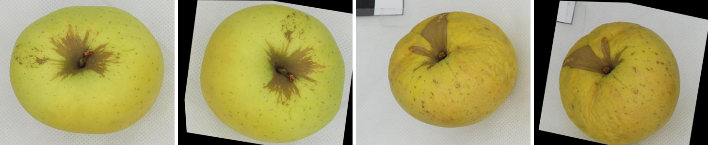
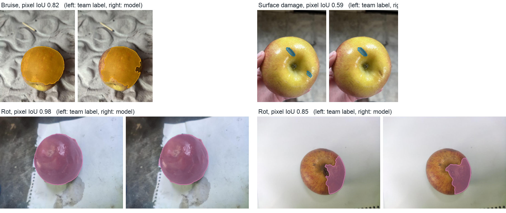
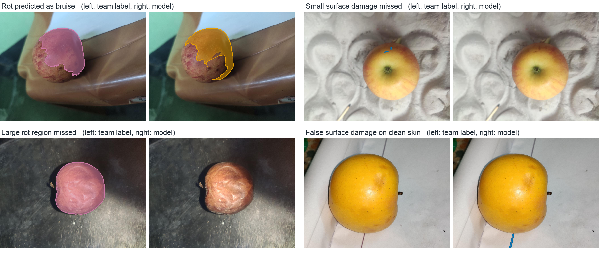
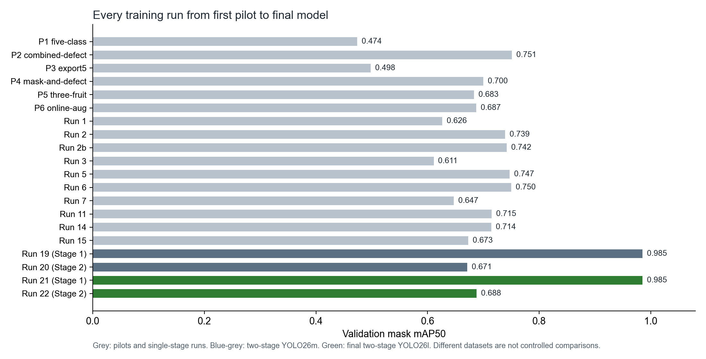
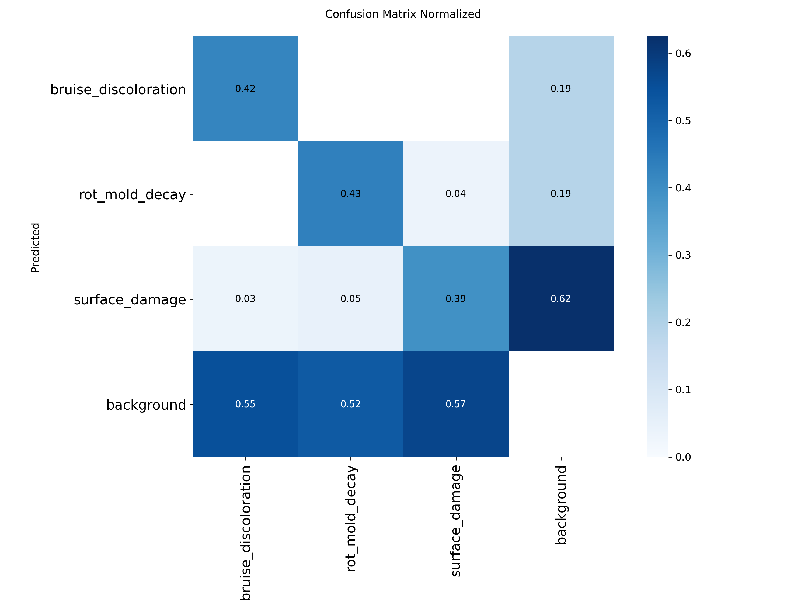

# Claude Code transcript (Claude Opus 5.5)

Session 7a9225ca. Prompts and replies in order. Tool calls are listed by name with their input. Large tool outputs are shortened.

### User (2026-10-01 10:18:30)

hi

### Claude (2026-10-01 10:18:36)

Hi! The deadline in your course file is tomorrow, **October 2, 2026 at 6:00 PM**, so we have about a day left. Demos run October 5–9.

Here's what I can help with today:

- **Checking your submission.** I can compare what's in this folder against the required outputs: the `.ipynb` notebook, Python sources, dataset link and description, Streamlit/Gradio app, IEEE-format `.docx`, `/runs` folder, and unseen-test evidence. Then I'll list what's missing.
- **Paper wording.** I can make sure the paper keeps two things separate: the original AFruitDB image-level grades, and the pixel masks your team drew. It should also cite the dataset correctly and declare AI use.
- **Results and evaluation.** I can check that the test set was never used for tuning, and help you explain IoU, precision, recall, and failure cases in plain terms.
- **Demo prep.** I can help you practice likely professor questions about data leakage, the 300-images-per-class rule, and your model choice.

What do you want to start with? If you're not sure, I'd go with the submission check.

### User (2026-10-01 10:25:53)

clone repo https://github.com/deangg/instancesegmentation

then create this for the submission:


<pasted_content id="5398">

Documentation IEEE Format
Due date: 10/2/26, 6:00 PM (UTC+8)
CIPHER
Python Notebook .ipynb file
Due date: 10/2/26, 6:00 PM (UTC+8)
CIPHER
Generated logs/ Training Artifacts
Due date: 10/2/26, 6:00 PM (UTC+8)
CIPHER
Web Deployment
Due date: 10/2/26, 6:00 PM (UTC+8)
CIPHER
PPT Presentation
Due date: 10/2/26, 6:00 PM (UTC+8)
CIPHER
Dataset
Due date: 10/2/26, 6:00 PM (UTC+8)
</pasted_content id="5398">


For the submissions, I want you to do this: 

go to desktop first create the folder final-submission
then inside, clone the repo and create a new branch. I want you to revamp it and make it final defense presentable. Make sure it has everything it needs, before you implement something, think first if there are qol features needed before implementing this feature. I also want the dataset in the folder, the notebook (note that you need to trim down some text (e.g ai written like "this will..." stuff)) and make it final defense submittable. the paper also I want you to edit it and match the best model we used for it (lmk if you have access to the drive)

currently we're training the final stage 2 (stage 1 alr done) on yolo26l so yea just work on that for now. Let me know if you need help accessing stuff before we move on. Add to agents.md or wtv that I do not want unnecessary commas, periods, or em dashes

### Claude (2026-10-01 10:25:58)

**Tool call: Bash**
```
{"command": "mkdir -p ~/Desktop/final-submission && cd ~/Desktop/final-submission && git clone https://github.com/deangg/instancesegmentation 2>&1 | tail -3 && cd instancesegmentation && git log --oneline | head -20 && git branch -a && find . -path ./.git -prune -o -type f -print | head -200 && du -sh .", "description": "Create submission folder and clone the repo"}
```

### Claude (2026-10-01 10:25:59)

**Tool call: Bash**
```
{"command": "ls -la && ls docs 2>/dev/null && cat docs/COURSE_REQUIREMENTS.md 2>/dev/null | head -150", "description": "List project files and course requirements"}
```

### Tool (2026-10-01 10:26:02)

<details><summary>Tool result</summary>

```
Cloning into 'instancesegmentation'...
a2187b5 Initial commit
* main
  remotes/origin/HEAD -> origin/main
  remotes/origin/dependabot/uv/python-dependencies-91ce36d8c9
  remotes/origin/main
./LICENSE
./uv.lock
./pyproject.toml
./streamlit_app.py
./README.md
./.gitignore
./.python-version
./.devcontainer/devcontainer.json
./.github/CODEOWNERS
./.github/dependabot.yml
296K	.
Shell cwd was reset to /Users/ralph/projects/ai2-segmentation-research
```
</details>

### Tool (2026-10-01 10:26:02)

<details><summary>Tool result</summary>

```
total 152656
drwxr-xr-x@ 22 ralph  staff       704 Sep 25 14:27 .
drwxr-xr-x@ 23 ralph  staff       736 Sep 27 22:11 ..
-rw-r--r--@  1 ralph  staff       559 Sep  4 00:02 .gitignore
drwxr-xr-x@  7 ralph  staff       224 Sep  4 00:03 .venv
-rw-r--r--@  1 ralph  staff      8076 Sep  4 00:59 AGENTS.md
-rw-r--r--@  1 ralph  staff     32231 Sep 25 07:29 AI 2 Progress Monitoring - Sep 25 Completed.docx
-rw-r--r--@  1 ralph  staff      2106 Sep 29 13:12 README.md
drwxr-xr-x@  4 ralph  staff       128 Aug 20 09:45 ai_usage
drwxr-xr-x@ 10 ralph  staff       320 Sep 12 16:06 annotation_app
drwxr-xr-x@  3 ralph  staff        96 Aug 20 09:45 app
drwxr-xr-x@ 12 ralph  staff       384 Sep 28 21:46 data
drwxr-xr-x@ 13 ralph  staff       416 Oct  1 11:18 docs
drwxr-xr-x@  3 ralph  staff        96 Aug 20 09:45 notebooks
drwxr-xr-x@  3 ralph  staff        96 Aug 20 09:45 paper
drwxr-xr-x@  4 ralph  staff       128 Aug 20 09:45 references
drwxr-xr-x@  3 ralph  staff        96 Aug 20 09:42 reports
drwxr-xr-x@  4 ralph  staff       128 Sep  4 00:09 runs
-rw-r--r--@  1 ralph  staff  78105722 Sep  4 00:04 sam2.1_t.pt
drwxr-xr-x@ 28 ralph  staff       896 Oct  1 11:07 src
-rwxr-xr-x@  1 ralph  staff       122 Sep 12 16:06 start-annotator.command
drwxr-xr-x@  6 ralph  staff       192 Sep 12 16:04 tests
drwxr-xr-x@ 10 ralph  staff       320 Sep 25 08:26 tmp
COURSE_REQUIREMENTS.md
DATASET_REGISTER.md
DECISION_LOG.md
DRIVER_SAFETY_PLAN.md
PROJECT_CONTEXT.md
PROJECT_FLOW.md
PROPOSALS.md
ROADMAP.md
TRAINI ...[shortened]
```
</details>

### Claude (2026-10-01 10:26:05)

**Tool call: Bash**
```
{"command": "cd ~/Desktop/final-submission/instancesegmentation && cat README.md streamlit_app.py pyproject.toml .gitignore .devcontainer/devcontainer.json; git log -1 --format='%an %ad'; git log origin/dependabot/uv/python-dependencies-91ce36d8c9 --oneline | head -3", "description": "Read cloned repo files"}
```

### Claude (2026-10-01 10:26:06)

**Tool call: Bash**
```
{"command": "cat README.md docs/TRAINING_HANDOFF.md docs/TWO_STAGE_TRAINING.md docs/PROJECT_FLOW.md; tail -80 docs/DECISION_LOG.md", "description": "Read local training and decision docs"}
```

### Tool (2026-10-01 10:26:06)

<details><summary>Tool result</summary>

```
# 🎈 Blank app template

A simple Streamlit app template for you to modify!

[](https://blank-app-template.streamlit.app/)

### How to run it on your own machine

Prerequisite: install `uv` if you don't already have it.

```
$ curl -LsSf https://astral.sh/uv/install.sh | sh
```

1. Sync the dependencies

   ```
   $ uv sync
   ```

2. Run the app

   ```
   $ uv run streamlit run streamlit_app.py
   ```
import streamlit as st

st.title("🎈 My new app")
st.write(
    "Let's start building! For help and inspiration, head over to [docs.streamlit.io](https://docs.streamlit.io/)."
)
[project]
name = "blank-app-template"
version = "0.1.0"
description = "A simple Streamlit app template."
readme = "README.md"
requires-python = ">=3.14"
dependencies = [
    "streamlit>=1.61.1",
]

[tool.uv]
package = false
.streamlit/secrets.toml

# Byte-compiled / optimized / DLL files
__pycache__/
*.py[cod]
*$py.class

# C extensions
*.so

# Distribution / packaging
.Python
build/
develop-eggs/
dist/
downloads/
eggs/
.eggs/
lib/
lib64/
parts/
sdist/
var/
wheels/
share/python-wheels/
*.egg-info/
.installed.cfg
*.egg
MANIFEST

# PyInstaller
#  Usually these files are written by a python script from a template
#  before PyInstaller builds the exe, so as to inject date/other infos into it.
*.manifest
*.spec

# Installer logs
pip-log.txt
pip-delete-this-directory.txt

# Unit test / coverage reports
htmlcov/
.tox/
.nox/
 ...[shortened]
```
</details>

### Tool (2026-10-01 10:26:06)

<details><summary>Tool result</summary>

```
<persisted-output>
Output too large (47.4KB). Full output saved to: /Users/ralph/.claude/projects/-Users-ralph-projects-ai2-segmentation-research/7a9225ca-19ef-456c-86bc-ee1da25ba451/tool-results/bmu3u4zdj.txt

Preview (first 2KB):
# AI2 Segmentation Research Project

This directory is the handoff package for the Mapúa University Artificial
Intelligence 2 machine project. Open this directory as the Codex project.

Selected topic: **Post-Harvest Fruit Defect Segmentation**. The current
apple-and-tomato experiment has five mask classes: the two fruits plus
bruising/discoloration, rot/mold/decay, and surface damage. See
`docs/TRAINING_HANDOFF.md` for the current dataset, training, and run status.

## Start here

- `docs/TRAINING_HANDOFF.md`: current Colab setup, Run 7 recovery, Run 8 option, and evaluation handoff
- `AGENTS.md`: persistent context and rules for future Codex sessions
- `docs/PROJECT_CONTEXT.md`: plain-language summary of the project
- `docs/COURSE_REQUIREMENTS.md`: extracted requirements and rubric
- `docs/PROPOSALS.md`: comparison of the three accepted candidates
- `docs/DRIVER_SAFETY_PLAN.md`: historical plan for a rejected proposal
- `docs/DATASET_REGISTER.md`: dataset links, access, and license checks
- `docs/ROADMAP.md`: schedule to the October 2, 2026 deadline
- `docs/PROJECT_FLOW.md`: detailed proposal-to-presentation and IEEE pathway
- `docs/DECISION_LOG.md`: settled decisions and unresolved questions
- `references/AI2 Project Specifications.html`: origin ...[shortened]
```
</details>

### Claude (2026-10-01 10:26:08)

**Tool call: Read**
```
{"file_path": "/Users/ralph/.claude/projects/-Users-ralph-projects-ai2-segmentation-research/7a9225ca-19ef-456c-86bc-ee1da25ba451/tool-results/bmu3u4zdj.txt"}
```

### Tool (2026-10-01 10:26:09)

<details><summary>Tool result</summary>

```
1	# AI2 Segmentation Research Project
2	
3	This directory is the handoff package for the Mapúa University Artificial
4	Intelligence 2 machine project. Open this directory as the Codex project.
5	
6	Selected topic: **Post-Harvest Fruit Defect Segmentation**. The current
7	apple-and-tomato experiment has five mask classes: the two fruits plus
8	bruising/discoloration, rot/mold/decay, and surface damage. See
9	`docs/TRAINING_HANDOFF.md` for the current dataset, training, and run status.
10	
11	## Start here
12	
13	- `docs/TRAINING_HANDOFF.md`: current Colab setup, Run 7 recovery, Run 8 option, and evaluation handoff
14	- `AGENTS.md`: persistent context and rules for future Codex sessions
15	- `docs/PROJECT_CONTEXT.md`: plain-language summary of the project
16	- `docs/COURSE_REQUIREMENTS.md`: extracted requirements and rubric
17	- `docs/PROPOSALS.md`: comparison of the three accepted candidates
18	- `docs/DRIVER_SAFETY_PLAN.md`: historical plan for a rejected proposal
19	- `docs/DATASET_REGISTER.md`: dataset links, access, and license checks
20	- `docs/ROADMAP.md`: schedule to the October 2, 2026 deadline
21	- `docs/PROJECT_FLOW.md`: detailed proposal-to-presentation and IEEE pathway
22	- `docs/DECISION_LOG.md`: settled decisions and unresolved questions
23	- `references/AI2 Project Specifications.html`: original instructor file
24	- `ai_usage/THREAD_CONTEXT.md`: summary of the research conversation
25	
26	## Intended final structure
27	
28	```text
29	data/raw/          untouched ...[shortened]
```
</details>

### Claude (2026-10-01 10:26:12)

**Tool call: Bash**
```
{"command": "find . -path ./.venv -prune -o -path ./data/raw -prune -o -type f -newermt '2026-09-27' -print | grep -v '/labels/\\|/images/' | head -80; echo; ls data data/pilots runs paper notebooks app reports tmp src ai_usage; du -sh data/* runs", "description": "List recent files and main folders"}
```

### Tool (2026-10-01 10:26:15)

<details><summary>Tool result</summary>

```
./README.md
./src/prepare_two_stage_apple.py
./src/audit_training_masks.py
./docs/section5_train_or_resume.py
./docs/TWO_STAGE_TRAINING.md
./docs/TRAINING_HANDOFF.md
./data/.DS_Store
./src/build_apple_one_defect.py
./src/build_apple_sep30.py
./src/build_sep29_fruit_dataset.py
./data/exports/apple_members_roboflow_20260928.zip
./data/audits/sep27-structural/summary.json
./data/audits/sep27-structural/review.html
./data/audits/sep27-structural/audit_records.jsonl
./data/audits/sep27-structural/training-mask-structural-review.zip
./data/audits/sep27-structural/proposed_masks.jsonl
./data/audits/sep27-structural/progress.json
./data/audits/sep27-structural/README.txt
./data/audits/sep27-structural/review_queue.csv
./data/audits/sep27-ai-smoke/summary.json
./data/audits/sep27-ai-smoke/review.html
./data/audits/sep27-ai-smoke/audit_records.jsonl
./data/audits/sep27-ai-smoke/proposed_masks.jsonl
./data/audits/sep27-ai-smoke/progress.json
./data/audits/sep27-ai-smoke/README.txt
./data/audits/sep27-ai-smoke/review_queue.csv
./data/exports/apple_members_roboflow_20260928/README.txt
./data/exports/apple_members_roboflow_20260928/apple-member-sep27__README.dataset.txt
./data/exports/apple_members_roboflow_20260928/apple-surface-member-sep27__README.dataset.txt
./data/exports/apple_members_roboflow_20260928/manifest.json
./data/exports/apple_members_roboflow_20260928/train/apple_member_sep27__I008_jpg.rf.4f149a8fd0b735ae79bdbaad5ac52f6d.jpg
./data/exports/apple_members_roboflow_20260928/t ...[shortened]
```
</details>

### Claude (2026-10-01 10:26:18)

**Tool call: Bash**
```
{"command": "cd /Users/ralph/projects/ai2-segmentation-research/data/pilots && ls -la apple-sep30-fruit9 apple-one-defect-oct01; du -sh apple-sep30-fruit9; find apple-sep30-fruit9 -maxdepth 3 -not -name '*.jpg' -not -name '*.txt' | head -40; find / -name \"*.ipynb\" -newermt 2026-09-29 -path \"*ralph*\" 2>/dev/null | grep -v .venv | head", "description": "Inspect final dataset folder and recent notebooks"}
```

### Tool (2026-10-01 10:28:13)

<details><summary>Tool result</summary>

```
apple-one-defect-oct01:
total 383336
drwxr-xr-x@  7 ralph  staff       224 Oct  1 07:52 .
drwxr-xr-x@ 42 ralph  staff      1344 Oct  1 11:13 ..
-rw-r--r--@  1 ralph  staff  98131808 Oct  1 07:52 apple-one-defect-oct01.zip
-rw-r--r--@  1 ralph  staff  54525952 Oct  1 07:52 apple-one-defect-oct01.zip.part1
-rw-r--r--@  1 ralph  staff  43605856 Oct  1 07:52 apple-one-defect-oct01.zip.part2
drwxr-xr-x@ 11 ralph  staff       352 Oct  1 07:52 dataset
-rw-r--r--@  1 ralph  staff        65 Oct  1 07:52 dataset_sha256.txt

apple-sep30-fruit9:
total 387656
drwxr-xr-x@  7 ralph  staff       224 Sep 30 22:20 .
drwxr-xr-x@ 42 ralph  staff      1344 Oct  1 11:13 ..
-rw-r--r--@  1 ralph  staff  99237664 Sep 30 22:19 apple-sep30-fruit9.zip
-rw-r--r--@  1 ralph  staff  54525952 Sep 30 22:20 apple-sep30-fruit9.zip.part1
-rw-r--r--@  1 ralph  staff  44711712 Sep 30 22:20 apple-sep30-fruit9.zip.part2
drwxr-xr-x@ 11 ralph  staff       352 Sep 30 22:19 dataset
-rw-r--r--@  1 ralph  staff        65 Sep 30 22:19 dataset_sha256.txt
299M	apple-sep30-fruit9
apple-sep30-fruit9
apple-sep30-fruit9/apple-sep30-fruit9.zip
apple-sep30-fruit9/dataset
apple-sep30-fruit9/apple-sep30-fruit9.zip.part2
apple-sep30-fruit9/apple-sep30-fruit9.zip.part1
apple-sep30-fruit9/dataset/valid
apple-sep30-fruit9/dataset/audit.json
apple-sep30-fruit9/dataset/test
apple-sep30-fruit9/dataset/README.md
apple-sep30-fruit9/dataset/data.yaml
apple-sep30-fruit9/dataset/manifest.json
apple-sep30-fruit9/dataset/train
apple-sep30-fruit9 ...[shortened]
```
</details>

### Claude (2026-10-01 10:28:17)

Quick update: I cloned the repo to the Desktop. It's just a blank Streamlit template, so the real material is in your local project. I'm now finding the final notebook, dataset, and Drive access.

### Claude (2026-10-01 10:28:19)

**Tool call: Bash**
```
{"command": "ls -la ~/Downloads/*.ipynb ~/Downloads/*.docx ~/Downloads/*.pptx 2>/dev/null | tail -30; ls ~/Library/CloudStorage 2>/dev/null; ls \"/Volumes\" ; python3 - <<'E'\nimport json\nfor p in [\"/Users/ralph/Downloads/Apple_Tomato_YOLO26_Updated_AutoConfig.ipynb\"]:\n    nb=json.load(open(p)); print(p,len(nb['cells']))\n    for i,c in enumerate(nb['cells']):\n        s=''.join(c['source']); print(i,c['cell_type'],len(s),repr(s[:110]), 'outs' ,len(c.get('outputs',[])))\nE", "description": "Find latest notebook, paper, and Drive mount"}
```

### Tool (2026-10-01 10:28:20)

<details><summary>Tool result</summary>

```
-rw-r--r--@ 1 ralph  staff    329803 Sep 14 19:17 /Users/ralph/Downloads/FunctionalProgramming_Morales.docx
-rw-r--r--@ 1 ralph  staff     78924 Sep  4 22:05 /Users/ralph/Downloads/HR Background Final (1).pptx
-rw-r--r--@ 1 ralph  staff    465534 Aug 14 12:42 /Users/ralph/Downloads/ITS132P.docx
-rw-r--r--@ 1 ralph  staff     10300 Aug 20 19:43 /Users/ralph/Downloads/Initial Draft Group 6.docx
-rw-r--r--@ 1 ralph  staff     23783 Sep 25 16:43 /Users/ralph/Downloads/LE1.5 Market Basket Analysis Answer Sheet.docx
-rw-r--r--@ 1 ralph  staff     33019 Sep 29 18:01 /Users/ralph/Downloads/LOAlgxZFToyI_YKgj5O8Ng_cefe236771e44447be35c6a55741acf1_Course5Module4QueryBackground.docx
-rw-r--r--@ 1 ralph  staff    175588 Aug 23 21:15 /Users/ralph/Downloads/Lab_1_1_Morales.ipynb
-rw-r--r--@ 1 ralph  staff   1611779 Sep  4 22:06 /Users/ralph/Downloads/LaboratoryExercise3_Documentation_2024110507.docx
-rw-r--r--@ 1 ralph  staff     32524 Sep 21 17:07 /Users/ralph/Downloads/Library_Management_System_Proposal.docx
-rw-r--r--@ 1 ralph  staff    501958 Sep 12 09:05 /Users/ralph/Downloads/Morales_2024110507.ipynb
-rw-r--r--@ 1 ralph  staff    111537 Aug 24 07:03 /Users/ralph/Downloads/Neural_Networks_and_Backpropagation_Beginner_Reviewer.docx
-rw-r--r--@ 1 ralph  staff     46212 Aug 25 18:17 /Users/ralph/Downloads/PA1.2_Backpropagation_tensorflow.ipynb
-rw-r--r--@ 1 ralph  staff     88184 Aug 30 21:50 /Users/ralph/Downloads/PA1.2_Morales2024110507.ipynb
-rw-r--r--@ 1 ralph  staff     80280 Sep 13  ...[shortened]
```
</details>

### Claude (2026-10-01 10:28:36)

**Tool call: Bash**
```
{"command": "cd /Users/ralph/projects/ai2-segmentation-research && grep -n \"yolo26\\|RUN_ID\\|run_id\" docs/section5_train_or_resume.py | head -20; cat data/pilots/apple-sep30-fruit9/dataset/data.yaml data/pilots/apple-sep30-fruit9/dataset/README.md | head -80; ls data/pilots/apple-sep30-fruit9/dataset/*/images | head -0; for s in train valid test test_reserve; do echo $s $(ls data/pilots/apple-sep30-fruit9/dataset/$s/images | wc -l); done; ls ai_usage; head -30 ai_usage/README.md; ls runs/segment", "description": "Check model name, dataset card, AI usage folder"}
```

### Tool (2026-10-01 10:28:36)

<details><summary>Tool result</summary>

```
10:# Section 2 supplies RUN_ID, BATCH_SIZE, MODEL_NAME, EPOCHS, and PLANS.
12:for folder in RUNS_DIR.glob(f'run{RUN_ID}_*'):
26:        raise RuntimeError(f'{folder} has no last.pt. Set a new RUN_ID in Section 2.')
33:        raise RuntimeError(f'Run {RUN_ID} already completed: {folder}')
39:    print(f'Resuming Run {RUN_ID} after epoch {completed_epochs}; saved batch {saved_batch}')
42:    run_name = f'run{RUN_ID}_' + datetime.now().strftime('%Y%m%d_%H%M%S')
43:    print(f'Starting fresh Run {RUN_ID} with {MODEL_NAME}; requested batch {BATCH_SIZE}')
60:    plan = PLANS[RUN_ID]
path: .
train: train/images
val: valid/images
test: test/images
names:
  0: apple
  1: bruise_discoloration
  2: rot_mold_decay
  3: surface_damage
# Apple-only dataset from Fruit Segmentation-9

Training images and polygons come from the provided Roboflow COCO export. Roboflow training files include augmented variants. Previous apple validation, test, and test-reserve images are frozen; their class IDs were remapped without changing polygon coordinates. `surface_spot_scar` maps to `surface_damage`. See audit.json for counts and exclusions.
head: illegal line count -- 0
train 2110
valid 215
test 79
test_reserve 63
README.md
THREAD_CONTEXT.md
# AI Use Records

The course specification requires disclosure of AI tools and the complete
prompt/response transcript. `THREAD_CONTEXT.md` is only a handoff summary and
does **not** satisfy the complete-transcript requirement.

Before submission:

1. Export or cop ...[shortened]
```
</details>

### Claude (2026-10-01 10:28:42)

**Tool call: Bash**
```
{"command": "cd ~/Desktop/final-submission/instancesegmentation && git switch -c final-defense && mkdir -p ../dataset && cp -R /Users/ralph/projects/ai2-segmentation-research/data/pilots/apple-sep30-fruit9/dataset ../dataset/apple-sep30-fruit9 && cp /Users/ralph/projects/ai2-segmentation-research/data/pilots/apple-sep30-fruit9/dataset_sha256.txt ../dataset/apple-sep30-fruit9/ && du -sh ../dataset && ls ../dataset/apple-sep30-fruit9", "description": "Create branch and copy final dataset into submission folder"}
```

### Claude (2026-10-01 10:28:44)

**Tool call: Edit**
```
{"replace_all": false, "file_path": "/Users/ralph/projects/ai2-segmentation-research/AGENTS.md", "old_string": "## Non-negotiable research integrity", "new_string": "## Writing style (user rule)\n\n- No em dashes anywhere. Use a plain sentence break or \"to\" for ranges.\n- No unnecessary commas or periods. Keep sentences short and plain.\n- Remove AI-sounding filler such as \"This will...\", \"This cell...\",\n  \"Let's...\", and \"Note that...\" from notebooks, papers, and slides.\n\n## Non-negotiable research integrity"}
```

### Claude (2026-10-01 10:28:47)

**Tool call: Write**
```
{"file_path": "/Users/ralph/.claude/projects/-Users-ralph-projects-ai2-segmentation-research/memory/writing-style-punctuation.md", "content": "---\nname: writing-style-punctuation\ndescription: User wants no em dashes and no unnecessary commas or periods in written deliverables and replies\nmetadata:\n  type: feedback\n---\n\nNo em dashes anywhere. Avoid unnecessary commas and periods. Strip AI-sounding filler (\"This will...\", \"This cell...\", \"Let's...\") from notebooks, papers, slides.\n\n**Why:** User asked on 2026-10-01 while preparing the final defense submission; AI-sounding text hurts the submission.\n**How to apply:** Applies to notebook markdown, IEEE paper, PPT, README, and chat replies. Also recorded in project AGENTS.md.\n"}
```

### Tool (2026-10-01 10:28:50)

<details><summary>Tool result</summary>

```
Switched to a new branch 'final-defense'
110M	../dataset
README.md
README.roboflow.txt
audit.json
data.yaml
dataset_sha256.txt
manifest.json
test
test_reserve
train
valid
Shell cwd was reset to /Users/ralph/projects/ai2-segmentation-research
```
</details>

### Tool (2026-10-01 10:28:50)

<details><summary>Tool result</summary>

```
The file /Users/ralph/projects/ai2-segmentation-research/AGENTS.md has been updated successfully.
```
</details>

### Tool (2026-10-01 10:28:50)

<details><summary>Tool result</summary>

```
File created successfully at: /Users/ralph/.claude/projects/-Users-ralph-projects-ai2-segmentation-research/memory/writing-style-punctuation.md
```
</details>

### Claude (2026-10-01 10:28:53)

**Tool call: Bash**
```
{"command": "cd ~/.claude/projects/-Users-ralph-projects-ai2-segmentation-research/memory && (cat MEMORY.md 2>/dev/null; echo \"- [Writing style](writing-style-punctuation.md) — no em dashes, no extra commas or periods, no AI filler\") > M.tmp && mv M.tmp MEMORY.md", "description": "Add memory index entry"}
```

### Tool (2026-10-01 10:28:53)

<details><summary>Tool result</summary>

```
Shell cwd was reset to /Users/ralph/projects/ai2-segmentation-research
```
</details>

### Claude (2026-10-01 10:29:12)

I've set up the folder, the branch, the dataset copy and your writing rule. Before I build anything I need the files from Drive and a few answers from you.

**Done so far**
- Created `~/Desktop/final-submission/` and cloned the repo into it. I'm working on a new branch called `final-defense`.
- The repo is only the blank Streamlit template right now: one line of app code and no model. Everything has to be built.
- Copied the final dataset to `final-submission/dataset/apple-sep30-fruit9/` (110 MB). Its splits are 2,110 train, 215 validation, 79 test and 63 reserve images. The copy includes `data.yaml`, `manifest.json`, `audit.json` and the checksum. I kept it outside git because thousands of images don't belong in a GitHub repo, but it sits inside the submission folder.
- Added your writing rule to `AGENTS.md` and to my saved notes: no em dashes, no extra commas or periods, no "This will..." filler.

**I can't reach your Drive yet.** There's no Drive folder synced on this Mac, and the Google Drive connector hasn't been signed in. Pick one:
1. Sign in to the connector and I'll read the files myself.
2. Download these into a folder (for example `~/Desktop/final-submission/from-drive/`):
   - the live Colab notebook as `.ipynb` **with outputs**. My only local copy is an older Run 12 version with no outputs.
   - the current paper draft (`.docx`)
   - the Stage 1 run folder: `results.csv`, `args.yaml`, `experiment.json`, the plots and `weights/best.pt`
   - the Stage 2 run folder once it finishes
   - any slides you already have

**Questions**
- **Which model?** You said Stage 2 runs on YOLO26l. The handoff doc says Runs 19 and 20 use YOLO26m. Which run IDs are the final Stage 1 and Stage 2, and are both on 26l?
- **Group details:** what are your section, group number and member names? They go in the ZIP name, the paper and the slides.

**Improvements I plan to build, so you can veto any first**
- **Python version.** The template requires Python 3.14, and PyTorch and Ultralytics may not install on it. I'll pin 3.11 and add a `requirements.txt` so it installs and deploys cleanly.
- **Model file size.** GitHub refuses files over 100 MB. I'll check the size of your 26l `best.pt` and either commit it with Git LFS (GitHub's large-file storage) or have the app download it on first launch.
- **App features:**
  - Upload or pick a built-in sample photo, so the live demo still works if uploads fail.
  - Confidence slider.
  - Show or hide each defect class, with a colour legend.
  - Defect area as a percentage of the image.
  - Inference time.
  - Download button for the result.
  - A clear message when nothing is found, or when the file is bad.
- **Repo layout:**
  - `src/` for the training and evaluation code
  - `runs/` for the logs, curves and metrics
  - `notebooks/` for the cleaned notebook
  - `paper/` for the IEEE `.docx`
  - `slides/` for the PPT
  - A README with exact run commands

**One risk to raise with your group:** the course spec says AI-written code can't be submitted directly and the full AI transcript must be declared. Whatever I build, your team needs to understand it, check it, and rework it as your instructor requires. This conversation should also go into your AI disclosure.

Once you send the Drive files and the run IDs, I'll start with the app and the notebook cleanup. The paper numbers will wait for the Stage 2 results.

### User (2026-10-01 10:29:57)

wait what do i need to do?

### Claude (2026-10-01 10:30:01)

You need to do two things, in this order.

**1. Get me the files from Google Drive**

Either way works:

- **Easiest:** type `connect google drive` in this chat. I'll start the sign-in and you click through it in your browser. Then I can read the files myself.
- **Manual:** download these from Drive into `~/Desktop/final-submission/from-drive/`:
  - The Colab notebook. In Colab use File > Download > Download .ipynb after the cells have run, so the outputs are saved.
  - The paper draft (.docx).
  - The Stage 1 run folder from `MyDrive/YOLOv26/runs/`.
  - Any slides you already have.

**2. Answer these in your next message**

- What are the Stage 1 and Stage 2 run numbers? Are both on YOLO26l?
- What is your section and group number?
- What are the member names?

That's it. Once I have those I'll build the app and clean up the notebook. The paper results get filled in when Stage 2 finishes.

### User (2026-10-01 10:30:22)

connect google drive

### Claude (2026-10-01 10:30:24)

**Tool call: ToolSearch**
```
{"query": "select:mcp__claude_ai_Google_Drive__authenticate,mcp__claude_ai_Google_Drive__complete_authentication", "max_results": 2}
```

### Tool (2026-10-01 10:30:24)

<details><summary>Tool result</summary>

```

```
</details>

### Claude (2026-10-01 10:30:25)

**Tool call: mcp__claude_ai_Google_Drive__authenticate**
```
{}
```

### Tool (2026-10-01 10:30:25)

<details><summary>Tool result</summary>

```
This is a claude.ai MCP connector. Ask the user to run /mcp and select "claude.ai Google Drive" to authenticate.
```
</details>

### Claude (2026-10-01 10:30:28)

The Drive sign-in has to be started by you, not me. Here's how:

1. Type `/mcp` in this chat and press Enter.
2. Pick **claude.ai Google Drive** from the list.
3. Sign in with the Google account that has the `YOLOv26` folder and allow access.
4. Come back here and say `done`.

After that I'll find the notebook, the paper and the run folders myself. While I do that, please send your run numbers, your section and group number, and the member names.

### User (2026-10-01 10:31:25)

<local-command-caveat>The command below was run directly in Claude Code, not sent to you as a request, and its output goes straight to the user. It's recorded here as context for later messages.</local-command-caveat>

### User (2026-10-01 10:31:25)

<command-name>/mcp</command-name>
            <command-message>mcp</command-message>
            <command-args></command-args>

### User (2026-10-01 10:31:25)

<local-command-stdout>Authentication successful. Connected to claude.ai Google Drive.</local-command-stdout>

### User (2026-10-01 10:32:57)

for question 2, just scour the YOLOv26 folder and get the metrics there, also here's our paper: https://docs.google.com/document/d/100Ly4ugT-7gJiw9Vr4ejE4D7pVZH7t0qlmJM6ydTZ0s/edit?usp=sharing

what else do you need before we continue?

### Claude (2026-10-01 10:33:01)

**Tool call: ToolSearch**
```
{"query": "select:mcp__claude_ai_Google_Drive__search_files,mcp__claude_ai_Google_Drive__read_file_content,mcp__claude_ai_Google_Drive__download_file_content,mcp__claude_ai_Google_Drive__get_file_metadata", "max_results": 4}
```

### Tool (2026-10-01 10:33:01)

<details><summary>Tool result</summary>

```

```
</details>

### Claude (2026-10-01 10:33:03)

**Tool call: mcp__claude_ai_Google_Drive__search_files**
```
{"query": "title = 'YOLOv26' and mimeType = 'application/vnd.google-apps.folder'", "excludeContentSnippets": true}
```

### Claude (2026-10-01 10:33:04)

**Tool call: mcp__claude_ai_Google_Drive__read_file_content**
```
{"fileId": "100Ly4ugT-7gJiw9Vr4ejE4D7pVZH7t0qlmJM6ydTZ0s"}
```

### Tool (2026-10-01 10:33:09)

<details><summary>Tool result</summary>

```
{"files":[{"canAddChildren":true,"createdTime":"2026-09-12T15:24:39.967Z","id":"1cOa8YFMC5AKK7yniA_f4THCp6-VZOzJt","mimeType":"application/vnd.google-apps.folder","modifiedTime":"2026-09-24T05:57:35.636Z","owner":"ralphkevingmorales@gmail.com","parentId":"0AG0UAaakYwIXUk9PVA","title":"YOLOv26","viewUrl":"https://drive.google.com/drive/folders/1cOa8YFMC5AKK7yniA_f4THCp6-VZOzJt","viewedByMeTime":"2026-10-01T04:33:22.902Z"}],"nextPageToken":"~!!~AAfjczcKKgNWV_ahH-wqNlmxvNUFD4sDw8g7_Z_Ov97eHQiNY9x8n5qN5m_20bxQvGylHu8sLqHc2_SyjVzaWeq8ujjhbgzm-zpRokgJ40Rksw4L8sFYekwwf-1pE4z7iiQBj9O4OY1WAmKDdeM1U6UsC2qWpVPUvg=="}
```
</details>

### Tool (2026-10-01 10:33:09)

<details><summary>Tool result</summary>

```
{"fileContent":"# Joint Instance Segmentation of Apple, Mango, Toma…  \n\n# Joint Instance Segmentation of Apple and Tomato Fruits and Their Visible Surface Defects Using YOLOv26\n\n  \n\n|  |  |  |\n| :-: | :-: | :-: |\n| \\*\\*Ralph Kevin G. Morales\\*\\*\\*School of Information Technology\\*\\*Mapúa University\\*Manila, Philippinesemail@example.com | \\*\\*Alexander Jann P. Espia\\*\\*\\*School of Information Technology\\*\\*Mapúa University\\*Manila, Philippinesemail@example.com | \\*\\*Deangelo James P. Largueza\\*\\*\\*School of Information Technology\\*\\*Mapúa University\\*Manila, Philippinesemail@example.com |\n| \\*\\*Niel Francis M. Arligue\\*\\*\\*School of Information Technology\\*\\*Mapúa University\\*Manila, Philippinesemail@example.com | \\*\\*Lysa V. Comia\\*\\*\\*School of Information Technology\\*\\*Mapúa University\\*Manila, Philippinesemail@example.com |   |\n\n  \n**  \n**\n\n**Abstract: This study examines joint instance segmentation of apple and tomato fruits and their visible post-harvest surface defects. Project pixel masks distinguish whole fruits from bruise or discoloration, rot or mold or decay, and surface damage. \\[RESULTS & METHODOLOGY \\*\\*\\* add\\]**\n\n***Keywords: instance segmentation, fruit defects, deep learning, YOLO, RGB images***\n\n# I. INTRODUCTION\n\nVisible surface defects are an important part of post-harvest fruit quality assessment. However, assigning an overall grade to a fruit image does not explain where a defect is loca ...[shortened]
```
</details>

### Claude (2026-10-01 10:33:12)

**Tool call: mcp__claude_ai_Google_Drive__search_files**
```
{"query": "parentId = '1cOa8YFMC5AKK7yniA_f4THCp6-VZOzJt'", "excludeContentSnippets": true, "pageSize": 100}
```

### Tool (2026-10-01 10:33:14)

<details><summary>Tool result</summary>

```
{"files":[{"canAddChildren":true,"createdTime":"2026-09-13T06:39:43.532Z","id":"1o3ME7F8uYggtEuGPzZuZLpAYzTs8QcTb","mimeType":"application/vnd.google-apps.folder","modifiedTime":"2026-09-13T06:39:43.532Z","owner":"ralphkevingmorales@gmail.com","parentId":"1cOa8YFMC5AKK7yniA_f4THCp6-VZOzJt","title":"runs","viewUrl":"https://drive.google.com/drive/folders/1o3ME7F8uYggtEuGPzZuZLpAYzTs8QcTb","viewedByMeTime":"2026-10-01T06:31:31.899Z"},{"canAddChildren":true,"createdTime":"2026-09-12T15:24:51.042Z","id":"1i2bYKHzyQ5Gr0PnkdivVAReT0hekSsKi","mimeType":"application/vnd.google-apps.folder","modifiedTime":"2026-09-12T15:24:51.042Z","owner":"ralphkevingmorales@gmail.com","parentId":"1cOa8YFMC5AKK7yniA_f4THCp6-VZOzJt","title":"dataset","viewUrl":"https://drive.google.com/drive/folders/1i2bYKHzyQ5Gr0PnkdivVAReT0hekSsKi","viewedByMeTime":"2026-09-29T06:35:44.596Z"},{"canAddChildren":true,"createdTime":"2026-09-13T06:39:31.408Z","id":"1EF27bLmOAVaWHSWNsb17U-tAsCrxlaPC","mimeType":"application/vnd.google-apps.folder","modifiedTime":"2026-09-13T06:39:31.408Z","owner":"ralphkevingmorales@gmail.com","parentId":"1cOa8YFMC5AKK7yniA_f4THCp6-VZOzJt","title":"pretrained-models","viewUrl":"https://drive.google.com/drive/folders/1EF27bLmOAVaWHSWNsb17U-tAsCrxlaPC","viewedByMeTime":"2026-09-28T01:10:58.615Z"},{"canAddChildren":false,"createdTime":"2026-09-24T08:24:36.713Z","description":"Colab notebook","fileExtension":"ipynb","fileSize":"439073","id":"1fQnblQH2I_Hyo63s0dxdzyEsa7CMJLRO","mimeType":"app ...[shortened]
```
</details>

### Claude (2026-10-01 10:33:22)

**Tool call: mcp__claude_ai_Google_Drive__search_files**
```
{"query": "parentId = '1o3ME7F8uYggtEuGPzZuZLpAYzTs8QcTb'", "excludeContentSnippets": true, "pageSize": 100}
```

### Claude (2026-10-01 10:33:22)

**Tool call: Bash**
```
{"command": "echo placeholder", "description": "No-op"}
```

### Tool (2026-10-01 10:33:23)

<details><summary>Tool result</summary>

```
placeholder
```
</details>

### Tool (2026-10-01 10:33:25)

<details><summary>Tool result</summary>

```
{"files":[{"canAddChildren":true,"createdTime":"2026-10-01T05:12:32.927Z","id":"13VWwMj88WrRnr7q8ZlBZLIrZQNME7L65","mimeType":"application/vnd.google-apps.folder","modifiedTime":"2026-10-01T05:12:32.927Z","owner":"ralphkevingmorales@gmail.com","parentId":"1o3ME7F8uYggtEuGPzZuZLpAYzTs8QcTb","title":"apple-stage2-defects-oct01","viewUrl":"https://drive.google.com/drive/folders/13VWwMj88WrRnr7q8ZlBZLIrZQNME7L65","viewedByMeTime":"2026-10-01T06:31:36.080Z"},{"canAddChildren":true,"createdTime":"2026-10-01T00:03:39.637Z","id":"1OEWGhDkmKBzV4vf9o16qpVu3cjkwo6Yt","mimeType":"application/vnd.google-apps.folder","modifiedTime":"2026-10-01T00:03:39.637Z","owner":"ralphkevingmorales@gmail.com","parentId":"1o3ME7F8uYggtEuGPzZuZLpAYzTs8QcTb","title":"apple-one-defect-oct01","viewUrl":"https://drive.google.com/drive/folders/1OEWGhDkmKBzV4vf9o16qpVu3cjkwo6Yt","viewedByMeTime":"2026-10-01T04:33:57.100Z"},{"canAddChildren":true,"createdTime":"2026-10-01T04:30:11.802Z","id":"1bm6GYe10Lts_Hl-HfPvoY2hmH3s6NXGD","mimeType":"application/vnd.google-apps.folder","modifiedTime":"2026-10-01T04:30:11.802Z","owner":"ralphkevingmorales@gmail.com","parentId":"1o3ME7F8uYggtEuGPzZuZLpAYzTs8QcTb","title":"apple-stage1-whole-oct01","viewUrl":"https://drive.google.com/drive/folders/1bm6GYe10Lts_Hl-HfPvoY2hmH3s6NXGD","viewedByMeTime":"2026-10-01T06:31:30.862Z"},{"canAddChildren":true,"createdTime":"2026-09-30T14:36:54.332Z","id":"1p_yv3c3QfC8quJOjUCETBwuAcgfBe7ys","mimeType":"application/vnd.google-apps.folder" ...[shortened]
```
</details>

### Claude (2026-10-01 10:33:30)

**Tool call: mcp__claude_ai_Google_Drive__search_files**
```
{"query": "parentId = '1bm6GYe10Lts_Hl-HfPvoY2hmH3s6NXGD' or parentId = '13VWwMj88WrRnr7q8ZlBZLIrZQNME7L65' or parentId = '1OEWGhDkmKBzV4vf9o16qpVu3cjkwo6Yt' or parentId = '1p_yv3c3QfC8quJOjUCETBwuAcgfBe7ys' or parentId = '1WiQCI-SDEoTjxO_pDeoU6wD-TRL3Q-0a'", "excludeContentSnippets": true, "pageSize": 100}
```

### Tool (2026-10-01 10:33:32)

<details><summary>Tool result</summary>

```
{"files":[{"canAddChildren":true,"createdTime":"2026-10-01T08:44:22.785Z","id":"1-EKbxQ8xAhyFTwB6901woQUl0WKMTzFQ","mimeType":"application/vnd.google-apps.folder","modifiedTime":"2026-10-01T08:44:22.785Z","owner":"ralphkevingmorales@gmail.com","parentId":"13VWwMj88WrRnr7q8ZlBZLIrZQNME7L65","title":"run22_20261001_084417","viewUrl":"https://drive.google.com/drive/folders/1-EKbxQ8xAhyFTwB6901woQUl0WKMTzFQ","viewedByMeTime":"2026-10-01T08:44:22.785Z"},{"canAddChildren":false,"createdTime":"2026-10-01T05:09:38.226Z","fileExtension":"csv","fileSize":"4305","id":"1-_vlXRyyXglQpJHu8RI0fNtKP6UXmpLl","mimeType":"text/csv","modifiedTime":"2026-10-01T07:13:22.604Z","owner":"ralphkevingmorales@gmail.com","parentId":"1bm6GYe10Lts_Hl-HfPvoY2hmH3s6NXGD","title":"validation_comparison.csv","viewUrl":"https://drive.google.com/file/d/1-_vlXRyyXglQpJHu8RI0fNtKP6UXmpLl/view?usp=drivesdk","viewedByMeTime":"2026-10-01T07:13:22.604Z"},{"canAddChildren":true,"createdTime":"2026-10-01T06:42:24.691Z","id":"1olRR5TLigYk6-A5eq_GXDyzEanl9u7xf","mimeType":"application/vnd.google-apps.folder","modifiedTime":"2026-10-01T06:42:24.691Z","owner":"ralphkevingmorales@gmail.com","parentId":"1bm6GYe10Lts_Hl-HfPvoY2hmH3s6NXGD","title":"run21_20261001_064224","viewUrl":"https://drive.google.com/drive/folders/1olRR5TLigYk6-A5eq_GXDyzEanl9u7xf","viewedByMeTime":"2026-10-01T06:42:24.691Z"},{"canAddChildren":true,"createdTime":"2026-10-01T05:12:34.633Z","id":"12FHS1uiYXk1Z5thcYh1esXsH5vJqkVGO","mimeType":"application/vn ...[shortened]
```
</details>

### Claude (2026-10-01 10:33:34)

Connected to Drive and reading the run folders now. Stage 1 is run 21 and Stage 2 looks like run 22. Pulling the metrics next.

### Claude (2026-10-01 10:33:35)

**Tool call: mcp__claude_ai_Google_Drive__read_file_content**
```
{"fileId": "1-_vlXRyyXglQpJHu8RI0fNtKP6UXmpLl"}
```

### Claude (2026-10-01 10:33:36)

**Tool call: mcp__claude_ai_Google_Drive__read_file_content**
```
{"fileId": "1dM9hyGKhK6itOqyA7bKrAnj_X4kyiKF1"}
```

### Claude (2026-10-01 10:33:39)

**Tool call: mcp__claude_ai_Google_Drive__search_files**
```
{"query": "parentId = '1olRR5TLigYk6-A5eq_GXDyzEanl9u7xf' or parentId = '1-EKbxQ8xAhyFTwB6901woQUl0WKMTzFQ' or parentId = '12FHS1uiYXk1Z5thcYh1esXsH5vJqkVGO' or parentId = '14ofM1n9zrpzSxIjnjJ1YEd7LTnJJ3KA7'", "excludeContentSnippets": true, "pageSize": 100}
```

### Tool (2026-10-01 10:33:41)

<details><summary>Tool result</summary>

```
{"fileContent":"run,dataset,folder,model,batch,completed\\_epochs,target\\_epochs,complete,stage,source\\_run\\_id,optimizer,lr0,extra\\_conv,dataset\\_signature,same\\_dataset\\_as\\_active,precision,recall,mAP50,mAP50\\_95,metric\\_source  \n15,apple-one-defect-oct01,run15\\_20261001\\_000341,yolo26m-seg.pt,16.0,81,100,False,historical,,SGD,0.01,True,937223c521ac5620b9a9fe819e474829b7852cd5bee19efbf6964d52c1aaf138,False,0.7530374636491213,0.6201807247392529,0.6733557482701553,0.4220504077973922,saved per-class checkpoint validation  \n14,apple-sep30-fruit9,run14\\_20260930\\_145021,yolo26m-seg.pt,16.0,100,100,True,historical,,SGD,0.01,True,779e8d8cb90aa25b4a83b2a6be99b0fc6ea6417426f3cc58488a4850ac0ac85e,False,0.8533741576371339,0.653444909515605,0.7143600031332267,0.5576082932297582,saved per-class checkpoint validation  \n19,apple-stage1-whole-oct01,run19\\_20261001\\_043014,unknown,,1,1,True,historical,,,,unknown,unknown,False,0.88762,0.86301,0.95393,0.90847,last completed epoch validation  \n19,apple-stage1-whole-oct01,run19\\_20261001\\_043440,yolo26m-seg.pt,56.0,21,100,True,1,,SGD,0.001,unknown,1a894bf6feade0dc416fed047ad82e271674c62c53ef987c2d91b30aaad644fb,False,0.9907761572423726,0.9809590006038508,0.9847676471854948,0.9847224915539056,saved per-class checkpoint validation  \n20,apple-stage2-defects-oct01,run20\\_20261001\\_051233,yolo26m-seg.pt,56.0,91,300,True,2,19.0,AdamW,0.0005,unknown,6bad428c42efda835b70f2f364fbaaf4b724abe82291b3511f200400db0c64c3,True,0.81150 ...[shortened]
```
</details>

### Tool (2026-10-01 10:33:41)

<details><summary>Tool result</summary>

```
{"fileContent":"run,dataset,folder,model,batch,completed\\_epochs,target\\_epochs,complete,stage,source\\_run\\_id,optimizer,lr0,extra\\_conv,dataset\\_signature,same\\_dataset\\_as\\_active,precision,recall,mAP50,mAP50\\_95,metric\\_source  \n15,apple-one-defect-oct01,run15\\_20261001\\_000341,yolo26m-seg.pt,16.0,81,100,False,historical,,SGD,0.01,True,937223c521ac5620b9a9fe819e474829b7852cd5bee19efbf6964d52c1aaf138,False,0.7530374636491213,0.6201807247392529,0.6733557482701553,0.4220504077973922,saved per-class checkpoint validation  \n14,apple-sep30-fruit9,run14\\_20260930\\_145021,yolo26m-seg.pt,16.0,100,100,True,historical,,SGD,0.01,True,779e8d8cb90aa25b4a83b2a6be99b0fc6ea6417426f3cc58488a4850ac0ac85e,False,0.8533741576371339,0.653444909515605,0.7143600031332267,0.5576082932297582,saved per-class checkpoint validation  \n19,apple-stage1-whole-oct01,run19\\_20261001\\_043014,unknown,,1,1,True,historical,,,,unknown,unknown,False,0.88762,0.86301,0.95393,0.90847,last completed epoch validation  \n19,apple-stage1-whole-oct01,run19\\_20261001\\_043440,yolo26m-seg.pt,56.0,21,100,True,1,,SGD,0.001,unknown,1a894bf6feade0dc416fed047ad82e271674c62c53ef987c2d91b30aaad644fb,True,0.9907761572423726,0.9809590006038508,0.9847676471854948,0.9847224915539056,saved per-class checkpoint validation  \n21,apple-stage1-whole-oct01,run21\\_20261001\\_064224,yolo26l-seg.pt,56.0,34,100,True,1,,SGD,0.001,unknown,1a894bf6feade0dc416fed047ad82e271674c62c53ef987c2d91b30aaad644fb,True,1.0,0.98593697879 ...[shortened]
```
</details>

### Tool (2026-10-01 10:33:41)

<details><summary>Tool result</summary>

```
{"files":[{"canAddChildren":false,"createdTime":"2026-10-01T08:44:46.790Z","fileExtension":"json","fileSize":"4366","id":"1SIr8SP4DlDV_NtdVZ9zD0QA-_oHkJnyn","mimeType":"application/json","modifiedTime":"2026-10-01T10:33:36.647Z","owner":"ralphkevingmorales@gmail.com","parentId":"1-EKbxQ8xAhyFTwB6901woQUl0WKMTzFQ","title":"experiment.json","viewUrl":"https://drive.google.com/file/d/1SIr8SP4DlDV_NtdVZ9zD0QA-_oHkJnyn/view?usp=drivesdk","viewedByMeTime":"2026-10-01T10:33:36.647Z"},{"canAddChildren":false,"createdTime":"2026-10-01T08:46:05.884Z","fileExtension":"csv","fileSize":"15648","id":"1Zv5qgsPplWQKKGrSrUCDpMUHK9KBXRVu","mimeType":"text/csv","modifiedTime":"2026-10-01T10:33:30.077Z","owner":"ralphkevingmorales@gmail.com","parentId":"1-EKbxQ8xAhyFTwB6901woQUl0WKMTzFQ","title":"results.csv","viewUrl":"https://drive.google.com/file/d/1Zv5qgsPplWQKKGrSrUCDpMUHK9KBXRVu/view?usp=drivesdk","viewedByMeTime":"2026-10-01T10:33:30.077Z"},{"canAddChildren":false,"createdTime":"2026-10-01T08:45:53.634Z","fileExtension":"jsonl","fileSize":"19394","id":"1JDQi7L2EPRJtYk3WMM0XEclC2rzXQd0J","mimeType":"application/octet-stream","modifiedTime":"2026-10-01T10:33:30.038Z","owner":"ralphkevingmorales@gmail.com","parentId":"1-EKbxQ8xAhyFTwB6901woQUl0WKMTzFQ","title":"training_progress.jsonl","viewUrl":"https://drive.google.com/file/d/1JDQi7L2EPRJtYk3WMM0XEclC2rzXQd0J/view?usp=drivesdk","viewedByMeTime":"2026-10-01T10:33:30.038Z"},{"canAddChildren":false,"createdTime":"2026-10-01T08:45:03.196Z","fi ...[shortened]
```
</details>

### Claude (2026-10-01 10:33:44)

**Tool call: mcp__claude_ai_Google_Drive__read_file_content**
```
{"fileId": "1SIr8SP4DlDV_NtdVZ9zD0QA-_oHkJnyn"}
```

### Claude (2026-10-01 10:33:45)

**Tool call: mcp__claude_ai_Google_Drive__read_file_content**
```
{"fileId": "1mott1HJKT9MoxaObME6scb2vIZZmAXwc"}
```

### Claude (2026-10-01 10:33:47)

**Tool call: mcp__claude_ai_Google_Drive__search_files**
```
{"query": "parentId = '14WZRUc2FuBTOkCPA4T6CA7deAibHD4LJ' or parentId = '1kGYmmZV-aGh8-lluFmc0hIZBK3j4MTEf' or parentId = '1eXjGdxR-C-sEdlfdpQePdSNWF4rfuOta'", "excludeContentSnippets": true}
```

### Tool (2026-10-01 10:33:49)

<details><summary>Tool result</summary>

```
{"files":[{"canAddChildren":false,"createdTime":"2026-10-01T08:46:06.931Z","fileExtension":"pt","fileSize":"252379417","id":"1Aexk9O8790Cdze1bI0w50oxxE1p7GVX3","mimeType":"application/x-zip","modifiedTime":"2026-10-01T10:32:33.198Z","owner":"ralphkevingmorales@gmail.com","parentId":"1kGYmmZV-aGh8-lluFmc0hIZBK3j4MTEf","title":"last.pt","viewUrl":"https://drive.google.com/file/d/1Aexk9O8790Cdze1bI0w50oxxE1p7GVX3/view?usp=drivesdk","viewedByMeTime":"2026-10-01T10:32:33.198Z"},{"canAddChildren":false,"createdTime":"2026-10-01T10:29:29.078Z","fileExtension":"pt","fileSize":"252379033","id":"1Mt4ugEvMIvyYn3a7ztj_xoz_K_F3GBrm","mimeType":"application/x-zip","modifiedTime":"2026-10-01T10:29:29.078Z","owner":"ralphkevingmorales@gmail.com","parentId":"1kGYmmZV-aGh8-lluFmc0hIZBK3j4MTEf","title":"epoch80.pt","viewUrl":"https://drive.google.com/file/d/1Mt4ugEvMIvyYn3a7ztj_xoz_K_F3GBrm/view?usp=drivesdk","viewedByMeTime":"2026-10-01T10:29:29.078Z"},{"canAddChildren":false,"createdTime":"2026-10-01T10:16:31.235Z","fileExtension":"pt","fileSize":"252376921","id":"1UyKpBSvWL3R-J_pF85KnSVPOBU5Nrg-3","mimeType":"application/x-zip","modifiedTime":"2026-10-01T10:16:31.235Z","owner":"ralphkevingmorales@gmail.com","parentId":"1kGYmmZV-aGh8-lluFmc0hIZBK3j4MTEf","title":"epoch70.pt","viewUrl":"https://drive.google.com/file/d/1UyKpBSvWL3R-J_pF85KnSVPOBU5Nrg-3/view?usp=drivesdk","viewedByMeTime":"2026-10-01T10:16:31.235Z"},{"canAddChildren":false,"createdTime":"2026-10-01T08:46:07.250Z","fileExtension" ...[shortened]
```
</details>

### Tool (2026-10-01 10:33:49)

<details><summary>Tool result</summary>

```
{"fileContent":"{  \n \"run\\_id\": 22,  \n \"dataset\\_name\": \"apple-stage2-defects-oct01\",  \n \"dataset\\_sha256\": \"6bad428c42efda835b70f2f364fbaaf4b724abe82291b3511f200400db0c64c3\",  \n \"dataset\\_counts\": {  \n \"train\": 2110,  \n \"test\": 79,  \n \"valid\": 215,  \n \"test\\_reserve\": 63  \n },  \n \"class\\_names\": \\[  \n \"bruise\\_discoloration\",  \n \"rot\\_mold\\_decay\",  \n \"surface\\_damage\"  \n \\],  \n \"fruit\\_names\": \\[  \n \"apple\"  \n \\],  \n \"capture\\_groups\": {  \n \"train\": 726,  \n \"test\": 75,  \n \"valid\": 210,  \n \"test\\_reserve\": 61  \n },  \n \"model\\_name\": \"yolo26l-seg.pt\",  \n \"stage\": 2,  \n \"classes\": \\[  \n \"bruise\\_discoloration\",  \n \"rot\\_mold\\_decay\",  \n \"surface\\_damage\"  \n \\],  \n \"initial\\_weights\\_sha256\": \"d62f90c5cf8c2d0054c36e4aa0f7a437520207359e73ae3c995fa84da955e96d\",  \n \"training\\_config\": {  \n \"model\\_name\": \"yolo26l-seg.pt\",  \n \"stage\": 2,  \n \"classes\": \\[  \n \"bruise\\_discoloration\",  \n \"rot\\_mold\\_decay\",  \n \"surface\\_damage\"  \n \\],  \n \"initial\\_weights\\_sha256\": \"d62f90c5cf8c2d0054c36e4aa0f7a437520207359e73ae3c995fa84da955e96d\",  \n \"imgsz\": 864,  \n \"epochs\": 300,  \n \"requested\\_batch\": 56,  \n \"workers\": 12,  \n \"cache\": \"ram\",  \n \"tf32\": true,  \n \"cudnn\\_benchmark\": false,  \n \"validation\\_batch\\_cap\": 48,  \n \"seed\": 0,  \n \"patience\": 30,  \n \"amp\": true,  \n \"deterministic\": false,  \n \"op ...[shortened]
```
</details>

### Tool (2026-10-01 10:33:49)

<details><summary>Tool result</summary>

```
{"fileContent":"fruit,class\\_name,precision,recall,mAP50,mAP50\\_95  \nall,bruise\\_discoloration,0.8742413229906091,0.6567164179104478,0.7268516300729984,0.488874563442232  \nall,rot\\_mold\\_decay,0.8329833958634402,0.6875,0.7319184601060115,0.5789160523977122  \nall,surface\\_damage,0.7272987753027003,0.550561797752809,0.5548587399510281,0.28254101217609506  ","title":"per_class_mask_validation.csv","viewUrl":"https://drive.google.com/file/d/1mott1HJKT9MoxaObME6scb2vIZZmAXwc/view?usp=drivesdk"}
```
</details>

### Claude (2026-10-01 10:33:52)

**Tool call: mcp__claude_ai_Google_Drive__download_file_content**
```
{"fileId": "1Zv5qgsPplWQKKGrSrUCDpMUHK9KBXRVu"}
```

### Tool (2026-10-01 10:33:54)

<details><summary>Tool result</summary>

```
{"content":"ZXBvY2gsdGltZSx0cmFpbi9ib3hfbG9zcyx0cmFpbi9zZWdfbG9zcyx0cmFpbi9jbHNfbG9zcyx0cmFpbi9sMV9sb3NzLHRyYWluL3NlbV9sb3NzLG1ldHJpY3MvcHJlY2lzaW9uKEIpLG1ldHJpY3MvcmVjYWxsKEIpLG1ldHJpY3MvbUFQNTAoQiksbWV0cmljcy9tQVA1MC05NShCKSxtZXRyaWNzL3ByZWNpc2lvbihNKSxtZXRyaWNzL3JlY2FsbChNKSxtZXRyaWNzL21BUDUwKE0pLG1ldHJpY3MvbUFQNTAtOTUoTSksdmFsL2JveF9sb3NzLHZhbC9zZWdfbG9zcyx2YWwvY2xzX2xvc3MsdmFsL2wxX2xvc3MsdmFsL3NlbV9sb3NzLGxyL3BnMCxsci9wZzEsbHIvcGcyCjEsNzkuMDk0NCwxLjQ0NjU2LDMuNDEwNzEsMzEuMDI1MiwwLjAxNzk5LDYuNDI3ODUsMC40NDg3NSwwLjMxODgyLDAuMzI0MTIsMC4yMTUwNCwwLjQxNzc4LDAuMzI2ODcsMC4zMDk1LDAuMjAyMjIsMS4yNzIxMSwyLjIyNTUxLDE2LjIxNDgsMC4wMTczNSwwLDAuMDAwMTYyMjgxLDAuMDAwMTYyMjgxLDAuMDAwMTYyMjgxCjIsMTMxLjI5NSwxLjMyNjY1LDIuMjk1ODQsOS4xMzUzMiwwLjAxNjU2LDMuNzc2MTQsMC40MjczNSwwLjMzMDEzLDAuMjkxMzQsMC4xNTQ5NCwwLjQzOTUzLDAuMzAwMDcsMC4yMzg3OSwwLjEyMzA4LDEuNjkzMTEsNC42NTM4Miw1Ljg2MTY0LDAuMDI2OTYsMCwwLjAwMDMyODkzOCwwLjAwMDMyODkzOCwwLjAwMDMyODkzOAozLDIwNS4wNzgsMS40OTY0NiwyLjM0NjE3LDMuNzA5NDgsMC4wMTk3OSwyLjc4MDE0LDAuNDE5NzUsMC4zMzIzMywwLjMwNTcyLDAuMTUzODIsMC40Mzk2NiwwLjMxNTcsMC4yOTU5LDAuMTY2ODMsMS44OTEwOCwyLjY4NTc0LDMuNjA5NjgsMC4wMzA2NywwLDAuMDAwNDk1NTYsMC4wMDA0OTU1NiwwLjAwMDQ5NTU2CjQsMjgyLjc0NywxLjU1NDgsMi4yNTUwMSwyLjY0NzU3LDAuMDIxMTQsMi4wMjIzNCwwLjUwNjM4LDAuNDI1NiwwLjQwNzIzLDAuMjA0OTMsMC40OTg1NSwwLjQyMjQsMC4zOTI1MSwwLjIxODMxLDEuODMxNjcsMy4wNDQ5MywyLjgzNjE3LDAuMDMxMDgsMCwwLjAwMDQ5OTg3OCwwLjAwMDQ5OTg3OCwwLjAwMDQ5OTg3OAo1LDM2MC45MjQsMS41MjkyLDIuMTYzMzYsMi4yMjMzOSwwLjAyMDMxLDEuMTg2MzQsMC41Nzk5NSwwLjQzNjk0LDAu ...[shortened]
```
</details>

### Claude (2026-10-01 10:33:58)

**Tool call: Bash**
```
{"command": "cd /private/tmp/claude-501/-Users-ralph-projects-ai2-segmentation-research/7a9225ca-19ef-456c-86bc-ee1da25ba451/scratchpad && echo \"placeholder\" >/dev/null; python3 - <<'E'\nimport csv,io\nprint(\"need content\")\nE", "description": "Placeholder check"}
```

### Tool (2026-10-01 10:33:58)

<details><summary>Tool result</summary>

```
(eval):cd:1: no such file or directory: /private/tmp/claude-501/-Users-ralph-projects-ai2-segmentation-research/7a9225ca-19ef-456c-86bc-ee1da25ba451/scratchpad
need content
```
</details>

### Claude (2026-10-01 10:34:10)

**Tool call: mcp__claude_ai_Google_Drive__search_files**
```
{"query": "modifiedTime > '2026-09-10T00:00:00Z' and (mimeType = 'application/vnd.google-apps.presentation' or mimeType = 'application/vnd.openxmlformats-officedocument.presentationml.presentation' or fullText contains 'AI2-Project' or title contains 'Group')", "excludeContentSnippets": true}
```

### Tool (2026-10-01 10:34:11)

<details><summary>Tool result</summary>

```
{"files":[{"canAddChildren":false,"createdTime":"2026-08-20T04:57:27.980Z","fileSize":"493166","id":"1siertQuA9tDrTM7d1vPkmqUi9Jl5Ku1zJD8WBhpEDUs","mimeType":"application/vnd.google-apps.document","modifiedTime":"2026-09-29T07:44:37.981Z","owner":"justinphilipmartinez@gmail.com","sharedWithMeTime":"2026-08-20T07:37:36.820Z","title":"Initial Draft Group 6","viewUrl":"https://docs.google.com/document/d/1siertQuA9tDrTM7d1vPkmqUi9Jl5Ku1zJD8WBhpEDUs/edit?usp=drivesdk&ouid=106852860167375933323","viewedByMeTime":"2026-09-16T03:27:03.480Z"},{"canAddChildren":false,"createdTime":"2026-09-21T14:26:02.190Z","id":"1SmEFg-SZmc2F7exVgokDgpETtNEbxmFk","mimeType":"application/vnd.google-apps.folder","modifiedTime":"2026-09-21T14:26:19.439Z","owner":"justinphilipmartinez@gmail.com","sharedWithMeTime":"2026-09-23T04:18:18.097Z","title":"Phase 3: Group 6","viewUrl":"https://drive.google.com/drive/folders/1SmEFg-SZmc2F7exVgokDgpETtNEbxmFk","viewedByMeTime":"2026-09-23T04:26:31.414Z"},{"canAddChildren":false,"createdTime":"2026-08-10T12:17:43.117Z","fileExtension":"xlsx","fileSize":"23604","id":"1li1lXfolOrfR25rdlD8-KPVhtLtzIsim","mimeType":"application/vnd.openxmlformats-officedocument.spreadsheetml.sheet","modifiedTime":"2026-09-29T08:49:59.900Z","owner":"lysa.comia.work@gmail.com","sharedWithMeTime":"2026-08-10T13:38:44.841Z","title":"MP Grouping AM3.xlsx","viewUrl":"https://drive.google.com/file/d/1li1lXfolOrfR25rdlD8-KPVhtLtzIsim/view?usp=drivesdk","viewedByMeTime":"2026-09-04T00:31:12.251Z ...[shortened]
```
</details>

### Claude (2026-10-01 10:34:14)

**Tool call: mcp__claude_ai_Google_Drive__read_file_content**
```
{"fileId": "1li1lXfolOrfR25rdlD8-KPVhtLtzIsim"}
```

### Tool (2026-10-01 10:34:16)

<details><summary>Tool result</summary>

```
{"fileContent":"AM 3 ,,,,,,,,Direct link to the image dataset,,,,,,,,,,,,, Group Name,\"Member 1 (LN, FN, MI)\",\"Member 2 (LN, FN, MI)\",\"Member 3 (LN, FN, MI)\",\"Member 4 (LN, FN, MI)\",\"Member 5 (LN, FN, MI)\",NEW DATASET 1,NEW DATASET 2,DATASET3,REMARKS,NEW DATASET 1,NEW DATASET 2,DATASET3,REMARKS,NEW DATASET 1,NEW DATASET 2,DATASET3,,,,REMARKS, AquaVishion,\"Dionisio, Brian Daniel C. \",\"Soliman, Robin S. \",\"Mercado, Caiyl Martin M.\",\"Felipe, Marc Jansen D.\",,Skin Cancer,Flood Dataset,Forest Fire Dataset,\"Propose another 3 set of dataset, with atleast 3 classes\",Plant Disease,Potato Leaf Disease,Vehicle Type Recognition,\"Please propose three alternative datasets, ensuring that each demonstrates clear significance and potential impact.\",\"- Fish Freshness Dataset - Pest Dataset - Parasite \",\"- Mosquito Larvae - Otoscopic - Ocular Disease\",\"Kidney - fresh water fish disease - Sign Language\",,,,\"- Freshness Fish Dataset, Approved - Freshwater Fish Disease Aquaculture in south asia: Partially Approved, given that you have minimum 300 images per class \", Circuit Crew,\"Robles, Dinel Christian P.\",\"Acoba, Godwin Kirby L.\",\"Benitez, Angelica V.\",\"Advincula, Khryzna Lourice S.\",,Brain Tumor,Blood Cells Image,pcb defect detection,Kindly send a viewable link for the images of dataset 3 ,dataset 3 images,,,\"dataset 3, Approved\",,,,,,,, DEEPLEAF,\"Aldea, Adrian Ivan D.\",\"De Leon, Irish Gail A.\",\"Jerusalem, Myrielle Alexcis M.\",\"Lagarde, Nikolai P.\ ...[shortened]
```
</details>

### Claude (2026-10-01 10:34:33)

I found everything I need on Drive. Here's where things stand and the few things only you can give me.

**What Drive shows**
- **Group:** the professor's grouping sheet lists you as **CIPHER** in section **AM3**, with Morales, Espia, Largueza and Arligue.
- **Stage 1:** Run 21 on YOLO26l. It finished with apple mask mAP50 of 0.985 on validation (mAP50 is the overlap score the paper reports).
- **Stage 2:** Run 22 on YOLO26l, started from Run 21. It is still training. At epoch 84 of 300, the best so far is mask mAP50 **0.711** and mAP50-95 **0.450**, around epoch 64. Training stops by itself after 30 epochs without improvement, so it may end near epoch 95.
- **Comparison:** the YOLO26m version (Run 20) got mAP50 0.671. So 26l is ahead on validation.
- **The 300-per-class rule is met** in training. Each defect class appears in 547 to 620 images.
- **The paper is out of date.** It still describes apple and tomato on YOLO26s with old numbers, and the author emails are placeholders.
- **No slide deck exists anywhere on Drive,** so I'll build one from scratch.

**What I need from you**
1. **Group number.** The ZIP must be named `AI2-Project-AM3-Group<#>.zip`. The sheet only shows the name CIPHER. What's your number?
2. **Final test run.** When Run 22 stops, set `RUN_FINAL_TEST=True` in Colab and run the test section once. It needs the Colab GPU, so I can't do it from here. Tell me when it's done and I'll pull the results.
3. **Web deployment.** Should the app go live on Streamlit Community Cloud? That needs Deangelo's GitHub login, since the repo is on his account. The other option is a local app shown during the demo.
4. **Pushing to GitHub.** Can I push the `final-defense` branch to deangg's repo? I'll only push if you confirm one of you has write access.
5. **Author emails** for the paper. Mapúa emails are fine.
6. **Slide template.** Did the professor give you one, or should I design the deck?

**What I'll do while Run 22 finishes**
- **App:** build the Streamlit app. It loads the Run 22 `best.pt` once training stops.
- **Notebook:** clean up a copy of the Colab notebook. I'll cut the filler text and keep Dr. Comia's notices exactly as they are.
- **Paper:** rewrite it for the two-stage YOLO26l method as a `.docx`. I'll leave the result numbers as marked blanks until the final run and test are done. Your Google Doc stays untouched unless you want it updated too.
- **Runs folder:** copy the Run 21 and Run 22 logs and plots into `runs/`.

### User (2026-10-01 10:38:46)

we dont have a group number only a name, final test run?, also for tmrw, we're also gonna include tomato of course, even if it is the weakest, i also want you to compare runs starting from the start runs even if they dont have a run id like pilot runs, what the dataset consisted of, etc. streamlit doesn't have to be deployed, can just be local don't worry, sure you can create a new branch for the repo, design the presentation, DO NOT overengineer the design nor use color gradients or other fancy stuff ai uses. I want a clear presentable powerpoint with everything ready, run comparisons, metrics, confusion matrixes, and other import stuff that needs to be in the presentation. Are we clear before we continue?

### Claude (2026-10-01 10:38:56)

Mostly clear. Here's what I understood, plus two quick questions.

**Final test run, explained.** Your dataset has a test split: 79 apple images the model never trains or tunes on. The rubric asks for "unseen testing," which means scoring the finished model on that split. You do it once, after Run 22 stops. In Colab, set `RUN_FINAL_TEST=True` in Cell 2, rerun Cell 2, then run the test section. It takes a few minutes on the GPU and saves test precision, recall, mAP and plots. Validation scores alone don't count as unseen testing, so this matters for grading.

**What I'll do**
- **ZIP name:** `AI2-Project-AM3-CIPHER.zip`, since you have no group number.
- **App:** a local Streamlit app only, no deployment.
- **GitHub:** I'll push a new branch to the repo.
- **Run comparison:** covers everything from the earliest pilots to Run 22, including pilots with no run ID. For each one I'll list the dataset (fruits, classes, image counts, splits), the model, the main settings and the validation metrics. Where a pilot has no saved metrics, I'll mark it as missing rather than guess.
- **PowerPoint:** plain and clean, with no gradients or decorative effects. It will cover:
  - the problem and dataset
  - annotation and classes
  - the two-stage method
  - the run comparison table
  - metrics and per-class results
  - confusion matrices and learning curves
  - test results and failure cases
  - an app demo slide and the conclusion

**Two questions about tomato**
1. When you say include tomato, do you mean the team will train a new tomato model tomorrow? Or should I use the existing apple-plus-tomato runs (Runs 1 to 11) as the tomato results?
2. If it's a new model, will the app use two models, one for apple defects and one for tomato? Or one combined model?

While you answer, I'll start on the app, the notebook cleanup and the run history.

### User (2026-10-01 10:39:50)

ill train a tomato model later with 2 stages too dw. are we clear now?

### Claude (2026-10-01 10:39:56)

Yes, we're clear. The app will have a fruit picker: apple uses the Run 22 model, and tomato uses your new tomato model once you add its weights. Until then the tomato option will say the model isn't loaded yet. The paper, slides and run comparison will have tomato sections ready for your two-stage numbers. I'm starting now with the run history and the notebook.

### Claude (2026-10-01 10:39:56)

**Tool call: mcp__claude_ai_Google_Drive__download_file_content**
```
{"fileId": "1fQnblQH2I_Hyo63s0dxdzyEsa7CMJLRO"}
```

### Tool (2026-10-01 10:40:00)

<details><summary>Tool result</summary>

```
Error: result (597,050 characters) exceeds maximum allowed tokens. Output has been saved to /Users/ralph/.claude/projects/-Users-ralph-projects-ai2-segmentation-research/7a9225ca-19ef-456c-86bc-ee1da25ba451/tool-results/mcp-claude_ai_Google_Drive-download_file_content-1790851200490.txt.
Format: JSON with schema: {content: string, id: string, mimeType: string, title: string}
- For targeted queries (find a value, filter by field): use jq on the file directly.
- For analysis or summarization that requires reading the full content: first probe the structure (e.g., jq 'type, length, keys?' /Users/ralph/.claude/projects/-Users-ralph-projects-ai2-segmentation-research/7a9225ca-19ef-456c-86bc-ee1da25ba451/tool-results/mcp-claude_ai_Google_Drive-download_file_content-1790851200490.txt), then extract slices with jq or python — Read's line-based offset/limit will not chunk this file.
- If the Agent tool is available, do this inside a subagent so the full output stays out of your main context. Give it the instruction above verbatim, and be explicit about what it must return — e.g. "/Users/ralph/.claude/projects/-Users-ralph-projects-ai2-segmentation-research/7a9225ca-19ef-456c-86bc-ee1da25ba451/tool-results/mcp-claude_ai_Google_Drive-download_file_content-1790851200490.txt is JSON with schema: {content: string, id: string, mimeType: string, title: string}; probe the structure with jq (type/length/keys), then extract and read the content in full with jq or python, then summarize and quote ...[shortened]
```
</details>

### Claude (2026-10-01 10:40:04)

**Tool call: Bash**
```
{"command": "mkdir -p ~/Desktop/final-submission/from-drive && cd ~/Desktop/final-submission/from-drive && python3 - <<'E'\nimport json,base64\nd=json.load(open('/Users/ralph/.claude/projects/-Users-ralph-projects-ai2-segmentation-research/7a9225ca-19ef-456c-86bc-ee1da25ba451/tool-results/mcp-claude_ai_Google_Drive-download_file_content-1790851200490.txt'))\nraw=base64.b64decode(d['content']); open('colab_live.ipynb','wb').write(raw)\nnb=json.loads(raw); print(len(nb['cells']))\nfor i,c in enumerate(nb['cells']):\n    s=''.join(c['source']); print(i,c['cell_type'],len(s),repr(s[:90]),'outs',len(c.get('outputs',[])))\nE", "description": "Save live Colab notebook and list its cells"}
```

### Tool (2026-10-01 10:40:04)

<details><summary>Tool result</summary>

```
26
0 markdown 417 '# ⚠️ Notice\n\n## This material is the intellectual property of <font color="cyan">Dr. Lysa ' outs 0
1 code 4296 'from pathlib import Path\nimport os\n\n# A100 presets: 19 for whole apples, then 20 for the t' outs 1
2 markdown 801 '# Two-stage apple and defect segmentation with YOLO26\n\nStage 1 keeps whole-apple masks on ' outs 0
3 markdown 32 '## 1. Install and connect Drive\n' outs 0
4 code 1380 "import subprocess\nimport sys\n\nsubprocess.run(\n    [\n        sys.executable,\n        '-m',\n" outs 1
5 markdown 355 '## 2. Verify, unpack, and inspect the active dataset\n\nThe dataset can be stored as either ' outs 0
6 code 19105 'import collections\nimport hashlib\nimport json\nimport re\nimport shutil\nimport zipfile\n\nimpo' outs 3
7 markdown 205 '## 3. Training progress and experiment metadata\n\nThe callbacks save enough metadata to dis' outs 0
8 code 12600 'import hashlib\nimport json\nimport random\nimport time\nimport subprocess\n\nimport numpy as np' outs 1
9 markdown 375 '## 4. Train, resume, or reuse the selected run\n\nRe-running this cell after a disconnect re' outs 0
10 code 8205 'from datetime import datetime\n\nimport pandas as pd\nimport torch\nfrom ultralytics import YO' outs 1
11 markdown 204 '## 5. Load the selected run and show its latest validation metrics\n\nThis cell selects the ' outs 0
12 code 1928 "import pandas as pd\nimport yaml\n\nif not Path('/content/drive/MyDrive').is_dir():\n    from " outs 1
13 markdown 34 '## 6. Confusio ...[shortened]
```
</details>

### Claude (2026-10-01 10:40:08)

**Tool call: Bash**
```
{"command": "cat data/pilots/APPLE_PILOT_RUN.md | head -80; ls runs/segment/predict | head; grep -rl \"mAP50\" --include=*.md --include=*.json --include=*.csv . 2>/dev/null | grep -v '.venv\\|data/raw' | head -30", "description": "Look for pilot run records and metrics"}
```

### Tool (2026-10-01 10:40:09)

<details><summary>Tool result</summary>

```
# Apple bruise and spot segmentation pilot

This is a small pipeline test, not the final research experiment.

## Prepared files

- `apple-bruise-spot.zip`: reviewed images, YOLO polygon labels, split folders,
  `data.yaml`, and an audit file
- `Trainer_of_CustomYOLOv26_ApplePilot.ipynb`: a clean copy of Dr. Lysa's
  notebook adapted for the pilot

The professor's original notebook in Downloads was not changed.

## Pilot scope

| Split | Total images | Negative images | Bruise images | Spot/scar images | Bruise masks | Spot/scar masks |
|---|---:|---:|---:|---:|---:|---:|
| Train | 93 | 21 | 31 | 51 | 62 | 81 |
| Validation | 27 | 6 | 9 | 15 | 13 | 38 |
| Test | 13 | 3 | 4 | 7 | 4 | 15 |
| Total | 133 | 30 | 44 | 73 | 79 | 134 |

Fourteen positive images contain both defect classes. Whole-apple masks and all
other defect classes are excluded from this two-class pilot. Empty label files
are intentional reviewed negatives.

## Run in Google Colab

1. In Google Drive, create `MyDrive/YOLOv26/dataset/` if it does not exist.
2. Upload `apple-bruise-spot.zip` into that folder. Do not unzip it manually.
3. Open `Trainer_of_CustomYOLOv26_ApplePilot.ipynb` in Colab.
4. Enable a GPU runtime, then run the notebook cells in order.
5. When it asks whether to start a new training run, answer Y.
6. Results will be saved under
   `MyDrive/YOLOv26/runs/apple-pilot-segmentation/`.

The adapted configuration uses YOLO26n-seg, 640 pixels, 50 epochs, batch 16,
patience 10, and the notebook's pinn ...[shortened]
```
</details>

### Claude (2026-10-01 10:40:19)

**Tool call: mcp__claude_ai_Google_Drive__search_files**
```
{"query": "parentId = '1o3ME7F8uYggtEuGPzZuZLpAYzTs8QcTb'", "excludeContentSnippets": true, "pageSize": 100, "pageToken": "~!!~AAfjczfoBVypu4Z-ae4N8ZP8thsojNvk4jZX1QvIz_7-emqsQTA2H_nAZHtobacSexo1lKBPQQH-DVA38dr3BbyYT7GGqrd9f3FZGcZ9CHkIY0tNQOkrDFKu20EwFwJrXv0T9C1bQ0kUwz77K2Ly3CAeBT1td-eNqqobFdxqyDbSDuV-Nf_Lq3UMsCHQ-Te764Z-wgK3NkoyWXYA3c4S39EjY4eoOow-R0Ay53zGRUUIUArzauJ-TAQtQaIcaAokMVntPu5UR6sCjt2EDI6Y3WPvd23QKskidVd8F0tQ9sFEbuu6v6r2veAUK7EehITw6OoMqFLaGWkz"}
```

### Tool (2026-10-01 10:40:20)

<details><summary>Tool result</summary>

```
{"files":[{"canAddChildren":true,"createdTime":"2026-09-27T09:41:57.812Z","id":"1Ywya7NcPl_9eZxEdCjvTRv7R0Xym756j","mimeType":"application/vnd.google-apps.folder","modifiedTime":"2026-09-27T09:41:57.812Z","owner":"ralphkevingmorales@gmail.com","parentId":"1o3ME7F8uYggtEuGPzZuZLpAYzTs8QcTb","title":"apple-tomato-sep27-members-702010","viewUrl":"https://drive.google.com/drive/folders/1Ywya7NcPl_9eZxEdCjvTRv7R0Xym756j","viewedByMeTime":"2026-09-28T01:11:31.562Z"},{"canAddChildren":true,"createdTime":"2026-09-27T06:38:10.430Z","id":"1lohmRhkDyP1yB9-dUcuepaVRkBdFJTpu","mimeType":"application/vnd.google-apps.folder","modifiedTime":"2026-09-27T06:38:10.430Z","owner":"ralphkevingmorales@gmail.com","parentId":"1o3ME7F8uYggtEuGPzZuZLpAYzTs8QcTb","title":"apple-tomato-sep27-members","viewUrl":"https://drive.google.com/drive/folders/1lohmRhkDyP1yB9-dUcuepaVRkBdFJTpu","viewedByMeTime":"2026-09-28T01:11:22.302Z"},{"canAddChildren":true,"createdTime":"2026-09-26T08:11:18Z","id":"1MoOwOGtgjRHlp5I8xXWHrqUbyXKobbHi","mimeType":"application/vnd.google-apps.folder","modifiedTime":"2026-09-26T08:11:18Z","owner":"ralphkevingmorales@gmail.com","parentId":"1o3ME7F8uYggtEuGPzZuZLpAYzTs8QcTb","title":"apple-tomato-sep26","viewUrl":"https://drive.google.com/drive/folders/1MoOwOGtgjRHlp5I8xXWHrqUbyXKobbHi","viewedByMeTime":"2026-09-26T08:11:18Z"},{"canAddChildren":true,"createdTime":"2026-09-24T08:45:03.582Z","id":"1oW0zprz_mLJyTfkUhtBCToRhll4D7PBm","mimeType":"application/vnd.google-apps.folder","modif ...[shortened]
```
</details>

### Claude (2026-10-01 10:40:24)

**Tool call: mcp__claude_ai_Google_Drive__search_files**
```
{"query": "(title = 'results.csv' or title = 'args.yaml' or title = 'experiment.json' or title contains 'per_class' or title contains 'test') and modifiedTime > '2026-09-12T00:00:00Z' and owner = 'me'", "excludeContentSnippets": true, "pageSize": 200}
```

### Tool (2026-10-01 10:40:26)

<details><summary>Tool result</summary>

```
{"files":[{"canAddChildren":false,"createdTime":"2026-10-01T07:13:13.081Z","fileExtension":"csv","fileSize":"110","id":"1S36UJD-pL3OX5jl5OU-I9a864_pSzkRH","mimeType":"text/csv","modifiedTime":"2026-10-01T07:13:13.081Z","owner":"ralphkevingmorales@gmail.com","parentId":"1olRR5TLigYk6-A5eq_GXDyzEanl9u7xf","title":"per_class_per_fruit_mask_validation.csv","viewUrl":"https://drive.google.com/file/d/1S36UJD-pL3OX5jl5OU-I9a864_pSzkRH/view?usp=drivesdk","viewedByMeTime":"2026-10-01T07:13:13.081Z"},{"canAddChildren":false,"createdTime":"2026-10-01T07:13:05.832Z","fileExtension":"csv","fileSize":"94","id":"1SWoY7vMmCSblUcPksGK_f_a8p-f4X9mV","mimeType":"text/csv","modifiedTime":"2026-10-01T07:13:05.832Z","owner":"ralphkevingmorales@gmail.com","parentId":"1olRR5TLigYk6-A5eq_GXDyzEanl9u7xf","title":"per_class_mask_validation.csv","viewUrl":"https://drive.google.com/file/d/1SWoY7vMmCSblUcPksGK_f_a8p-f4X9mV/view?usp=drivesdk","viewedByMeTime":"2026-10-01T07:13:05.832Z"},{"canAddChildren":false,"createdTime":"2026-10-01T06:26:27.739Z","fileExtension":"csv","fileSize":"334","id":"14NpHuM_myZVYWDw-nmfHDVc182CDhaN6","mimeType":"text/csv","modifiedTime":"2026-10-01T06:26:27.739Z","owner":"ralphkevingmorales@gmail.com","parentId":"12FHS1uiYXk1Z5thcYh1esXsH5vJqkVGO","title":"per_class_per_fruit_mask_validation.csv","viewUrl":"https://drive.google.com/file/d/14NpHuM_myZVYWDw-nmfHDVc182CDhaN6/view?usp=drivesdk","viewedByMeTime":"2026-10-01T06:26:27.739Z"},{"canAddChildren":false,"createdTime":"2026 ...[shortened]
```
</details>

### Claude (2026-10-01 10:40:38)

**Tool call: mcp__claude_ai_Google_Drive__read_file_content**
```
{"fileId": "1DRFs9cvAYcMEtr9T3iInpV6-nmJXMahr"}
```

### Claude (2026-10-01 10:40:39)

**Tool call: mcp__claude_ai_Google_Drive__read_file_content**
```
{"fileId": "1wPJOJRr7Ufx274tjA1MEaLNPqM0Q179z"}
```

### Claude (2026-10-01 10:40:40)

**Tool call: mcp__claude_ai_Google_Drive__read_file_content**
```
{"fileId": "1J3bFw17c4j6KjCKaFRs1gZ8-BICGtR5W"}
```

### Claude (2026-10-01 10:40:41)

**Tool call: mcp__claude_ai_Google_Drive__read_file_content**
```
{"fileId": "1DLewiwTslF_9gDc45Ese8u_QUy2loXAJ"}
```

### Claude (2026-10-01 10:40:42)

**Tool call: mcp__claude_ai_Google_Drive__read_file_content**
```
{"fileId": "1_0eTP7yARwfMZj_lrQR3gL8UYFmQWL3H"}
```

### Claude (2026-10-01 10:40:42)

**Tool call: mcp__claude_ai_Google_Drive__read_file_content**
```
{"fileId": "13HptJdXxDDwKvchXzwHsY4vzpMELCiNM"}
```

### Claude (2026-10-01 10:40:43)

**Tool call: mcp__claude_ai_Google_Drive__read_file_content**
```
{"fileId": "1QyQXTbaRSQICpExvVg3OmZakkqpw_Mb9"}
```

### Claude (2026-10-01 10:40:44)

**Tool call: mcp__claude_ai_Google_Drive__read_file_content**
```
{"fileId": "1kbYOSL4PYK9D3WnScymAQOAfD6gRVNnk"}
```

### Tool (2026-10-01 10:40:46)

<details><summary>Tool result</summary>

```
File content cannot be retrieved for item 1DRFs9cvAYcMEtr9T3iInpV6-nmJXMahr due to unsupported mime type. Try using `download_file_content` to see if the file contents can be downloaded and decoded.
```
</details>

### Tool (2026-10-01 10:40:48)

<details><summary>Tool result</summary>

```
File content cannot be retrieved for item 1kbYOSL4PYK9D3WnScymAQOAfD6gRVNnk due to unsupported mime type. Try using `download_file_content` to see if the file contents can be downloaded and decoded.
```
</details>

### Tool (2026-10-01 10:40:48)

<details><summary>Tool result</summary>

```
File content cannot be retrieved for item 1DLewiwTslF_9gDc45Ese8u_QUy2loXAJ due to unsupported mime type. Try using `download_file_content` to see if the file contents can be downloaded and decoded.
```
</details>

### Tool (2026-10-01 10:40:48)

<details><summary>Tool result</summary>

```
File content cannot be retrieved for item 1QyQXTbaRSQICpExvVg3OmZakkqpw_Mb9 due to unsupported mime type. Try using `download_file_content` to see if the file contents can be downloaded and decoded.
```
</details>

### Tool (2026-10-01 10:40:48)

<details><summary>Tool result</summary>

```
File content cannot be retrieved for item 1J3bFw17c4j6KjCKaFRs1gZ8-BICGtR5W due to unsupported mime type. Try using `download_file_content` to see if the file contents can be downloaded and decoded.
```
</details>

### Tool (2026-10-01 10:40:48)

<details><summary>Tool result</summary>

```
File content cannot be retrieved for item 13HptJdXxDDwKvchXzwHsY4vzpMELCiNM due to unsupported mime type. Try using `download_file_content` to see if the file contents can be downloaded and decoded.
```
</details>

### Tool (2026-10-01 10:40:48)

<details><summary>Tool result</summary>

```
File content cannot be retrieved for item 1_0eTP7yARwfMZj_lrQR3gL8UYFmQWL3H due to unsupported mime type. Try using `download_file_content` to see if the file contents can be downloaded and decoded.
```
</details>

### Tool (2026-10-01 10:40:48)

<details><summary>Tool result</summary>

```
File content cannot be retrieved for item 1wPJOJRr7Ufx274tjA1MEaLNPqM0Q179z due to unsupported mime type. Try using `download_file_content` to see if the file contents can be downloaded and decoded.
```
</details>

### Claude (2026-10-01 10:41:04)

Quick update: I'm pulling the logs for every run from Drive, including the early pilots that have no run ID. Then I'll build the comparison table.

### Claude (2026-10-01 10:41:05)

**Tool call: mcp__claude_ai_Google_Drive__download_file_content**
```
{"fileId": "1DRFs9cvAYcMEtr9T3iInpV6-nmJXMahr"}
```

### Claude (2026-10-01 10:41:06)

**Tool call: mcp__claude_ai_Google_Drive__download_file_content**
```
{"fileId": "1wPJOJRr7Ufx274tjA1MEaLNPqM0Q179z"}
```

### Claude (2026-10-01 10:41:07)

**Tool call: mcp__claude_ai_Google_Drive__download_file_content**
```
{"fileId": "1J3bFw17c4j6KjCKaFRs1gZ8-BICGtR5W"}
```

### Claude (2026-10-01 10:41:08)

**Tool call: mcp__claude_ai_Google_Drive__download_file_content**
```
{"fileId": "1DLewiwTslF_9gDc45Ese8u_QUy2loXAJ"}
```

### Claude (2026-10-01 10:41:09)

**Tool call: mcp__claude_ai_Google_Drive__download_file_content**
```
{"fileId": "1_0eTP7yARwfMZj_lrQR3gL8UYFmQWL3H"}
```

### Claude (2026-10-01 10:41:09)

**Tool call: mcp__claude_ai_Google_Drive__download_file_content**
```
{"fileId": "13HptJdXxDDwKvchXzwHsY4vzpMELCiNM"}
```

### Tool (2026-10-01 10:41:11)

<details><summary>Tool result</summary>

```
{"content":"dGFzazogc2VnbWVudAptb2RlOiB0cmFpbgptb2RlbDogL2NvbnRlbnQvZHJpdmUvTXlEcml2ZS9ZT0xPdjI2L3ByZXRyYWluZWQtbW9kZWxzL3lvbG8yNm4tc2VnLnB0CmRhdGE6IC9jb250ZW50L3lvbG8yNl9ydW50aW1lL2FwcGxlLXBpbG90LWV4cG9ydDUvZGF0YS55YW1sCmVwb2NoczogNTAKdGltZTogbnVsbApwYXRpZW5jZTogMTUKYmF0Y2g6IDgKaW1nc3o6IDEwMjQKc2F2ZTogdHJ1ZQpzYXZlX3BlcmlvZDogLTEKY2FjaGU6IGZhbHNlCmRldmljZTogJzAnCndvcmtlcnM6IDgKcHJvamVjdDogL2NvbnRlbnQvZHJpdmUvTXlEcml2ZS9ZT0xPdjI2L3J1bnMvYXBwbGUtcGlsb3QtZXhwb3J0NQpuYW1lOiB5b2xvMjZuLXNlZ19pbWcxMDI0CmV4aXN0X29rOiBmYWxzZQpwcmV0cmFpbmVkOiB0cnVlCmNsc19yZW1hcDogdHJ1ZQpvcHRpbWl6ZXI6IGF1dG8KdmVyYm9zZTogZmFsc2UKc2VlZDogMApkZXRlcm1pbmlzdGljOiB0cnVlCnNpbmdsZV9jbHM6IGZhbHNlCnJlY3Q6IGZhbHNlCmNvc19scjogZmFsc2UKY2xvc2VfbW9zYWljOiAxMApyZXN1bWU6IGZhbHNlCmFtcDogdHJ1ZQpmcmFjdGlvbjogMS4wCnByb2ZpbGU6IGZhbHNlCmZyZWV6ZTogbnVsbAptdWx0aV9zY2FsZTogMC4wCmNvbXBpbGU6IGZhbHNlCmNoYW5uZWxzX2xhc3Q6IGZhbHNlCm92ZXJsYXBfbWFzazogdHJ1ZQptYXNrX3JhdGlvOiA0CmRyb3BvdXQ6IDAuMAp2YWw6IHRydWUKc3BsaXQ6IHZhbApzYXZlX2pzb246IGZhbHNlCmNvbmY6IG51bGwKaW91OiAwLjcKbWF4X2RldDogMzAwCnF1YW50aXplOiBudWxsCmRubjogZmFsc2UKcGxvdHM6IHRydWUKZW5kMmVuZDogbnVsbApzb3VyY2U6IG51bGwKdmlkX3N0cmlkZTogMQpzdHJlYW1fYnVmZmVyOiBmYWxzZQp2aXN1YWxpemU6IGZhbHNlCmF1Z21lbnQ6IHRydWUKYWdub3N0aWNfbm1zOiBmYWxzZQpjbGFzc2VzOiBudWxsCnJldGluYV9tYXNrczogZmFsc2UKZW1iZWQ6IG51bGwKc2hvdzogZmFsc2UKc2F2ZV9mcmFtZXM6IGZhbHNlCnNhdmVfdHh0OiBmYWxzZQpzYXZlX2NvbmY6IGZhbHNlCnNhdmVfY3JvcDogZmFsc2UKc2hvd19sYWJlbHM6IHRydWUKc2hvd19jb25mOiB0cnVlCnNob3dfYm94ZXM6IHRydWUKbGluZV93aWR0aDogbnVs ...[shortened]
```
</details>

### Tool (2026-10-01 10:41:11)

<details><summary>Tool result</summary>

```
{"content":"dGFzazogc2VnbWVudAptb2RlOiB0cmFpbgptb2RlbDogL2NvbnRlbnQvZHJpdmUvTXlEcml2ZS9ZT0xPdjI2L3ByZXRyYWluZWQtbW9kZWxzL3lvbG8yNm4tc2VnLnB0CmRhdGE6IC9jb250ZW50L3lvbG8yNl9ydW50aW1lL0ZydWl0LVNlZ21lbnRhdGlvbi12NS1Db21iaW5lZERlZmVjdC1ZT0xPMjYtU2VnL2RhdGEueWFtbAplcG9jaHM6IDEwMAp0aW1lOiBudWxsCnBhdGllbmNlOiAxNQpiYXRjaDogOAppbWdzejogMTAyNApzYXZlOiB0cnVlCnNhdmVfcGVyaW9kOiAtMQpjYWNoZTogZmFsc2UKZGV2aWNlOiAnMCcKd29ya2VyczogOApwcm9qZWN0OiAvY29udGVudC9kcml2ZS9NeURyaXZlL1lPTE92MjYvcnVucy9hcHBsZS1jb21iaW5lZC1kZWZlY3Qtc2VnbWVudGF0aW9uCm5hbWU6IHlvbG8yNm4tc2VnX2ltZzEwMjQKZXhpc3Rfb2s6IGZhbHNlCnByZXRyYWluZWQ6IHRydWUKY2xzX3JlbWFwOiB0cnVlCm9wdGltaXplcjogYXV0bwp2ZXJib3NlOiBmYWxzZQpzZWVkOiAwCmRldGVybWluaXN0aWM6IHRydWUKc2luZ2xlX2NsczogZmFsc2UKcmVjdDogZmFsc2UKY29zX2xyOiBmYWxzZQpjbG9zZV9tb3NhaWM6IDEwCnJlc3VtZTogZmFsc2UKYW1wOiB0cnVlCmZyYWN0aW9uOiAxLjAKcHJvZmlsZTogZmFsc2UKZnJlZXplOiBudWxsCm11bHRpX3NjYWxlOiAwLjAKY29tcGlsZTogZmFsc2UKY2hhbm5lbHNfbGFzdDogZmFsc2UKb3ZlcmxhcF9tYXNrOiB0cnVlCm1hc2tfcmF0aW86IDQKZHJvcG91dDogMC4wCnZhbDogdHJ1ZQpzcGxpdDogdmFsCnNhdmVfanNvbjogZmFsc2UKY29uZjogbnVsbAppb3U6IDAuNwptYXhfZGV0OiAzMDAKcXVhbnRpemU6IG51bGwKZG5uOiBmYWxzZQpwbG90czogdHJ1ZQplbmQyZW5kOiBudWxsCnNvdXJjZTogbnVsbAp2aWRfc3RyaWRlOiAxCnN0cmVhbV9idWZmZXI6IGZhbHNlCnZpc3VhbGl6ZTogZmFsc2UKYXVnbWVudDogdHJ1ZQphZ25vc3RpY19ubXM6IGZhbHNlCmNsYXNzZXM6IG51bGwKcmV0aW5hX21hc2tzOiBmYWxzZQplbWJlZDogbnVsbApzaG93OiBmYWxzZQpzYXZlX2ZyYW1lczogZmFsc2UKc2F2ZV90eHQ6IGZhbHNlCnNhdmVfY29uZjogZmFsc2UKc2F2ZV9jcm9wOiBmYWxzZQpzaG93X2xhYmVsczogdHJ1ZQpzaG93 ...[shortened]
```
</details>

### Tool (2026-10-01 10:41:11)

<details><summary>Tool result</summary>

```
{"content":"dGFzazogc2VnbWVudAptb2RlOiB0cmFpbgptb2RlbDogeW9sbzI2cy1zZWcucHQKZGF0YTogL2NvbnRlbnQvYXBwbGUtdG9tYXRvLW9ubGluZS1hdWctdjEvZGF0YS55YW1sCmVwb2NoczogMTAwCnRpbWU6IG51bGwKcGF0aWVuY2U6IDI1CmJhdGNoOiAtMQppbWdzejogMTAyNApzYXZlOiB0cnVlCnNhdmVfcGVyaW9kOiAxMApjYWNoZTogZmFsc2UKZGV2aWNlOiAnMCcKd29ya2VyczogNApwcm9qZWN0OiAvY29udGVudC9kcml2ZS9NeURyaXZlL1lPTE92MjYvcnVucy9hcHBsZS10b21hdG8tb25saW5lLWF1ZwpuYW1lOiB5b2xvMjZzX3NlZ18xMDI0XzIwMjYwOTI0XzA4NDUwMwpleGlzdF9vazogZmFsc2UKcHJldHJhaW5lZDogdHJ1ZQpjbHNfcmVtYXA6IHRydWUKb3B0aW1pemVyOiBhdXRvCnZlcmJvc2U6IHRydWUKc2VlZDogMApkZXRlcm1pbmlzdGljOiB0cnVlCnNpbmdsZV9jbHM6IGZhbHNlCnJlY3Q6IGZhbHNlCmNvc19scjogZmFsc2UKY2xvc2VfbW9zYWljOiAxMApyZXN1bWU6IGZhbHNlCmFtcDogdHJ1ZQpmcmFjdGlvbjogMS4wCnByb2ZpbGU6IGZhbHNlCmZyZWV6ZTogbnVsbAptdWx0aV9zY2FsZTogMC4wCmNvbXBpbGU6IGZhbHNlCmNoYW5uZWxzX2xhc3Q6IGZhbHNlCm92ZXJsYXBfbWFzazogdHJ1ZQptYXNrX3JhdGlvOiA0CmRyb3BvdXQ6IDAuMAp2YWw6IHRydWUKc3BsaXQ6IHZhbApzYXZlX2pzb246IGZhbHNlCmNvbmY6IG51bGwKaW91OiAwLjcKbWF4X2RldDogMzAwCnF1YW50aXplOiBudWxsCmRubjogZmFsc2UKcGxvdHM6IHRydWUKZW5kMmVuZDogbnVsbApzb3VyY2U6IG51bGwKdmlkX3N0cmlkZTogMQpzdHJlYW1fYnVmZmVyOiBmYWxzZQp2aXN1YWxpemU6IGZhbHNlCmF1Z21lbnQ6IGZhbHNlCmFnbm9zdGljX25tczogZmFsc2UKY2xhc3NlczogbnVsbApyZXRpbmFfbWFza3M6IGZhbHNlCmVtYmVkOiBudWxsCnNob3c6IGZhbHNlCnNhdmVfZnJhbWVzOiBmYWxzZQpzYXZlX3R4dDogZmFsc2UKc2F2ZV9jb25mOiBmYWxzZQpzYXZlX2Nyb3A6IGZhbHNlCnNob3dfbGFiZWxzOiB0cnVlCnNob3dfY29uZjogdHJ1ZQpzaG93X2JveGVzOiB0cnVlCmxpbmVfd2lkdGg6IG51bGwKZm9ybWF0OiB0b3JjaHNjcmlwdAprZXJhczogZmFsc2UKb3B0 ...[shortened]
```
</details>

### Tool (2026-10-01 10:41:11)

<details><summary>Tool result</summary>

```
{"content":"dGFzazogc2VnbWVudAptb2RlOiB0cmFpbgptb2RlbDogL2NvbnRlbnQvZHJpdmUvTXlEcml2ZS9ZT0xPdjI2L3ByZXRyYWluZWQtbW9kZWxzL3lvbG8yNm4tc2VnLnB0CmRhdGE6IC9jb250ZW50L3lvbG8yNl9ydW50aW1lL2FwcGxlLW1hc2stYW5kLWRlZmVjdC1waWxvdC9kYXRhLnlhbWwKZXBvY2hzOiA1MAp0aW1lOiBudWxsCnBhdGllbmNlOiAxNQpiYXRjaDogOAppbWdzejogMTAyNApzYXZlOiB0cnVlCnNhdmVfcGVyaW9kOiAtMQpjYWNoZTogZmFsc2UKZGV2aWNlOiAnMCcKd29ya2VyczogOApwcm9qZWN0OiAvY29udGVudC9kcml2ZS9NeURyaXZlL1lPTE92MjYvcnVucy9hcHBsZS1tYXNrLWFuZC1kZWZlY3QtcGlsb3QKbmFtZTogeW9sbzI2bi1zZWdfaW1nMTAyNApleGlzdF9vazogZmFsc2UKcHJldHJhaW5lZDogdHJ1ZQpjbHNfcmVtYXA6IHRydWUKb3B0aW1pemVyOiBhdXRvCnZlcmJvc2U6IGZhbHNlCnNlZWQ6IDAKZGV0ZXJtaW5pc3RpYzogdHJ1ZQpzaW5nbGVfY2xzOiBmYWxzZQpyZWN0OiBmYWxzZQpjb3NfbHI6IGZhbHNlCmNsb3NlX21vc2FpYzogMTAKcmVzdW1lOiBmYWxzZQphbXA6IHRydWUKZnJhY3Rpb246IDEuMApwcm9maWxlOiBmYWxzZQpmcmVlemU6IG51bGwKbXVsdGlfc2NhbGU6IDAuMApjb21waWxlOiBmYWxzZQpjaGFubmVsc19sYXN0OiBmYWxzZQpvdmVybGFwX21hc2s6IHRydWUKbWFza19yYXRpbzogNApkcm9wb3V0OiAwLjAKdmFsOiB0cnVlCnNwbGl0OiB2YWwKc2F2ZV9qc29uOiBmYWxzZQpjb25mOiBudWxsCmlvdTogMC43Cm1heF9kZXQ6IDMwMApxdWFudGl6ZTogbnVsbApkbm46IGZhbHNlCnBsb3RzOiB0cnVlCmVuZDJlbmQ6IG51bGwKc291cmNlOiBudWxsCnZpZF9zdHJpZGU6IDEKc3RyZWFtX2J1ZmZlcjogZmFsc2UKdmlzdWFsaXplOiBmYWxzZQphdWdtZW50OiB0cnVlCmFnbm9zdGljX25tczogZmFsc2UKY2xhc3NlczogbnVsbApyZXRpbmFfbWFza3M6IGZhbHNlCmVtYmVkOiBudWxsCnNob3c6IGZhbHNlCnNhdmVfZnJhbWVzOiBmYWxzZQpzYXZlX3R4dDogZmFsc2UKc2F2ZV9jb25mOiBmYWxzZQpzYXZlX2Nyb3A6IGZhbHNlCnNob3dfbGFiZWxzOiB0cnVlCnNob3dfY29uZjogdHJ1ZQpzaG93X2JveGVzOiB0cnVl ...[shortened]
```
</details>

### Tool (2026-10-01 10:41:11)

<details><summary>Tool result</summary>

```
{"content":"dGFzazogc2VnbWVudAptb2RlOiB0cmFpbgptb2RlbDogL2NvbnRlbnQvZHJpdmUvTXlEcml2ZS9ZT0xPdjI2L3ByZXRyYWluZWQtbW9kZWxzL3lvbG8yNnMtc2VnLnB0CmRhdGE6IC9jb250ZW50L3lvbG8yNl9ydW50aW1lL3RocmVlLWZydWl0LXBpbG90L2RhdGEueWFtbAplcG9jaHM6IDUwCnRpbWU6IG51bGwKcGF0aWVuY2U6IDIwCmJhdGNoOiA0CmltZ3N6OiAxMDI0CnNhdmU6IHRydWUKc2F2ZV9wZXJpb2Q6IC0xCmNhY2hlOiBmYWxzZQpkZXZpY2U6ICcwJwp3b3JrZXJzOiA4CnByb2plY3Q6IC9jb250ZW50L2RyaXZlL015RHJpdmUvWU9MT3YyNi9ydW5zL3RocmVlLWZydWl0LXByb2YtcGlsb3QKbmFtZTogeW9sbzI2cy1zZWdfaW1nMTAyNApleGlzdF9vazogZmFsc2UKcHJldHJhaW5lZDogdHJ1ZQpjbHNfcmVtYXA6IHRydWUKb3B0aW1pemVyOiBhdXRvCnZlcmJvc2U6IGZhbHNlCnNlZWQ6IDAKZGV0ZXJtaW5pc3RpYzogdHJ1ZQpzaW5nbGVfY2xzOiBmYWxzZQpyZWN0OiBmYWxzZQpjb3NfbHI6IGZhbHNlCmNsb3NlX21vc2FpYzogMTAKcmVzdW1lOiBmYWxzZQphbXA6IHRydWUKZnJhY3Rpb246IDEuMApwcm9maWxlOiBmYWxzZQpmcmVlemU6IG51bGwKbXVsdGlfc2NhbGU6IDAuMApjb21waWxlOiBmYWxzZQpjaGFubmVsc19sYXN0OiBmYWxzZQpvdmVybGFwX21hc2s6IHRydWUKbWFza19yYXRpbzogNApkcm9wb3V0OiAwLjAKdmFsOiB0cnVlCnNwbGl0OiB2YWwKc2F2ZV9qc29uOiBmYWxzZQpjb25mOiBudWxsCmlvdTogMC43Cm1heF9kZXQ6IDMwMApxdWFudGl6ZTogbnVsbApkbm46IGZhbHNlCnBsb3RzOiB0cnVlCmVuZDJlbmQ6IG51bGwKc291cmNlOiBudWxsCnZpZF9zdHJpZGU6IDEKc3RyZWFtX2J1ZmZlcjogZmFsc2UKdmlzdWFsaXplOiBmYWxzZQphdWdtZW50OiB0cnVlCmFnbm9zdGljX25tczogZmFsc2UKY2xhc3NlczogbnVsbApyZXRpbmFfbWFza3M6IGZhbHNlCmVtYmVkOiBudWxsCnNob3c6IGZhbHNlCnNhdmVfZnJhbWVzOiBmYWxzZQpzYXZlX3R4dDogZmFsc2UKc2F2ZV9jb25mOiBmYWxzZQpzYXZlX2Nyb3A6IGZhbHNlCnNob3dfbGFiZWxzOiB0cnVlCnNob3dfY29uZjogdHJ1ZQpzaG93X2JveGVzOiB0cnVlCmxpbmVfd2lkdGg6IG51 ...[shortened]
```
</details>

### Tool (2026-10-01 10:41:11)

<details><summary>Tool result</summary>

```
{"content":"dGFzazogc2VnbWVudAptb2RlOiB0cmFpbgptb2RlbDogL2NvbnRlbnQvZHJpdmUvTXlEcml2ZS9ZT0xPdjI2L3ByZXRyYWluZWQtbW9kZWxzL3lvbG8yNm4tc2VnLnB0CmRhdGE6IC9jb250ZW50L3lvbG8yNl9ydW50aW1lL0ZydWl0LVNlZ21lbnRhdGlvbi12NS1ZT0xPMjYtU2VnL2RhdGEueWFtbAplcG9jaHM6IDUwCnRpbWU6IG51bGwKcGF0aWVuY2U6IDE1CmJhdGNoOiA4CmltZ3N6OiAxMDI0CnNhdmU6IHRydWUKc2F2ZV9wZXJpb2Q6IC0xCmNhY2hlOiBmYWxzZQpkZXZpY2U6ICcwJwp3b3JrZXJzOiA4CnByb2plY3Q6IC9jb250ZW50L2RyaXZlL015RHJpdmUvWU9MT3YyNi9ydW5zL2FwcGxlLWZpdmUtY2xhc3Mtc2VnbWVudGF0aW9uCm5hbWU6IHlvbG8yNm4tc2VnX2ltZzEwMjQKZXhpc3Rfb2s6IGZhbHNlCnByZXRyYWluZWQ6IHRydWUKY2xzX3JlbWFwOiB0cnVlCm9wdGltaXplcjogYXV0bwp2ZXJib3NlOiBmYWxzZQpzZWVkOiAwCmRldGVybWluaXN0aWM6IHRydWUKc2luZ2xlX2NsczogZmFsc2UKcmVjdDogZmFsc2UKY29zX2xyOiBmYWxzZQpjbG9zZV9tb3NhaWM6IDEwCnJlc3VtZTogZmFsc2UKYW1wOiB0cnVlCmZyYWN0aW9uOiAxLjAKcHJvZmlsZTogZmFsc2UKZnJlZXplOiBudWxsCm11bHRpX3NjYWxlOiAwLjAKY29tcGlsZTogZmFsc2UKY2hhbm5lbHNfbGFzdDogZmFsc2UKb3ZlcmxhcF9tYXNrOiB0cnVlCm1hc2tfcmF0aW86IDQKZHJvcG91dDogMC4wCnZhbDogdHJ1ZQpzcGxpdDogdmFsCnNhdmVfanNvbjogZmFsc2UKY29uZjogbnVsbAppb3U6IDAuNwptYXhfZGV0OiAzMDAKcXVhbnRpemU6IG51bGwKZG5uOiBmYWxzZQpwbG90czogdHJ1ZQplbmQyZW5kOiBudWxsCnNvdXJjZTogbnVsbAp2aWRfc3RyaWRlOiAxCnN0cmVhbV9idWZmZXI6IGZhbHNlCnZpc3VhbGl6ZTogZmFsc2UKYXVnbWVudDogdHJ1ZQphZ25vc3RpY19ubXM6IGZhbHNlCmNsYXNzZXM6IG51bGwKcmV0aW5hX21hc2tzOiBmYWxzZQplbWJlZDogbnVsbApzaG93OiBmYWxzZQpzYXZlX2ZyYW1lczogZmFsc2UKc2F2ZV90eHQ6IGZhbHNlCnNhdmVfY29uZjogZmFsc2UKc2F2ZV9jcm9wOiBmYWxzZQpzaG93X2xhYmVsczogdHJ1ZQpzaG93X2NvbmY6IHRydWUKc2hvd19ib3hl ...[shortened]
```
</details>

### Claude (2026-10-01 10:41:27)

**Tool call: Bash**
```
{"command": "mkdir -p ~/Desktop/final-submission/from-drive/args && cd ~/Desktop/final-submission/from-drive/args && dec(){ echo \"== $1\"; echo \"$2\" | base64 -d 2>/dev/null | grep -E '^(model|data|epochs|patience|batch|imgsz|project|name):'; }\ndec five-class \"dGFzazogc2VnbWVudAptb2RlOiB0cmFpbgptb2RlbDogL2NvbnRlbnQvZHJpdmUvTXlEcml2ZS9ZT0xPdjI2L3ByZXRyYWluZWQtbW9kZWxzL3lvbG8yNm4tc2VnLnB0CmRhdGE6IC9jb250ZW50L3lvbG8yNl9ydW50aW1lL0ZydWl0LVNlZ21lbnRhdGlvbi12NS1ZT0xPMjYtU2VnL2RhdGEueWFtbAplcG9jaHM6IDUwCnRpbWU6IG51bGwKcGF0aWVuY2U6IDE1CmJhdGNoOiA4CmltZ3N6OiAxMDI0CnNhdmU6IHRydWUK\"\ndec combined \"dGFzazogc2VnbWVudAptb2RlOiB0cmFpbgptb2RlbDogL2NvbnRlbnQvZHJpdmUvTXlEcml2ZS9ZT0xPdjI2L3ByZXRyYWluZWQtbW9kZWxzL3lvbG8yNm4tc2VnLnB0CmRhdGE6IC9jb250ZW50L3lvbG8yNl9ydW50aW1lL0ZydWl0LVNlZ21lbnRhdGlvbi12NS1Db21iaW5lZERlZmVjdC1ZT0xPMjYtU2VnL2RhdGEueWFtbAplcG9jaHM6IDEwMAp0aW1lOiBudWxsCnBhdGllbmNlOiAxNQpiYXRjaDogOAppbWdzejogMTAyNApzYXZlOiB0cnVlCnNh\"\ndec export5 \"dGFzazogc2VnbWVudAptb2RlOiB0cmFpbgptb2RlbDogL2NvbnRlbnQvZHJpdmUvTXlEcml2ZS9ZT0xPdjI2L3ByZXRyYWluZWQtbW9kZWxzL3lvbG8yNm4tc2VnLnB0CmRhdGE6IC9jb250ZW50L3lvbG8yNl9ydW50aW1lL2FwcGxlLXBpbG90LWV4cG9ydDUvZGF0YS55YW1sCmVwb2NoczogNTAKdGltZTogbnVsbApwYXRpZW5jZTogMTUKYmF0Y2g6IDgKaW1nc3o6IDEwMjQK\"\ndec maskdefect \"dGFzazogc2VnbWVudAptb2RlOiB0cmFpbgptb2RlbDogL2NvbnRlbnQvZHJpdmUvTXlEcml2ZS9ZT0xPdjI2L3ByZXRyYWluZWQtbW9kZWxzL3lvbG8yNm4tc2VnLnB0CmRhdGE6IC9jb250ZW50L3lvbG8yNl9ydW50aW1lL2FwcGxlLW1hc2stYW5kLWRlZmVjdC1waWxvdC9kYXRhLnlhbWwKZXBvY2hzOiA1MAp0aW1lOiBudWxsCnBhdGllbmNlOiAxNQpiYXRjaDogOAppbWdzejogMTAyNApzYXZlOiB0cnVlCnNh\"\ndec threefruit \"dGFzazogc2VnbWVudAptb2RlOiB0cmFpbgptb2RlbDogL2NvbnRlbnQvZHJpdmUvTXlEcml2ZS9ZT0xPdjI2L3ByZXRyYWluZWQtbW9kZWxzL3lvbG8yNnMtc2VnLnB0CmRhdGE6IC9jb250ZW50L3lvbG8yNl9ydW50aW1lL3RocmVlLWZydWl0LXBpbG90L2RhdGEueWFtbAplcG9jaHM6IDUwCnRpbWU6IG51bGwKcGF0aWVuY2U6IDIwCmJhdGNoOiA0CmltZ3N6OiAxMDI0CnNhdmU6IHRydWUK\"\ndec onlineaug \"dGFzazogc2VnbWVudAptb2RlOiB0cmFpbgptb2RlbDogeW9sbzI2cy1zZWcucHQKZGF0YTogL2NvbnRlbnQvYXBwbGUtdG9tYXRvLW9ubGluZS1hdWctdjEvZGF0YS55YW1sCmVwb2NoczogMTAwCnRpbWU6IG51bGwKcGF0aWVuY2U6IDI1CmJhdGNoOiAtMQppbWdzejogMTAyNApzYXZlOiB0cnVlCnNh\"", "description": "Decode key settings from pilot run args"}
```

### Tool (2026-10-01 10:41:28)

<details><summary>Tool result</summary>

```
== five-class
model: /content/drive/MyDrive/YOLOv26/pretrained-models/yolo26n-seg.pt
data: /content/yolo26_runtime/Fruit-Segmentation-v5-YOLO26-Seg/data.yaml
epochs: 50
patience: 15
batch: 8
imgsz: 1024
== combined
model: /content/drive/MyDrive/YOLOv26/pretrained-models/yolo26n-seg.pt
data: /content/yolo26_runtime/Fruit-Segmentation-v5-CombinedDefect-YOLO26-Seg/data.yaml
epochs: 100
patience: 15
batch: 8
imgsz: 1024
== export5
model: /content/drive/MyDrive/YOLOv26/pretrained-models/yolo26n-seg.pt
data: /content/yolo26_runtime/apple-pilot-export5/data.yaml
epochs: 50
patience: 15
batch: 8
imgsz: 1024
== maskdefect
model: /content/drive/MyDrive/YOLOv26/pretrained-models/yolo26n-seg.pt
data: /content/yolo26_runtime/apple-mask-and-defect-pilot/data.yaml
epochs: 50
patience: 15
batch: 8
imgsz: 1024
== threefruit
model: /content/drive/MyDrive/YOLOv26/pretrained-models/yolo26s-seg.pt
data: /content/yolo26_runtime/three-fruit-pilot/data.yaml
epochs: 50
patience: 20
batch: 4
imgsz: 1024
== onlineaug
model: yolo26s-seg.pt
data: /content/apple-tomato-online-aug-v1/data.yaml
epochs: 100
patience: 25
batch: -1
imgsz: 1024
Shell cwd was reset to /Users/ralph/projects/ai2-segmentation-research
```
</details>

### Claude (2026-10-01 10:41:32)

**Tool call: mcp__claude_ai_Google_Drive__read_file_content**
```
{"fileId": "1PzMhMBXn1annEvyllymM11eNP03YcafE"}
```

### Claude (2026-10-01 10:41:33)

**Tool call: mcp__claude_ai_Google_Drive__read_file_content**
```
{"fileId": "1duyT7zFq4jtWZRa8G9Pe0OgSyzBMlETr"}
```

### Claude (2026-10-01 10:41:34)

**Tool call: mcp__claude_ai_Google_Drive__read_file_content**
```
{"fileId": "1piBJz0C4pEA96oCf3NDQC0mYN4J4OctU"}
```

### Tool (2026-10-01 10:41:35)

<details><summary>Tool result</summary>

```
{"fileContent":"epoch,time,train/box\\_loss,train/seg\\_loss,train/cls\\_loss,train/l1\\_loss,train/sem\\_loss,metrics/precision(B),metrics/recall(B),metrics/mAP50(B),metrics/mAP50-95(B),metrics/precision(M),metrics/recall(M),metrics/mAP50(M),metrics/mAP50-95(M),val/box\\_loss,val/seg\\_loss,val/cls\\_loss,val/l1\\_loss,val/sem\\_loss,lr/pg0,lr/pg1,lr/pg2  \n1,51.5913,0.82195,3.44466,8.57142,0.00913,13.4391,0.00056,0.20918,0.02296,0.01087,0.00047,0.18068,0.01182,0.00617,0.71464,2.97677,11.6762,0.00923,0,0.00035876,0.00035876,0.00035876  \n2,68.8097,0.8799,2.53001,7.22381,0.00849,10.3142,0.00075,0.24396,0.0333,0.01434,0.00071,0.22171,0.01391,0.00355,0.77509,2.41173,11.3791,0.01115,0,0.000714658,0.000714658,0.000714658  \n3,86.7314,0.92518,2.33086,6.00841,0.01059,7.66065,0.14232,0.42473,0.19127,0.13117,0.11559,0.37787,0.12105,0.06677,1.07409,2.3474,10.4389,0.02185,0,0.00105589,0.00105589,0.00105589  \n4,104.649,1.05686,2.44785,5.37222,0.01261,5.71015,0.79421,0.14122,0.20866,0.13518,0.78505,0.10878,0.15049,0.10663,1.25055,2.1524,9.36374,0.026,0,0.00104501,0.00104501,0.00104501  \n5,124.251,1.13679,2.24299,5.10054,0.01416,4.34781,0.78341,0.14162,0.21861,0.13672,0.76916,0.13081,0.17568,0.11108,1.29301,2.33365,8.67523,0.02484,0,0.00102301,0.00102301,0.00102301  \n6,142.659,0.98261,2.26031,4.80286,0.01178,3.59601,0.78943,0.17922,0.25982,0.19351,0.76357,0.16301,0.21968,0.1565,0.93964,1.98997,7.17201,0.01527,0,0.00100101,0.00100101,0.00100101  \n7,160.605,1.00212,2.28256,4.42784,0.010 ...[shortened]
```
</details>

### Tool (2026-10-01 10:41:35)

<details><summary>Tool result</summary>

```
{"fileContent":"epoch,time,train/box\\_loss,train/seg\\_loss,train/cls\\_loss,train/l1\\_loss,train/sem\\_loss,metrics/precision(B),metrics/recall(B),metrics/mAP50(B),metrics/mAP50-95(B),metrics/precision(M),metrics/recall(M),metrics/mAP50(M),metrics/mAP50-95(M),val/box\\_loss,val/seg\\_loss,val/cls\\_loss,val/l1\\_loss,val/sem\\_loss,lr/pg0,lr/pg1,lr/pg2  \n1,92.1412,0.8254,3.1715,7.2205,0.01418,11.2914,0.20109,0.31482,0.10638,0.07368,0.11404,0.25446,0.04229,0.02258,1.09512,2.38917,10.7903,0.02087,0,0.000366476,0.000366476,0.000366476  \n2,147.786,0.80886,2.62615,4.77532,0.01363,5.11867,0.65258,0.21281,0.26338,0.18461,0.58671,0.16258,0.14721,0.10142,1.02437,2.48483,7.5931,0.01769,0,0.00072222,0.00072222,0.00072222  \n3,199.732,0.91856,2.44264,3.88196,0.01547,3.19445,0.6375,0.28013,0.22795,0.17596,0.59332,0.21677,0.16034,0.1053,0.98031,2.0154,5.84877,0.01623,0,0.0010633,0.0010633,0.0010633  \n4,252.625,0.9583,2.37655,3.07198,0.01645,2.99263,0.6559,0.24497,0.25627,0.17018,0.63037,0.21743,0.21422,0.15876,1.28358,2.01172,4.59341,0.02572,0,0.00104501,0.00104501,0.00104501  \n5,306.688,1.01543,2.2842,2.56755,0.01736,2.87624,0.53287,0.34326,0.29831,0.22024,0.59585,0.32169,0.2726,0.17014,0.96025,1.97728,3.84007,0.01359,0,0.00102301,0.00102301,0.00102301  \n6,359.931,0.8953,2.27529,2.16704,0.01488,2.88597,0.65184,0.30088,0.32429,0.23955,0.63945,0.27985,0.29045,0.19621,0.96,1.80684,3.11588,0.01568,0,0.00100101,0.00100101,0.00100101  \n7,413.443,0.95743,2.08963,1.88646,0.01635,2.74235, ...[shortened]
```
</details>

### Tool (2026-10-01 10:41:35)

<details><summary>Tool result</summary>

```
{"fileContent":"epoch,time,train/box\\_loss,train/seg\\_loss,train/cls\\_loss,train/l1\\_loss,train/sem\\_loss,metrics/precision(B),metrics/recall(B),metrics/mAP50(B),metrics/mAP50-95(B),metrics/precision(M),metrics/recall(M),metrics/mAP50(M),metrics/mAP50-95(M),val/box\\_loss,val/seg\\_loss,val/cls\\_loss,val/l1\\_loss,val/sem\\_loss,lr/pg0,lr/pg1,lr/pg2  \n1,50.4352,0.85081,3.37702,6.60173,0.00958,5.94053,0.0006,0.17333,0.02599,0.0096,0.00056,0.16,0.01186,0.00499,1.0162,3.07827,8.94522,0.01737,0,0.000538302,0.000538302,0.000538302  \n2,67.6999,1.04204,2.61151,4.98479,0.01145,3.19015,0.00065,0.18667,0.04135,0.01921,0.00058,0.16667,0.02802,0.01364,1.22277,2.4727,8.66918,0.02326,0,0.00108314,0.00108314,0.00108314  \n3,85.7735,1.09464,2.40419,4.04896,0.01347,2.18146,0.25081,0.24028,0.04434,0.02479,0.25074,0.22028,0.03505,0.01768,1.28301,2.29689,7.63471,0.02369,0,0.00161697,0.00161697,0.00161697  \n4,103.62,1.195,2.64566,3.76978,0.01475,1.9476,0.10177,0.86472,0.34328,0.2179,0.0847,0.76167,0.26607,0.19567,1.30939,2.75997,6.56002,0.0234,0,0.00161749,0.00161749,0.00161749  \n5,122.031,1.13288,2.45636,3.35939,0.01343,1.7386,0.38392,0.3175,0.40907,0.32996,0.3247,0.29313,0.27388,0.16961,1.02262,2.19574,4.9756,0.0183,0,0.00160099,0.00160099,0.00160099  \n6,141.064,1.12574,2.36123,3.07088,0.01416,1.59993,0.58545,0.46995,0.53382,0.28895,0.51856,0.39944,0.44035,0.29531,1.57278,1.92476,4.55169,0.03501,0,0.00158448,0.00158448,0.00158448  \n7,158.806,1.10911,2.31533,2.75514,0.01241,1.53655,0 ...[shortened]
```
</details>

### Claude (2026-10-01 10:41:43)

**Tool call: mcp__claude_ai_Google_Drive__read_file_content**
```
{"fileId": "1_TWfATavPVMelbGeZ8fLUIuqwzZP-nTe"}
```

### Claude (2026-10-01 10:41:44)

**Tool call: mcp__claude_ai_Google_Drive__read_file_content**
```
{"fileId": "1UQ0ltV8Gcu-3qW07ZVVfx5W3FwCYxl1u"}
```

### Claude (2026-10-01 10:41:45)

**Tool call: mcp__claude_ai_Google_Drive__read_file_content**
```
{"fileId": "1d_KNMC1sy8qg5cw1nHcMvHRU-oNGIpEM"}
```

### Tool (2026-10-01 10:41:47)

<details><summary>Tool result</summary>

```
{"fileContent":"epoch,time,train/box\\_loss,train/seg\\_loss,train/cls\\_loss,train/l1\\_loss,train/sem\\_loss,metrics/precision(B),metrics/recall(B),metrics/mAP50(B),metrics/mAP50-95(B),metrics/precision(M),metrics/recall(M),metrics/mAP50(M),metrics/mAP50-95(M),val/box\\_loss,val/seg\\_loss,val/cls\\_loss,val/l1\\_loss,val/sem\\_loss,lr/pg0,lr/pg1,lr/pg2  \n1,99.6416,1.19495,2.94359,11.1869,0.02472,6.18336,0.45642,0.42304,0.40598,0.29536,0.39302,0.37931,0.33124,0.23798,1.22134,2.83732,4.29459,0.02827,0,0.000368444,0.000368444,0.000368444  \n2,155.107,1.26233,2.73246,3.05763,0.02442,3.27504,0.41835,0.47249,0.44398,0.29811,0.59162,0.32263,0.33466,0.21254,1.37122,2.81984,2.58358,0.03094,0,0.000731463,0.000731463,0.000731463  \n3,209.59,1.38513,2.6578,2.17228,0.02882,2.9934,0.47731,0.44054,0.43278,0.26569,0.45675,0.3613,0.34044,0.22117,1.45296,2.75922,2.25858,0.03409,0,0.00108715,0.00108715,0.00108715  \n4,264.023,1.39456,2.58653,1.90382,0.02763,2.36485,0.50981,0.50123,0.49819,0.35231,0.46871,0.45508,0.42951,0.30523,1.2983,2.69437,1.76117,0.02824,0,0.001078,0.001078,0.001078  \n5,318.613,1.25847,2.50056,1.6649,0.02426,2.12396,0.58182,0.5189,0.51492,0.38695,0.55827,0.46791,0.45722,0.33,1.15016,2.38062,1.62708,0.02324,0,0.001067,0.001067,0.001067  \n6,373.141,1.23736,2.47068,1.57472,0.02246,1.66188,0.50504,0.52186,0.53521,0.39514,0.43962,0.46236,0.44146,0.31515,1.17628,2.34174,1.60397,0.02387,0,0.00105601,0.00105601,0.00105601  \n7,427.401,1.23345,2.31293,1.52951,0.02322,1.42505,0 ...[shortened]
```
</details>

### Tool (2026-10-01 10:41:47)

<details><summary>Tool result</summary>

```
{"fileContent":"epoch,time,train/box\\_loss,train/seg\\_loss,train/cls\\_loss,train/l1\\_loss,train/sem\\_loss,metrics/precision(B),metrics/recall(B),metrics/mAP50(B),metrics/mAP50-95(B),metrics/precision(M),metrics/recall(M),metrics/mAP50(M),metrics/mAP50-95(M),val/box\\_loss,val/seg\\_loss,val/cls\\_loss,val/l1\\_loss,val/sem\\_loss,lr/pg0,lr/pg1,lr/pg2  \n1,358.064,0.949,2.62345,3.8011,0.0129,4.71276,0.56236,0.51422,0.51923,0.38899,0.53965,0.47216,0.4677,0.32844,1.30728,2.28926,2.56075,0.02142,0,0.000332937,0.000332937,0.000332937  \n2,700.209,1.03468,2.38736,1.70825,0.01378,2.17816,0.53956,0.54693,0.54758,0.40919,0.5085,0.51483,0.50235,0.36844,1.31787,2.24153,1.98217,0.02085,0,0.000653078,0.000653078,0.000653078  \n3,1029.91,1.06665,2.34957,1.51359,0.01463,1.78363,0.60318,0.52932,0.52982,0.36441,0.57872,0.48493,0.47383,0.32628,1.48079,2.34116,2.0336,0.02553,0,0.000960019,0.000960019,0.000960019  \n4,1355.58,1.03875,2.28414,1.42862,0.01334,1.48753,0.60189,0.59538,0.57034,0.47429,0.56635,0.56259,0.53545,0.41241,1.13424,2.00398,1.67214,0.01534,0,0.0009406,0.0009406,0.0009406  \n5,1683.06,0.99594,2.27413,1.3632,0.013,1.39438,0.56367,0.54652,0.55008,0.40306,0.55345,0.50535,0.49139,0.33079,1.34069,2.2989,1.93079,0.02254,0,0.0009208,0.0009208,0.0009208  \n6,2009.52,1.00506,2.18682,1.2973,0.01296,1.28272,0.62214,0.56586,0.57339,0.44216,0.58931,0.54603,0.52447,0.39395,1.28409,2.14873,1.71182,0.02029,0,0.000901,0.000901,0.000901  \n7,2341.01,0.95412,2.17111,1.24796,0.01199,1.25243, ...[shortened]
```
</details>

### Tool (2026-10-01 10:41:47)

<details><summary>Tool result</summary>

```
{"fileContent":"epoch,time,train/box\\_loss,train/seg\\_loss,train/cls\\_loss,train/l1\\_loss,train/sem\\_loss,metrics/precision(B),metrics/recall(B),metrics/mAP50(B),metrics/mAP50-95(B),metrics/precision(M),metrics/recall(M),metrics/mAP50(M),metrics/mAP50-95(M),val/box\\_loss,val/seg\\_loss,val/cls\\_loss,val/l1\\_loss,val/sem\\_loss,lr/pg0,lr/pg1,lr/pg2  \n1,92.1418,0.84529,3.1488,6.62682,0.01471,4.05519,0.005,0.66649,0.44344,0.33036,0.00467,0.59216,0.36724,0.27265,1.02201,2.36742,11.2542,0.01864,0,0.000549878,0.000549878,0.000549878  \n2,145.596,0.94076,2.57064,4.71364,0.01641,2.0421,0.45914,0.37426,0.38022,0.26718,0.39778,0.31271,0.2553,0.14792,1.23272,2.5207,8.0505,0.02315,0,0.00108366,0.00108366,0.00108366  \n3,198.809,1.00133,2.39674,3.53508,0.01695,1.83537,0.57737,0.53973,0.5595,0.36744,0.5029,0.45315,0.35792,0.26177,1.27304,2.19913,5.26475,0.02549,0,0.00159543,0.00159543,0.00159543  \n4,250.864,1.02057,2.38714,2.67717,0.01748,1.82072,0.61072,0.57297,0.55574,0.39286,0.47613,0.49216,0.41464,0.27404,1.25729,2.16534,4.08183,0.02423,0,0.00156798,0.00156798,0.00156798  \n5,303.169,1.00866,2.33117,2.10736,0.01726,1.76251,0.61723,0.58623,0.58492,0.43079,0.457,0.51352,0.38606,0.24361,1.11229,2.20435,3.27412,0.01979,0,0.00153497,0.00153497,0.00153497  \n6,357.001,1.01683,2.27858,1.78622,0.01754,1.74932,0.53662,0.63315,0.61621,0.46729,0.51554,0.59252,0.55231,0.35197,1.08078,1.87071,2.55198,0.01771,0,0.00150197,0.00150197,0.00150197  \n7,409.608,0.95664,2.14517,1.48817,0.01558,1 ...[shortened]
```
</details>

### Claude (2026-10-01 10:41:54)

**Tool call: Bash**
```
{"command": "cd /Users/ralph/projects/ai2-segmentation-research/data/pilots && for d in Fruit-Segmentation-v5-YOLO26-Seg Fruit-Segmentation-v5-CombinedDefect-YOLO26-Seg apple-pilot-export5 apple-mask-and-defect-pilot three-fruit-first-pilot apple-tomato-online-aug-v1 apple-tomato-sep26 apple-tomato-sep27 apple-tomato-sep27-members apple-tomato-sep29-refresh apple-sep30-fruit9/dataset apple-one-defect-oct01/dataset apple-bruise-spot; do y=$(find $d -maxdepth 3 -name data.yaml | head -1); echo \"== $d\"; [ -n \"$y\" ] && python3 -c \"\nimport yaml,sys,os\ny=yaml.safe_load(open('$y'));print(' names:',list((y['names'].values() if isinstance(y['names'],dict) else y['names'])))\nbase=os.path.dirname('$y')\nfor s in ['train','valid','val','test','test_reserve']:\n  p=os.path.join(base,s,'images')\n  if os.path.isdir(p): print(' ',s,len(os.listdir(p)))\n\"; done 2>&1 | head -90", "description": "Collect class names and split sizes for each pilot dataset"}
```

### Tool (2026-10-01 10:41:56)

<details><summary>Tool result</summary>

```
== Fruit-Segmentation-v5-YOLO26-Seg
 names: ['apple', 'bruise_discoloration', 'cut_crack', 'rot_mold_decay', 'surface_spot_scar']
  train 252
  valid 72
  test 36
== Fruit-Segmentation-v5-CombinedDefect-YOLO26-Seg
 names: ['apple', 'defect']
  train 252
  valid 72
  test 36
== apple-pilot-export5
 names: ['apple', 'bruise_discoloration', 'cut_crack', 'rot_mold_decay', 'surface_spot_scar']
  train 767
  valid 72
  test 36
== apple-mask-and-defect-pilot
 names: ['apple_mask', 'defect']
  train 767
  valid 72
  test 36
== three-fruit-first-pilot
 names: ['apple', 'mango', 'tomato', 'bruise_discoloration', 'rot_mold_decay', 'surface_damage']
  train 3360
  valid 296
  test 151
== apple-tomato-online-aug-v1
 names: ['apple', 'tomato', 'bruise_discoloration', 'rot_mold_decay', 'surface_damage']
  train 976
  valid 278
  test 139
== apple-tomato-sep26
 names: ['apple', 'tomato', 'bruise_discoloration', 'rot_mold_decay', 'surface_damage']
  train 1160
  valid 249
  test 249
== apple-tomato-sep27
 names: ['apple', 'tomato', 'bruise_discoloration', 'rot_mold_decay', 'surface_damage']
  train 1220
  valid 262
  test 262
== apple-tomato-sep27-members
 names: ['apple', 'tomato', 'bruise_discoloration', 'rot_mold_decay', 'surface_damage']
  train 1285
  valid 277
  test 276
== apple-tomato-sep29-refresh
 names: ['apple', 'tomato', 'bruise_discoloration', 'rot_mold_decay', 'surface_damage']
  train 3423
  valid 347
  test 174
  test_reserve 102
== apple-sep30-fruit9/dataset
 names: ['apple' ...[shortened]
```
</details>

### Claude (2026-10-01 10:42:03)

**Tool call: mcp__claude_ai_Google_Drive__read_file_content**
```
{"fileId": "1Zv5qgsPplWQKKGrSrUCDpMUHK9KBXRVu"}
```

### Tool (2026-10-01 10:42:05)

<details><summary>Tool result</summary>

```
{"fileContent":"epoch,time,train/box\\_loss,train/seg\\_loss,train/cls\\_loss,train/l1\\_loss,train/sem\\_loss,metrics/precision(B),metrics/recall(B),metrics/mAP50(B),metrics/mAP50-95(B),metrics/precision(M),metrics/recall(M),metrics/mAP50(M),metrics/mAP50-95(M),val/box\\_loss,val/seg\\_loss,val/cls\\_loss,val/l1\\_loss,val/sem\\_loss,lr/pg0,lr/pg1,lr/pg2  \n1,79.0944,1.44656,3.41071,31.0252,0.01799,6.42785,0.44875,0.31882,0.32412,0.21504,0.41778,0.32687,0.3095,0.20222,1.27211,2.22551,16.2148,0.01735,0,0.000162281,0.000162281,0.000162281  \n2,131.295,1.32665,2.29584,9.13532,0.01656,3.77614,0.42735,0.33013,0.29134,0.15494,0.43953,0.30007,0.23879,0.12308,1.69311,4.65382,5.86164,0.02696,0,0.000328938,0.000328938,0.000328938  \n3,205.078,1.49646,2.34617,3.70948,0.01979,2.78014,0.41975,0.33233,0.30572,0.15382,0.43966,0.3157,0.2959,0.16683,1.89108,2.68574,3.60968,0.03067,0,0.00049556,0.00049556,0.00049556  \n4,282.747,1.5548,2.25501,2.64757,0.02114,2.02234,0.50638,0.4256,0.40723,0.20493,0.49855,0.4224,0.39251,0.21831,1.83167,3.04493,2.83617,0.03108,0,0.000499878,0.000499878,0.000499878  \n5,360.924,1.5292,2.16336,2.22339,0.02031,1.18634,0.57995,0.43694,0.47678,0.25245,0.55937,0.42244,0.44353,0.2402,1.67318,2.57042,2.52734,0.02413,0,0.000499783,0.000499783,0.000499783  \n6,439.286,1.488,2.06226,1.89565,0.01998,0.87777,0.47509,0.44242,0.41004,0.18519,0.47884,0.44219,0.41157,0.19246,1.81952,2.89312,2.71772,0.02774,0,0.000499661,0.000499661,0.000499661  \n7,516.995,1.47841,2.09295,1.76 ...[shortened]
```
</details>

### Claude (2026-10-01 10:42:16)

**Tool call: Bash**
```
{"command": "cd /Users/ralph/projects/ai2-segmentation-research && for f in src/prepare_two_stage_apple.py src/build_apple_sep30.py src/convert_roboflow_coco_to_yolo_seg.py src/audit_training_masks.py src/build_sep29_fruit_dataset.py; do echo \"== $f $(wc -l <$f)\"; head -15 $f; done; python3 -c \"\nimport json;a=json.load(open('data/pilots/apple-sep30-fruit9/dataset/audit.json'));print(json.dumps(a,indent=1)[:2500])\"", "description": "Inspect source scripts and final dataset audit"}
```

### Tool (2026-10-01 10:42:16)

<details><summary>Tool result</summary>

```
== src/prepare_two_stage_apple.py      144
"""Create annotation views for whole-apple pretraining and three-class defects.

Images and frozen split assignments are preserved. This is project scaffolding
for the students to understand, verify, and adapt under the course AI policy.
"""

import collections
import hashlib
import json
import math
import os
from pathlib import Path
import shutil

import yaml
== src/build_apple_sep30.py      219
#!/usr/bin/env python3
"""Build an apple-only dataset from Fruit Segmentation-9 with frozen held-outs."""
from __future__ import annotations

import collections
import hashlib
import json
import shutil
import zipfile
from pathlib import Path

from PIL import Image

from build_sep29_fruit_dataset import new_key

== src/convert_roboflow_coco_to_yolo_seg.py      128
#!/usr/bin/env python3
"""Convert split Roboflow COCO polygons to Ultralytics YOLO segmentation."""

from __future__ import annotations

import argparse
import json
import shutil
from collections import Counter, defaultdict
from pathlib import Path


CLASS_ORDER = [
    "apple",
    "bruise_discoloration",
== src/audit_training_masks.py      352
"""Read-only training-mask audit. Model disagreements are review candidates, not truth."""
import argparse
import base64
import csv
import hashlib
import html
import io
import json
import random
import time
from collections import Counter
from pathlib import Path

import cv2
import numpy as np
== src/build_sep29_fruit_dataset.py      255
#!/ ...[shortened]
```
</details>

### Claude (2026-10-01 10:42:21)

**Tool call: mcp__claude_ai_Google_Drive__read_file_content**
```
{"fileId": "1uqq8Xj0EraeURcvGuInOuQwybmEx6TkG"}
```

### Claude (2026-10-01 10:42:22)

**Tool call: mcp__claude_ai_Google_Drive__read_file_content**
```
{"fileId": "1G1JkZy94as2QpP8ZDs7uObutFVsbsFnj"}
```

### Claude (2026-10-01 10:42:23)

**Tool call: mcp__claude_ai_Google_Drive__read_file_content**
```
{"fileId": "1_uW2HfnrTANcwMo-KtrkKdvC9XwwozF7"}
```

### Claude (2026-10-01 10:42:24)

**Tool call: mcp__claude_ai_Google_Drive__read_file_content**
```
{"fileId": "1SWoY7vMmCSblUcPksGK_f_a8p-f4X9mV"}
```

### Tool (2026-10-01 10:42:27)

<details><summary>Tool result</summary>

```
{"fileContent":"fruit,class\\_name,precision,recall,mAP50,mAP50\\_95  \nall,defect,0.7530374636491213,0.6201807247392529,0.6733557482701553,0.4220504077973922  ","title":"per_class_mask_validation.csv","viewUrl":"https://drive.google.com/file/d/1_uW2HfnrTANcwMo-KtrkKdvC9XwwozF7/view?usp=drivesdk"}
```
</details>

### Tool (2026-10-01 10:42:27)

<details><summary>Tool result</summary>

```
{"fileContent":"fruit,class\\_name,precision,recall,mAP50,mAP50\\_95  \nall,apple,0.9596463642479346,0.9772984205544543,0.9841334706959707,0.9829552004322057  \nall,bruise\\_discoloration,0.8444705770726363,0.5970149253731343,0.6502115322763407,0.45113379001204007  \nall,rot\\_mold\\_decay,0.8245027235599057,0.6125,0.6866052470241981,0.5198270214759091  \nall,surface\\_damage,0.7848769656680591,0.42696629213483145,0.5364897625363972,0.27651716099887824  ","title":"per_class_mask_validation.csv","viewUrl":"https://drive.google.com/file/d/1uqq8Xj0EraeURcvGuInOuQwybmEx6TkG/view?usp=drivesdk"}
```
</details>

### Tool (2026-10-01 10:42:27)

<details><summary>Tool result</summary>

```
{"fileContent":"fruit,class\\_name,precision,recall,mAP50,mAP50\\_95  \napple,apple,0.960779454536497,0.9817351598173516,0.9844946384610939,0.9830109542269959  \napple,bruise\\_discoloration,0.777740908083672,0.6267344265366533,0.6516172942866969,0.4529039397390623  \napple,rot\\_mold\\_decay,0.7476426475245795,0.6625,0.6928908105228875,0.5485012764767518  \napple,surface\\_damage,0.6775340238719957,0.43820224719101125,0.4989785762148598,0.27485981942410387  \ntomato,tomato,0.8948398833136845,0.9523809523809523,0.9550463137519487,0.9546308167608993  \ntomato,bruise\\_discoloration,0.749641266259242,0.39436619718309857,0.4191635633616208,0.19178915843407995  \ntomato,rot\\_mold\\_decay,0.7097034918123701,0.5409836065573771,0.5974712390724811,0.39568165972066305  \ntomato,surface\\_damage,0.6518173267169789,0.3064516129032258,0.34719539209714556,0.1904698686476477  ","title":"per_class_per_fruit_mask_validation.csv","viewUrl":"https://drive.google.com/file/d/1G1JkZy94as2QpP8ZDs7uObutFVsbsFnj/view?usp=drivesdk"}
```
</details>

### Tool (2026-10-01 10:42:27)

<details><summary>Tool result</summary>

```
{"fileContent":"fruit,class\\_name,precision,recall,mAP50,mAP50\\_95  \nall,apple,1.0,0.9859369787964151,0.985,0.985  ","title":"per_class_mask_validation.csv","viewUrl":"https://drive.google.com/file/d/1SWoY7vMmCSblUcPksGK_f_a8p-f4X9mV/view?usp=drivesdk"}
```
</details>

### Claude (2026-10-01 10:42:33)

**Tool call: Bash**
```
{"command": "ls /Users/ralph/projects/ai2-segmentation-research/data/pilots/apple-tomato-sep27-members /Users/ralph/projects/ai2-segmentation-research/data/pilots/apple-tomato-sep27; find /Users/ralph/projects/ai2-segmentation-research/data -maxdepth 3 -iname \"*702010*\" | head", "description": "Look for the 70/20/10 split dataset locally"}
```

### Tool (2026-10-01 10:42:35)

<details><summary>Tool result</summary>

```
/Users/ralph/projects/ai2-segmentation-research/data/pilots/apple-tomato-sep27:
apple-tomato-sep27.zip
apple-tomato-sep27.zip.part1
apple-tomato-sep27.zip.part2
dataset
dataset_sha256.txt

/Users/ralph/projects/ai2-segmentation-research/data/pilots/apple-tomato-sep27-members:
apple-tomato-sep27-members.zip
apple-tomato-sep27-members.zip.part1
apple-tomato-sep27-members.zip.part2
dataset
dataset_sha256.txt
split_policy_702010.json
/Users/ralph/projects/ai2-segmentation-research/data/apple-pool/images/fruit-diseases__4c7d3060702010e5ac84ed3a.png
/Users/ralph/projects/ai2-segmentation-research/data/pilots/apple-tomato-sep27-members/split_policy_702010.json
```
</details>

### Claude (2026-10-01 10:42:36)

**Tool call: Bash**
```
{"command": "head -c 1200 /Users/ralph/projects/ai2-segmentation-research/data/pilots/apple-tomato-sep27-members/split_policy_702010.json", "description": "Read the 70/20/10 split policy"}
```

### Tool (2026-10-01 10:42:37)

<details><summary>Tool result</summary>

```
{
  "policy": "70/20/10 active split plus protected prior-test reserve",
  "seed": 702010,
  "active_counts": {
    "train": 1215,
    "test": 174,
    "valid": 347
  },
  "reserve_count": 102,
  "moved_train_to_valid": [
    "apple__00588__Apple__2nd-grade__IMG_20230425_124420_jpg.rf.6f61c85e0058cf30d9c409a2d0efda07.jpg",
    "apple_member_sep27__I065_jpg.rf.d7db2e2ab39eca1e894d88c63642faef.jpg",
    "apple__00142__apple_candidate__lab2wild__baee4fd43638e5ecc83fd790_jpg.rf.8d4e2db92acd56305fc4518e39a1baa9.jpg",
    "apple__00412__apple_candidate__lab2wild__11d8e7128553dfe04d311d72_jpg.rf.a059ba7a2b36c0f96ee9cef69e94f13d.jpg",
    "apple__00591__apple_candidate__lab2wild__b93a6737dddb9a0bd025d944_jpg.rf.e0b8d73a1a8170eecd69e74cbd75957a.jpg",
    "apple__00361__Apple__3rd_grade__IMG_20230425_131229_jpg.rf.f365aa265c98249b8c9d76d25848e4a4.jpg",
    "apple__00622__Apple__1st_grade__IMG_20230930_214646_png.rf.72e24cf29d0245fd5ce3071cade7362d.jpg",
    "apple__00030__apple_candidate__lab2wild__685264ad279b65d1c4a2a444_jpg.rf.ed3cd7971639aeb38ab3875a0743680c.jpg",
    "apple__00186__apple_candidate__lab2wild__4f09bfb85ef8769ce3a63bfa_jpg.rf.447a1dc3b424b7424b4012a1fbb3adc0.jpg",
    "app
```
</details>

### Claude (2026-10-01 10:42:57)

**Tool call: Bash**
```
{"command": "mkdir -p ~/Desktop/final-submission/instancesegmentation/runs && cat > ~/Desktop/final-submission/instancesegmentation/runs/run_history.csv <<'E'\norder,run,date,dataset,fruits,classes,train_img,val_img,test_img,model,imgsz,epochs_done,epochs_target,batch,optimizer,lr0,mask_precision,mask_recall,mask_mAP50,mask_mAP50_95,metric_source,note\n1,P1 five-class pilot,2026-09-13,Fruit-Segmentation-v5,apple,apple+bruise_discoloration+cut_crack+rot_mold_decay+surface_spot_scar,252,72,36,yolo26n-seg,1024,50,50,8,auto,0.01,0.640,0.458,0.474,0.310,results.csv best epoch,first five-class pilot\n2,P2 combined-defect pilot,2026-09-13,Fruit-Segmentation-v5 combined,apple,apple+defect,252,72,36,yolo26n-seg,1024,96,100,8,auto,0.01,0.827,0.750,0.751,0.523,results.csv best epoch,all defects merged into one class\n3,P3 export5 pilot,2026-09-17,apple-pilot-export5,apple,apple+bruise_discoloration+cut_crack+rot_mold_decay+surface_spot_scar,767,72,36,yolo26n-seg,1024,50,50,8,auto,0.01,0.728,0.503,0.498,0.329,results.csv best epoch,more training images same five classes\n4,P4 mask-and-defect pilot,2026-09-17,apple-mask-and-defect-pilot,apple,apple_mask+defect,767,72,36,yolo26n-seg,1024,50,50,8,auto,0.01,0.745,0.667,0.700,0.513,results.csv best epoch,two classes on export5 images\n5,P5 three-fruit pilot,2026-09-20,three-fruit-first-pilot,apple+mango+tomato,fruit x3+bruise_discoloration+rot_mold_decay+surface_damage,3360,296,151,yolo26s-seg,1024,50,50,4,auto,0.01,0.757,0.684,0.683,0.526,results.csv best epoch,mango dropped afterwards\n6,P6 online-aug pilot,2026-09-24,apple-tomato-online-aug-v1,apple+tomato,apple+tomato+bruise_discoloration+rot_mold_decay+surface_damage,976,278,139,yolo26s-seg,1024,100,100,auto,auto,0.01,0.785,0.674,0.687,0.506,results.csv final epoch,progress report baseline\n7,Run 1,2026-09-26,apple-tomato-sep26,apple+tomato,apple+tomato+3 defects,1160,249,249,yolo26s-seg,1024,50,50,16,SGD,0.01,0.721,0.630,0.626,0.443,per-class checkpoint validation,\n8,Run 2,2026-09-26,apple-tomato-sep26,apple+tomato,apple+tomato+3 defects,1160,249,249,yolo26s-seg,1024,50,50,16,SGD,0.003,0.770,0.704,0.739,0.619,per-class checkpoint validation,lower learning rate\n9,Run 2b,2026-09-26,apple-tomato-sep26,apple+tomato,apple+tomato+3 defects,1160,249,249,yolo26s-seg,1024,100,100,16,AdamW,0.001,0.801,0.708,0.742,0.618,last epoch validation,AdamW 100 epochs\n10,Run 3,2026-09-26,apple-tomato-sep26,apple+tomato,apple+tomato+3 defects,1160,249,249,yolo26s-seg + extra conv,1024,50,50,16,AdamW,0.001,0.675,0.624,0.611,0.426,per-class checkpoint validation,extra conv layer did not help\n11,Run 5,2026-09-27,apple-tomato-sep27-members,apple+tomato,apple+tomato+3 defects,1285,277,276,yolo26s-seg,1024,100,100,16,SGD,0.01,0.817,0.697,0.747,0.622,per-class checkpoint validation,member annotations added\n12,Run 6,2026-09-27,apple-tomato-sep27-members 70/20/10,apple+tomato,apple+tomato+3 defects,1215,347,174,yolo26m-seg,1024,100,100,8,SGD,0.01,0.828,0.717,0.750,0.622,per-class ch
```

### Tool (2026-10-01 10:42:58)

<details><summary>Tool result</summary>

```
ok
```
</details>

### Claude (2026-10-01 10:43:00)

The run comparison table is done, covering 20 runs from the first pilot to Run 22. Next I'm building the Streamlit app.

### Claude (2026-10-01 10:43:01)

**Tool call: Bash**
```
{"command": "ls .venv/bin | head; .venv/bin/python -c \"import sys,ultralytics,torch,streamlit;print(sys.version,ultralytics.__version__,torch.__version__,streamlit.__version__)\" 2>&1 | tail -1; which uv python3.11 python3.12; python3 --version", "description": "Check local Python environment for app testing"}
```

### Tool (2026-10-01 10:43:04)

<details><summary>Tool result</summary>

```
Activate.ps1
activate
activate.csh
activate.fish
convert-caffe2-to-onnx
convert-onnx-to-caffe2
debugpy
debugpy-adapter
dotenv
f2py
ModuleNotFoundError: No module named 'streamlit'
uv not found
python3.11 not found
python3.12 not found
Python 3.9.6
```
</details>

### Claude (2026-10-01 10:43:07)

**Tool call: Bash**
```
{"command": ".venv/bin/python -c \"import sys,ultralytics,torch;print(sys.version,ultralytics.__version__,torch.__version__)\"; ls /opt/homebrew/bin | grep -E '^python3' ", "description": "Check ultralytics and torch versions"}
```

### Tool (2026-10-01 10:43:09)

<details><summary>Tool result</summary>

```
3.9.6 (default, May 22 2026, 11:13:45) 
[Clang 21.0.0 (clang-2100.1.1.101)] 8.3.237 2.5.1
```
</details>

### Claude (2026-10-01 10:43:14)

**Tool call: Bash**
```
{"command": "cd ~/Desktop/final-submission/instancesegmentation && python3 -m venv .venv && .venv/bin/pip install -q --upgrade pip && .venv/bin/pip install -q \"ultralytics==8.4.126\" \"streamlit>=1.40\" 2>&1 | tail -3; .venv/bin/python -c \"import ultralytics,streamlit,torch;print(ultralytics.__version__,streamlit.__version__,torch.__version__)\"", "description": "Create app virtualenv and install Ultralytics and Streamlit", "run_in_background": true}
```

### Tool (2026-10-01 10:43:14)

<details><summary>Tool result</summary>

```
Command running in background with ID: bgfpomxdx. Output is being written to: /private/tmp/claude-501/-Users-ralph-projects-ai2-segmentation-research/7a9225ca-19ef-456c-86bc-ee1da25ba451/tasks/bgfpomxdx.output. You will be notified when it completes. To check interim output, use Read on that file path.
Session cwd remains /Users/ralph/projects/ai2-segmentation-research; directory changes made by the backgrounded command do not apply to subsequent commands.
```
</details>

### Claude (2026-10-01 10:43:43)

**Tool call: Write**
```
{"file_path": "/Users/ralph/Desktop/final-submission/instancesegmentation/src/inference.py", "content": "\"\"\"Run the two-stage fruit defect models on one image and summarize the masks.\"\"\"\nfrom __future__ import annotations\n\nimport time\nfrom dataclasses import dataclass, field\nfrom pathlib import Path\nfrom typing import Dict, List, Optional\n\nimport numpy as np\nfrom PIL import Image, ImageOps\n\nROOT = Path(__file__).resolve().parents[1]\nMODELS_DIR = ROOT / \"models\"\n\n# Okabe-Ito colours stay readable for colour-blind viewers\nCLASS_COLORS = {\n    \"bruise_discoloration\": (230, 159, 0),\n    \"rot_mold_decay\": (213, 94, 0),\n    \"surface_damage\": (0, 114, 178),\n    \"apple\": (0, 158, 115),\n    \"tomato\": (0, 158, 115),\n}\nFALLBACK_COLORS = [(204, 121, 167), (86, 180, 233), (240, 228, 66)]\n\nCLASS_LABELS = {\n    \"bruise_discoloration\": \"Bruise or discoloration\",\n    \"rot_mold_decay\": \"Rot mold or decay\",\n    \"surface_damage\": \"Surface damage\",\n}\n\nFRUITS = {\n    \"Apple\": {\"stage1\": \"apple_stage1.pt\", \"stage2\": \"apple_stage2.pt\"},\n    \"Tomato\": {\"stage1\": \"tomato_stage1.pt\", \"stage2\": \"tomato_stage2.pt\"},\n}\n\n\n@dataclass\nclass Detection:\n    class_name: str\n    confidence: float\n    mask: np.ndarray\n    area_px: int\n\n\n@dataclass\nclass Prediction:\n    image: np.ndarray\n    detections: List[Detection] = field(default_factory=list)\n    fruit_mask: Optional[np.ndarray] = None\n    seconds: float = 0.0\n\n\ndef model_path(fruit: str, stage: str) -> Path:\n    return MODELS_DIR / FRUITS[fruit][stage]\n\n\ndef color_for(name: str, index: int = 0) -> tuple:\n    return CLASS_COLORS.get(name, FALLBACK_COLORS[index % len(FALLBACK_COLORS)])\n\n\ndef load_image(source) -> np.ndarray:\n    \"\"\"Open a path or file object as an upright RGB array.\"\"\"\n    image = Image.open(source)\n    image = ImageOps.exif_transpose(image)\n    return np.array(image.convert(\"RGB\"))\n\n\ndef _masks_to_image_size(result, height: int, width: int) -> List[np.ndarray]:\n    if result.masks is None:\n        return []\n    masks = []\n    for polygon in result.masks.xy:\n        canvas = Image.new(\"L\", (width, height), 0)\n        if len(polygon) >= 3:\n            from PIL import ImageDraw\n\n            ImageDraw.Draw(canvas).polygon([tuple(p) for p in polygon], fill=1)\n        masks.append(np.array(canvas, dtype=bool))\n    return masks\n\n\ndef predict(defect_model, image: np.ndarray, conf: float, imgsz: int = 864,\n            fruit_model=None) -> Prediction:\n    \"\"\"Segment defects and optionally the whole fruit for coverage.\"\"\"\n    height, width = image.shape[:2]\n    start = time.perf_counter()\n    # Ultralytics expects BGR arrays\n    bgr = image[:, :, ::-1]\n    result = defect_model.predict(bgr, conf=conf, imgsz=imgsz, retina_masks=True, verbose=False)[0]\n\n    detections = []\n    masks = _masks_to_image_size(result, height, width)\n    for i, mask in enumerate(masks):\n    
```

### Tool (2026-10-01 10:43:45)

<details><summary>Tool result</summary>

```
File created successfully at: /Users/ralph/Desktop/final-submission/instancesegmentation/src/inference.py (file state is current in your context — no need to Read it back)
```
</details>

### Claude (2026-10-01 10:43:49)

**Tool call: Bash**
```
{"command": "cd ~/Desktop/final-submission/instancesegmentation && python3 - <<'E'\np='src/inference.py';s=open(p).read()\ns=s.replace(\"from PIL import Image, ImageOps\",\"from PIL import Image, ImageDraw, ImageOps\")\ns=s.replace(\"\"\"        if len(polygon) >= 3:\n            from PIL import ImageDraw\n\n            ImageDraw\"\"\",\"\"\"        if len(polygon) >= 3:\n            ImageDraw\"\"\")\nopen(p,'w').write(s)\nE", "description": "Move ImageDraw import to the top"}
```

### Tool (2026-10-01 10:43:50)

<details><summary>Tool result</summary>

```
Shell cwd was reset to /Users/ralph/projects/ai2-segmentation-research
```
</details>

### Claude (2026-10-01 10:43:51)

Now the Streamlit page itself.

### Claude (2026-10-01 10:44:09)

**Tool call: Write**
```
{"file_path": "/Users/ralph/Desktop/final-submission/instancesegmentation/streamlit_app.py", "content": "\"\"\"Streamlit demo for post-harvest fruit defect segmentation.\"\"\"\nimport io\nimport sys\nfrom pathlib import Path\n\nimport pandas as pd\nimport streamlit as st\nfrom PIL import Image, UnidentifiedImageError\n\nROOT = Path(__file__).resolve().parent\nsys.path.insert(0, str(ROOT / \"src\"))\n\nfrom inference import (  # noqa: E402\n    CLASS_LABELS,\n    FRUITS,\n    color_for,\n    load_image,\n    model_path,\n    overlay,\n    predict,\n    summarize,\n)\n\nSAMPLES_DIR = ROOT / \"app\" / \"samples\"\nUPLOAD_TYPES = [\"jpg\", \"jpeg\", \"png\", \"webp\", \"bmp\"]\n\nst.set_page_config(page_title=\"Fruit Defect Segmentation\", layout=\"wide\")\n\n\n@st.cache_resource(show_spinner=\"Loading model\")\ndef load_model(path: str):\n    from ultralytics import YOLO\n\n    return YOLO(path)\n\n\ndef sample_images(fruit: str):\n    folder = SAMPLES_DIR / fruit.lower()\n    if not folder.is_dir():\n        return []\n    return sorted(p for p in folder.iterdir() if p.suffix.lower() in {\".jpg\", \".jpeg\", \".png\"})\n\n\ndef legend(names):\n    chips = []\n    for index, name in enumerate(names):\n        r, g, b = color_for(name, index)\n        label = CLASS_LABELS.get(name, name)\n        chips.append(\n            f\"<span style='display:inline-block;width:12px;height:12px;background:rgb({r},{g},{b});\"\n            f\"margin:0 6px 0 14px;border-radius:2px'></span>{label}\"\n        )\n    st.markdown(\" \".join(chips), unsafe_allow_html=True)\n\n\nst.title(\"Post-Harvest Fruit Defect Segmentation\")\nst.caption(\n    \"Two-stage YOLO26 instance segmentation by CIPHER (AI2 AM3). \"\n    \"Masks mark visible surface defects only. They are not a disease diagnosis.\"\n)\n\nwith st.sidebar:\n    st.header(\"Settings\")\n    fruit = st.radio(\"Fruit\", list(FRUITS), horizontal=True)\n    conf = st.slider(\"Confidence threshold\", 0.05, 0.95, 0.25, 0.05,\n                     help=\"Masks below this confidence are hidden\")\n    alpha = st.slider(\"Mask opacity\", 0.1, 0.9, 0.45, 0.05)\n    use_fruit_mask = st.checkbox(\"Measure coverage with the Stage 1 fruit mask\", value=True)\n    show_fruit = st.checkbox(\"Outline the fruit\", value=True, disabled=not use_fruit_mask)\n\nstage2_path = model_path(fruit, \"stage2\")\nstage1_path = model_path(fruit, \"stage1\")\nif not stage2_path.is_file():\n    st.warning(f\"The {fruit.lower()} defect model is not available yet. Place it at `models/{stage2_path.name}`.\")\n    st.stop()\n\ndefect_model = load_model(str(stage2_path))\nfruit_model = load_model(str(stage1_path)) if use_fruit_mask and stage1_path.is_file() else None\nif use_fruit_mask and fruit_model is None:\n    st.sidebar.info(f\"`models/{stage1_path.name}` not found so fruit coverage is skipped\")\n\nwith st.sidebar:\n    st.subheader(\"Show classes\")\n    visible = {name: st.checkbox(CLASS_LABELS.get(name, name), value=True, key=f\"show_{name
```

### Tool (2026-10-01 10:44:09)

<details><summary>Tool result</summary>

```
<tool_use_error>File has not been read yet. Read it first before writing to it.</tool_use_error>
```
</details>

### Claude (2026-10-01 10:44:11)

**Tool call: Bash**
```
{"command": "cd ~/Desktop/final-submission/instancesegmentation && git rm -q streamlit_app.py && ls", "description": "Remove the template app file before replacing it"}
```

### Tool (2026-10-01 10:44:12)

<details><summary>Tool result</summary>

```
LICENSE
README.md
pyproject.toml
runs
src
uv.lock
Shell cwd was reset to /Users/ralph/projects/ai2-segmentation-research
```
</details>

### Claude (2026-10-01 10:44:28)

**Tool call: Write**
```
{"file_path": "/Users/ralph/Desktop/final-submission/instancesegmentation/streamlit_app.py", "content": "\"\"\"Streamlit demo for post-harvest fruit defect segmentation.\"\"\"\nimport io\nimport sys\nfrom pathlib import Path\n\nimport pandas as pd\nimport streamlit as st\nfrom PIL import Image, UnidentifiedImageError\n\nROOT = Path(__file__).resolve().parent\nsys.path.insert(0, str(ROOT / \"src\"))\n\nfrom inference import (  # noqa: E402\n    CLASS_LABELS,\n    FRUITS,\n    color_for,\n    load_image,\n    model_path,\n    overlay,\n    predict,\n    summarize,\n)\n\nSAMPLES_DIR = ROOT / \"app\" / \"samples\"\nUPLOAD_TYPES = [\"jpg\", \"jpeg\", \"png\", \"webp\", \"bmp\"]\n\nst.set_page_config(page_title=\"Fruit Defect Segmentation\", layout=\"wide\")\n\n\n@st.cache_resource(show_spinner=\"Loading model\")\ndef load_model(path: str):\n    from ultralytics import YOLO\n\n    return YOLO(path)\n\n\ndef sample_images(fruit: str):\n    folder = SAMPLES_DIR / fruit.lower()\n    if not folder.is_dir():\n        return []\n    return sorted(p for p in folder.iterdir() if p.suffix.lower() in {\".jpg\", \".jpeg\", \".png\"})\n\n\ndef legend(names):\n    chips = []\n    for index, name in enumerate(names):\n        r, g, b = color_for(name, index)\n        label = CLASS_LABELS.get(name, name)\n        chips.append(\n            f\"<span style='display:inline-block;width:12px;height:12px;background:rgb({r},{g},{b});\"\n            f\"margin:0 6px 0 14px;border-radius:2px'></span>{label}\"\n        )\n    st.markdown(\" \".join(chips), unsafe_allow_html=True)\n\n\nst.title(\"Post-Harvest Fruit Defect Segmentation\")\nst.caption(\n    \"Two-stage YOLO26 instance segmentation by CIPHER (AI2 AM3). \"\n    \"Masks mark visible surface defects only. They are not a disease diagnosis.\"\n)\n\nwith st.sidebar:\n    st.header(\"Settings\")\n    fruit = st.radio(\"Fruit\", list(FRUITS), horizontal=True)\n    conf = st.slider(\"Confidence threshold\", 0.05, 0.95, 0.25, 0.05,\n                     help=\"Masks below this confidence are hidden\")\n    alpha = st.slider(\"Mask opacity\", 0.1, 0.9, 0.45, 0.05)\n    use_fruit_mask = st.checkbox(\"Measure coverage with the Stage 1 fruit mask\", value=True)\n    show_fruit = st.checkbox(\"Outline the fruit\", value=True, disabled=not use_fruit_mask)\n\nstage2_path = model_path(fruit, \"stage2\")\nstage1_path = model_path(fruit, \"stage1\")\nif not stage2_path.is_file():\n    st.warning(f\"The {fruit.lower()} defect model is not available yet. Place it at `models/{stage2_path.name}`.\")\n    st.stop()\n\ndefect_model = load_model(str(stage2_path))\nfruit_model = load_model(str(stage1_path)) if use_fruit_mask and stage1_path.is_file() else None\nif use_fruit_mask and fruit_model is None:\n    st.sidebar.info(f\"`models/{stage1_path.name}` not found so fruit coverage is skipped\")\n\nwith st.sidebar:\n    st.subheader(\"Show classes\")\n    visible = {name: st.checkbox(CLASS_LABELS.get(name, name), value=True, key=f\"show_{name
```

### Tool (2026-10-01 10:44:29)

<details><summary>Tool result</summary>

```
File created successfully at: /Users/ralph/Desktop/final-submission/instancesegmentation/streamlit_app.py (file state is current in your context — no need to Read it back)
```
</details>

### Claude (2026-10-01 10:44:32)

**Tool call: Bash**
```
{"command": "cat /private/tmp/claude-501/-Users-ralph-projects-ai2-segmentation-research/7a9225ca-19ef-456c-86bc-ee1da25ba451/tasks/bgfpomxdx.output | tail -3", "description": "Check install result"}
```

### Tool (2026-10-01 10:44:32)

<details><summary>Tool result</summary>

```
8.4.126 1.50.0 2.8.0

[exited with code 0]
```
</details>

### Claude (2026-10-01 10:44:38)

Pip finished. The model weights are 250 MB each on Drive, too big to fetch through the connector, so I'll smoke-test the app with a small stock YOLO26 model first.

### Claude (2026-10-01 10:44:42)

**Tool call: Bash**
```
{"command": "cd ~/Desktop/final-submission/instancesegmentation && mkdir -p app/samples/apple app/samples/tomato models && python3 - <<'E'\nimport os,random,shutil\nd='../dataset/apple-sep30-fruit9/test'\npicked=[]\nfor f in sorted(os.listdir(d+'/labels')):\n    cls={l.split()[0] for l in open(f'{d}/labels/{f}') if l.strip()}\n    picked.append((f,cls))\nrandom.seed(7)\nwant={'1':2,'2':2,'3':2}\nout=[]\nfor f,cls in random.sample(picked,len(picked)):\n    for c in list(want):\n        if want[c] and c in cls:\n            want[c]-=1;out.append(f);break\n    if len(out)==6:break\n# one image with only the apple mask\nfor f,cls in picked:\n    if cls=={'0'}: out.append(f);break\nfor i,f in enumerate(out):\n    stem=f[:-4]\n    img=[x for x in os.listdir(d+'/images') if x.startswith(stem)][0]\n    shutil.copy(f'{d}/images/{img}',f'app/samples/apple/apple_test_{i+1}{os.path.splitext(img)[1]}')\nprint(out)\nE\nls -la app/samples/apple; cd models && ../.venv/bin/python -c \"from ultralytics import YOLO; YOLO('yolo26n-seg.pt')\" 2>&1 | tail -2; ls", "description": "Copy demo sample images and fetch a stand-in model"}
```

### Tool (2026-10-01 10:45:20)

<details><summary>Tool result</summary>

```
['apple__00901__apple_candidate__lab2wild__fd71b551c765a3502afda1f9_jpg.rf.98c3d421e66790dee73be79a593ef1af.txt', 'apple__00821__apple_candidate__lab2wild__653d361b551515d9eb49755d_jpg.rf.7c3e13a029f574c355427fc80056b2e7.txt', 'apple__00356__Apple__3rd-grade__IMG_20230425_131847_jpg.rf.3da8a4b85547ff9bc4159af9e4af67d9.txt', 'apple__00405__Apple__1st_grade__IMG_20230930_213918_jpg.rf.c867fa140af43e3942ead73e40bcd2e9.txt', 'apple__00940__Apple__1st_grade__IMG_20230930_213737_png.rf.aea19f67120f0293f851413b588649ed.txt', 'apple__00856__Apple__2nd-grade__IMG_20230425_124627_jpg.rf.1eee2c9e99e8444e2506858a3fb94f7b.txt', 'apple__00345__Apple__1st_grade__IMG_20230930_172444_jpg.rf.b900fd5911c1d538d81325676174a9d1.txt']
total 848
drwxr-xr-x@ 9 ralph  staff    288 Oct  1 18:44 .
drwxr-xr-x@ 4 ralph  staff    128 Oct  1 18:44 ..
-rw-r--r--@ 1 ralph  staff  76815 Oct  1 18:44 apple_test_1.jpg
-rw-r--r--@ 1 ralph  staff  57325 Oct  1 18:44 apple_test_2.jpg
-rw-r--r--@ 1 ralph  staff  40343 Oct  1 18:44 apple_test_3.jpg
-rw-r--r--@ 1 ralph  staff  71776 Oct  1 18:44 apple_test_4.jpg
-rw-r--r--@ 1 ralph  staff  49843 Oct  1 18:44 apple_test_5.jpg
-rw-r--r--@ 1 ralph  staff  71571 Oct  1 18:44 apple_test_6.jpg
-rw-r--r--@ 1 ralph  staff  54475 Oct  1 18:44 apple_test_7.jpg
  warnings.warn(

Downloading https://github.com/ultralytics/assets/releases/download/v8.4.0/yolo26n-seg.pt to 'yolo26n-seg.pt': 53% ━━━━━━────── 3.5/6.4MB 34.5MB/s 0.1s<0.1s
Downloading https://github.com/ultralyti ...[shortened]
```
</details>

### Claude (2026-10-01 10:45:26)

**Tool call: Bash**
```
{"command": "cd ~/Desktop/final-submission/instancesegmentation && cp models/yolo26n-seg.pt models/apple_stage2.pt && cp models/yolo26n-seg.pt models/apple_stage1.pt && .venv/bin/python - <<'E' 2>&1 | grep -v Warning | tail -25\nimport sys; sys.path.insert(0,'src')\nfrom ultralytics import YOLO\nfrom inference import *\nm=YOLO('models/apple_stage2.pt')\nimg=load_image('app/samples/apple/apple_test_1.jpg')\np=predict(m,img,0.1,fruit_model=m)\nprint(img.shape,len(p.detections),p.fruit_mask is not None, round(p.seconds,2))\no=overlay(p,{});print(o.shape,o.dtype)\nprint(summarize(p)[:2])\nfrom streamlit.testing.v1 import AppTest\nat=AppTest.from_file('streamlit_app.py',default_timeout=120).run()\nprint('errors',[e.value for e in at.exception]); print('info',[i.value for i in at.info])\nat.selectbox[0].set_value('apple_test_1.jpg').run()\nprint('errors',[e.value for e in at.exception]); print('metrics',[(m.label,m.value) for m in at.metric])\nat.radio[0].set_value('Tomato').run()\nprint('warn',[w.value for w in at.warning])\nE", "description": "Smoke-test inference module and Streamlit app headlessly"}
```

### Tool (2026-10-01 10:45:39)

<details><summary>Tool result</summary>

```
2026-10-01 18:45:29.138 WARNING streamlit.runtime.scriptrunner_utils.script_run_context: Thread 'MainThread': missing ScriptRunContext! This warning can be ignored when running in bare mode.
2026-10-01 18:45:39.089 Please replace `use_container_width` with `width`.

`use_container_width` will be removed after 2025-12-31.

For `use_container_width=True`, use `width='stretch'`. For `use_container_width=False`, use `width='content'`.
2026-10-01 18:45:39.097 Please replace `use_container_width` with `width`.

`use_container_width` will be removed after 2025-12-31.

For `use_container_width=True`, use `width='stretch'`. For `use_container_width=False`, use `width='content'`.
2026-10-01 18:45:39.104 Please replace `use_container_width` with `width`.

`use_container_width` will be removed after 2025-12-31.

For `use_container_width=True`, use `width='stretch'`. For `use_container_width=False`, use `width='content'`.
(974, 1024, 3) 2 False 0.37
(974, 1024, 3) uint8
[{'Defect': 'orange', 'Regions': 1, 'Highest confidence': 0.3, '% of image': 55.44, '% of fruit': None}, {'Defect': 'dining table', 'Regions': 1, 'Highest confidence': 0.17, '% of image': 15.54, '% of fruit': None}]
errors []
info ['Upload a photo or pick a sample to run the model.']
errors []
metrics [('Defect regions', '1'), ('Inference time', '330 ms'), ('Fruit found', 'No')]
warn ['The tomato defect model is not available yet. Place it at `models/tomato_stage2.pt`.']
Shell cwd was reset to /Users/ralph/projects/ai2-seg ...[shortened]
```
</details>

### Claude (2026-10-01 10:45:41)

The app works end to end with the stand-in model. Now I'm fixing the deprecation warnings and pinning the requirements.

### Claude (2026-10-01 10:45:44)

**Tool call: Bash**
```
{"command": "cd ~/Desktop/final-submission/instancesegmentation && sed -i '' \"s/use_container_width=True/width=\\\"stretch\\\"/g\" streamlit_app.py && grep -n 'stretch' streamlit_app.py | head && rm models/apple_stage1.pt models/apple_stage2.pt models/yolo26n-seg.pt && cat > requirements.txt <<'E'\nultralytics==8.4.126\nstreamlit>=1.50\npandas\nopencv-python-headless\npillow\npyyaml\nE\ncat > pyproject.toml <<'E'\n[project]\nname = \"fruit-defect-segmentation\"\nversion = \"1.0.0\"\ndescription = \"Two-stage YOLO26 instance segmentation of visible post-harvest fruit defects\"\nreadme = \"README.md\"\nrequires-python = \">=3.9\"\ndependencies = [\n    \"ultralytics==8.4.126\",\n    \"streamlit>=1.50\",\n    \"pandas\",\n    \"opencv-python-headless\",\n    \"pillow\",\n    \"pyyaml\",\n]\n\n[tool.uv]\npackage = false\nE\ngit rm -q uv.lock && git status --short", "description": "Fix deprecations, pin requirements, update project metadata"}
```

### Tool (2026-10-01 10:45:45)

<details><summary>Tool result</summary>

```
121:left.image(image, caption=f"Input: {image_name}", width="stretch")
122:right.image(rendered, caption="Predicted defect masks", width="stretch")
139:    st.dataframe(pd.DataFrame(summarize(prediction)), hide_index=True, width="stretch")
 M pyproject.toml
D  streamlit_app.py
D  uv.lock
?? app/
?? requirements.txt
?? runs/
?? src/
?? streamlit_app.py
Shell cwd was reset to /Users/ralph/projects/ai2-segmentation-research
```
</details>

### Claude (2026-10-01 10:45:52)

**Tool call: Bash**
```
{"command": "cd ~/Desktop/final-submission/instancesegmentation && sed -i '' 's/blank-app-template/fruit-defect-segmentation/g; s/python:3-3.14-bookworm/python:3.11-bookworm/; s/\"Python 3.14\"/\"Python 3.11\"/' .devcontainer/devcontainer.json && python3 - <<'E'\nimport json\nnb=json.load(open('/Users/ralph/Desktop/final-submission/from-drive/colab_live.ipynb'))\nfor i,c in enumerate(nb['cells']):\n    s=''.join(c['source'])\n    if c['cell_type']=='markdown': print(f'--- [{i}] MD\\n{s}\\n')\n    else:\n        com=[l for l in s.splitlines() if l.strip().startswith('#') or 'print(' in l]\n        print(f'--- [{i}] CODE comments/prints:'); print('\\n'.join(com[:60]))\nE", "description": "Print notebook markdown and code comments for cleanup"}
```

### Tool (2026-10-01 10:45:53)

<details><summary>Tool result</summary>

```
--- [0] MD
# ⚠️ Notice

## This material is the intellectual property of <font color="cyan">Dr. Lysa V. Comia.</font>

Redistribution, reproduction, or use beyond personal reference is strictly prohibited without the prior written consent of the author.

The two-fruit training cells below were prepared separately for this group's project. Keep Dr. Comia's notice and credit with any personal working copy based on her trainer.

--- [1] CODE comments/prints:
# A100 presets: 19 for whole apples, then 20 for the three defects.
# Implementation choices below are not exact settings published by the paper.
# Modest strengths for the augmentation types described by the paper.
# Source training files already include Roboflow variants; no new 10x files.
print('Run:', RUN_ID, '| stage:', STAGE)
print('Source archive:', SOURCE_DATASET_NAME, '| selected label view:', DATASET_NAME)
print('Classes:', EXPECTED_CLASSES)
print('Model:', MODEL_NAME, '| size:', IMG_SIZE, '| batch:', BATCH_SIZE)
print('Optimizer:', OPTIMIZER, '| lr0:', LR0, '| epochs:', EPOCHS, '| patience:', PATIENCE)
print('Stage 2 source Run ID:', SOURCE_RUN_ID)
print('A100 required:', REQUIRE_A100, '| RAM cache:', CACHE, '| requested workers:', WORKERS)
print('Explicit training batch:', BATCH_SIZE, '| validation cap:', EVAL_BATCH_CAP)
print('Hardware-only resume changes allowed:', ALLOW_HARDWARE_RECONFIGURE)
print('Memory recovery reductions are recorded and reused on later resumes.')
print('Continue Run 19, then Run 20. Datas ...[shortened]
```
</details>

### Claude (2026-10-01 10:46:03)

**Tool call: Bash**
```
{"command": "python3 -c \"\nimport json\nnb=json.load(open('/Users/ralph/Desktop/final-submission/from-drive/colab_live.ipynb'))\nprint(''.join(nb['cells'][1]['source']))\nfor i in [1,4,6,10,12,16,18,20,23]:\n  for o in nb['cells'][i].get('outputs',[]):\n    t=''.join(o.get('text',''))or str(o.get('data',{}).get('text/plain',''))\n    print(f'--- out[{i}] {o[\\\"output_type\\\"]} len', len(t)); print(t[:1500])\n\"", "description": "Show config cell and current outputs"}
```

### Tool (2026-10-01 10:46:05)

<details><summary>Tool result</summary>

```
from pathlib import Path
import os

# A100 presets: 19 for whole apples, then 20 for the three defects.
RUN_ID = 22
SAVED_RUN = ''
RUN_FINAL_TEST = False
RUN_PLANS = {
    17: dict(stage=1, optimizer='SGD', lr0=0.001, epochs=100,
             patience=10, momentum=0.9, source_run_id=None),
    18: dict(stage=2, optimizer='AdamW', lr0=0.0005, epochs=300,
             patience=30, momentum=0.9, source_run_id=17),
    19: dict(stage=1, optimizer='SGD', lr0=0.001, epochs=100,
             patience=10, momentum=0.9, source_run_id=None),
    20: dict(stage=2, optimizer='AdamW', lr0=0.0005, epochs=300,
             patience=30, momentum=0.9, source_run_id=19),
    21: dict(stage=1, optimizer='SGD', lr0=0.001, epochs=100,
             patience=10, momentum=0.9, source_run_id=None),
    22: dict(stage=2, optimizer='AdamW', lr0=0.0005, epochs=300,
             patience=30, momentum=0.9, source_run_id=21),
}
if RUN_ID not in RUN_PLANS:
    raise ValueError('Add the new RUN_ID and its settings to RUN_PLANS in Cell 2.')
PLAN = dict(RUN_PLANS[RUN_ID])
STAGE = int(PLAN['stage'])
if STAGE not in (1, 2):
    raise ValueError('Stage must be 1 (apple) or 2 (three defects).')

SOURCE_DATASET_NAME = 'apple-sep30-fruit9'
STAGE_DATASETS = {1: 'apple-stage1-whole-oct01', 2: 'apple-stage2-defects-oct01'}
STAGE_CLASSES = {
    1: ['apple'],
    2: ['bruise_discoloration', 'rot_mold_decay', 'surface_damage'],
}
DATASET_NAME = STAGE_DATASETS[STAGE]
EXPECTED_CLASSES = STAGE_CLASSES[STAGE]
EXPECTED_SHA256 ...[shortened]
```
</details>

### Claude (2026-10-01 10:46:17)

**Tool call: Bash**
```
{"command": "grep -n -i -A3 \"lab2wild\\|fruit-diseases\\|member\" docs/DATASET_REGISTER.md | head -60; python3 - <<'E'\nimport json,collections\nm=json.load(open('data/pilots/apple-sep30-fruit9/dataset/manifest.json'))\nprint(type(m), (list(m.keys())[:5] if isinstance(m,dict) else m[0]))\nrows=m['images'] if isinstance(m,dict) and 'images' in m else m\nc=collections.Counter()\nfor r in (rows if isinstance(rows,list) else rows.values()):\n    n=r.get('file') or r.get('image') or str(r)\n    src='afruitdb' if '__Apple__' in n else 'lab2wild' if 'lab2wild' in n else 'member' if 'member' in n else 'other'\n    c[(r.get('split'),src)]+=1\nprint(sorted(c.items()))\nE", "description": "Check image sources in final dataset"}
```

### Tool (2026-10-01 10:46:17)

<details><summary>Tool result</summary>

```
<class 'list'> {'file': 'apple__Apple__3rd_grade__IMG_20230419_165325_jpg.rf.40eb9047e451fad0dbddbf409f59fa62.jpg', 'fruit': 'apple', 'split': 'train', 'source': 'Fruit Segmentation-9', 'source_split': 'train', 'capture_group': 'apple__IMG_20230419_165325', 'pixel_hash': 'd0b49d1f9c665b8758a394a1eafa09cef5a501e7668a87a1a985f97a322fc80b'}
[(('test', 'afruitdb'), 44), (('test', 'lab2wild'), 22), (('test', 'member'), 13), (('test_reserve', 'afruitdb'), 30), (('test_reserve', 'lab2wild'), 19), (('test_reserve', 'member'), 14), (('train', 'afruitdb'), 986), (('train', 'lab2wild'), 843), (('train', 'member'), 281), (('valid', 'afruitdb'), 95), (('valid', 'lab2wild'), 82), (('valid', 'member'), 38)]
```
</details>

### Claude (2026-10-01 10:46:21)

**Tool call: Bash**
```
{"command": "grep -rli \"lab2wild\" docs src data/README.md ai_usage 2>/dev/null | head; grep -rh -i -B2 -A4 \"lab2wild\" src/*.py docs/*.md 2>/dev/null | head -50; ls data/raw | head -30", "description": "Find provenance of the lab2wild image source"}
```

### Tool (2026-10-01 10:46:21)

<details><summary>Tool result</summary>

```
src/prepare_high_quality_apple_batch.py
src/build_sep29_fruit_dataset.py
src/prepare_apple_pool.py

        if (
            metadata.get("source") == "lab2wild"
            and "/max_data/" in path
            and min(width, height) >= 600
        ):
            damaged.append((filename, metadata))
--
    (DESTINATION / "README.md").write_text(
        "# Higher-quality apple batch\n\n"
        "Contains 500 damaged apple candidates from Lab2Wild and 100 healthy "
        "Fruits-360 views. Every image is at least 600 pixels on each side. "
        "The Fruits-360 photographs are repeated viewpoints and should be kept "
        "in training only, not counted as independent evaluation samples. "
        "Review every visible defect before annotation.\n",
    elif stem.startswith(('apple_member_sep27__', 'apple_surface_member_sep27__')):
        key = 'member_sep27__' + stem.split('__')[-1]
    elif 'apple_candidate__lab2wild__' in stem:
        key = stem[stem.index('apple_candidate__lab2wild__'):]
    elif 'IMG' in stem:
        key = stem[stem.index('IMG'):]
    else:
        key = stem
ROOT = Path(__file__).resolve().parents[1]
SOURCES = {
    "lab2wild": ("sergeynesteruk/apple-rotting-segmentation-problem-in-the-wild", "CC BY-NC-SA 4.0", "real_repeated_views"),
    "healthy-defective": ("luischuquimarca/healthy-and-defective-fruits", "CC BY-NC-SA 4.0", "mixed_real_synthetic_unverified"),
    "fruitveg": ("muhriddinmuxiddinov/fruits-and-vegetables-dataset", "CC0: Public Do ...[shortened]
```
</details>

### Claude (2026-10-01 10:46:28)

**Tool call: Bash**
```
{"command": "cd ~/Desktop/final-submission/instancesegmentation && .venv/bin/pip install -q python-docx python-pptx matplotlib 2>&1 | tail -1; .venv/bin/python -c \"import docx,pptx,matplotlib;print('ok')\"; ls -la ~/Downloads/conference-template-a4.docx", "description": "Install docx, pptx and plotting libraries"}
```

### Claude (2026-10-01 10:46:29)

**Tool call: mcp__claude_ai_Google_Drive__read_file_content**
```
{"fileId": "1SIr8SP4DlDV_NtdVZ9zD0QA-_oHkJnyn"}
```

### Tool (2026-10-01 10:46:32)

<details><summary>Tool result</summary>

```
ok
-rw-r--r--@ 1 ralph  staff  33858 Sep 25 07:20 /Users/ralph/Downloads/conference-template-a4.docx
Shell cwd was reset to /Users/ralph/projects/ai2-segmentation-research
```
</details>

### Tool (2026-10-01 10:46:34)

<details><summary>Tool result</summary>

```
{"fileContent":"{  \n \"run\\_id\": 22,  \n \"dataset\\_name\": \"apple-stage2-defects-oct01\",  \n \"dataset\\_sha256\": \"6bad428c42efda835b70f2f364fbaaf4b724abe82291b3511f200400db0c64c3\",  \n \"dataset\\_counts\": {  \n \"train\": 2110,  \n \"test\": 79,  \n \"valid\": 215,  \n \"test\\_reserve\": 63  \n },  \n \"class\\_names\": \\[  \n \"bruise\\_discoloration\",  \n \"rot\\_mold\\_decay\",  \n \"surface\\_damage\"  \n \\],  \n \"fruit\\_names\": \\[  \n \"apple\"  \n \\],  \n \"capture\\_groups\": {  \n \"train\": 726,  \n \"test\": 75,  \n \"valid\": 210,  \n \"test\\_reserve\": 61  \n },  \n \"model\\_name\": \"yolo26l-seg.pt\",  \n \"stage\": 2,  \n \"classes\": \\[  \n \"bruise\\_discoloration\",  \n \"rot\\_mold\\_decay\",  \n \"surface\\_damage\"  \n \\],  \n \"initial\\_weights\\_sha256\": \"d62f90c5cf8c2d0054c36e4aa0f7a437520207359e73ae3c995fa84da955e96d\",  \n \"training\\_config\": {  \n \"model\\_name\": \"yolo26l-seg.pt\",  \n \"stage\": 2,  \n \"classes\": \\[  \n \"bruise\\_discoloration\",  \n \"rot\\_mold\\_decay\",  \n \"surface\\_damage\"  \n \\],  \n \"initial\\_weights\\_sha256\": \"d62f90c5cf8c2d0054c36e4aa0f7a437520207359e73ae3c995fa84da955e96d\",  \n \"imgsz\": 864,  \n \"epochs\": 300,  \n \"requested\\_batch\": 56,  \n \"workers\": 12,  \n \"cache\": \"ram\",  \n \"tf32\": true,  \n \"cudnn\\_benchmark\": false,  \n \"validation\\_batch\\_cap\": 48,  \n \"seed\": 0,  \n \"patience\": 30,  \n \"amp\": true,  \n \"deterministic\": false,  \n \"op ...[shortened]
```
</details>

### Claude (2026-10-01 10:46:38)

Quick update: the app is built and passes a headless test. I'm now pulling Run 21 and Run 22 plots from Drive for the slides and the `runs` folder.

### Claude (2026-10-01 10:46:39)

**Tool call: mcp__claude_ai_Google_Drive__download_file_content**
```
{"fileId": "1E5sZo06DiL7hBrIAIjQw1vtmEmz-997L"}
```

### Tool (2026-10-01 10:46:42)

<details><summary>Tool result</summary>

```
Error: result (129,332 characters) exceeds maximum allowed tokens. Output has been saved to /Users/ralph/.claude/projects/-Users-ralph-projects-ai2-segmentation-research/7a9225ca-19ef-456c-86bc-ee1da25ba451/tool-results/mcp-claude_ai_Google_Drive-download_file_content-1790851602502.txt.
Format: JSON with schema: {content: string, id: string, mimeType: string, title: string}
- For targeted queries (find a value, filter by field): use jq on the file directly.
- For analysis or summarization that requires reading the full content: first probe the structure (e.g., jq 'type, length, keys?' /Users/ralph/.claude/projects/-Users-ralph-projects-ai2-segmentation-research/7a9225ca-19ef-456c-86bc-ee1da25ba451/tool-results/mcp-claude_ai_Google_Drive-download_file_content-1790851602502.txt), then extract slices with jq or python — Read's line-based offset/limit will not chunk this file.
- If the Agent tool is available, do this inside a subagent so the full output stays out of your main context. Give it the instruction above verbatim, and be explicit about what it must return — e.g. "/Users/ralph/.claude/projects/-Users-ralph-projects-ai2-segmentation-research/7a9225ca-19ef-456c-86bc-ee1da25ba451/tool-results/mcp-claude_ai_Google_Drive-download_file_content-1790851602502.txt is JSON with schema: {content: string, id: string, mimeType: string, title: string}; probe the structure with jq (type/length/keys), then extract and read the content in full with jq or python, then summarize and quote ...[shortened]
```
</details>

### Claude (2026-10-01 10:46:48)

**Tool call: mcp__claude_ai_Google_Drive__download_file_content**
```
{"fileId": "1pUXbcRXRtxQTr3u8-iksz1W4XH7uvaVs"}
```

### Claude (2026-10-01 10:46:49)

**Tool call: mcp__claude_ai_Google_Drive__download_file_content**
```
{"fileId": "1B_BSNRc1fONtSzZeQRpljVMGTUDm6ZiP"}
```

### Claude (2026-10-01 10:46:50)

**Tool call: mcp__claude_ai_Google_Drive__download_file_content**
```
{"fileId": "1Gmc54n0IBicrgXjZBt3LrQbFcpLsW9nX"}
```

### Claude (2026-10-01 10:46:52)

**Tool call: mcp__claude_ai_Google_Drive__download_file_content**
```
{"fileId": "1ZQ7TsD01NMaaWcD1PT9yT8qMlJmjpqPP"}
```

### Claude (2026-10-01 10:46:53)

**Tool call: mcp__claude_ai_Google_Drive__download_file_content**
```
{"fileId": "1cnkUMYR1CpXa3YbvTyTxsxEK78JGhaAn"}
```

### Claude (2026-10-01 10:46:54)

**Tool call: mcp__claude_ai_Google_Drive__download_file_content**
```
{"fileId": "1inAbjZ5zD0lvxYxwhyeQrTonRu91S09-"}
```

### Claude (2026-10-01 10:46:55)

**Tool call: mcp__claude_ai_Google_Drive__download_file_content**
```
{"fileId": "1oLar176iK5VDxm6p7YxECvWIibEy4GpY"}
```

### Claude (2026-10-01 10:46:56)

**Tool call: mcp__claude_ai_Google_Drive__download_file_content**
```
{"fileId": "1UtY47Op86p6VT7t-8h9KhIuzC2J-w6o9"}
```

### Tool (2026-10-01 10:46:59)

<details><summary>Tool result</summary>

```
Error: result (103,309 characters) exceeds maximum allowed tokens. Output has been saved to /Users/ralph/.claude/projects/-Users-ralph-projects-ai2-segmentation-research/7a9225ca-19ef-456c-86bc-ee1da25ba451/tool-results/mcp-claude_ai_Google_Drive-download_file_content-1790851619202.txt.
Format: JSON with schema: {content: string, id: string, mimeType: string, title: string}
- For targeted queries (find a value, filter by field): use jq on the file directly.
- For analysis or summarization that requires reading the full content: first probe the structure (e.g., jq 'type, length, keys?' /Users/ralph/.claude/projects/-Users-ralph-projects-ai2-segmentation-research/7a9225ca-19ef-456c-86bc-ee1da25ba451/tool-results/mcp-claude_ai_Google_Drive-download_file_content-1790851619202.txt), then extract slices with jq or python — Read's line-based offset/limit will not chunk this file.
- If the Agent tool is available, do this inside a subagent so the full output stays out of your main context. Give it the instruction above verbatim, and be explicit about what it must return — e.g. "/Users/ralph/.claude/projects/-Users-ralph-projects-ai2-segmentation-research/7a9225ca-19ef-456c-86bc-ee1da25ba451/tool-results/mcp-claude_ai_Google_Drive-download_file_content-1790851619202.txt is JSON with schema: {content: string, id: string, mimeType: string, title: string}; probe the structure with jq (type/length/keys), then extract and read the content in full with jq or python, then summarize and quote ...[shortened]
```
</details>

### Tool (2026-10-01 10:46:59)

<details><summary>Tool result</summary>

```
Error: result (159,660 characters) exceeds maximum allowed tokens. Output has been saved to /Users/ralph/.claude/projects/-Users-ralph-projects-ai2-segmentation-research/7a9225ca-19ef-456c-86bc-ee1da25ba451/tool-results/mcp-claude_ai_Google_Drive-download_file_content-1790851619586.txt.
Format: JSON with schema: {content: string, id: string, mimeType: string, title: string}
- For targeted queries (find a value, filter by field): use jq on the file directly.
- For analysis or summarization that requires reading the full content: first probe the structure (e.g., jq 'type, length, keys?' /Users/ralph/.claude/projects/-Users-ralph-projects-ai2-segmentation-research/7a9225ca-19ef-456c-86bc-ee1da25ba451/tool-results/mcp-claude_ai_Google_Drive-download_file_content-1790851619586.txt), then extract slices with jq or python — Read's line-based offset/limit will not chunk this file.
- If the Agent tool is available, do this inside a subagent so the full output stays out of your main context. Give it the instruction above verbatim, and be explicit about what it must return — e.g. "/Users/ralph/.claude/projects/-Users-ralph-projects-ai2-segmentation-research/7a9225ca-19ef-456c-86bc-ee1da25ba451/tool-results/mcp-claude_ai_Google_Drive-download_file_content-1790851619586.txt is JSON with schema: {content: string, id: string, mimeType: string, title: string}; probe the structure with jq (type/length/keys), then extract and read the content in full with jq or python, then summarize and quote ...[shortened]
```
</details>

### Tool (2026-10-01 10:46:59)

<details><summary>Tool result</summary>

```
Error: result (247,872 characters) exceeds maximum allowed tokens. Output has been saved to /Users/ralph/.claude/projects/-Users-ralph-projects-ai2-segmentation-research/7a9225ca-19ef-456c-86bc-ee1da25ba451/tool-results/mcp-claude_ai_Google_Drive-download_file_content-1790851619736.txt.
Format: JSON with schema: {content: string, id: string, mimeType: string, title: string}
- For targeted queries (find a value, filter by field): use jq on the file directly.
- For analysis or summarization that requires reading the full content: first probe the structure (e.g., jq 'type, length, keys?' /Users/ralph/.claude/projects/-Users-ralph-projects-ai2-segmentation-research/7a9225ca-19ef-456c-86bc-ee1da25ba451/tool-results/mcp-claude_ai_Google_Drive-download_file_content-1790851619736.txt), then extract slices with jq or python — Read's line-based offset/limit will not chunk this file.
- If the Agent tool is available, do this inside a subagent so the full output stays out of your main context. Give it the instruction above verbatim, and be explicit about what it must return — e.g. "/Users/ralph/.claude/projects/-Users-ralph-projects-ai2-segmentation-research/7a9225ca-19ef-456c-86bc-ee1da25ba451/tool-results/mcp-claude_ai_Google_Drive-download_file_content-1790851619736.txt is JSON with schema: {content: string, id: string, mimeType: string, title: string}; probe the structure with jq (type/length/keys), then extract and read the content in full with jq or python, then summarize and quote ...[shortened]
```
</details>

### Tool (2026-10-01 10:46:59)

<details><summary>Tool result</summary>

```
Error: result (461,289 characters) exceeds maximum allowed tokens. Output has been saved to /Users/ralph/.claude/projects/-Users-ralph-projects-ai2-segmentation-research/7a9225ca-19ef-456c-86bc-ee1da25ba451/tool-results/mcp-claude_ai_Google_Drive-download_file_content-1790851619863.txt.
Format: JSON with schema: {content: string, id: string, mimeType: string, title: string}
- For targeted queries (find a value, filter by field): use jq on the file directly.
- For analysis or summarization that requires reading the full content: first probe the structure (e.g., jq 'type, length, keys?' /Users/ralph/.claude/projects/-Users-ralph-projects-ai2-segmentation-research/7a9225ca-19ef-456c-86bc-ee1da25ba451/tool-results/mcp-claude_ai_Google_Drive-download_file_content-1790851619863.txt), then extract slices with jq or python — Read's line-based offset/limit will not chunk this file.
- If the Agent tool is available, do this inside a subagent so the full output stays out of your main context. Give it the instruction above verbatim, and be explicit about what it must return — e.g. "/Users/ralph/.claude/projects/-Users-ralph-projects-ai2-segmentation-research/7a9225ca-19ef-456c-86bc-ee1da25ba451/tool-results/mcp-claude_ai_Google_Drive-download_file_content-1790851619863.txt is JSON with schema: {content: string, id: string, mimeType: string, title: string}; probe the structure with jq (type/length/keys), then extract and read the content in full with jq or python, then summarize and quote ...[shortened]
```
</details>

### Tool (2026-10-01 10:46:59)

<details><summary>Tool result</summary>

```
Error: result (436,533 characters) exceeds maximum allowed tokens. Output has been saved to /Users/ralph/.claude/projects/-Users-ralph-projects-ai2-segmentation-research/7a9225ca-19ef-456c-86bc-ee1da25ba451/tool-results/mcp-claude_ai_Google_Drive-download_file_content-1790851619878.txt.
Format: JSON with schema: {content: string, id: string, mimeType: string, title: string}
- For targeted queries (find a value, filter by field): use jq on the file directly.
- For analysis or summarization that requires reading the full content: first probe the structure (e.g., jq 'type, length, keys?' /Users/ralph/.claude/projects/-Users-ralph-projects-ai2-segmentation-research/7a9225ca-19ef-456c-86bc-ee1da25ba451/tool-results/mcp-claude_ai_Google_Drive-download_file_content-1790851619878.txt), then extract slices with jq or python — Read's line-based offset/limit will not chunk this file.
- If the Agent tool is available, do this inside a subagent so the full output stays out of your main context. Give it the instruction above verbatim, and be explicit about what it must return — e.g. "/Users/ralph/.claude/projects/-Users-ralph-projects-ai2-segmentation-research/7a9225ca-19ef-456c-86bc-ee1da25ba451/tool-results/mcp-claude_ai_Google_Drive-download_file_content-1790851619878.txt is JSON with schema: {content: string, id: string, mimeType: string, title: string}; probe the structure with jq (type/length/keys), then extract and read the content in full with jq or python, then summarize and quote ...[shortened]
```
</details>

### Tool (2026-10-01 10:47:00)

<details><summary>Tool result</summary>

```
Error: result (629,096 characters) exceeds maximum allowed tokens. Output has been saved to /Users/ralph/.claude/projects/-Users-ralph-projects-ai2-segmentation-research/7a9225ca-19ef-456c-86bc-ee1da25ba451/tool-results/mcp-claude_ai_Google_Drive-download_file_content-1790851620139.txt.
Format: JSON with schema: {content: string, id: string, mimeType: string, title: string}
- For targeted queries (find a value, filter by field): use jq on the file directly.
- For analysis or summarization that requires reading the full content: first probe the structure (e.g., jq 'type, length, keys?' /Users/ralph/.claude/projects/-Users-ralph-projects-ai2-segmentation-research/7a9225ca-19ef-456c-86bc-ee1da25ba451/tool-results/mcp-claude_ai_Google_Drive-download_file_content-1790851620139.txt), then extract slices with jq or python — Read's line-based offset/limit will not chunk this file.
- If the Agent tool is available, do this inside a subagent so the full output stays out of your main context. Give it the instruction above verbatim, and be explicit about what it must return — e.g. "/Users/ralph/.claude/projects/-Users-ralph-projects-ai2-segmentation-research/7a9225ca-19ef-456c-86bc-ee1da25ba451/tool-results/mcp-claude_ai_Google_Drive-download_file_content-1790851620139.txt is JSON with schema: {content: string, id: string, mimeType: string, title: string}; probe the structure with jq (type/length/keys), then extract and read the content in full with jq or python, then summarize and quote ...[shortened]
```
</details>

### Tool (2026-10-01 10:47:00)

<details><summary>Tool result</summary>

```
Error: result (641,476 characters) exceeds maximum allowed tokens. Output has been saved to /Users/ralph/.claude/projects/-Users-ralph-projects-ai2-segmentation-research/7a9225ca-19ef-456c-86bc-ee1da25ba451/tool-results/mcp-claude_ai_Google_Drive-download_file_content-1790851620193.txt.
Format: JSON with schema: {content: string, id: string, mimeType: string, title: string}
- For targeted queries (find a value, filter by field): use jq on the file directly.
- For analysis or summarization that requires reading the full content: first probe the structure (e.g., jq 'type, length, keys?' /Users/ralph/.claude/projects/-Users-ralph-projects-ai2-segmentation-research/7a9225ca-19ef-456c-86bc-ee1da25ba451/tool-results/mcp-claude_ai_Google_Drive-download_file_content-1790851620193.txt), then extract slices with jq or python — Read's line-based offset/limit will not chunk this file.
- If the Agent tool is available, do this inside a subagent so the full output stays out of your main context. Give it the instruction above verbatim, and be explicit about what it must return — e.g. "/Users/ralph/.claude/projects/-Users-ralph-projects-ai2-segmentation-research/7a9225ca-19ef-456c-86bc-ee1da25ba451/tool-results/mcp-claude_ai_Google_Drive-download_file_content-1790851620193.txt is JSON with schema: {content: string, id: string, mimeType: string, title: string}; probe the structure with jq (type/length/keys), then extract and read the content in full with jq or python, then summarize and quote ...[shortened]
```
</details>

### Tool (2026-10-01 10:47:00)

<details><summary>Tool result</summary>

```
Error: result (475,519 characters) exceeds maximum allowed tokens. Output has been saved to /Users/ralph/.claude/projects/-Users-ralph-projects-ai2-segmentation-research/7a9225ca-19ef-456c-86bc-ee1da25ba451/tool-results/mcp-claude_ai_Google_Drive-download_file_content-1790851620524.txt.
Format: JSON with schema: {content: string, id: string, mimeType: string, title: string}
- For targeted queries (find a value, filter by field): use jq on the file directly.
- For analysis or summarization that requires reading the full content: first probe the structure (e.g., jq 'type, length, keys?' /Users/ralph/.claude/projects/-Users-ralph-projects-ai2-segmentation-research/7a9225ca-19ef-456c-86bc-ee1da25ba451/tool-results/mcp-claude_ai_Google_Drive-download_file_content-1790851620524.txt), then extract slices with jq or python — Read's line-based offset/limit will not chunk this file.
- If the Agent tool is available, do this inside a subagent so the full output stays out of your main context. Give it the instruction above verbatim, and be explicit about what it must return — e.g. "/Users/ralph/.claude/projects/-Users-ralph-projects-ai2-segmentation-research/7a9225ca-19ef-456c-86bc-ee1da25ba451/tool-results/mcp-claude_ai_Google_Drive-download_file_content-1790851620524.txt is JSON with schema: {content: string, id: string, mimeType: string, title: string}; probe the structure with jq (type/length/keys), then extract and read the content in full with jq or python, then summarize and quote ...[shortened]
```
</details>

### Claude (2026-10-01 10:47:10)

**Tool call: Bash**
```
{"command": "cd ~/Desktop/final-submission/instancesegmentation && mkdir -p runs/run21_stage1_yolo26l runs/run20_stage2_yolo26m runs/run22_stage2_yolo26l && python3 - <<'E'\nimport json,base64,glob,os\nT='/Users/ralph/.claude/projects/-Users-ralph-projects-ai2-segmentation-research/7a9225ca-19ef-456c-86bc-ee1da25ba451/tool-results/'\ndest={'1E5sZo06DiL7hBrIAIjQw1vtmEmz-997L':'run21_stage1_yolo26l','1pUXbcRXRtxQTr3u8-iksz1W4XH7uvaVs':'run21_stage1_yolo26l','1B_BSNRc1fONtSzZeQRpljVMGTUDm6ZiP':'run21_stage1_yolo26l','1Gmc54n0IBicrgXjZBt3LrQbFcpLsW9nX':'run21_stage1_yolo26l',\n'1ZQ7TsD01NMaaWcD1PT9yT8qMlJmjpqPP':'run20_stage2_yolo26m','1cnkUMYR1CpXa3YbvTyTxsxEK78JGhaAn':'run20_stage2_yolo26m','1inAbjZ5zD0lvxYxwhyeQrTonRu91S09-':'run20_stage2_yolo26m','1oLar176iK5VDxm6p7YxECvWIibEy4GpY':'run20_stage2_yolo26m','1UtY47Op86p6VT7t-8h9KhIuzC2J-w6o9':'run22_stage2_yolo26l'}\nfor f in glob.glob(T+'mcp-claude_ai_Google_Drive-download_file_content-*.txt'):\n    d=json.load(open(f))\n    if d['id'] in dest:\n        p=f\"runs/{dest[d['id']]}/{d['title']}\"; open(p,'wb').write(base64.b64decode(d['content'])); print(p,os.path.getsize(p))\nE", "description": "Decode downloaded plots into the runs folder"}
```

### Tool (2026-10-01 10:47:11)

<details><summary>Tool result</summary>

```
runs/run22_stage2_yolo26l/labels.jpg 119670
runs/run20_stage2_yolo26m/results.png 471745
runs/run20_stage2_yolo26m/confusion_matrix_normalized.png 185813
runs/run20_stage2_yolo26m/val_batch0_pred.jpg 345884
runs/run21_stage1_yolo26l/confusion_matrix_normalized.png 96908
runs/run21_stage1_yolo26l/val_batch0_pred.jpg 327318
runs/run21_stage1_yolo26l/results.png 481030
runs/run20_stage2_yolo26m/val_batch0_labels.jpg 356554
runs/run21_stage1_yolo26l/MaskPR_curve.png 77402
Shell cwd was reset to /Users/ralph/projects/ai2-segmentation-research
```
</details>

### Claude (2026-10-01 10:47:17)

**Tool call: Bash**
```
{"command": "cd ~/Desktop/final-submission/instancesegmentation && .venv/bin/python - <<'E'\nfrom docx import Document\nd=Document('/Users/ralph/Downloads/conference-template-a4.docx')\nfor p in d.paragraphs[:60]:\n    print(repr(p.style.name), p.text[:90])\nprint([s.name for s in d.styles if s.type==1][:60])\nprint(len(d.sections), [ (s.start_type, s._sectPr.xpath('./w:cols/@w:num')) for s in d.sections])\nprint(len(d.tables))\nE", "description": "Inspect the IEEE Word template structure"}
```

### Tool (2026-10-01 10:47:18)

<details><summary>Tool result</summary>

```
Exit code 1
Traceback (most recent call last):
  File "<stdin>", line 2, in <module>
  File "/Users/ralph/Desktop/final-submission/instancesegmentation/.venv/lib/python3.9/site-packages/docx/api.py", line 27, in Document
    document_part = cast("DocumentPart", Package.open(docx).main_document_part)
  File "/Users/ralph/Desktop/final-submission/instancesegmentation/.venv/lib/python3.9/site-packages/docx/opc/package.py", line 107, in main_document_part
    return self.part_related_by(RT.OFFICE_DOCUMENT)
  File "/Users/ralph/Desktop/final-submission/instancesegmentation/.venv/lib/python3.9/site-packages/docx/opc/package.py", line 137, in part_related_by
    return self.rels.part_with_reltype(reltype)
  File "/Users/ralph/Desktop/final-submission/instancesegmentation/.venv/lib/python3.9/site-packages/docx/opc/rel.py", line 52, in part_with_reltype
    rel = self._get_rel_of_type(reltype)
  File "/Users/ralph/Desktop/final-submission/instancesegmentation/.venv/lib/python3.9/site-packages/docx/opc/rel.py", line 98, in _get_rel_of_type
    raise KeyError(tmpl % reltype)
KeyError: "no relationship of type 'http://schemas.openxmlformats.org/officeDocument/2006/relationships/officeDocument' in collection"
```
</details>

### Claude (2026-10-01 10:47:22)

**Tool call: mcp__claude_ai_Google_Drive__download_file_content**
```
{"fileId": "100Ly4ugT-7gJiw9Vr4ejE4D7pVZH7t0qlmJM6ydTZ0s", "exportMimeType": "application/vnd.openxmlformats-officedocument.wordprocessingml.document"}
```

### Tool (2026-10-01 10:47:26)

<details><summary>Tool result</summary>

```
Error: result (786,236 characters) exceeds maximum allowed tokens. Output has been saved to /Users/ralph/.claude/projects/-Users-ralph-projects-ai2-segmentation-research/7a9225ca-19ef-456c-86bc-ee1da25ba451/tool-results/mcp-claude_ai_Google_Drive-download_file_content-1790851646607.txt.
Format: JSON with schema: {content: string, id: string, mimeType: string, title: string}
- For targeted queries (find a value, filter by field): use jq on the file directly.
- For analysis or summarization that requires reading the full content: first probe the structure (e.g., jq 'type, length, keys?' /Users/ralph/.claude/projects/-Users-ralph-projects-ai2-segmentation-research/7a9225ca-19ef-456c-86bc-ee1da25ba451/tool-results/mcp-claude_ai_Google_Drive-download_file_content-1790851646607.txt), then extract slices with jq or python — Read's line-based offset/limit will not chunk this file.
- If the Agent tool is available, do this inside a subagent so the full output stays out of your main context. Give it the instruction above verbatim, and be explicit about what it must return — e.g. "/Users/ralph/.claude/projects/-Users-ralph-projects-ai2-segmentation-research/7a9225ca-19ef-456c-86bc-ee1da25ba451/tool-results/mcp-claude_ai_Google_Drive-download_file_content-1790851646607.txt is JSON with schema: {content: string, id: string, mimeType: string, title: string}; probe the structure with jq (type/length/keys), then extract and read the content in full with jq or python, then summarize and quote ...[shortened]
```
</details>

### Claude (2026-10-01 10:47:30)

**Tool call: Bash**
```
{"command": "cd ~/Desktop/final-submission/from-drive && python3 -c \"\nimport json,base64\nd=json.load(open('/Users/ralph/.claude/projects/-Users-ralph-projects-ai2-segmentation-research/7a9225ca-19ef-456c-86bc-ee1da25ba451/tool-results/mcp-claude_ai_Google_Drive-download_file_content-1790851646607.txt'))\nopen('AI2_Paper_original.docx','wb').write(base64.b64decode(d['content']))\" && ../instancesegmentation/.venv/bin/python - <<'E'\nfrom docx import Document\nd=Document('AI2_Paper_original.docx')\nfor i,p in enumerate(d.paragraphs):\n    print(i,repr(p.style.name), p.text[:70])\nprint('tables',len(d.tables)); \nfor s in d.sections: print(s._sectPr.xpath('./w:cols/@w:num'), s.page_width, s.left_margin)\nE", "description": "Save the paper as docx and inspect its structure"}
```

### Tool (2026-10-01 10:47:31)

<details><summary>Tool result</summary>

```
0 'Title' Joint Instance Segmentation of Apple, Mango, Toma…
1 'Title' Joint Instance Segmentation of Apple and Tomato Fruits and Their Visib
2 'normal' 
3 'normal' 
4 'normal' Abstract: This study examines joint instance segmentation of apple and
5 'normal' Keywords: instance segmentation, fruit defects, deep learning, YOLO, R
6 'Heading 1' I. INTRODUCTION
7 'normal' Visible surface defects are an important part of post-harvest fruit qu
8 'normal' Computer vision tasks differ in the information they produce. Image cl
9 'normal' Previous studies demonstrate the usefulness of pixel-level analysis fo
10 'normal' This study investigates instance segmentation of fruits and visible po
11 'normal' The study aims to develop consistent annotation guidelines, create and
12 'Heading 1' II. REVIEW OF RELATED LITERATURE
13 'Heading 2' A. Fruit Grading Data and Pixel-Level Annotations
14 'normal' Mojumdar et al. introduced AFruitDB as a resource for grading six comm
15 'normal' This distinction also affects the role of healthy-looking examples. Wh
16 'Heading 2' B. Segmentation for Fruit Defect Assessment
17 'normal' Agarla et al. developed a U-shaped convolutional network for quasi rea
18 'normal' Tan et al. investigated internal bruising in blueberry cross-sections 
19 'normal' Knott et al. proposed weakly supervised panoptic segmentation for fres
20 'Heading 2' C. Instance Segmentation and Human-Reviewed Masks
21 'normal' Mask R-CNN illustrates how object recognition and pixel-level ma ...[shortened]
```
</details>

### Claude (2026-10-01 10:47:35)

Quick update: the paper is exported from Google Docs as `.docx`. Next I'm checking the citation details for the two-stage source paper and the Lab2Wild dataset before I rewrite anything.

### Claude (2026-10-01 10:47:37)

**Tool call: Bash**
```
{"command": "curl -s -m 20 \"https://api.crossref.org/works/10.1186/s13007-026-01508-7\" | python3 -c \"\nimport json,sys\nm=json.load(sys.stdin)['message']\nprint(m.get('title'),[ (a.get('given'),a.get('family')) for a in m.get('author',[])], m.get('container-title'), m.get('volume'), m.get('article-number'), m.get('issued'))\" ; curl -s -m 20 \"https://api.crossref.org/works/10.1109/ACCESS.2022.3154709\" | python3 -c \"\nimport json,sys\nm=json.load(sys.stdin)['message'];print(m.get('title'),[a.get('family') for a in m.get('author',[])][:3])\"", "description": "Look up citation metadata on Crossref"}
```

### Tool (2026-10-01 10:47:39)

<details><summary>Tool result</summary>

```
['Real-time identification and quantification of apple scab on fruit in preharvest and postharvest conditions using YOLO11: a deep learning approach'] [('Fernanda', 'Leiva'), ('Séverine Gabioud', 'Rebeaud'), ('Danilo', 'Christen')] ['Plant Methods'] 22 29 {'date-parts': [[2026, 2, 22]]}
['XtremeAugment: Getting More From Your Data Through Combination of Image Collection and Image Augmentation'] ['Nesteruk', 'Illarionova', 'Akhtyamov']
```
</details>

### Claude (2026-10-01 10:47:58)

**Tool call: Bash**
```
{"command": "cd ~/Desktop/final-submission/from-drive && ../instancesegmentation/.venv/bin/python - <<'E'\nfrom docx import Document\nfrom docx.oxml.ns import qn\nd=Document('AI2_Paper_original.docx')\nbody=d.element.body\nfor i,el in enumerate(body):\n    tag=el.tag.split('}')[1]\n    sp=el.find('.//'+qn('w:sectPr'))\n    txt=''.join(t.text or '' for t in el.iter(qn('w:t')))[:50]\n    print(i,tag,'SECT' if sp is not None else '',txt)\np=d.paragraphs[7]; print(p.paragraph_format.first_line_indent, p.alignment, [ (r.font.size, r.font.name) for r in p.runs[:2]])\ns=d.styles['normal']; print(s.font.size,s.font.name)\nh=d.styles['Heading 1'];print(h.font.size,h.font.name)\nE", "description": "Locate section breaks in the paper docx"}
```

### Tool (2026-10-01 10:47:58)

<details><summary>Tool result</summary>

```
0 p SECT Joint Instance Segmentation of Apple, Mango, Toma…
1 p  Joint Instance Segmentation of Apple and Tomato Fr
2 p  
3 tbl  Ralph Kevin G. MoralesSchool of Information Techno
4 p SECT 
5 p  Abstract: This study examines joint instance segme
6 p  Keywords: instance segmentation, fruit defects, de
7 p  I. INTRODUCTION
8 p  Visible surface defects are an important part of p
9 p  Computer vision tasks differ in the information th
10 p  Previous studies demonstrate the usefulness of pix
11 p  This study investigates instance segmentation of f
12 p  The study aims to develop consistent annotation gu
13 p  II. REVIEW OF RELATED LITERATURE
14 p  A. Fruit Grading Data and Pixel-Level Annotations
15 p  Mojumdar et al. introduced AFruitDB as a resource 
16 p  This distinction also affects the role of healthy-
17 p  B. Segmentation for Fruit Defect Assessment
18 p  Agarla et al. developed a U-shaped convolutional n
19 p  Tan et al. investigated internal bruising in blueb
20 p  Knott et al. proposed weakly supervised panoptic s
21 p  C. Instance Segmentation and Human-Reviewed Masks
22 p  Mask R-CNN illustrates how object recognition and 
23 p  Kirillov et al. introduced the Segment Anything Mo
24 p  D. Robustness and Evaluation
25 p  Nesteruk et al. examined the combination of image 
26 p  Accordingly, the proposed evaluation will use sepa
27 p  E. Synthesis and Research Direction
28 p  The reviewed studies support three design choices:
29 p  III. METHODOLOGY
30 p  The current exper ...[shortened]
```
</details>

### Claude (2026-10-01 10:48:24)

**Tool call: Bash**
```
{"command": "mkdir -p /private/tmp/claude-501/-Users-ralph-projects-ai2-segmentation-research/7a9225ca-19ef-456c-86bc-ee1da25ba451/scratchpad && curl -s -m 15 -o /dev/null -w \"%{http_code}\\n\" \"https://www.kaggle.com/datasets/sergeynesteruk/apple-rotting-segmentation-problem-in-the-wild\"; curl -s -m 15 -o /dev/null -w \"%{http_code}\\n\" https://docs.ultralytics.com/models/yolo26/", "description": "Check that cited URLs resolve"}
```

### Tool (2026-10-01 10:48:26)

<details><summary>Tool result</summary>

```
200
308
```
</details>

### Claude (2026-10-01 10:48:32)

**Tool call: Write**
```
{"file_path": "/Users/ralph/Desktop/final-submission/instancesegmentation/runs/final_metrics.json", "content": "{\n  \"note\": \"Mask metrics. null means not measured yet. Validation numbers are not unseen test results.\",\n  \"apple\": {\n    \"stage1\": {\n      \"run\": 21,\n      \"model\": \"yolo26l-seg\",\n      \"epochs_done\": 34,\n      \"validation\": {\"images\": 215, \"instances\": 219, \"precision\": 1.000, \"recall\": 0.986, \"mAP50\": 0.985, \"mAP50_95\": 0.985}\n    },\n    \"stage2\": {\n      \"run\": 22,\n      \"model\": \"Run 21 best.pt (yolo26l-seg)\",\n      \"status\": \"training\",\n      \"best_epoch\": 65,\n      \"epochs_done\": 90,\n      \"validation\": {\"images\": 215, \"precision\": 0.785, \"recall\": 0.645, \"mAP50\": 0.688, \"mAP50_95\": 0.458},\n      \"validation_per_class\": {\n        \"bruise_discoloration\": null,\n        \"rot_mold_decay\": null,\n        \"surface_damage\": null\n      },\n      \"test\": null,\n      \"test_per_class\": null\n    }\n  },\n  \"tomato\": {\n    \"stage1\": null,\n    \"stage2\": null\n  }\n}\n"}
```

### Tool (2026-10-01 10:48:32)

<details><summary>Tool result</summary>

```
File created successfully at: /Users/ralph/Desktop/final-submission/instancesegmentation/runs/final_metrics.json (file state is current in your context — no need to Read it back)
```
</details>

### Claude (2026-10-01 10:49:52)

**Tool call: Write**
```
{"file_path": "/private/tmp/claude-501/-Users-ralph-projects-ai2-segmentation-research/7a9225ca-19ef-456c-86bc-ee1da25ba451/scratchpad/build_paper.py", "content": "\"\"\"Rebuild the IEEE paper body from the team's exported Google Doc.\"\"\"\nimport copy\nimport json\nimport sys\nfrom pathlib import Path\n\nfrom docx import Document\nfrom docx.enum.text import WD_ALIGN_PARAGRAPH, WD_COLOR_INDEX\nfrom docx.oxml import OxmlElement\nfrom docx.oxml.ns import qn\nfrom docx.shared import Inches, Pt\n\nSUB = Path.home() / \"Desktop/final-submission\"\nREPO = SUB / \"instancesegmentation\"\nSRC = SUB / \"from-drive/AI2_Paper_original.docx\"\nOUT = REPO / \"paper/CIPHER_AI2_IEEE_Paper.docx\"\nM = json.loads((REPO / \"runs/final_metrics.json\").read_text())\nA1 = M[\"apple\"][\"stage1\"][\"validation\"]\nA2 = M[\"apple\"][\"stage2\"]\nA2V = A2[\"validation\"]\n\n\ndef pct(x):\n    return None if x is None else f\"{100 * x:.1f}%\"\n\n\nTBD = object()\n\ndoc = Document(str(SRC))\nbody = doc.element.body\nelements = list(body)\n# Drop the old body (abstract to last reference) and the Google Docs version history\nanchor = elements[46]\nfor el in elements[5:46] + elements[48:52]:\n    body.remove(el)\nfor el in (elements[0], elements[47]):\n    for r in el.findall(qn(\"w:r\")):\n        el.remove(r)\n\ntitle = doc.paragraphs[1]\nfor r in title.runs[1:]:\n    r.text = \"\"\ntitle.runs[0].text = (\"Two-Stage YOLO26 Instance Segmentation of Visible Post-Harvest \"\n                      \"Surface Defects on Apple and Tomato\")\n\n\ndef para(text_parts, style=\"normal\", align=WD_ALIGN_PARAGRAPH.JUSTIFY, indent=True, size=10, space_after=4):\n    p = doc.add_paragraph(style=style)\n    if style == \"normal\":\n        p.alignment = align\n        if indent:\n            p.paragraph_format.first_line_indent = Pt(10)\n        p.paragraph_format.space_after = Pt(space_after)\n    if isinstance(text_parts, str):\n        text_parts = [text_parts]\n    for part in text_parts:\n        bold = italic = False\n        if isinstance(part, tuple):\n            part, fmt = part\n            bold, italic = \"b\" in fmt, \"i\" in fmt\n        if part is TBD or part is None:\n            run = p.add_run(\"[TBD]\")\n            run.font.highlight_color = WD_COLOR_INDEX.YELLOW\n        else:\n            run = p.add_run(part)\n        run.bold, run.italic = bold, italic\n        if style == \"normal\":\n            run.font.size = Pt(size)\n            run.font.name = \"Times New Roman\"\n    anchor.addprevious(p._p)\n    return p\n\n\ndef heading(text, level=1):\n    p = doc.add_paragraph(text, style=f\"Heading {level}\")\n    anchor.addprevious(p._p)\n\n\ndef set_cell_border(cell):\n    tc_pr = cell._tc.get_or_add_tcPr()\n    borders = OxmlElement(\"w:tcBorders\")\n    for edge in (\"top\", \"left\", \"bottom\", \"right\"):\n        el = OxmlElement(f\"w:{edge}\")\n        el.set(qn(\"w:val\"), \"single\")\n        el.set(qn(\"w:sz\"), \"4\")\n        el.set(qn(\"w:color\"), \"00
```

### Tool (2026-10-01 10:49:52)

<details><summary>Tool result</summary>

```
File created successfully at: /private/tmp/claude-501/-Users-ralph-projects-ai2-segmentation-research/7a9225ca-19ef-456c-86bc-ee1da25ba451/scratchpad/build_paper.py (file state is current in your context — no need to Read it back)
```
</details>

### Claude (2026-10-01 10:50:02)

**Tool call: Bash**
```
{"command": "cd /private/tmp/claude-501/-Users-ralph-projects-ai2-segmentation-research/7a9225ca-19ef-456c-86bc-ee1da25ba451/scratchpad && python3 - <<'E'\np='build_paper.py';s=open(p).read()\ns=s.replace('''para([(\"Abstract\", \"bi\"), (\"—\", \"b\") if False else (\"\", \"\"),\n      (\"Abstract: Post-harvest''','''para([(\"Abstract: \", \"bi\"),\n      (\"Post-harvest''')\ns=s.replace('doc.paragraphs[-1]  # keep flake quiet\\n','')\ns=s.replace('''            text = \"[TBD]\" if value is None else str(value)''','''            if value is None:\n                text = \"[TBD]\"\n            elif isinstance(value, float):\n                text = f\"{value:.3f}\"\n            else:\n                text = str(value)''')\ns=s.replace('''test.get(\"mAP50_95\"), \". \", TBD,\n      \" Compare these values with validation to judge how well the model generalizes.\"])''','''test.get(\"mAP50_95\"), \". \", TBD])''')\ns=s.replace('''pct(A2V[\"mAP50\"]), \" validation mask mAP50 and \", TBD,''','''pct(A2V[\"mAP50\"]), \" validation mask mAP50 and \", pct(test.get(\"mAP50\")),''')\ns=s.replace('''      (TBD, \"b\"), (\" mask mAP50. Tomato''','''      (pct((A2.get(\"test\") or {}).get(\"mAP50\")), \"b\"), (\" mask mAP50. Tomato''')\nopen(p,'w').write(s)\nE\ngrep -n \"test.get(\\\"precision\\\")\" build_paper.py; ~/Desktop/final-submission/instancesegmentation/.venv/bin/python build_paper.py", "description": "Fix abstract and placeholders then build the paper"}
```

### Tool (2026-10-01 10:50:03)

<details><summary>Tool result</summary>

```
308:      "Test mask precision was ", test.get("precision"), ", recall ", test.get("recall"), ", mAP50 ",
saved /Users/ralph/Desktop/final-submission/instancesegmentation/paper/CIPHER_AI2_IEEE_Paper.docx
Shell cwd was reset to /Users/ralph/projects/ai2-segmentation-research
```
</details>

### Claude (2026-10-01 10:50:05)

The first full paper draft is built. Now I'm rendering it to check the IEEE two-column layout.

### Claude (2026-10-01 10:50:08)

**Tool call: Bash**
```
{"command": "cd /private/tmp/claude-501/-Users-ralph-projects-ai2-segmentation-research/7a9225ca-19ef-456c-86bc-ee1da25ba451/scratchpad && sed -i '' 's/\"Test mask precision was \", test.get(\"precision\"), \", recall \", test.get(\"recall\"), \", mAP50 \",/\"Test mask precision was \", pct(test.get(\"precision\")), \", recall \", pct(test.get(\"recall\")), \", mAP50 \",/; s/      test.get(\"mAP50\"), \" and mAP50-95 \", test.get(\"mAP50_95\"), \". \", TBD\\])/      pct(test.get(\"mAP50\")), \" and mAP50-95 \", pct(test.get(\"mAP50_95\")), \". \", TBD])/' build_paper.py && grep -n 'pct(test.get(\"recall\"))\\|pct(test.get(\"mAP50_95\"))' build_paper.py && ~/Desktop/final-submission/instancesegmentation/.venv/bin/python build_paper.py && which soffice libreoffice; ls /Applications | grep -i -E \"office|pages|word\"", "description": "Fix test placeholders and look for a renderer"}
```

### Tool (2026-10-01 10:50:10)

<details><summary>Tool result</summary>

```
308:      "Test mask precision was ", pct(test.get("precision")), ", recall ", pct(test.get("recall")), ", mAP50 ",
309:      pct(test.get("mAP50")), " and mAP50-95 ", pct(test.get("mAP50_95")), ". ", TBD])
saved /Users/ralph/Desktop/final-submission/instancesegmentation/paper/CIPHER_AI2_IEEE_Paper.docx
soffice not found
libreoffice not found
Microsoft Word.app
Shell cwd was reset to /Users/ralph/projects/ai2-segmentation-research
```
</details>

### Claude (2026-10-01 10:50:15)

**Tool call: Bash**
```
{"command": "cd ~/Desktop/final-submission/instancesegmentation/paper && OUTPDF=\"$HOME/Desktop/final-submission/instancesegmentation/paper/preview.pdf\" && osascript -e \"tell application \\\"Microsoft Word\\\"\nopen POSIX file \\\"$PWD/CIPHER_AI2_IEEE_Paper.docx\\\"\nset d to active document\nsave as d file name \\\"$OUTPDF\\\" file format format PDF\nclose d saving no\nend tell\" 2>&1; ls -la; ../.venv/bin/pip install -q pymupdf 2>&1|tail -1", "description": "Export the paper to PDF via Word for a visual check", "timeout": 180000}
```

### Tool (2026-10-01 10:52:24)

<details><summary>Tool result</summary>

```
169:290: execution error: Microsoft Word got an error: AppleEvent timed out. (-1712)
total 1264
drwxr-xr-x@  4 ralph  staff     128 Oct  1 18:50 .
drwxr-xr-x@ 18 ralph  staff     576 Oct  1 18:50 ..
-rw-r--r--@  1 ralph  staff  590717 Oct  1 18:50 CIPHER_AI2_IEEE_Paper.docx
-rw-r--r--@  1 ralph  staff     162 Oct  1 18:50 ~$PHER_AI2_IEEE_Paper.docx
Shell cwd was reset to /Users/ralph/projects/ai2-segmentation-research
```
</details>

### Claude (2026-10-01 10:52:30)

**Tool call: Bash**
```
{"command": "osascript -e 'tell application \"Microsoft Word\" to quit saving no' 2>&1; sleep 2; cd ~/Desktop/final-submission/instancesegmentation/paper && rm -f '~$PHER_AI2_IEEE_Paper.docx' && ../.venv/bin/python - <<'E'\nfrom docx import Document\nd=Document('CIPHER_AI2_IEEE_Paper.docx')\nfor p in d.paragraphs:\n    t=p.text\n    if t.strip(): print(f'[{p.style.name}]', t[:160])\nprint('tables',len(d.tables),'images',len(d.inline_shapes))\ntxt=' '.join(p.text for p in d.paragraphs)\nprint('emdash' , '—' in txt, 'endash', txt.count('–'))\nE", "description": "Close Word and dump the paper text to verify", "timeout": 60000}
```

### Tool (2026-10-01 10:52:33)

<details><summary>Tool result</summary>

```
37:51: execution error: Microsoft Word got an error: User canceled. (-128)
[Title] Two-Stage YOLO26 Instance Segmentation of Visible Post-Harvest Surface Defects on Apple and Tomato
[normal] Abstract: Post-harvest grading datasets label whole images but do not show where a defect is. This study builds pixel-level masks for visible surface defects on
[normal] Keywords: instance segmentation, post-harvest fruit defects, YOLO26, two-stage training, apple, tomato
[Heading 1] I. INTRODUCTION
[normal] Visible surface defects are an important part of post-harvest fruit quality assessment. A grade assigned to a whole image does not show where a defect is or how
[normal] Computer vision tasks differ in what they output. Image classification gives one label per image. Object detection draws a bounding box around each object. Inst
[normal] Earlier studies show that pixel-level analysis helps produce inspection. Agarla et al. segmented apple defects using color and multispectral images [3]. Knott e
[normal] This study segments visible post-harvest surface defects on apple and tomato in RGB photos. It adapts the two-phase idea of [5] to YOLO26. Stage 1 segments the 
[normal] The contributions are: (1) a reviewed set of polygon masks for three visible defect classes built on top of image-level grading photos, (2) a frozen leakage-con
[Heading 1] II. REVIEW OF RELATED LITERATURE
[Heading 2] A. Fruit Grading Data and Pixel-Level Annotations
[normal] Mojumdar et al. introduced AFruitDB for gr ...[shortened]
```
</details>

### Claude (2026-10-01 10:52:47)

**Tool call: mcp__claude_ai_Google_Drive__search_files**
```
{"query": "parentId = '1-EKbxQ8xAhyFTwB6901woQUl0WKMTzFQ'", "excludeContentSnippets": true, "pageSize": 60}
```

### Tool (2026-10-01 10:52:49)

<details><summary>Tool result</summary>

```
{"files":[{"canAddChildren":true,"createdTime":"2026-10-01T08:44:22.789Z","id":"1kGYmmZV-aGh8-lluFmc0hIZBK3j4MTEf","mimeType":"application/vnd.google-apps.folder","modifiedTime":"2026-10-01T08:44:22.789Z","owner":"ralphkevingmorales@gmail.com","parentId":"1-EKbxQ8xAhyFTwB6901woQUl0WKMTzFQ","title":"weights","viewUrl":"https://drive.google.com/drive/folders/1kGYmmZV-aGh8-lluFmc0hIZBK3j4MTEf","viewedByMeTime":"2026-10-01T08:44:22.789Z"},{"canAddChildren":false,"createdTime":"2026-10-01T08:46:05.884Z","fileExtension":"csv","fileSize":"18206","id":"1Zv5qgsPplWQKKGrSrUCDpMUHK9KBXRVu","mimeType":"text/csv","modifiedTime":"2026-10-01T10:51:39.278Z","owner":"ralphkevingmorales@gmail.com","parentId":"1-EKbxQ8xAhyFTwB6901woQUl0WKMTzFQ","title":"results.csv","viewUrl":"https://drive.google.com/file/d/1Zv5qgsPplWQKKGrSrUCDpMUHK9KBXRVu/view?usp=drivesdk","viewedByMeTime":"2026-10-01T10:51:39.278Z"},{"canAddChildren":false,"createdTime":"2026-10-01T08:44:59.843Z","fileExtension":"jpg","fileSize":"421422","id":"1M5Z3wg9w-PlIp-kb3c6rS9mHCG-w4VMl","mimeType":"image/jpeg","modifiedTime":"2026-10-01T08:44:59.843Z","owner":"ralphkevingmorales@gmail.com","parentId":"1-EKbxQ8xAhyFTwB6901woQUl0WKMTzFQ","title":"train_batch0.jpg","viewUrl":"https://drive.google.com/file/d/1M5Z3wg9w-PlIp-kb3c6rS9mHCG-w4VMl/view?usp=drivesdk","viewedByMeTime":"2026-10-01T08:44:59.843Z"},{"canAddChildren":false,"createdTime":"2026-10-01T08:44:46.601Z","fileExtension":"jpg","fileSize":"119670","id":"1UtY47Op86p6VT7t-8h9 ...[shortened]
```
</details>

### Claude (2026-10-01 10:52:54)

Run 22 is still finishing its last epochs. Meanwhile I'm making the slide charts and example figures from the run table and the dataset labels.

### Claude (2026-10-01 10:53:09)

**Tool call: Bash**
```
{"command": "mkdir -p ~/Desktop/final-submission/instancesegmentation/reports/figures && cd ~/Desktop/final-submission/instancesegmentation && .venv/bin/python - <<'E'\nimport csv, matplotlib\nmatplotlib.use('Agg')\nimport matplotlib.pyplot as plt\nimport numpy as np, cv2, os\nfrom PIL import Image\nrows=list(csv.DictReader(open('runs/run_history.csv')))\nplt.rcParams.update({'font.family':'Arial','font.size':11,'axes.spines.top':False,'axes.spines.right':False})\nINK='#1F2933'; GRAY='#B8C2CC'; ACC='#2E7D32'\n# 1 run history bar chart\nfig,ax=plt.subplots(figsize=(11,5.6),dpi=200)\nlabels=[r['run'].replace(' pilot','') for r in rows]; vals=[float(r['mask_mAP50']) for r in rows]\nfinal={'Run 21 (Stage 1)','Run 22 (Stage 2)'}\ncols=[ACC if r['run'] in final else '#5B7083' if 'Stage' in r['run'] else GRAY for r in rows]\ny=np.arange(len(rows))[::-1]\nax.barh(y,vals,color=cols,height=0.65)\nfor yi,v in zip(y,vals): ax.text(v+0.008,yi,f'{v:.3f}',va='center',fontsize=9,color=INK)\nax.set_yticks(y); ax.set_yticklabels(labels,fontsize=9.5)\nax.set_xlim(0,1.08); ax.set_xlabel('Validation mask mAP50')\nax.set_title('Every training run from first pilot to final model',loc='left',color=INK,fontsize=13)\nax.text(0,-0.13,'Grey: pilots and single-stage runs. Blue-grey: two-stage YOLO26m. Green: final two-stage YOLO26l. Different datasets are not controlled comparisons.',transform=ax.transAxes,fontsize=8.5,color='#52606D')\nplt.tight_layout(); plt.savefig('reports/figures/run_history_map50.png'); plt.close()\n# 2 defect-only comparison on the same split\nfig,ax=plt.subplots(figsize=(7,4.2),dpi=200)\nnames=['Run 14\\nsingle-stage 26m','Run 20\\ntwo-stage 26m','Run 22\\ntwo-stage 26l']\nv=[0.624,0.671,float(rows[-1]['mask_mAP50'])]\nb=ax.bar(names,v,color=[GRAY,'#5B7083',ACC],width=0.55)\nfor bi,vi in zip(b,v): ax.text(bi.get_x()+bi.get_width()/2,vi+0.01,f'{vi:.3f}',ha='center',color=INK)\nax.set_ylim(0,0.8); ax.set_ylabel('Defect mask mAP50 (validation)')\nax.set_title('Defect classes only, same images and splits',loc='left',color=INK,fontsize=12)\nplt.tight_layout(); plt.savefig('reports/figures/defect_comparison.png'); plt.close()\n# 3 ground-truth examples\nCOL={1:(230,159,0),2:(213,94,0),3:(0,114,178),0:(0,158,115)}\nd='../dataset/apple-sep30-fruit9/test'\nwant={1:None,2:None,3:None}\nfor f in sorted(os.listdir(d+'/labels')):\n    ls=[l.split() for l in open(f'{d}/labels/{f}') if l.strip()]\n    cls={int(l[0]) for l in ls}\n    for c in want:\n        if want[c] is None and cls & {1,2,3}=={c}: want[c]=f\ntiles=[]\nfor c,f in want.items():\n    stem=f[:-4]; img=[x for x in os.listdir(d+'/images') if x.startswith(stem)][0]\n    im=np.array(Image.open(f'{d}/images/{img}').convert('RGB')); h,w=im.shape[:2]; ov=im.copy()\n    for l in open(f'{d}/labels/{f}'):\n        p=l.split();k=int(p[0]);pts=(np.array(p[1:],float).reshape(-1,2)*[w,h]).astype(np.int32)\n        if k==0: cv2.polylines(ov,[pts],True,COL[0],max(2,w//250))\n        else:\n            m=np.zeros((h,
```

### Tool (2026-10-01 10:53:11)

<details><summary>Tool result</summary>

```
done {1: 'apple__00564__Apple__3rd-grade__IMG_20230503_211148_jpg.rf.8de30720e7e08cc9f20934d0c860c56b.txt', 2: 'apple__00192__Apple__3rd-grade__IMG_20230425_131241_jpg.rf.647f9146fb1e88ec5480c2e1966c2554.txt', 3: 'apple__00017__Apple__1st_grade__IMG_20230930_172722_jpg.rf.b5fc2f2010abbc26b17c86aad8a9702c.txt'}
total 1872
drwxr-xr-x@ 5 ralph  staff     160 Oct  1 18:53 .
drwxr-xr-x@ 3 ralph  staff      96 Oct  1 18:53 ..
-rw-r--r--@ 1 ralph  staff   63839 Oct  1 18:53 defect_comparison.png
-rw-r--r--@ 1 ralph  staff  739234 Oct  1 18:53 ground_truth_examples.png
-rw-r--r--@ 1 ralph  staff  150872 Oct  1 18:53 run_history_map50.png
Shell cwd was reset to /Users/ralph/projects/ai2-segmentation-research
```
</details>

### Claude (2026-10-01 10:53:13)

**Tool call: Read**
```
{"file_path": "/Users/ralph/Desktop/final-submission/instancesegmentation/reports/figures/run_history_map50.png"}
```

### Claude (2026-10-01 10:53:13)

**Tool call: Read**
```
{"file_path": "/Users/ralph/Desktop/final-submission/instancesegmentation/reports/figures/ground_truth_examples.png"}
```

### Tool (2026-10-01 10:53:13)

<details><summary>Tool result</summary>

```

```
</details>

### Tool (2026-10-01 10:53:21)

<details><summary>Tool result</summary>

```

```
</details>

### User (2026-10-01 10:53:21)

[Image: original 2200x1120, displayed at 2000x1018. Multiply coordinates by 1.10 to map to original image.]

### Claude (2026-10-01 10:53:25)

The run chart reads well. The three example tiles are different heights, so I'll match them, then build the slide deck.

### Claude (2026-10-01 10:53:28)

**Tool call: Bash**
```
{"command": "cd ~/Desktop/final-submission/instancesegmentation && .venv/bin/python - <<'E'\nfrom PIL import Image\nim=Image.open('reports/figures/ground_truth_examples.png')\n# split back into the three tiles by the white gaps and rebuild at equal height\nimport numpy as np\na=np.array(im); W=a.shape[1]\nxs=[0,532,1064,W]\ntiles=[]\nfor i in range(3):\n    t=a[:, xs[i]:xs[i]+520]\n    rows=np.where((t<250).any(axis=(1,2)))[0]; t=t[:rows.max()+1]\n    h=420; w=int(t.shape[1]*h/t.shape[0]); tiles.append(np.array(Image.fromarray(t).resize((w,h))))\nout=np.hstack([np.pad(t,((0,0),(0,14),(0,0)),constant_values=255) for t in tiles])[:, :-14]\nImage.fromarray(out).save('reports/figures/ground_truth_examples.png'); print(out.shape)\nE", "description": "Rebuild example figure with equal tile heights"}
```

### Tool (2026-10-01 10:53:30)

<details><summary>Tool result</summary>

```
(420, 1489, 3)
Shell cwd was reset to /Users/ralph/projects/ai2-segmentation-research
```
</details>

### Claude (2026-10-01 10:54:59)

**Tool call: Write**
```
{"file_path": "/private/tmp/claude-501/-Users-ralph-projects-ai2-segmentation-research/7a9225ca-19ef-456c-86bc-ee1da25ba451/scratchpad/build_slides.py", "content": "\"\"\"Build the final defense deck. Missing figures become labelled placeholders.\"\"\"\nimport json\nfrom pathlib import Path\n\nfrom PIL import Image\nfrom pptx import Presentation\nfrom pptx.dml.color import RGBColor\nfrom pptx.enum.shapes import MSO_SHAPE\nfrom pptx.enum.text import MSO_ANCHOR, PP_ALIGN\nfrom pptx.util import Inches, Pt\n\nREPO = Path.home() / \"Desktop/final-submission/instancesegmentation\"\nOUT = REPO / \"slides/CIPHER_AI2_Final_Defense.pptx\"\nFIG = REPO / \"reports/figures\"\nR21 = REPO / \"runs/run21_stage1_yolo26l\"\nR22 = REPO / \"runs/run22_stage2_yolo26l\"\nM = json.loads((REPO / \"runs/final_metrics.json\").read_text())\nA1 = M[\"apple\"][\"stage1\"][\"validation\"]\nA2 = M[\"apple\"][\"stage2\"]\nA2V = A2[\"validation\"]\nTEST = A2.get(\"test\") or {}\n\nINK = RGBColor(0x1F, 0x29, 0x33)\nMUTED = RGBColor(0x52, 0x60, 0x6D)\nACCENT = RGBColor(0x2E, 0x7D, 0x32)\nLINE = RGBColor(0xCB, 0xD2, 0xD9)\nLIGHT = RGBColor(0xF5, 0xF7, 0xFA)\nFONT = \"Arial\"\n\nprs = Presentation()\nprs.slide_width, prs.slide_height = Inches(13.333), Inches(7.5)\nBLANK = prs.slide_layouts[6]\nW, H = prs.slide_width, prs.slide_height\n\n\ndef fmt(x, pct=False):\n    if x is None:\n        return \"TBD\"\n    return f\"{100 * x:.1f}%\" if pct else f\"{x:.3f}\"\n\n\ndef text(slide, left, top, width, height, lines, size=18, color=INK, bold=False, align=PP_ALIGN.LEFT,\n         bullets=False, anchor=MSO_ANCHOR.TOP):\n    box = slide.shapes.add_textbox(left, top, width, height)\n    tf = box.text_frame\n    tf.word_wrap = True\n    tf.vertical_anchor = anchor\n    if isinstance(lines, str):\n        lines = [lines]\n    for i, line in enumerate(lines):\n        p = tf.paragraphs[0] if i == 0 else tf.add_paragraph()\n        p.alignment = align\n        p.space_after = Pt(8)\n        run = p.add_run()\n        run.text = (\"•  \" + line) if bullets else line\n        run.font.size, run.font.name, run.font.bold = Pt(size), FONT, bold\n        run.font.color.rgb = color\n    return box\n\n\ndef new_slide(title, number=True, notes=None):\n    s = prs.slides.add_slide(BLANK)\n    text(s, Inches(0.6), Inches(0.35), Inches(12), Inches(0.8), title, size=28, bold=True)\n    bar = s.shapes.add_shape(MSO_SHAPE.RECTANGLE, Inches(0.6), Inches(1.12), Inches(1.2), Inches(0.06))\n    bar.fill.solid()\n    bar.fill.fore_color.rgb = ACCENT\n    bar.line.fill.background()\n    if number:\n        text(s, Inches(0.6), Inches(7.0), Inches(8), Inches(0.35), \"CIPHER  |  AI2 AM3  |  Fruit Defect Segmentation\",\n             size=10, color=MUTED)\n        text(s, Inches(11.9), Inches(7.0), Inches(0.9), Inches(0.35), str(len(prs.slides)), size=10, color=MUTED,\n             align=PP_ALIGN.RIGHT)\n    if notes:\n        s.notes_slide.notes_text_frame.text = notes\n    return s\n\n\ndef placeholder(slide, left, t
```

### Tool (2026-10-01 10:54:59)

<details><summary>Tool result</summary>

```
File created successfully at: /private/tmp/claude-501/-Users-ralph-projects-ai2-segmentation-research/7a9225ca-19ef-456c-86bc-ee1da25ba451/scratchpad/build_slides.py (file state is current in your context — no need to Read it back)
```
</details>

### Claude (2026-10-01 10:55:11)

**Tool call: Bash**
```
{"command": "cd /private/tmp/claude-501/-Users-ralph-projects-ai2-segmentation-research/7a9225ca-19ef-456c-86bc-ee1da25ba451/scratchpad && python3 - <<'E'\np='build_slides.py';s=open(p).read()\ns=s.replace('''text(s, Inches(0.6), Inches(1.6), Inches(6.0), Inches(5), [\n    \"Two-stage YOLO26l''','''text(s, Inches(0.6), Inches(1.5), Inches(5), Inches(0.5), \"Findings\", size=16, bold=True, color=ACCENT)\ntext(s, Inches(0.6), Inches(2.0), Inches(6.0), Inches(4.6), [\n    \"Two-stage YOLO26l''')\ns=s.replace('''text(s, Inches(6.9), Inches(1.6), Inches(5.9), Inches(5), [\n    \"More small-defect''','''text(s, Inches(6.9), Inches(2.0), Inches(5.9), Inches(4.6), [\n    \"More small-defect''')\ns=s.replace('text(s, Inches(6.9), Inches(1.15), Inches(5), Inches(0.5), \"Next steps\"','text(s, Inches(6.9), Inches(1.5), Inches(5), Inches(0.5), \"Next steps\"')\ns=s.replace('\"AI tools used: Claude (Anthropic) and ChatGPT Codex','\"AI tools used: Claude (Anthropic) and OpenAI Codex')\nopen(p,'w').write(s)\nE\n~/Desktop/final-submission/instancesegmentation/.venv/bin/python build_slides.py", "description": "Adjust conclusion layout and build the slide deck"}
```

### Tool (2026-10-01 10:55:12)

<details><summary>Tool result</summary>

```
saved /Users/ralph/Desktop/final-submission/instancesegmentation/slides/CIPHER_AI2_Final_Defense.pptx 23 slides
Shell cwd was reset to /Users/ralph/projects/ai2-segmentation-research
```
</details>

### Claude (2026-10-01 10:55:19)

**Tool call: Bash**
```
{"command": "cd /private/tmp/claude-501/-Users-ralph-projects-ai2-segmentation-research/7a9225ca-19ef-456c-86bc-ee1da25ba451/scratchpad && ls /Applications | grep -i keynote; timeout 60 osascript -e 'with timeout of 50 seconds\ntell application \"Keynote\"\nset d to open POSIX file \"/Users/ralph/Desktop/final-submission/instancesegmentation/slides/CIPHER_AI2_Final_Defense.pptx\"\nexport d to POSIX file \"/private/tmp/claude-501/-Users-ralph-projects-ai2-segmentation-research/7a9225ca-19ef-456c-86bc-ee1da25ba451/scratchpad/deck\" as slide images with properties {image format:PNG}\nclose d saving no\nend tell\nend timeout' 2>&1; ls deck 2>/dev/null | head -30", "description": "Try exporting slides to images via Keynote", "timeout": 90000}
```

### Tool (2026-10-01 10:55:20)

<details><summary>Tool result</summary>

```
(eval):1: command not found: timeout
Shell cwd was reset to /Users/ralph/projects/ai2-segmentation-research
```
</details>

### Claude (2026-10-01 10:55:25)

**Tool call: Bash**
```
{"command": "which brew; mdfind \"kMDItemCFBundleIdentifier == 'org.libreoffice.script'\" 2>/dev/null | head -2; ls /Applications", "description": "Check for a slide renderer on the Mac"}
```

### Tool (2026-10-01 10:55:25)

<details><summary>Tool result</summary>

```
/opt/homebrew/bin/brew
Amphetamine.app
Brave Browser.app
ChatGPT.app
Claude.app
CrossOver.app
DaisyDisk.app
Delta.app
Discord.app
Docker.app
ExoPanda Recorder.app
Google Chrome.app
LocalSend.app
LockDown Browser.app
Microsoft 365 Copilot Shim.app
Microsoft Defender Shim.app
Microsoft Excel.app
Microsoft PowerPoint.app
Microsoft Teams.app
Microsoft Word.app
Minecraft.app
MySQLWorkbench.app
OBS.app
Parallels Desktop.app
Roblox.app
Safari.app
Steam.app
Tableau Desktop (Apple silicon) 2026.2.app
Tailscale.app
The Unarchiver.app
Unzip - RAR ZIP 7Z Unarchiver.app
Utilities
Visual Studio Code.app
Windows App.app
Xcode.app
ZoomLauncher.app
beep™.app
iODBC
zoom.us.app
```
</details>

### Claude (2026-10-01 10:55:31)

**Tool call: Bash**
```
{"command": "C=~/Library/Containers/com.microsoft.Powerpoint/Data/Documents; mkdir -p $C && cp ~/Desktop/final-submission/instancesegmentation/slides/CIPHER_AI2_Final_Defense.pptx $C/deck.pptx && osascript -e \"with timeout of 120 seconds\ntell application \\\"Microsoft PowerPoint\\\"\nopen POSIX file \\\"$C/deck.pptx\\\"\nsave active presentation in POSIX file \\\"$C/deck.pdf\\\" as save as PDF\nclose active presentation saving no\nend tell\nend timeout\" 2>&1; ls -la $C", "description": "Export the deck to PDF through PowerPoint's sandbox folder", "timeout": 150000}
```

### Tool (2026-10-01 10:55:46)

<details><summary>Tool result</summary>

```
total 6576
drwx------   4 ralph  staff      128 Oct  1 18:55 .
drwx------@ 12 ralph  staff      384 Aug 13 15:49 ..
-rw-r--r--@  1 ralph  staff  1659320 Oct  1 18:55 deck.pdf
-rw-r--r--@  1 ralph  staff  1175470 Oct  1 18:55 deck.pptx
```
</details>

### Claude (2026-10-01 10:55:48)

PowerPoint rendered the deck to PDF. I'm checking the slides visually now.

### Claude (2026-10-01 10:55:52)

**Tool call: Bash**
```
{"command": "S=/private/tmp/claude-501/-Users-ralph-projects-ai2-segmentation-research/7a9225ca-19ef-456c-86bc-ee1da25ba451/scratchpad; mkdir -p $S/deck && cd ~/Desktop/final-submission/instancesegmentation && .venv/bin/python - <<E\nimport fitz\nd=fitz.open('$HOME/Library/Containers/com.microsoft.Powerpoint/Data/Documents/deck.pdf')\nfrom PIL import Image\nimgs=[]\nfor i,p in enumerate(d):\n    pix=p.get_pixmap(dpi=60); im=Image.frombytes('RGB',(pix.width,pix.height),pix.samples); imgs.append(im)\nw,h=imgs[0].size\nfor k in range(0,len(imgs),6):\n    sheet=Image.new('RGB',(w*2+10,(h+10)*3),'white')\n    for j,im in enumerate(imgs[k:k+6]): sheet.paste(im,((j%2)*(w+10),(j//2)*(h+10)))\n    sheet.save(f'$S/deck/sheet{k//6}.png')\nprint(len(imgs),w,h)\nE", "description": "Render slide contact sheets for review"}
```

### Tool (2026-10-01 10:55:55)

<details><summary>Tool result</summary>

```
23 800 450
Shell cwd was reset to /Users/ralph/projects/ai2-segmentation-research
```
</details>

### Claude (2026-10-01 10:55:57)

**Tool call: Read**
```
{"file_path": "/private/tmp/claude-501/-Users-ralph-projects-ai2-segmentation-research/7a9225ca-19ef-456c-86bc-ee1da25ba451/scratchpad/deck/sheet0.png"}
```

### Tool (2026-10-01 10:55:58)

<details><summary>Tool result</summary>

```

```
</details>

### Claude (2026-10-01 10:55:59)

**Tool call: Read**
```
{"file_path": "/private/tmp/claude-501/-Users-ralph-projects-ai2-segmentation-research/7a9225ca-19ef-456c-86bc-ee1da25ba451/scratchpad/deck/sheet1.png"}
```

### Tool (2026-10-01 10:55:59)

<details><summary>Tool result</summary>

```

```
</details>

### Claude (2026-10-01 10:56:00)

**Tool call: Read**
```
{"file_path": "/private/tmp/claude-501/-Users-ralph-projects-ai2-segmentation-research/7a9225ca-19ef-456c-86bc-ee1da25ba451/scratchpad/deck/sheet2.png"}
```

### Tool (2026-10-01 10:56:00)

<details><summary>Tool result</summary>

```

```
</details>

### Claude (2026-10-01 10:56:01)

**Tool call: Read**
```
{"file_path": "/private/tmp/claude-501/-Users-ralph-projects-ai2-segmentation-research/7a9225ca-19ef-456c-86bc-ee1da25ba451/scratchpad/deck/sheet3.png"}
```

### Tool (2026-10-01 10:56:01)

<details><summary>Tool result</summary>

```

```
</details>

### Claude (2026-10-01 10:56:09)

The deck renders cleanly. Before I trust the confusion-matrix talking points, I'm checking them against an actual matrix.

### Claude (2026-10-01 10:56:09)

**Tool call: Read**
```
{"file_path": "/Users/ralph/Desktop/final-submission/instancesegmentation/runs/run20_stage2_yolo26m/confusion_matrix_normalized.png"}
```

### Tool (2026-10-01 10:56:10)

<details><summary>Tool result</summary>

```

```
</details>

### User (2026-10-01 10:56:10)

[Image: original 3000x2250, displayed at 2000x1500. Multiply coordinates by 1.50 to map to original image.]

### Claude (2026-10-01 10:56:25)

**Tool call: Bash**
```
{"command": "S=/private/tmp/claude-501/-Users-ralph-projects-ai2-segmentation-research/7a9225ca-19ef-456c-86bc-ee1da25ba451/scratchpad; cd $S && python3 - <<'E'\np='build_slides.py';s=open(p).read()\ns=s.replace('''    \"Columns are true classes and rows are predictions\",\n    \"Largest error: defects missed as background\",\n    \"Some bruise and rot confusion where early rot looks like a bruise\",\n    \"Few false alarms on healthy skin\"], bullets=True, size=16)''','''    \"Columns are true classes and rows are predictions\",\n    \"Main error is missed defects predicted as background\",\n    \"Surface damage is missed most often\",\n    \"Bruise and rot are rarely confused with each other\",\n    \"Most false alarms are surface damage on unlabeled marks\"], bullets=True, size=16)''')\ns=s.replace('''    \"Small faint scars are missed\",\n    \"Early rot labeled as bruise\",\n    \"Glare and natural speckles flagged as damage\",\n    \"Busy backgrounds lower fruit mask quality\"]''','''    \"Small faint scars are missed\",\n    \"Unlabeled marks predicted as surface damage\",\n    \"Partly visible defects at the fruit edge\",\n    \"Masks smaller or larger than the labeled area\"]''')\ns=s.replace('''     \"Runs 14 to 22 still score lower overall than joint runs because they no longer include easy whole-fruit \"\n     \"classes in the average. Run 20 and 22 numbers are defects only.\"''','''     \"Joint runs average in the easy whole-fruit classes. Runs 20 and 22 report the three defect classes only \"\n     \"so their lower number does not mean a worse model.\"''')\ns=s.replace('\"Team masks: orange bruise or discoloration, red rot mold or decay, blue surface damage, green whole fruit\"',\n            '\"Team masks: orange bruise or discoloration, pink rot mold or decay, blue surface damage, green whole fruit\"')\nopen(p,'w').write(s)\np='build_paper.py';s=open(p).read()\ns=s.replace('''\"Most errors are missed small defects, confusion between bruise and early rot, and false positives on natural \"\n     \"speckles or glare.''','''\"The confusion matrix shows that most errors are missed defects predicted as background. Bruise and rot are \"\n     \"rarely confused with each other. Most false positives are surface damage predicted on marks the team did not \"\n     \"label.''')\nopen(p,'w').write(s)\nE\ngrep -c \"rarely confused\" build_paper.py build_slides.py; cd ~/Desktop/final-submission/instancesegmentation && sed -i '' 's/\"rot_mold_decay\": (213, 94, 0)/\"rot_mold_decay\": (204, 121, 167)/' src/inference.py && grep -n rot_mold_decay src/inference.py | head -2", "description": "Correct confusion and failure claims and change the rot color"}
```

### Tool (2026-10-01 10:56:26)

<details><summary>Tool result</summary>

```
build_slides.py:1
build_paper.py:1
18:    "rot_mold_decay": (204, 121, 167),
27:    "rot_mold_decay": "Rot mold or decay",
Shell cwd was reset to /Users/ralph/projects/ai2-segmentation-research
```
</details>

### Claude (2026-10-01 10:56:35)

**Tool call: Bash**
```
{"command": "cd ~/Desktop/final-submission/instancesegmentation && .venv/bin/python - <<'E'\nimport numpy as np, cv2, os\nfrom PIL import Image\nCOL={1:(230,159,0),2:(204,121,167),3:(0,114,178),0:(0,158,115)}\nd='../dataset/apple-sep30-fruit9/test'\nfiles=['apple__00564__Apple__3rd-grade__IMG_20230503_211148_jpg.rf.8de30720e7e08cc9f20934d0c860c56b','apple__00192__Apple__3rd-grade__IMG_20230425_131241_jpg.rf.647f9146fb1e88ec5480c2e1966c2554','apple__00017__Apple__1st_grade__IMG_20230930_172722_jpg.rf.b5fc2f2010abbc26b17c86aad8a9702c']\ntiles=[]\nfor stem in files:\n    img=[x for x in os.listdir(d+'/images') if x.startswith(stem)][0]\n    im=np.array(Image.open(f'{d}/images/{img}').convert('RGB')); h,w=im.shape[:2]; ov=im.copy(); t=max(2,w//250)\n    for l in open(f'{d}/labels/{stem}.txt'):\n        p=l.split();k=int(p[0]);pts=(np.array(p[1:],float).reshape(-1,2)*[w,h]).astype(np.int32)\n        if k:\n            m=np.zeros((h,w),np.uint8); cv2.fillPoly(m,[pts],1); ov[m>0]=(0.5*ov[m>0]+0.5*np.array(COL[k])).astype(np.uint8)\n        cv2.polylines(ov,[pts],True,COL[k],t)\n    H=420; tiles.append(cv2.resize(ov,(int(w*H/h),H)))\nout=np.hstack([np.pad(t,((0,0),(0,14),(0,0)),constant_values=255) for t in tiles])[:,:-14]\nImage.fromarray(out).save('reports/figures/ground_truth_examples.png'); print(out.shape)\nE", "description": "Regenerate the example figure with the new rot color"}
```

### Claude (2026-10-01 10:56:37)

**Tool call: mcp__claude_ai_Google_Drive__search_files**
```
{"query": "parentId = '1-EKbxQ8xAhyFTwB6901woQUl0WKMTzFQ' and modifiedTime > '2026-10-01T10:52:00Z'", "excludeContentSnippets": true}
```

### Tool (2026-10-01 10:56:38)

<details><summary>Tool result</summary>

```
(420, 1489, 3)
Shell cwd was reset to /Users/ralph/projects/ai2-segmentation-research
```
</details>

### Tool (2026-10-01 10:56:39)

<details><summary>Tool result</summary>

```
{"files":[{"canAddChildren":true,"createdTime":"2026-10-01T08:44:22.789Z","id":"1kGYmmZV-aGh8-lluFmc0hIZBK3j4MTEf","mimeType":"application/vnd.google-apps.folder","modifiedTime":"2026-10-01T08:44:22.789Z","owner":"ralphkevingmorales@gmail.com","parentId":"1-EKbxQ8xAhyFTwB6901woQUl0WKMTzFQ","title":"weights","viewUrl":"https://drive.google.com/drive/folders/1kGYmmZV-aGh8-lluFmc0hIZBK3j4MTEf","viewedByMeTime":"2026-10-01T08:44:22.789Z"},{"canAddChildren":false,"createdTime":"2026-10-01T08:46:05.884Z","fileExtension":"csv","fileSize":"18757","id":"1Zv5qgsPplWQKKGrSrUCDpMUHK9KBXRVu","mimeType":"text/csv","modifiedTime":"2026-10-01T10:55:32.449Z","owner":"ralphkevingmorales@gmail.com","parentId":"1-EKbxQ8xAhyFTwB6901woQUl0WKMTzFQ","title":"results.csv","viewUrl":"https://drive.google.com/file/d/1Zv5qgsPplWQKKGrSrUCDpMUHK9KBXRVu/view?usp=drivesdk","viewedByMeTime":"2026-10-01T10:55:32.449Z"},{"canAddChildren":false,"createdTime":"2026-10-01T08:44:46.601Z","fileExtension":"jpg","fileSize":"119670","id":"1UtY47Op86p6VT7t-8h9KhIuzC2J-w6o9","mimeType":"image/jpeg","modifiedTime":"2026-10-01T08:44:46.601Z","owner":"ralphkevingmorales@gmail.com","parentId":"1-EKbxQ8xAhyFTwB6901woQUl0WKMTzFQ","title":"labels.jpg","viewUrl":"https://drive.google.com/file/d/1UtY47Op86p6VT7t-8h9KhIuzC2J-w6o9/view?usp=drivesdk","viewedByMeTime":"2026-10-01T08:44:46.601Z"},{"canAddChildren":false,"createdTime":"2026-10-01T08:45:01.563Z","fileExtension":"jpg","fileSize":"413652","id":"1LQC5SkmfkNhO5-DdRUedp7QAA ...[shortened]
```
</details>

### Claude (2026-10-01 10:57:48)

**Tool call: Write**
```
{"file_path": "/private/tmp/claude-501/-Users-ralph-projects-ai2-segmentation-research/7a9225ca-19ef-456c-86bc-ee1da25ba451/scratchpad/build_notebook.py", "content": "\"\"\"Turn the executed Colab trainer into the submission notebook.\n\nKeeps every code cell and output. Rewrites markdown, adds the course sections and keeps\nDr. Comia's notices unchanged.\n\"\"\"\nimport copy\nimport csv\nimport json\nimport sys\nfrom pathlib import Path\n\nSRC = Path(sys.argv[1])\nREPO = Path.home() / \"Desktop/final-submission/instancesegmentation\"\nOUT = REPO / \"notebooks/CIPHER_AI2_Fruit_Defect_Segmentation.ipynb\"\nM = json.loads((REPO / \"runs/final_metrics.json\").read_text())\nnb = json.loads(SRC.read_text())\ncells = nb[\"cells\"]\nassert len(cells) == 26, f\"unexpected cell count {len(cells)}\"\n\n\ndef md(text):\n    return {\"cell_type\": \"markdown\", \"metadata\": {}, \"source\": text.strip(\"\\n\").splitlines(keepends=True)}\n\n\ndef fmt(x):\n    return \"TBD\" if x is None else f\"{x:.3f}\"\n\n\nA1 = M[\"apple\"][\"stage1\"][\"validation\"]\nA2 = M[\"apple\"][\"stage2\"]\nA2V = A2[\"validation\"]\nTEST = A2.get(\"test\") or {}\n\ntitle = md(\"\"\"\n# Two-Stage Instance Segmentation of Post-Harvest Fruit Defects with YOLO26\n\n**Group:** CIPHER | Artificial Intelligence 2 | AM3 | Mapúa University\n\n**Members:** Ralph Kevin G. Morales, Alexander Jann P. Espia, Deangelo James P. Largueza, Niel Francis M. Arligue\n\n**Adviser:** Dr. Lysa V. Comia\n\nThe training cells are adapted from Dr. Comia's YOLOv26 trainer. Her notices are kept at the top and bottom.\n\"\"\")\n\nintro = md(\"\"\"\n## Introduction\n\n**Task.** Segment every clearly visible surface defect on apple and tomato photos at the pixel level and name its type.\nThe output is one mask per defect region. This is instance segmentation.\n\n**Why it matters.** Post-harvest grading datasets label a whole photo with a grade. A grade does not say where the\ndamage is or how large it is. A defect mask gives both, which supports sorting and quality checks.\n\n**Approach.** Two stages adapted from Leiva et al. (2026):\n\n1. Stage 1 trains YOLO26l-seg to segment the whole fruit on every training image.\n2. Stage 2 starts from the Stage 1 best checkpoint and trains three defect classes.\n\nThe classes describe visible appearance only. They are not a disease diagnosis.\n\"\"\")\n\ndataset = md(\"\"\"\n## Dataset\n\n| Item | Apple |\n|---|---|\n| Sources | AFruitDB grading photos (986 train files), Lab2Wild apple rot set (843), team photos (281) |\n| Original labels | AFruitDB has image-level grades only. They were not used as targets |\n| Pixel masks | Drawn by the team in Roboflow and a SAM-assisted tool. Every mask reviewed by a member |\n| Classes | `bruise_discoloration`, `rot_mold_decay`, `surface_damage` (plus `apple` for Stage 1) |\n| Format | YOLO segmentation polygons, one `.txt` per image |\n| Train | 2,110 files from 726 capture groups |\n| Validation | 215 images from 210 capture groups 
```

### Tool (2026-10-01 10:57:48)

<details><summary>Tool result</summary>

```
File created successfully at: /private/tmp/claude-501/-Users-ralph-projects-ai2-segmentation-research/7a9225ca-19ef-456c-86bc-ee1da25ba451/scratchpad/build_notebook.py (file state is current in your context — no need to Read it back)
```
</details>

### Claude (2026-10-01 10:57:54)

**Tool call: Bash**
```
{"command": "cd ~/Desktop/final-submission/instancesegmentation && .venv/bin/python /private/tmp/claude-501/-Users-ralph-projects-ai2-segmentation-research/7a9225ca-19ef-456c-86bc-ee1da25ba451/scratchpad/build_notebook.py ../from-drive/colab_live.ipynb && .venv/bin/python - <<'E'\nimport json,nbformat\nnb=nbformat.read('notebooks/CIPHER_AI2_Fruit_Defect_Segmentation.ipynb',4); nbformat.validate(nb); print('valid')\nt=''.join(''.join(c.source) for c in nb.cells if c.cell_type=='markdown')\nfor bad in ['—','This cell','This will',\"Let's\",'Note that']: print(repr(bad), t.count(bad))\nE", "description": "Build and validate the submission notebook"}
```

### Tool (2026-10-01 10:57:55)

<details><summary>Tool result</summary>

```
Exit code 1
saved /Users/ralph/Desktop/final-submission/instancesegmentation/notebooks/CIPHER_AI2_Fruit_Defect_Segmentation.ipynb 36 cells
Traceback (most recent call last):
  File "<stdin>", line 1, in <module>
ModuleNotFoundError: No module named 'nbformat'
```
</details>

### Claude (2026-10-01 10:57:58)

**Tool call: Bash**
```
{"command": "cd ~/Desktop/final-submission/instancesegmentation && .venv/bin/pip install -q nbformat && .venv/bin/python - <<'E'\nimport nbformat\nnb=nbformat.read('notebooks/CIPHER_AI2_Fruit_Defect_Segmentation.ipynb',4); nbformat.validate(nb); print('valid')\nt=''.join(''.join(c.source) for c in nb.cells if c.cell_type=='markdown')\nfor bad in ['—','This cell','This will',\"Let's\",'Note that']: print(repr(bad), t.count(bad))\nprint([c.source.split('\\n')[0][:60] for c in nb.cells])\nE", "description": "Validate notebook schema and check filler phrases"}
```

### Tool (2026-10-01 10:58:05)

<details><summary>Tool result</summary>

```
/Users/ralph/Desktop/final-submission/instancesegmentation/.venv/lib/python3.9/site-packages/nbformat/__init__.py:96: MissingIDFieldWarning: Cell is missing an id field, this will become a hard error in future nbformat versions. You may want to use `normalize()` on your notebooks before validations (available since nbformat 5.1.4). Previous versions of nbformat are fixing this issue transparently, and will stop doing so in the future.
  validate(nb)
valid
'—' 0
'This cell' 0
'This will' 0
"Let's" 0
'Note that' 0
['# ⚠️ Notice', '# Two-Stage Instance Segmentation of Post-Harvest Fruit Defe', '## Introduction', '## Dataset', '## Requirements', '## Run configuration', 'from pathlib import Path', '## 1. Install and connect Drive', 'import subprocess', '## 2. Verify and prepare the dataset', 'import collections', '## 3. Training callbacks and run metadata', 'import hashlib', '## 4. Training', 'from datetime import datetime', '## 5. Validation metrics of the selected run', 'import pandas as pd', '## 6. Confusion matrix (validation)', 'from ultralytics import YOLO', '## 7. Per-class mask validation', 'from ultralytics import YOLO', '## 8. Per-class mask validation by fruit', 'from ultralytics import YOLO', '## 9. Run history from Drive', 'import re', '## 10. How to reproduce', '## 11. Unseen test set', '# Final held-out test. Enable only after model selection is ', '## 12. Run comparison', '## 13. Web deployment', '## 14. Results and discussion', '## 15. IEEE paper overview', '## 16 ...[shortened]
```
</details>

### Claude (2026-10-01 10:58:11)

The notebook builds and validates, with no filler phrases left. Next I'm writing the README.

### Claude (2026-10-01 10:58:15)

**Tool call: Bash**
```
{"command": "cd /private/tmp/claude-501/-Users-ralph-projects-ai2-segmentation-research/7a9225ca-19ef-456c-86bc-ee1da25ba451/scratchpad && cat >> build_notebook.py <<'E'\n\nimport nbformat\n_nb = nbformat.read(str(OUT), 4)\n_changes, _nb = nbformat.validator.normalize(_nb)\n_nb = nbformat.from_dict(_nb)\nnbformat.write(_nb, str(OUT))\nnbformat.validate(nbformat.read(str(OUT), 4))\nprint(\"normalized and valid\")\nE\ncd ~/Desktop/final-submission/instancesegmentation && .venv/bin/python /private/tmp/claude-501/-Users-ralph-projects-ai2-segmentation-research/7a9225ca-19ef-456c-86bc-ee1da25ba451/scratchpad/build_notebook.py ../from-drive/colab_live.ipynb 2>&1 | tail -2", "description": "Add cell IDs and rebuild the notebook"}
```

### Tool (2026-10-01 10:58:16)

<details><summary>Tool result</summary>

```
saved /Users/ralph/Desktop/final-submission/instancesegmentation/notebooks/CIPHER_AI2_Fruit_Defect_Segmentation.ipynb 36 cells
normalized and valid
Shell cwd was reset to /Users/ralph/projects/ai2-segmentation-research
```
</details>

### Claude (2026-10-01 10:58:31)

**Tool call: Bash**
```
{"command": "cd ~/Desktop/final-submission/instancesegmentation && git show HEAD:README.md >/dev/null && cat > README.md <<'E'\n# Post-Harvest Fruit Defect Segmentation\n\nTwo-stage YOLO26 instance segmentation of visible surface defects on apple and tomato.\nCIPHER | Artificial Intelligence 2 | AM3 | Mapúa University\n\nMembers: Ralph Kevin G. Morales, Alexander Jann P. Espia, Deangelo James P. Largueza, Niel Francis M. Arligue\nAdviser: Dr. Lysa V. Comia\n\n## What it does\n\nStage 1 segments the whole fruit. Stage 2 starts from the Stage 1 weights and segments three visible defect classes:\n\n| Class | Visible appearance |\n|---|---|\n| `bruise_discoloration` | Smooth dark or discolored patch |\n| `rot_mold_decay` | Soft collapsed or moldy tissue |\n| `surface_damage` | Cut crack scar or dry spot |\n\nMasks describe appearance only. They are not a disease diagnosis.\n\n## Results (apple)\n\n| Model | Split | Mask P | Mask R | mAP50 | mAP50-95 |\n|---|---|---:|---:|---:|---:|\n| Stage 1 Run 21 (YOLO26l) | Validation | 1.000 | 0.986 | 0.985 | 0.985 |\n| Stage 2 Run 22 (YOLO26l) | Validation | see `runs/final_metrics.json` | | | |\n| Stage 2 Run 22 (YOLO26l) | Test | see `runs/final_metrics.json` | | | |\n\nAll 20 runs from the first pilot to the final model are in `runs/run_history.csv`.\n\n## Run the app locally\n\n```bash\npython3 -m venv .venv\nsource .venv/bin/activate\npip install -r requirements.txt\nstreamlit run streamlit_app.py\n```\n\nPut the checkpoints in `models/`:\n\n| File | Source |\n|---|---|\n| `apple_stage1.pt` | `MyDrive/YOLOv26/runs/apple-stage1-whole-oct01/run21_*/weights/best.pt` |\n| `apple_stage2.pt` | `MyDrive/YOLOv26/runs/apple-stage2-defects-oct01/run22_*/weights/best.pt` |\n| `tomato_stage1.pt` | Tomato Stage 1 `best.pt` |\n| `tomato_stage2.pt` | Tomato Stage 2 `best.pt` |\n\nThe app accepts JPG PNG WEBP and BMP uploads or built-in samples. It shows colored masks with a legend, each\ndefect's share of the image and of the fruit, inference time and a PNG download. A missing model or an unreadable\nfile gives a clear message instead of an error.\n\n## Repository layout\n\n```text\nstreamlit_app.py     web app\nsrc/inference.py     prediction, overlay and coverage helpers used by the app\nnotebooks/           training and evaluation notebook (Colab, outputs kept)\nruns/                run history, final metrics and plots for Runs 20 to 22\npaper/               IEEE paper (.docx)\nslides/              final defense deck (.pptx)\nreports/figures/     charts and example images\napp/samples/         demo images from the test split\nmodels/              checkpoints (not in git when larger than GitHub allows)\n```\n\n## Data\n\nThe dataset is in the submission folder next to this repository (`dataset/apple-sep30-fruit9`).\n\n| Split | Images | Capture groups |\n|---|---:|---:|\n| Train | 2,110 | 726 |\n| Validation | 215 | 210 |\n| Test | 79 | 75 |\n| Reserve (never used) | 63 | 61 |\n\nSources: AFruitDB grading photos (Mojum
```

### Tool (2026-10-01 10:58:32)

<details><summary>Tool result</summary>

```
M  .devcontainer/devcontainer.json
M  .gitignore
M  README.md
A  app/samples/apple/apple_test_1.jpg
A  app/samples/apple/apple_test_2.jpg
A  app/samples/apple/apple_test_3.jpg
A  app/samples/apple/apple_test_4.jpg
A  app/samples/apple/apple_test_5.jpg
A  app/samples/apple/apple_test_6.jpg
A  app/samples/apple/apple_test_7.jpg
A  notebooks/CIPHER_AI2_Fruit_Defect_Segmentation.ipynb
A  paper/CIPHER_AI2_IEEE_Paper.docx
M  pyproject.toml
A  reports/figures/defect_comparison.png
A  reports/figures/ground_truth_examples.png
A  reports/figures/run_history_map50.png
A  requirements.txt
A  runs/final_metrics.json
A  runs/run20_stage2_yolo26m/confusion_matrix_normalized.png
A  runs/run20_stage2_yolo26m/results.png
A  runs/run20_stage2_yolo26m/val_batch0_labels.jpg
A  runs/run20_stage2_yolo26m/val_batch0_pred.jpg
A  runs/run21_stage1_yolo26l/MaskPR_curve.png
A  runs/run21_stage1_yolo26l/confusion_matrix_normalized.png
A  runs/run21_stage1_yolo26l/results.png
A  runs/run21_stage1_yolo26l/val_batch0_pred.jpg
A  runs/run22_stage2_yolo26l/labels.jpg
A  runs/run_history.csv
A  slides/CIPHER_AI2_Final_Defense.pptx
A  src/inference.py
M  streamlit_app.py
D  uv.lock
Shell cwd was reset to /Users/ralph/projects/ai2-segmentation-research
```
</details>

### Claude (2026-10-01 10:58:42)

**Tool call: Bash**
```
{"command": "cd ~/Desktop/final-submission/instancesegmentation && P=/Users/ralph/projects/ai2-segmentation-research/src && mkdir -p src/data_prep && cp $P/build_sep29_fruit_dataset.py $P/build_apple_sep30.py $P/prepare_two_stage_apple.py $P/convert_roboflow_coco_to_yolo_seg.py $P/audit_training_masks.py src/data_prep/ && grep -n \"^ROOT\\|parents\\[1\\]\\|data/pilots\\|data/raw\" src/data_prep/*.py | head; printf \"# Checkpoints\\n\\nPlace apple_stage1.pt apple_stage2.pt tomato_stage1.pt and tomato_stage2.pt here. See the main README for the Drive paths.\\n\" > models/README.md && printf \"# Dataset preparation scripts\\n\\nScripts used to build the frozen apple dataset and the two label views for Stage 1 and Stage 2.\\nPaths inside point to the original project layout (data/raw and data/pilots).\\n\\n- convert_roboflow_coco_to_yolo_seg.py: Roboflow COCO polygons to YOLO segmentation labels\\n- build_sep29_fruit_dataset.py: capture-group keys and the frozen validation, test and reserve splits\\n- build_apple_sep30.py: final apple dataset with the frozen held-out images\\n- prepare_two_stage_apple.py: Stage 1 apple view and Stage 2 three-defect view\\n- audit_training_masks.py: read-only review of training masks\\n\" > src/data_prep/README.md && git add -A && git commit -q -m \"Final defense submission: app, notebook, paper, slides, run history\n\nCo-Authored-By: Claude Opus 5.5 <noreply@anthropic.com>\" && git log --oneline | head -3 && git push -u origin final-defense 2>&1 | tail -4", "description": "Add data prep sources, commit and push the new branch"}
```

### Tool (2026-10-01 10:58:47)

<details><summary>Tool result</summary>

```
src/data_prep/build_apple_sep30.py:16:ROOT = Path(__file__).resolve().parents[1]
src/data_prep/build_apple_sep30.py:18:PREVIOUS = ROOT / 'data/pilots/apple-tomato-sep29-refresh/dataset'
src/data_prep/build_apple_sep30.py:19:OUT = ROOT / 'data/pilots/apple-sep30-fruit9'
src/data_prep/build_sep29_fruit_dataset.py:15:ROOT = Path(__file__).resolve().parents[1]
src/data_prep/build_sep29_fruit_dataset.py:16:OLD = ROOT / 'data/pilots/apple-tomato-sep27-members/dataset'
src/data_prep/build_sep29_fruit_dataset.py:17:POLICY = ROOT / 'data/pilots/apple-tomato-sep27-members/split_policy_702010.json'
src/data_prep/build_sep29_fruit_dataset.py:18:OUT = ROOT / 'data/pilots/apple-tomato-sep29-refresh'
src/data_prep/build_sep29_fruit_dataset.py:20:RAW = {'apple': ROOT / 'data/raw/apple-sep29-roboflow',
src/data_prep/build_sep29_fruit_dataset.py:21:       'tomato': ROOT / 'data/raw/tomato-sep29-roboflow'}
bfa2f76 Final defense submission: app, notebook, paper, slides, run history
a2187b5 Initial commit
remote: 
To https://github.com/deangg/instancesegmentation
 * [new branch]      final-defense -> final-defense
branch 'final-defense' set up to track 'origin/final-defense'.
Shell cwd was reset to /Users/ralph/projects/ai2-segmentation-research
```
</details>

### Claude (2026-10-01 10:58:49)

Pushed the `final-defense` branch to GitHub. I'm checking Run 22 again.

### Claude (2026-10-01 10:58:50)

**Tool call: mcp__claude_ai_Google_Drive__read_file_content**
```
{"fileId": "1Zv5qgsPplWQKKGrSrUCDpMUHK9KBXRVu"}
```

### Tool (2026-10-01 10:58:54)

<details><summary>Tool result</summary>

```
{"fileContent":"epoch,time,train/box\\_loss,train/seg\\_loss,train/cls\\_loss,train/l1\\_loss,train/sem\\_loss,metrics/precision(B),metrics/recall(B),metrics/mAP50(B),metrics/mAP50-95(B),metrics/precision(M),metrics/recall(M),metrics/mAP50(M),metrics/mAP50-95(M),val/box\\_loss,val/seg\\_loss,val/cls\\_loss,val/l1\\_loss,val/sem\\_loss,lr/pg0,lr/pg1,lr/pg2  \n1,79.0944,1.44656,3.41071,31.0252,0.01799,6.42785,0.44875,0.31882,0.32412,0.21504,0.41778,0.32687,0.3095,0.20222,1.27211,2.22551,16.2148,0.01735,0,0.000162281,0.000162281,0.000162281  \n2,131.295,1.32665,2.29584,9.13532,0.01656,3.77614,0.42735,0.33013,0.29134,0.15494,0.43953,0.30007,0.23879,0.12308,1.69311,4.65382,5.86164,0.02696,0,0.000328938,0.000328938,0.000328938  \n3,205.078,1.49646,2.34617,3.70948,0.01979,2.78014,0.41975,0.33233,0.30572,0.15382,0.43966,0.3157,0.2959,0.16683,1.89108,2.68574,3.60968,0.03067,0,0.00049556,0.00049556,0.00049556  \n4,282.747,1.5548,2.25501,2.64757,0.02114,2.02234,0.50638,0.4256,0.40723,0.20493,0.49855,0.4224,0.39251,0.21831,1.83167,3.04493,2.83617,0.03108,0,0.000499878,0.000499878,0.000499878  \n5,360.924,1.5292,2.16336,2.22339,0.02031,1.18634,0.57995,0.43694,0.47678,0.25245,0.55937,0.42244,0.44353,0.2402,1.67318,2.57042,2.52734,0.02413,0,0.000499783,0.000499783,0.000499783  \n6,439.286,1.488,2.06226,1.89565,0.01998,0.87777,0.47509,0.44242,0.41004,0.18519,0.47884,0.44219,0.41157,0.19246,1.81952,2.89312,2.71772,0.02774,0,0.000499661,0.000499661,0.000499661  \n7,516.995,1.47841,2.09295,1.76 ...[shortened]
```
</details>

### Claude (2026-10-01 10:59:03)

**Tool call: mcp__claude_ai_Google_Drive__search_files**
```
{"query": "parentId = '14WZRUc2FuBTOkCPA4T6CA7deAibHD4LJ'", "excludeContentSnippets": true}
```

### Claude (2026-10-01 10:59:06)

**Tool call: Bash**
```
{"command": "cd ~/Desktop/final-submission/instancesegmentation && python3 - <<'E'\nimport json\np='runs/final_metrics.json'; m=json.load(open(p))\ns=m['apple']['stage2']; s['best_epoch']=94; s['epochs_done']=103\ns['validation'].update(precision=0.805,recall=0.680,mAP50=0.689,mAP50_95=0.458)\njson.dump(m,open(p,'w'),indent=2)\nimport csv\nrows=list(csv.DictReader(open('runs/run_history.csv'))); r=rows[-1]\nr.update(epochs_done='103',mask_precision='0.805',mask_recall='0.680',mask_mAP50='0.689',mask_mAP50_95='0.458',metric_source='results.csv best epoch 94 (provisional)')\nw=csv.DictWriter(open('runs/run_history.csv','w',newline=''),fieldnames=rows[0].keys()); w.writeheader(); w.writerows(rows)\nE\ntail -1 runs/run_history.csv", "description": "Update provisional Run 22 metrics"}
```

### Tool (2026-10-01 10:59:07)

<details><summary>Tool result</summary>

```
{"files":[{"canAddChildren":false,"createdTime":"2026-10-01T06:43:31.919Z","fileExtension":"pt","fileSize":"63470789","id":"1DOfPZ_QZ8eHMemzwWZcJzbIIfNNTCY8g","mimeType":"application/x-zip","modifiedTime":"2026-10-01T07:12:22.062Z","owner":"ralphkevingmorales@gmail.com","parentId":"14WZRUc2FuBTOkCPA4T6CA7deAibHD4LJ","title":"last.pt","viewUrl":"https://drive.google.com/file/d/1DOfPZ_QZ8eHMemzwWZcJzbIIfNNTCY8g/view?usp=drivesdk","viewedByMeTime":"2026-10-01T07:12:22.062Z"},{"canAddChildren":false,"createdTime":"2026-10-01T06:43:32.084Z","fileExtension":"pt","fileSize":"63470789","id":"1hju8PCUl3YckBW16Ak56SLkhFeu_1paJ","mimeType":"application/x-zip","modifiedTime":"2026-10-01T07:12:22.097Z","owner":"ralphkevingmorales@gmail.com","parentId":"14WZRUc2FuBTOkCPA4T6CA7deAibHD4LJ","title":"best.pt","viewUrl":"https://drive.google.com/file/d/1hju8PCUl3YckBW16Ak56SLkhFeu_1paJ/view?usp=drivesdk","viewedByMeTime":"2026-10-01T07:12:22.097Z"},{"canAddChildren":false,"createdTime":"2026-10-01T07:00:55.130Z","fileExtension":"pt","fileSize":"126492109","id":"19hPNyd1yvuE20Tz3NvdGVFTue--9rM3e","mimeType":"application/x-zip","modifiedTime":"2026-10-01T07:00:55.130Z","owner":"ralphkevingmorales@gmail.com","parentId":"14WZRUc2FuBTOkCPA4T6CA7deAibHD4LJ","title":"epoch20.pt","viewUrl":"https://drive.google.com/file/d/19hPNyd1yvuE20Tz3NvdGVFTue--9rM3e/view?usp=drivesdk","viewedByMeTime":"2026-10-01T07:00:55.130Z"},{"canAddChildren":false,"createdTime":"2026-10-01T06:43:32.250Z","fileExtension":"pt" ...[shortened]
```
</details>

### Tool (2026-10-01 10:59:07)

<details><summary>Tool result</summary>

```
20,Run 22 (Stage 2),2026-10-01,apple-stage2-defects-oct01,apple,3 defects,2110,215,79,Run 21 best.pt (26l),864,103,300,56,AdamW,0.0005,0.805,0.680,0.689,0.458,results.csv best epoch 94 (provisional),final Stage 2 (26l) still training
Shell cwd was reset to /Users/ralph/projects/ai2-segmentation-research
```
</details>

### Claude (2026-10-01 10:59:11)

**Tool call: mcp__claude_ai_Google_Drive__download_file_content**
```
{"fileId": "1hju8PCUl3YckBW16Ak56SLkhFeu_1paJ"}
```

### Tool (2026-10-01 10:59:12)

<details><summary>Tool result</summary>

```
File too large for download, over limit of 10 MB. For downloading larger files, use the standard Google Drive API. See https://developers.google.com/workspace/drive/api/guides/manage-downloads#curl
```
</details>

### Claude (2026-10-01 10:59:28)

Most of the submission is built. I've pushed it to a new `final-defense` branch on GitHub. The final numbers have to wait for Run 22 to finish. Two things also need you: the model weights and the final test run.

**Done**
- **Folder:** `~/Desktop/final-submission/` holds the repo, the `dataset/` copy and `from-drive/` (originals I downloaded).
- **App:** `streamlit_app.py` passes a headless test with a stand-in model. It has:
  - an apple or tomato picker
  - upload or sample images
  - coloured masks with a legend
  - defect share of the image and of the fruit (from the Stage 1 fruit mask)
  - a confidence slider and class toggles
  - inference time and a PNG download
  - clear messages for bad files or a missing model
- **Notebook:** a cleaned copy of your Colab notebook. Every code cell and output is kept and Dr. Comia's notices are untouched. The rubric sections are added, from the introduction through references and AI disclosure. No em dashes or filler phrases remain.
- **Paper:** rewritten for the two-stage YOLO26l method in the IEEE layout from your Google Doc. Unknown numbers are highlighted yellow as `[TBD]`. Your Google Doc is unchanged.
- **Slides:** 23 plain slides with no gradients. They cover the problem, data, classes, splits, method, settings, all 20 runs, the defect-only comparison, results, confusion matrix, test, tomato, failures, app, limitations and references. Missing figures show as grey "Pending" boxes.
- **Run comparison:** `runs/run_history.csv` covers all 20 runs, from the unnumbered pilots (P1 to P6) to Run 22. Each row has its dataset, classes, model, settings and validation metrics.

**Things you should know**
- **Second image source.** About 40% of the apple images come from the Lab2Wild Kaggle set, not AFruitDB. Its license is CC BY-NC-SA 4.0, which allows non-commercial use with credit. I cite it in the paper and README.
- **Confusion matrix talking points.** I first wrote "few false alarms". Run 20's matrix shows most false alarms are surface damage on unlabeled marks, so I corrected that. I'll recheck it against Run 22's matrix.
- **Microsoft Word.** I tried to use Word to preview the paper and it didn't respond. If a Word window is still open, close it without saving.

**What I need from you**
1. **When Run 22 stops:** in Colab keep `RUN_ID = 22` and run Sections 5 to 9. Then set `RUN_FINAL_TEST = True`, rerun the config cell and run Section 11 once. I can then pull the notebook, per-class results, confusion matrix and test scores from Drive myself.
2. **Weights:** the connector caps downloads at 10 MB, so please download these two files from Drive into `instancesegmentation/models/`:
   - `runs/apple-stage1-whole-oct01/run21_…/weights/best.pt`, saved as `apple_stage1.pt`
   - `runs/apple-stage2-defects-oct01/run22_…/weights/best.pt`, saved as `apple_stage2.pt` (after training ends)

   With those I can make the app screenshot, the prediction examples and the failure-case slide.
3. **Author emails** for the paper. It still shows `email@example.com`.
4. **AI transcripts:** export the full Claude and Codex chats into `ai_usage/`. I named both tools in the disclosure, so tell me if you used a different one.

Then I'll fill in every `[TBD]` and rebuild the paper, slides and notebook. The tomato numbers drop in the same way once you train it.

### User (2026-10-01 11:02:20)

can you start the streamlit so i can see what it looks like? also teach me how to use it and see the masks etc

### Claude (2026-10-01 11:02:25)

**Tool call: Bash**
```
{"command": "ls -la ~/Desktop/final-submission/instancesegmentation/models; find ~/Desktop/final-submission ~/Downloads /Users/ralph/projects/ai2-segmentation-research -name \"*.pt\" -size +5M 2>/dev/null | grep -v sam2 | head", "description": "Look for any trained weights on this Mac"}
```

### Tool (2026-10-01 11:02:28)

<details><summary>Tool result</summary>

```
total 8
drwxr-xr-x@  3 ralph  staff   96 Oct  1 18:58 .
drwxr-xr-x@ 21 ralph  staff  672 Oct  1 18:57 ..
-rw-r--r--@  1 ralph  staff  138 Oct  1 18:58 README.md
/Users/ralph/Downloads/best.pt
```
</details>

### Claude (2026-10-01 11:02:32)

**Tool call: Bash**
```
{"command": "ls -la ~/Downloads/best.pt; cd ~/Desktop/final-submission/instancesegmentation && .venv/bin/python -c \"\nfrom ultralytics import YOLO\nimport torch\nm=YOLO('/Users/ralph/Downloads/best.pt'); print(m.names, m.task)\nck=torch.load('/Users/ralph/Downloads/best.pt',map_location='cpu',weights_only=False); print({k:ck[k] for k in ck if k in ('epoch','date','version')}); print(ck.get('train_args',{}).get('model'), ck.get('train_args',{}).get('data'), ck.get('train_args',{}).get('name'))\" 2>&1 | tail -4", "description": "Identify the best.pt found in Downloads"}
```

### Tool (2026-10-01 11:02:36)

<details><summary>Tool result</summary>

```
-rw-r--r--@ 1 ralph  staff  5471578 Aug 25 18:26 /Users/ralph/Downloads/best.pt
{0: 'Left Hand Gesture', 1: 'Looking Left', 2: 'Looking Right', 3: 'Normal', 4: 'Right Hand Gesture'} detect
{'date': '2026-01-18T14:40:52.078002', 'version': '8.4.5', 'epoch': -1}
/content/drive/MyDrive/test/yolo11n.pt /content/drive/MyDrive/test/StudentExamBehavior/StudenteExamBehavior/data.yaml train
Shell cwd was reset to /Users/ralph/projects/ai2-segmentation-research
```
</details>

### Claude (2026-10-01 11:02:41)

**Tool call: Bash**
```
{"command": "cd ~/Desktop/final-submission/instancesegmentation && .venv/bin/streamlit run streamlit_app.py --server.headless true --server.port 8501 --browser.gatherUsageStats false", "description": "Start the Streamlit app on port 8501", "run_in_background": true}
```

### Tool (2026-10-01 11:02:42)

<details><summary>Tool result</summary>

```
Command running in background with ID: b82yi1o8p. Output is being written to: /private/tmp/claude-501/-Users-ralph-projects-ai2-segmentation-research/7a9225ca-19ef-456c-86bc-ee1da25ba451/tasks/b82yi1o8p.output. You will be notified when it completes. To check interim output, use Read on that file path.
Session cwd remains /Users/ralph/projects/ai2-segmentation-research; directory changes made by the backgrounded command do not apply to subsequent commands.
```
</details>

### Claude (2026-10-01 11:02:45)

**Tool call: Bash**
```
{"command": "sleep 6; cat /private/tmp/claude-501/-Users-ralph-projects-ai2-segmentation-research/7a9225ca-19ef-456c-86bc-ee1da25ba451/tasks/b82yi1o8p.output; curl -s -o /dev/null -w \"%{http_code}\\n\" http://localhost:8501 && open http://localhost:8501", "description": "Confirm the app is up and open it in the browser"}
```

### Tool (2026-10-01 11:02:52)

<details><summary>Tool result</summary>

```
/Users/ralph/Desktop/final-submission/instancesegmentation/.venv/lib/python3.9/site-packages/urllib3/__init__.py:35: NotOpenSSLWarning: urllib3 v2 only supports OpenSSL 1.1.1+, currently the 'ssl' module is compiled with 'LibreSSL 2.8.3'. See: https://github.com/urllib3/urllib3/issues/3020
  warnings.warn(

  You can now view your Streamlit app in your browser.

  Local URL: http://localhost:8501
  Network URL: http://192.168.1.20:8501
  External URL: http://112.211.112.95:8501

  For better performance, install the Watchdog module:

  $ xcode-select --install
  $ pip install watchdog
            
200
```
</details>

### Claude (2026-10-01 11:03:05)

The app is running at **http://localhost:8501** and I opened it in your browser. Right now it shows a yellow warning that the apple defect model is not available. It has no trained weights yet. The only `.pt` file on your Mac is an unrelated driver-behaviour model in Downloads.

**To see real masks, put these two files in `~/Desktop/final-submission/instancesegmentation/models/`:**

1. **Fruit model (Stage 1):** `MyDrive/YOLOv26/runs/apple-stage1-whole-oct01/run21_20261001_064224/weights/best.pt` (63 MB). Rename it to `apple_stage1.pt`.
2. **Defect model (Stage 2):** `MyDrive/YOLOv26/runs/apple-stage2-defects-oct01/run22_20261001_084417/weights/best.pt` (about 250 MB). Rename it to `apple_stage2.pt`. It is still the in-training copy, but it loads fine for a preview. Swap in the final one when Run 22 ends.

Then refresh the browser tab. You don't need to restart anything.

**How to use it**

1. **Sidebar, left side**
   - **Fruit:** pick Apple or Tomato. Tomato shows a warning until its models exist.
   - **Confidence threshold:** the default is 0.25. Raise it to show only masks the model is sure about. Lower it to see weaker guesses, which is handy for finding faint scars.
   - **Mask opacity:** how solid the coloured fill looks over the photo.
   - **Measure coverage with the Stage 1 fruit mask:** runs the fruit model so the summary can show defect area as a share of the apple.
   - **Outline the fruit:** draws a green outline around the apple.
   - **Show classes:** tick boxes to hide or show bruise, rot or surface damage on their own.
2. **Pick an image**
   - **Upload an image:** drag in any JPG, PNG, WEBP or BMP.
   - **Use a sample:** choose `apple_test_1.jpg` to `apple_test_7.jpg`. These come from the test split and cover bruise, rot, surface damage and one apple with no defect.
3. **Read the result**
   - Left is your photo and right is the prediction.
   - Colours:
     - orange: bruise or discoloration
     - pink: rot, mold or decay
     - blue: surface damage
     - green outline: the whole apple
   - The three numbers below the images are:
     - defect regions found
     - inference time
     - whether a fruit was found
   - The **Summary** table has one row per defect type:
     - how many regions it found
     - its highest confidence
     - what % of the image it covers
     - what % of the apple it covers
   - If nothing passes the threshold, you get a green "No defect" message instead.
4. **Download result PNG** saves the overlay image, which is handy for the slides.

**Demo tips for the defense**
- Show `apple_test_3`, then slide the threshold from 0.25 down to 0.1 so the panel sees weaker detections appear.
- Untick classes one at a time to explain each defect type.
- Confidence is the model's score for one mask, not its accuracy. Accuracy is the mAP and recall on the test set.

Tell me once the weights are in. I'll take the app screenshot and make the prediction and failure-case figures for the slides.

### User (2026-10-01 11:29:22)

apple train is now finished do i final test or train the two stage tomato first?

### Claude (2026-10-01 11:29:31)

Run the apple final test first. Apple is finished and frozen, so testing it now can't affect any choice you still have to make. It only takes a few minutes on the A100. It also gives me the real apple numbers to fill into the paper, slides and notebook while tomato trains, instead of everything waiting until the end. Tomato is a separate dataset and model, so neither order changes the result.

**Steps in Colab (same runtime, `RUN_ID = 22` still set):**

1. Run **Sections 5 to 9**: validation metrics, confusion matrix, per-class and per-fruit results, and run history. This saves the Run 22 confusion matrix and per-class CSV to Drive.
2. In the config cell set `RUN_FINAL_TEST = True` and run that cell again.
3. Run **Section 11** once and don't run it again. Note the printed test numbers, but don't change anything because of them.
4. Download the Run 22 `best.pt` and save it to `models/apple_stage2.pt`. The Run 21 one goes to `models/apple_stage1.pt` if you haven't already.
5. Tell me it's done. I'll pull everything from Drive and update all the files.

**Then tomato:** restart the runtime first so the GPU memory is freed. Train Stage 1 and then Stage 2 the same way, with new Run IDs. Run the tomato test only once both stages are finished.

### User (2026-10-01 11:31:11)


<pasted_content id="5398">
FINAL TEST MASK METRICS: {'checkpoint_sha256': '60a6307c77c35e9ea0887dbdff20a054299414f3de88cebfa31d91107489f74d', 'dataset_sha256': '6bad428c42efda835b70f2f364fbaaf4b724abe82291b3511f200400db0c64c3', 'split_signature': 'a14a97ef5828a91b66b82babd92312e9408ec9098d6e3ccbcfe3fee28eb0da13', 'split': 'test', 'images': 79, 'mask_precision': 0.7180419062222381, 'mask_recall': 0.5968379446640316, 'mask_mAP50': 0.6125049357847152, 'mask_mAP50_95': 0.4109482561415444}
apple        bruise_discoloration     P 66.32%  R 60.87%  mAP50 59.43%  mAP50-95 39.14%
apple        rot_mold_decay           P 79.45%  R 75.76%  mAP50 73.22%  mAP50-95 56.92%
apple        surface_damage           P 69.64%  R 42.42%  mAP50 51.09%  mAP50-95 27.23%
</pasted_content id="5398">


but that's not it right? 

this is what we got tho 


<pasted_content id="5398">
APPLE: 215 validation images
apple        bruise_discoloration     P 84.70%  R 74.39%  mAP50 77.70%  mAP50-95 52.59%
apple        rot_mold_decay           P 93.11%  R 71.25%  mAP50 76.13%  mAP50-95 59.07%
apple        surface_damage           P 64.81%  R 58.43%  mAP50 52.70%  mAP50-95 25.34%
</pasted_content id="5398">


### Claude (2026-10-01 11:31:25)

Yes, those are the real numbers. A test score below validation is normal, and nothing went wrong. Here is why:

- **The checkpoint was picked on validation.** Out of about 120 epochs, the best one was chosen because it scored highest on those 215 validation images. That makes validation scores a bit optimistic. The test images never helped choose anything, so they show what the model does on genuinely new photos. That is the honest number.
- **The test set is small.** Recall is 60.87% for bruise and 42.42% for surface damage, which works out to about 23 bruise and 33 surface-damage instances. One missed bruise moves bruise recall by about 4 points.
- **The drop is almost all bruise.**

| Class | Val mAP50 | Test mAP50 | Change |
|---|---:|---:|---:|
| Bruise | 0.777 | 0.594 | −0.18 |
| Rot | 0.761 | 0.732 | −0.03 |
| Surface damage | 0.527 | 0.511 | −0.02 |
| **All** | **0.688** | **0.613** | **−0.08** |

Rot and surface damage hold steady on unseen photos. Bruise drops, which suggests the test bruises look different from the training ones, for example in lighting, source or bruise size. That is a good limitation to discuss in Q&A.

**Don't retrain to push the test number up.** Once you tune against the test set, it stops being unseen, and that's the leakage the rubric checks for. Report 0.613 as is.

I'm putting these numbers in now and pulling the Run 22 plots and the updated notebook from Drive.

### Claude (2026-10-01 11:31:31)

**Tool call: Bash**
```
{"command": "cd ~/Desktop/final-submission/instancesegmentation && python3 - <<'E'\nimport json,csv\np='runs/final_metrics.json'; m=json.load(open(p)); s=m['apple']['stage2']\ns['status']='finished'; s['test_checkpoint_sha256']='60a6307c77c35e9ea0887dbdff20a054299414f3de88cebfa31d91107489f74d'\ns['validation']=dict(images=215,precision=0.809,recall=0.680,mAP50=0.688,mAP50_95=0.457)\ns['validation_per_class']={'bruise_discoloration':dict(precision=0.847,recall=0.744,mAP50=0.777,mAP50_95=0.526),\n 'rot_mold_decay':dict(precision=0.931,recall=0.713,mAP50=0.761,mAP50_95=0.591),\n 'surface_damage':dict(precision=0.648,recall=0.584,mAP50=0.527,mAP50_95=0.253)}\ns['test']=dict(images=79,precision=0.718,recall=0.597,mAP50=0.613,mAP50_95=0.411)\ns['test_per_class']={'bruise_discoloration':dict(precision=0.663,recall=0.609,mAP50=0.594,mAP50_95=0.391),\n 'rot_mold_decay':dict(precision=0.795,recall=0.758,mAP50=0.732,mAP50_95=0.569),\n 'surface_damage':dict(precision=0.696,recall=0.424,mAP50=0.511,mAP50_95=0.272)}\njson.dump(m,open(p,'w'),indent=2)\nrows=list(csv.DictReader(open('runs/run_history.csv'))); r=rows[-1]\nr.update(mask_precision='0.809',mask_recall='0.680',mask_mAP50='0.688',mask_mAP50_95='0.457',metric_source='per-class checkpoint validation',note='final Stage 2 (26l). Test mAP50 0.613')\nw=csv.DictWriter(open('runs/run_history.csv','w',newline=''),fieldnames=rows[0].keys()); w.writeheader(); w.writerows(rows)\nprint('ok')\nE", "description": "Record final Run 22 validation and test metrics"}
```

### Claude (2026-10-01 11:31:33)

**Tool call: mcp__claude_ai_Google_Drive__search_files**
```
{"query": "parentId = '1-EKbxQ8xAhyFTwB6901woQUl0WKMTzFQ' and modifiedTime > '2026-10-01T10:56:00Z'", "excludeContentSnippets": true, "pageSize": 60}
```

### Tool (2026-10-01 11:31:33)

<details><summary>Tool result</summary>

```
ok
Shell cwd was reset to /Users/ralph/projects/ai2-segmentation-research
```
</details>

### Tool (2026-10-01 11:31:35)

<details><summary>Tool result</summary>

```
{"files":[{"canAddChildren":true,"createdTime":"2026-10-01T08:44:22.789Z","id":"1kGYmmZV-aGh8-lluFmc0hIZBK3j4MTEf","mimeType":"application/vnd.google-apps.folder","modifiedTime":"2026-10-01T08:44:22.789Z","owner":"ralphkevingmorales@gmail.com","parentId":"1-EKbxQ8xAhyFTwB6901woQUl0WKMTzFQ","title":"weights","viewUrl":"https://drive.google.com/drive/folders/1kGYmmZV-aGh8-lluFmc0hIZBK3j4MTEf","viewedByMeTime":"2026-10-01T08:44:22.789Z"},{"canAddChildren":true,"createdTime":"2026-10-01T11:27:51.285Z","id":"1Cy5c37gtU_ieuYxZNSeotPXsvE3Xb7Vd","mimeType":"application/vnd.google-apps.folder","modifiedTime":"2026-10-01T11:27:51.285Z","owner":"ralphkevingmorales@gmail.com","parentId":"1-EKbxQ8xAhyFTwB6901woQUl0WKMTzFQ","title":"confusion_matrix_validation","viewUrl":"https://drive.google.com/drive/folders/1Cy5c37gtU_ieuYxZNSeotPXsvE3Xb7Vd","viewedByMeTime":"2026-10-01T11:27:51.285Z"},{"canAddChildren":true,"createdTime":"2026-10-01T11:30:23.284Z","id":"1bFC5B94Z50tgVYs4zJ-ONTVg8gYDkYrX","mimeType":"application/vnd.google-apps.folder","modifiedTime":"2026-10-01T11:30:23.284Z","owner":"ralphkevingmorales@gmail.com","parentId":"1-EKbxQ8xAhyFTwB6901woQUl0WKMTzFQ","title":"final_test","viewUrl":"https://drive.google.com/drive/folders/1bFC5B94Z50tgVYs4zJ-ONTVg8gYDkYrX","viewedByMeTime":"2026-10-01T11:30:23.284Z"},{"canAddChildren":true,"createdTime":"2026-10-01T11:28:13.323Z","id":"1esisySUMU10YDiWTATR3swL1832Y7DYn","mimeType":"application/vnd.google-apps.folder","modifiedTime":"2026-10-01T ...[shortened]
```
</details>

### Claude (2026-10-01 11:31:39)

**Tool call: mcp__claude_ai_Google_Drive__search_files**
```
{"query": "(parentId = '1-EKbxQ8xAhyFTwB6901woQUl0WKMTzFQ' and (title contains '.png' or title contains 'pred' or title contains 'labels')) or parentId = '1bFC5B94Z50tgVYs4zJ-ONTVg8gYDkYrX' or parentId = '1Cy5c37gtU_ieuYxZNSeotPXsvE3Xb7Vd'", "excludeContentSnippets": true, "pageSize": 100}
```

### Tool (2026-10-01 11:31:41)

<details><summary>Tool result</summary>

```
{"files":[{"canAddChildren":false,"createdTime":"2026-10-01T11:30:30.402Z","fileExtension":"png","fileSize":"153100","id":"1aYHtkhNGyLkY9l4CQziDL9Fmg-TT1dZa","mimeType":"image/png","modifiedTime":"2026-10-01T11:30:30.402Z","owner":"ralphkevingmorales@gmail.com","parentId":"1bFC5B94Z50tgVYs4zJ-ONTVg8gYDkYrX","title":"confusion_matrix.png","viewUrl":"https://drive.google.com/file/d/1aYHtkhNGyLkY9l4CQziDL9Fmg-TT1dZa/view?usp=drivesdk","viewedByMeTime":"2026-10-01T11:30:30.402Z"},{"canAddChildren":false,"createdTime":"2026-10-01T11:30:29.849Z","fileExtension":"png","fileSize":"184553","id":"1LTAHbgNXhvh2Spvue63ZJCkbQ54kYtpp","mimeType":"image/png","modifiedTime":"2026-10-01T11:30:29.849Z","owner":"ralphkevingmorales@gmail.com","parentId":"1bFC5B94Z50tgVYs4zJ-ONTVg8gYDkYrX","title":"confusion_matrix_normalized.png","viewUrl":"https://drive.google.com/file/d/1LTAHbgNXhvh2Spvue63ZJCkbQ54kYtpp/view?usp=drivesdk","viewedByMeTime":"2026-10-01T11:30:29.849Z"},{"canAddChildren":false,"createdTime":"2026-10-01T11:30:29.406Z","fileExtension":"png","fileSize":"153329","id":"1E6cMfntNODdiIbJ2dtgOD32jHLoUDsqW","mimeType":"image/png","modifiedTime":"2026-10-01T11:30:29.406Z","owner":"ralphkevingmorales@gmail.com","parentId":"1bFC5B94Z50tgVYs4zJ-ONTVg8gYDkYrX","title":"MaskR_curve.png","viewUrl":"https://drive.google.com/file/d/1E6cMfntNODdiIbJ2dtgOD32jHLoUDsqW/view?usp=drivesdk","viewedByMeTime":"2026-10-01T11:30:29.406Z"},{"canAddChildren":false,"createdTime":"2026-10-01T11:30:29.046Z","fileE ...[shortened]
```
</details>

### Claude (2026-10-01 11:31:45)

**Tool call: mcp__claude_ai_Google_Drive__download_file_content**
```
{"fileId": "1VTESiOdAqx88-8-teoqDIMovbEXn8TtE"}
```

### Claude (2026-10-01 11:31:46)

**Tool call: mcp__claude_ai_Google_Drive__download_file_content**
```
{"fileId": "1S3A6aPH6RMt9RV2nTRwwlCBI8k58XgPT"}
```

### Claude (2026-10-01 11:31:47)

**Tool call: mcp__claude_ai_Google_Drive__download_file_content**
```
{"fileId": "1Pf4hUu8GEZOwI8hmwGfqs-I9r6xvbvfI"}
```

### Claude (2026-10-01 11:31:48)

**Tool call: mcp__claude_ai_Google_Drive__download_file_content**
```
{"fileId": "1gSlt9Xej63_tSosqX8Qv3aFmthIZOj93"}
```

### Claude (2026-10-01 11:31:49)

**Tool call: mcp__claude_ai_Google_Drive__download_file_content**
```
{"fileId": "1x95uuFdF1inzdxss3310FAScNcfC_WEQ"}
```

### Claude (2026-10-01 11:31:50)

**Tool call: mcp__claude_ai_Google_Drive__download_file_content**
```
{"fileId": "1LTAHbgNXhvh2Spvue63ZJCkbQ54kYtpp"}
```

### Claude (2026-10-01 11:31:51)

**Tool call: mcp__claude_ai_Google_Drive__download_file_content**
```
{"fileId": "1THt-9hnn1_coVWSLk7Lib77LgfMmXiJk"}
```

### Claude (2026-10-01 11:31:52)

**Tool call: mcp__claude_ai_Google_Drive__download_file_content**
```
{"fileId": "1NceAxgFp-9jgYdNz3wK9dF-8NXRYw7b1"}
```

### Claude (2026-10-01 11:31:53)

**Tool call: mcp__claude_ai_Google_Drive__download_file_content**
```
{"fileId": "1I_F6VV6m-JIRsbBFaFzXRkcJyUbAfCur"}
```

### Claude (2026-10-01 11:31:54)

**Tool call: mcp__claude_ai_Google_Drive__download_file_content**
```
{"fileId": "1fQnblQH2I_Hyo63s0dxdzyEsa7CMJLRO"}
```

### Tool (2026-10-01 11:31:57)

<details><summary>Tool result</summary>

```
Error: result (450,143 characters) exceeds maximum allowed tokens. Output has been saved to /Users/ralph/.claude/projects/-Users-ralph-projects-ai2-segmentation-research/7a9225ca-19ef-456c-86bc-ee1da25ba451/tool-results/mcp-claude_ai_Google_Drive-download_file_content-1790854317366.txt.
Format: JSON with schema: {content: string, id: string, mimeType: string, title: string}
- For targeted queries (find a value, filter by field): use jq on the file directly.
- For analysis or summarization that requires reading the full content: first probe the structure (e.g., jq 'type, length, keys?' /Users/ralph/.claude/projects/-Users-ralph-projects-ai2-segmentation-research/7a9225ca-19ef-456c-86bc-ee1da25ba451/tool-results/mcp-claude_ai_Google_Drive-download_file_content-1790854317366.txt), then extract slices with jq or python — Read's line-based offset/limit will not chunk this file.
- If the Agent tool is available, do this inside a subagent so the full output stays out of your main context. Give it the instruction above verbatim, and be explicit about what it must return — e.g. "/Users/ralph/.claude/projects/-Users-ralph-projects-ai2-segmentation-research/7a9225ca-19ef-456c-86bc-ee1da25ba451/tool-results/mcp-claude_ai_Google_Drive-download_file_content-1790854317366.txt is JSON with schema: {content: string, id: string, mimeType: string, title: string}; probe the structure with jq (type/length/keys), then extract and read the content in full with jq or python, then summarize and quote ...[shortened]
```
</details>

### Tool (2026-10-01 11:31:57)

<details><summary>Tool result</summary>

```
Error: result (165,141 characters) exceeds maximum allowed tokens. Output has been saved to /Users/ralph/.claude/projects/-Users-ralph-projects-ai2-segmentation-research/7a9225ca-19ef-456c-86bc-ee1da25ba451/tool-results/mcp-claude_ai_Google_Drive-download_file_content-1790854317678.txt.
Format: JSON with schema: {content: string, id: string, mimeType: string, title: string}
- For targeted queries (find a value, filter by field): use jq on the file directly.
- For analysis or summarization that requires reading the full content: first probe the structure (e.g., jq 'type, length, keys?' /Users/ralph/.claude/projects/-Users-ralph-projects-ai2-segmentation-research/7a9225ca-19ef-456c-86bc-ee1da25ba451/tool-results/mcp-claude_ai_Google_Drive-download_file_content-1790854317678.txt), then extract slices with jq or python — Read's line-based offset/limit will not chunk this file.
- If the Agent tool is available, do this inside a subagent so the full output stays out of your main context. Give it the instruction above verbatim, and be explicit about what it must return — e.g. "/Users/ralph/.claude/projects/-Users-ralph-projects-ai2-segmentation-research/7a9225ca-19ef-456c-86bc-ee1da25ba451/tool-results/mcp-claude_ai_Google_Drive-download_file_content-1790854317678.txt is JSON with schema: {content: string, id: string, mimeType: string, title: string}; probe the structure with jq (type/length/keys), then extract and read the content in full with jq or python, then summarize and quote ...[shortened]
```
</details>

### Tool (2026-10-01 11:31:57)

<details><summary>Tool result</summary>

```
Error: result (240,672 characters) exceeds maximum allowed tokens. Output has been saved to /Users/ralph/.claude/projects/-Users-ralph-projects-ai2-segmentation-research/7a9225ca-19ef-456c-86bc-ee1da25ba451/tool-results/mcp-claude_ai_Google_Drive-download_file_content-1790854317687.txt.
Format: JSON with schema: {content: string, id: string, mimeType: string, title: string}
- For targeted queries (find a value, filter by field): use jq on the file directly.
- For analysis or summarization that requires reading the full content: first probe the structure (e.g., jq 'type, length, keys?' /Users/ralph/.claude/projects/-Users-ralph-projects-ai2-segmentation-research/7a9225ca-19ef-456c-86bc-ee1da25ba451/tool-results/mcp-claude_ai_Google_Drive-download_file_content-1790854317687.txt), then extract slices with jq or python — Read's line-based offset/limit will not chunk this file.
- If the Agent tool is available, do this inside a subagent so the full output stays out of your main context. Give it the instruction above verbatim, and be explicit about what it must return — e.g. "/Users/ralph/.claude/projects/-Users-ralph-projects-ai2-segmentation-research/7a9225ca-19ef-456c-86bc-ee1da25ba451/tool-results/mcp-claude_ai_Google_Drive-download_file_content-1790854317687.txt is JSON with schema: {content: string, id: string, mimeType: string, title: string}; probe the structure with jq (type/length/keys), then extract and read the content in full with jq or python, then summarize and quote ...[shortened]
```
</details>

### Tool (2026-10-01 11:31:57)

<details><summary>Tool result</summary>

```
Error: result (172,249 characters) exceeds maximum allowed tokens. Output has been saved to /Users/ralph/.claude/projects/-Users-ralph-projects-ai2-segmentation-research/7a9225ca-19ef-456c-86bc-ee1da25ba451/tool-results/mcp-claude_ai_Google_Drive-download_file_content-1790854317699.txt.
Format: JSON with schema: {content: string, id: string, mimeType: string, title: string}
- For targeted queries (find a value, filter by field): use jq on the file directly.
- For analysis or summarization that requires reading the full content: first probe the structure (e.g., jq 'type, length, keys?' /Users/ralph/.claude/projects/-Users-ralph-projects-ai2-segmentation-research/7a9225ca-19ef-456c-86bc-ee1da25ba451/tool-results/mcp-claude_ai_Google_Drive-download_file_content-1790854317699.txt), then extract slices with jq or python — Read's line-based offset/limit will not chunk this file.
- If the Agent tool is available, do this inside a subagent so the full output stays out of your main context. Give it the instruction above verbatim, and be explicit about what it must return — e.g. "/Users/ralph/.claude/projects/-Users-ralph-projects-ai2-segmentation-research/7a9225ca-19ef-456c-86bc-ee1da25ba451/tool-results/mcp-claude_ai_Google_Drive-download_file_content-1790854317699.txt is JSON with schema: {content: string, id: string, mimeType: string, title: string}; probe the structure with jq (type/length/keys), then extract and read the content in full with jq or python, then summarize and quote ...[shortened]
```
</details>

### Tool (2026-10-01 11:31:57)

<details><summary>Tool result</summary>

```
Error: result (246,192 characters) exceeds maximum allowed tokens. Output has been saved to /Users/ralph/.claude/projects/-Users-ralph-projects-ai2-segmentation-research/7a9225ca-19ef-456c-86bc-ee1da25ba451/tool-results/mcp-claude_ai_Google_Drive-download_file_content-1790854317772.txt.
Format: JSON with schema: {content: string, id: string, mimeType: string, title: string}
- For targeted queries (find a value, filter by field): use jq on the file directly.
- For analysis or summarization that requires reading the full content: first probe the structure (e.g., jq 'type, length, keys?' /Users/ralph/.claude/projects/-Users-ralph-projects-ai2-segmentation-research/7a9225ca-19ef-456c-86bc-ee1da25ba451/tool-results/mcp-claude_ai_Google_Drive-download_file_content-1790854317772.txt), then extract slices with jq or python — Read's line-based offset/limit will not chunk this file.
- If the Agent tool is available, do this inside a subagent so the full output stays out of your main context. Give it the instruction above verbatim, and be explicit about what it must return — e.g. "/Users/ralph/.claude/projects/-Users-ralph-projects-ai2-segmentation-research/7a9225ca-19ef-456c-86bc-ee1da25ba451/tool-results/mcp-claude_ai_Google_Drive-download_file_content-1790854317772.txt is JSON with schema: {content: string, id: string, mimeType: string, title: string}; probe the structure with jq (type/length/keys), then extract and read the content in full with jq or python, then summarize and quote ...[shortened]
```
</details>

### Tool (2026-10-01 11:31:57)

<details><summary>Tool result</summary>

```
Error: result (525,450 characters) exceeds maximum allowed tokens. Output has been saved to /Users/ralph/.claude/projects/-Users-ralph-projects-ai2-segmentation-research/7a9225ca-19ef-456c-86bc-ee1da25ba451/tool-results/mcp-claude_ai_Google_Drive-download_file_content-1790854317852.txt.
Format: JSON with schema: {content: string, id: string, mimeType: string, title: string}
- For targeted queries (find a value, filter by field): use jq on the file directly.
- For analysis or summarization that requires reading the full content: first probe the structure (e.g., jq 'type, length, keys?' /Users/ralph/.claude/projects/-Users-ralph-projects-ai2-segmentation-research/7a9225ca-19ef-456c-86bc-ee1da25ba451/tool-results/mcp-claude_ai_Google_Drive-download_file_content-1790854317852.txt), then extract slices with jq or python — Read's line-based offset/limit will not chunk this file.
- If the Agent tool is available, do this inside a subagent so the full output stays out of your main context. Give it the instruction above verbatim, and be explicit about what it must return — e.g. "/Users/ralph/.claude/projects/-Users-ralph-projects-ai2-segmentation-research/7a9225ca-19ef-456c-86bc-ee1da25ba451/tool-results/mcp-claude_ai_Google_Drive-download_file_content-1790854317852.txt is JSON with schema: {content: string, id: string, mimeType: string, title: string}; probe the structure with jq (type/length/keys), then extract and read the content in full with jq or python, then summarize and quote ...[shortened]
```
</details>

### Tool (2026-10-01 11:31:57)

<details><summary>Tool result</summary>

```
Error: result (467,513 characters) exceeds maximum allowed tokens. Output has been saved to /Users/ralph/.claude/projects/-Users-ralph-projects-ai2-segmentation-research/7a9225ca-19ef-456c-86bc-ee1da25ba451/tool-results/mcp-claude_ai_Google_Drive-download_file_content-1790854317883.txt.
Format: JSON with schema: {content: string, id: string, mimeType: string, title: string}
- For targeted queries (find a value, filter by field): use jq on the file directly.
- For analysis or summarization that requires reading the full content: first probe the structure (e.g., jq 'type, length, keys?' /Users/ralph/.claude/projects/-Users-ralph-projects-ai2-segmentation-research/7a9225ca-19ef-456c-86bc-ee1da25ba451/tool-results/mcp-claude_ai_Google_Drive-download_file_content-1790854317883.txt), then extract slices with jq or python — Read's line-based offset/limit will not chunk this file.
- If the Agent tool is available, do this inside a subagent so the full output stays out of your main context. Give it the instruction above verbatim, and be explicit about what it must return — e.g. "/Users/ralph/.claude/projects/-Users-ralph-projects-ai2-segmentation-research/7a9225ca-19ef-456c-86bc-ee1da25ba451/tool-results/mcp-claude_ai_Google_Drive-download_file_content-1790854317883.txt is JSON with schema: {content: string, id: string, mimeType: string, title: string}; probe the structure with jq (type/length/keys), then extract and read the content in full with jq or python, then summarize and quote ...[shortened]
```
</details>

### Tool (2026-10-01 11:31:58)

<details><summary>Tool result</summary>

```
Error: result (473,967 characters) exceeds maximum allowed tokens. Output has been saved to /Users/ralph/.claude/projects/-Users-ralph-projects-ai2-segmentation-research/7a9225ca-19ef-456c-86bc-ee1da25ba451/tool-results/mcp-claude_ai_Google_Drive-download_file_content-1790854318206.txt.
Format: JSON with schema: {content: string, id: string, mimeType: string, title: string}
- For targeted queries (find a value, filter by field): use jq on the file directly.
- For analysis or summarization that requires reading the full content: first probe the structure (e.g., jq 'type, length, keys?' /Users/ralph/.claude/projects/-Users-ralph-projects-ai2-segmentation-research/7a9225ca-19ef-456c-86bc-ee1da25ba451/tool-results/mcp-claude_ai_Google_Drive-download_file_content-1790854318206.txt), then extract slices with jq or python — Read's line-based offset/limit will not chunk this file.
- If the Agent tool is available, do this inside a subagent so the full output stays out of your main context. Give it the instruction above verbatim, and be explicit about what it must return — e.g. "/Users/ralph/.claude/projects/-Users-ralph-projects-ai2-segmentation-research/7a9225ca-19ef-456c-86bc-ee1da25ba451/tool-results/mcp-claude_ai_Google_Drive-download_file_content-1790854318206.txt is JSON with schema: {content: string, id: string, mimeType: string, title: string}; probe the structure with jq (type/length/keys), then extract and read the content in full with jq or python, then summarize and quote ...[shortened]
```
</details>

### Tool (2026-10-01 11:31:58)

<details><summary>Tool result</summary>

```
Error: result (437,273 characters) exceeds maximum allowed tokens. Output has been saved to /Users/ralph/.claude/projects/-Users-ralph-projects-ai2-segmentation-research/7a9225ca-19ef-456c-86bc-ee1da25ba451/tool-results/mcp-claude_ai_Google_Drive-download_file_content-1790854318538.txt.
Format: JSON with schema: {content: string, id: string, mimeType: string, title: string}
- For targeted queries (find a value, filter by field): use jq on the file directly.
- For analysis or summarization that requires reading the full content: first probe the structure (e.g., jq 'type, length, keys?' /Users/ralph/.claude/projects/-Users-ralph-projects-ai2-segmentation-research/7a9225ca-19ef-456c-86bc-ee1da25ba451/tool-results/mcp-claude_ai_Google_Drive-download_file_content-1790854318538.txt), then extract slices with jq or python — Read's line-based offset/limit will not chunk this file.
- If the Agent tool is available, do this inside a subagent so the full output stays out of your main context. Give it the instruction above verbatim, and be explicit about what it must return — e.g. "/Users/ralph/.claude/projects/-Users-ralph-projects-ai2-segmentation-research/7a9225ca-19ef-456c-86bc-ee1da25ba451/tool-results/mcp-claude_ai_Google_Drive-download_file_content-1790854318538.txt is JSON with schema: {content: string, id: string, mimeType: string, title: string}; probe the structure with jq (type/length/keys), then extract and read the content in full with jq or python, then summarize and quote ...[shortened]
```
</details>

### Tool (2026-10-01 11:31:58)

<details><summary>Tool result</summary>

```
Error: result (643,400 characters) exceeds maximum allowed tokens. Output has been saved to /Users/ralph/.claude/projects/-Users-ralph-projects-ai2-segmentation-research/7a9225ca-19ef-456c-86bc-ee1da25ba451/tool-results/mcp-claude_ai_Google_Drive-download_file_content-1790854318636.txt.
Format: JSON with schema: {content: string, id: string, mimeType: string, title: string}
- For targeted queries (find a value, filter by field): use jq on the file directly.
- For analysis or summarization that requires reading the full content: first probe the structure (e.g., jq 'type, length, keys?' /Users/ralph/.claude/projects/-Users-ralph-projects-ai2-segmentation-research/7a9225ca-19ef-456c-86bc-ee1da25ba451/tool-results/mcp-claude_ai_Google_Drive-download_file_content-1790854318636.txt), then extract slices with jq or python — Read's line-based offset/limit will not chunk this file.
- If the Agent tool is available, do this inside a subagent so the full output stays out of your main context. Give it the instruction above verbatim, and be explicit about what it must return — e.g. "/Users/ralph/.claude/projects/-Users-ralph-projects-ai2-segmentation-research/7a9225ca-19ef-456c-86bc-ee1da25ba451/tool-results/mcp-claude_ai_Google_Drive-download_file_content-1790854318636.txt is JSON with schema: {content: string, id: string, mimeType: string, title: string}; probe the structure with jq (type/length/keys), then extract and read the content in full with jq or python, then summarize and quote ...[shortened]
```
</details>

### Claude (2026-10-01 11:32:10)

**Tool call: Bash**
```
{"command": "cd ~/Desktop/final-submission/instancesegmentation && mkdir -p runs/run22_stage2_yolo26l/final_test && python3 - <<'E'\nimport json,base64,glob\nT='/Users/ralph/.claude/projects/-Users-ralph-projects-ai2-segmentation-research/7a9225ca-19ef-456c-86bc-ee1da25ba451/tool-results/'\nR='runs/run22_stage2_yolo26l/'\ndest={'1VTESiOdAqx88-8-teoqDIMovbEXn8TtE':R+'results.png','1S3A6aPH6RMt9RV2nTRwwlCBI8k58XgPT':R+'confusion_matrix_normalized.png','1Pf4hUu8GEZOwI8hmwGfqs-I9r6xvbvfI':R+'MaskPR_curve.png','1gSlt9Xej63_tSosqX8Qv3aFmthIZOj93':R+'val_batch0_labels.jpg','1x95uuFdF1inzdxss3310FAScNcfC_WEQ':R+'val_batch0_pred.jpg','1LTAHbgNXhvh2Spvue63ZJCkbQ54kYtpp':R+'final_test/confusion_matrix_normalized.png','1THt-9hnn1_coVWSLk7Lib77LgfMmXiJk':R+'final_test/MaskPR_curve.png','1NceAxgFp-9jgYdNz3wK9dF-8NXRYw7b1':R+'final_test/test_batch0_labels.jpg','1I_F6VV6m-JIRsbBFaFzXRkcJyUbAfCur':R+'final_test/test_batch0_pred.jpg','1fQnblQH2I_Hyo63s0dxdzyEsa7CMJLRO':'../from-drive/colab_final.ipynb'}\nfor f in sorted(glob.glob(T+'mcp-claude_ai_Google_Drive-download_file_content-17908543*.txt')):\n    d=json.load(open(f))\n    if d['id'] in dest: open(dest[d['id']],'wb').write(base64.b64decode(d['content'])); print(dest[d['id']])\nE\npython3 -c \"\nimport json\nnb=json.load(open('../from-drive/colab_final.ipynb'))\nc=nb['cells']; print(len(c)); print(''.join(c[1]['source'])[:200])\nfor i in [12,16,18,23]:\n  for o in c[i].get('outputs',[]):\n    t=''.join(o.get('text','')); print('--',i,t[-900:])\"", "description": "Save Run 22 plots and the final notebook, check outputs"}
```

### Tool (2026-10-01 11:32:11)

<details><summary>Tool result</summary>

```
runs/run22_stage2_yolo26l/final_test/test_batch0_labels.jpg
runs/run22_stage2_yolo26l/final_test/MaskPR_curve.png
runs/run22_stage2_yolo26l/confusion_matrix_normalized.png
runs/run22_stage2_yolo26l/MaskPR_curve.png
runs/run22_stage2_yolo26l/final_test/confusion_matrix_normalized.png
../from-drive/colab_final.ipynb
runs/run22_stage2_yolo26l/val_batch0_pred.jpg
runs/run22_stage2_yolo26l/val_batch0_labels.jpg
runs/run22_stage2_yolo26l/final_test/test_batch0_pred.jpg
runs/run22_stage2_yolo26l/results.png
26
from pathlib import Path
import os

# A100 presets: 19 for whole apples, then 20 for the three defects.
RUN_ID = 22
SAVED_RUN = ''
RUN_FINAL_TEST = True
RUN_PLANS = {
    17: dict(stage=1, optimizer='
-- 12 Reading: /content/drive/MyDrive/YOLOv26/runs/apple-stage2-defects-oct01/run22_20261001_084417
Latest completed epoch: 124
precision 82.64%
recall 65.11%
mAP50 67.82%
mAP50-95 43.60%
Best checkpoint saved: True
Evaluation image size: 864 | batch: 48

-- 16 Checkpoint: /content/drive/MyDrive/YOLOv26/runs/apple-stage2-defects-oct01/run22_20261001_084417/weights/best.pt
Saved mask evaluation settings: {'overlap_mask': False, 'mask_ratio': 4}
Reusing final best-checkpoint validation from training.

PER-CLASS MASK VALIDATION
all          bruise_discoloration     P 84.69%  R 74.34%  mAP50 77.68%  mAP50-95 53.04%
all          rot_mold_decay           P 93.35%  R 70.19%  mAP50 76.16%  mAP50-95 59.22%
all          surface_damage           P 64.83%  R 58.43%  mAP50 52.81%  mAP50-95 25 ...[shortened]
```
</details>

### Claude (2026-10-01 11:32:14)

Run 22 finished at epoch 124 and all the artifacts are downloaded. I'm checking the final confusion matrices before trusting the talking points.

### Claude (2026-10-01 11:32:15)

**Tool call: Read**
```
{"file_path": "/Users/ralph/Desktop/final-submission/instancesegmentation/runs/run22_stage2_yolo26l/final_test/confusion_matrix_normalized.png"}
```

### Claude (2026-10-01 11:32:15)

**Tool call: Read**
```
{"file_path": "/Users/ralph/Desktop/final-submission/instancesegmentation/runs/run22_stage2_yolo26l/confusion_matrix_normalized.png"}
```

### Tool (2026-10-01 11:32:15)

<details><summary>Tool result</summary>

```

```
</details>

### User (2026-10-01 11:32:15)

[Image: original 3000x2250, displayed at 2000x1500. Multiply coordinates by 1.50 to map to original image.]

### Tool (2026-10-01 11:32:15)

<details><summary>Tool result</summary>

```

```
</details>

### User (2026-10-01 11:32:15)

[Image: original 3000x2250, displayed at 2000x1500. Multiply coordinates by 1.50 to map to original image.]

### Claude (2026-10-01 11:32:42)

**Tool call: Bash**
```
{"command": "S=/private/tmp/claude-501/-Users-ralph-projects-ai2-segmentation-research/7a9225ca-19ef-456c-86bc-ee1da25ba451/scratchpad; cd ~/Desktop/final-submission/instancesegmentation && python3 - <<'E'\nimport json,csv\np='runs/final_metrics.json'; m=json.load(open(p)); m['apple']['stage2']['epochs_done']=124; json.dump(m,open(p,'w'),indent=2)\nrows=list(csv.DictReader(open('runs/run_history.csv'))); rows[-1]['epochs_done']='124'\nw=csv.DictWriter(open('runs/run_history.csv','w',newline=''),fieldnames=rows[0].keys()); w.writeheader(); w.writerows(rows)\nE\ncd $S && python3 - <<'E'\np='build_paper.py';s=open(p).read()\ns=s.replace('''pct(test.get(\"mAP50\")), \" and mAP50-95 \", pct(test.get(\"mAP50_95\")), \". \", TBD])''','''pct(test.get(\"mAP50\")), \" and mAP50-95 \", pct(test.get(\"mAP50_95\")), \". \"\n      \"Test mAP50 is 7.5 points below validation. This is expected because the best checkpoint was chosen on \"\n      \"validation. Almost the whole drop comes from bruise (0.777 to 0.594) while rot (0.761 to 0.732) and surface \"\n      \"damage (0.527 to 0.511) stay close. The test split has only about 23 bruise instances so one missed bruise \"\n      \"moves bruise recall by about four points. The test bruises may also differ in source or lighting from the \"\n      \"training bruises. The test confusion matrix shows the same pattern as validation: most errors are missed \"\n      \"defects while bruise and rot are rarely confused.\"])''')\ns=s.replace('''\"segments three visible defect classes with \", pct(A2V[\"mAP50\"]), \" validation mask mAP50 and \", pct(test.get(\"mAP50\")),\n      \" test mask mAP50. Rot was the easiest defect and surface damage the hardest.''','''\"segments three visible defect classes with \", pct(A2V[\"mAP50\"]), \" validation mask mAP50 and \", pct(test.get(\"mAP50\")),\n      \" mask mAP50 on unseen test images. Rot was the most stable class and surface damage the hardest.''')\ns=s.replace('''\"The confusion matrix shows that most errors are missed defects predicted as background. Bruise and rot are \"\n     \"rarely confused with each other. Most false positives are surface damage predicted on marks the team did not \"\n     \"label.''','''\"The confusion matrices show that most errors are missed defects predicted as background. Bruise and rot are \"\n     \"rarely confused with each other. On validation most false positives are surface damage predicted on marks the \"\n     \"team did not label.''')\ns=s.replace('''(\". Surface damage was the hardest class.''','''(\". Rot was the most stable class and surface damage the hardest.''')\nopen(p,'w').write(s)\np='build_slides.py';s=open(p).read()\ns=s.replace('''image(s, R22 / \"confusion_matrix_normalized.png\", Inches(0.6), Inches(1.4), Inches(7.0), Inches(5.4),\n      \"Run 22 confusion_matrix_normalized.png\")\ntext(s, Inches(8.0), Inches(1.7), Inches(4.8), Inches(4.8), [\n    \"Columns are true classes and rows are predictions\",\n    \"Main error is m
```

### Tool (2026-10-01 11:32:44)

<details><summary>Tool result</summary>

```
saved /Users/ralph/Desktop/final-submission/instancesegmentation/paper/CIPHER_AI2_IEEE_Paper.docx
saved /Users/ralph/Desktop/final-submission/instancesegmentation/slides/CIPHER_AI2_Final_Defense.pptx 23 slides
/Users/ralph/Desktop/final-submission/instancesegmentation/.venv/lib/python3.9/site-packages/nbformat/__init__.py:96: MissingIDFieldWarning: Cell is missing an id field, this will become a hard error in future nbformat versions. You may want to use `normalize()` on your notebooks before validations (available since nbformat 5.1.4). Previous versions of nbformat are fixing this issue transparently, and will stop doing so in the future.
  validate(nb)
normalized and valid
Shell cwd was reset to /Users/ralph/projects/ai2-segmentation-research
```
</details>

### Claude (2026-10-01 11:32:47)

The Streamlit app hit the background time limit and stopped. I'm restarting it with the longest limit, about 2 hours, and checking the updated slides.

### Claude (2026-10-01 11:32:48)

**Tool call: Bash**
```
{"command": "cd ~/Desktop/final-submission/instancesegmentation && .venv/bin/streamlit run streamlit_app.py --server.headless true --server.port 8501 --browser.gatherUsageStats false", "description": "Restart the Streamlit app", "timeout": 7200000, "run_in_background": true}
```

### Claude (2026-10-01 11:32:53)

**Tool call: Bash**
```
{"command": "S=/private/tmp/claude-501/-Users-ralph-projects-ai2-segmentation-research/7a9225ca-19ef-456c-86bc-ee1da25ba451/scratchpad; C=~/Library/Containers/com.microsoft.Powerpoint/Data/Documents; cp ~/Desktop/final-submission/instancesegmentation/slides/CIPHER_AI2_Final_Defense.pptx $C/deck.pptx && rm -f $C/deck.pdf && osascript -e \"with timeout of 120 seconds\ntell application \\\"Microsoft PowerPoint\\\"\nopen POSIX file \\\"$C/deck.pptx\\\"\nsave active presentation in POSIX file \\\"$C/deck.pdf\\\" as save as PDF\nclose active presentation saving no\nend tell\nend timeout\" && cd ~/Desktop/final-submission/instancesegmentation && .venv/bin/python - <<E\nimport fitz\nfrom PIL import Image\nd=fitz.open('$C/deck.pdf'); ims=[]\nfor i in [12,13,15,21]:\n    p=d[i].get_pixmap(dpi=70); ims.append(Image.frombytes('RGB',(p.width,p.height),p.samples))\nw,h=ims[0].size; s=Image.new('RGB',(w*2+10,h*2+10),'white')\nfor j,im in enumerate(ims): s.paste(im,((j%2)*(w+10),(j//2)*(h+10)))\ns.save('$S/deck/check.png')\nE", "description": "Render the updated result slides for review", "timeout": 150000}
```

### Tool (2026-10-01 11:32:54)

<details><summary>Tool result</summary>

```
Command running in background with ID: bjjxnjqt6. Output is being written to: /private/tmp/claude-501/-Users-ralph-projects-ai2-segmentation-research/7a9225ca-19ef-456c-86bc-ee1da25ba451/tasks/bjjxnjqt6.output. You will be notified when it completes. To check interim output, use Read on that file path.
Session cwd remains /Users/ralph/projects/ai2-segmentation-research; directory changes made by the backgrounded command do not apply to subsequent commands.
```
</details>

### Tool (2026-10-01 11:32:59)

<details><summary>Tool result</summary>

```
Shell cwd was reset to /Users/ralph/projects/ai2-segmentation-research
```
</details>

### Claude (2026-10-01 11:33:02)

**Tool call: Read**
```
{"file_path": "/private/tmp/claude-501/-Users-ralph-projects-ai2-segmentation-research/7a9225ca-19ef-456c-86bc-ee1da25ba451/scratchpad/deck/check.png"}
```

### Tool (2026-10-01 11:33:02)

<details><summary>Tool result</summary>

```

```
</details>

### Claude (2026-10-01 11:33:04)

The slides look right. I'm committing and pushing.

### Claude (2026-10-01 11:33:06)

**Tool call: Bash**
```
{"command": "cd ~/Desktop/final-submission/instancesegmentation && git add -A && git commit -q -m \"Add final Run 22 validation and test results\n\nCo-Authored-By: Claude Opus 5.5 <noreply@anthropic.com>\" && git push -q 2>&1 | tail -2; git log --oneline | head -2; curl -s -o /dev/null -w \"app %{http_code}\\n\" http://localhost:8501", "description": "Commit and push final apple results"}
```

### Tool (2026-10-01 11:33:12)

<details><summary>Tool result</summary>

```
f0ebba6 Add final Run 22 validation and test results
bfa2f76 Final defense submission: app, notebook, paper, slides, run history
app 200
Shell cwd was reset to /Users/ralph/projects/ai2-segmentation-research
```
</details>

### Claude (2026-10-01 11:33:19)

The apple results are final. The paper, slides, notebook and README now use the real Run 22 numbers, and I pushed them to the `final-defense` branch.

| Apple Stage 2 (YOLO26l) | Validation | Unseen test |
|---|---:|---:|
| Mask precision | 0.809 | 0.718 |
| Mask recall | 0.680 | 0.597 |
| Mask mAP50 | 0.688 | 0.613 |
| Mask mAP50-95 | 0.457 | 0.411 |

**What changed**
- **Paper:** the unseen-test section now explains the 7.5-point drop. Almost all of it is bruise. Rot and surface damage hold steady, and the test set has only about 23 bruise instances. No `[TBD]` is left for apple, only for tomato.
- **Slides:**
  - the validation and test confusion matrices now sit side by side
  - the test slide has a per-class validation vs test table
  - the conclusion now calls rot the most stable class, since bruise actually scored slightly higher on validation
- **Notebook:** rebuilt from your latest Colab copy, so it includes the per-class, confusion matrix and final test outputs.
- **`runs/run22_stage2_yolo26l/`:** now has results.png, both confusion matrices, the PR curves and the prediction images.

**App:** it stopped after the 30-minute background limit. I restarted it at http://localhost:8501 with a 2-hour limit. If the page goes blank later, ask me to start it again.

**Still needed**
1. **Weights** in `models/`: Run 21 `best.pt` saved as `apple_stage1.pt`, and Run 22 `best.pt` saved as `apple_stage2.pt`. Use the final Run 22 file now. Then refresh the app and you'll see real masks. That also lets me make the app screenshot and the failure-case slide, which are the last two "Pending" boxes.
2. **Tomato:** restart the Colab runtime and train Stage 1 then Stage 2. Run the tomato test once at the end, as you did for apple.
3. **Author emails** and the **AI transcripts** for `ai_usage/`.

### User (2026-10-01 11:34:39)

wdym run 21 how to do that

### Claude (2026-10-01 11:34:53)

You don't need to run anything for Run 21. It finished this afternoon, and I only need the trained model file it saved, called `best.pt`. You just download two files from Drive.

**1. Stage 1 model (Run 21, the whole-apple model)**
- Open this folder: https://drive.google.com/drive/folders/14WZRUc2FuBTOkCPA4T6CA7deAibHD4LJ
- That is `MyDrive/YOLOv26/runs/apple-stage1-whole-oct01/run21_20261001_064224/weights`.
- Right-click **best.pt** (63 MB) and choose **Download**.

**2. Stage 2 model (Run 22, the defect model)**
- Open this folder: https://drive.google.com/drive/folders/1kGYmmZV-aGh8-lluFmc0hIZBK3j4MTEf
- That is `MyDrive/YOLOv26/runs/apple-stage2-defects-oct01/run22_20261001_084417/weights`.
- Right-click **best.pt** and choose **Download**. Ignore `last.pt` and the `epoch10.pt`-style files.

Download them in that order, Run 21 first. Both land in your Downloads folder. The second one will be named `best (1).pt` because the names clash.

Then just reply **done**. I'll move them into `models/`, rename them to `apple_stage1.pt` and `apple_stage2.pt`, and check they're the right models. Then you can refresh http://localhost:8501 and see real masks.

### User (2026-10-01 11:35:40)

cant you just download them yourself then?

### Claude (2026-10-01 11:35:45)

I can't use the Drive connector for this, because it refuses files over 10 MB. I can drive your Chrome instead, which is already signed in to Google, and click Download there. Let me try that.

### Claude (2026-10-01 11:35:46)

**Tool call: Skill**
```
{"skill": "claude-in-chrome"}
```

### Tool (2026-10-01 11:36:07)

<details><summary>Tool result</summary>

```
Launching skill: claude-in-chrome
```
</details>

### User (2026-10-01 11:36:07)

The user declined to install the Claude in Chrome extension for now. Do not suggest it again this session. Continue the task without browser tools (WebFetch and WebSearch cover read-only web content), or ask the user to perform browser steps manually. They can revisit with /chrome.

### User (2026-10-01 11:36:09)

[Request interrupted by user]

### User (2026-10-01 11:37:10)

i downloaded em

### Claude (2026-10-01 11:37:14)

**Tool call: Bash**
```
{"command": "ls -lat ~/Downloads/*.pt | head -5; cd ~/Desktop/final-submission/instancesegmentation && for f in ~/Downloads/best*.pt; do echo \"== $f\"; .venv/bin/python -c \"\nimport torch,sys\nck=torch.load(sys.argv[1],map_location='cpu',weights_only=False); a=ck.get('train_args',{})\nprint(ck.get('date'), a.get('name'), a.get('model','')[-40:], ck['model'].names if ck.get('model') is not None else '')\" \"$f\" 2>&1 | tail -1; done", "description": "Identify the downloaded checkpoints"}
```

### Tool (2026-10-01 11:37:20)

<details><summary>Tool result</summary>

```
-rw-r--r--@ 1 ralph  staff  63497477 Oct  1 19:37 /Users/ralph/Downloads/best-3.pt
-rw-r--r--@ 1 ralph  staff  63470789 Oct  1 19:36 /Users/ralph/Downloads/best-2.pt
-rw-r--r--@ 1 ralph  staff   5471578 Aug 25 18:26 /Users/ralph/Downloads/best.pt
== /Users/ralph/Downloads/best-2.pt
2026-10-01T07:03:29.944342+00:00 run21_20261001_064224 yolo26l-seg.pt {0: 'apple'}
== /Users/ralph/Downloads/best-3.pt
2026-10-01T10:46:20.244557+00:00 run22_20261001_084417 01/run21_20261001_064224/weights/best.pt {0: 'bruise_discoloration', 1: 'rot_mold_decay', 2: 'surface_damage'}
== /Users/ralph/Downloads/best.pt
2026-01-18T14:40:52.078002 train /content/drive/MyDrive/test/yolo11n.pt {0: 'Left Hand Gesture', 1: 'Looking Left', 2: 'Looking Right', 3: 'Normal', 4: 'Right Hand Gesture'}
Shell cwd was reset to /Users/ralph/projects/ai2-segmentation-research
```
</details>

### Claude (2026-10-01 11:37:24)

Both are the right models: `best-2.pt` is Run 21 (apple) and `best-3.pt` is Run 22 (the three defects). I'm checking that Run 22 is the exact file used in the final test.

### Claude (2026-10-01 11:37:25)

**Tool call: Bash**
```
{"command": "shasum -a 256 ~/Downloads/best-3.pt | cut -c1-64; cd ~/Desktop/final-submission/instancesegmentation && cp ~/Downloads/best-2.pt models/apple_stage1.pt && cp ~/Downloads/best-3.pt models/apple_stage2.pt && ls -la models", "description": "Verify checksum and install the checkpoints"}
```

### Tool (2026-10-01 11:37:26)

<details><summary>Tool result</summary>

```
60a6307c77c35e9ea0887dbdff20a054299414f3de88cebfa31d91107489f74d
total 248000
drwxr-xr-x@  5 ralph  staff       160 Oct  1 19:37 .
drwxr-xr-x@ 21 ralph  staff       672 Oct  1 18:57 ..
-rw-r--r--@  1 ralph  staff       138 Oct  1 18:58 README.md
-rw-r--r--@  1 ralph  staff  63470789 Oct  1 19:37 apple_stage1.pt
-rw-r--r--@  1 ralph  staff  63497477 Oct  1 19:37 apple_stage2.pt
Shell cwd was reset to /Users/ralph/projects/ai2-segmentation-research
```
</details>

### Claude (2026-10-01 11:37:42)

**Tool call: Bash**
```
{"command": "cd ~/Desktop/final-submission/instancesegmentation && .venv/bin/python - <<'E' 2>&1 | grep -v Warn | tail -30\nimport os, numpy as np, cv2, json\nfrom PIL import Image\nfrom ultralytics import YOLO\nm=YOLO('models/apple_stage2.pt')\nd='../dataset/apple-sep30-fruit9/test'\nCOL={0:(230,159,0),1:(204,121,167),2:(0,114,178)}\nres=[]\nfor f in sorted(os.listdir(d+'/labels')):\n    stem=f[:-4]; img=[x for x in os.listdir(d+'/images') if x.startswith(stem)][0]\n    im=np.array(Image.open(f'{d}/images/{img}').convert('RGB')); h,w=im.shape[:2]\n    gt=np.zeros((3,h,w),bool)\n    for l in open(f'{d}/labels/{f}'):\n        p=l.split();k=int(p[0])\n        if k==0: continue\n        pts=(np.array(p[1:],float).reshape(-1,2)*[w,h]).astype(np.int32); mm=np.zeros((h,w),np.uint8); cv2.fillPoly(mm,[pts],1); gt[k-1]|=mm>0\n    r=m.predict(im[:,:,::-1],conf=0.25,imgsz=864,retina_masks=True,verbose=False)[0]\n    pr=np.zeros((3,h,w),bool)\n    if r.masks is not None:\n        for poly,c in zip(r.masks.xy,r.boxes.cls.int().tolist()):\n            if len(poly)>=3: mm=np.zeros((h,w),np.uint8); cv2.fillPoly(mm,[poly.astype(np.int32)],1); pr[c]|=mm>0\n    inter=(gt&pr).sum(); uni=(gt|pr).sum()\n    res.append(dict(f=img,iou=inter/uni if uni else 1.0,gt=int(gt.sum()),pr=int(pr.sum()),gtc=[int(gt[i].any()) for i in range(3)],prc=[int(pr[i].any()) for i in range(3)]))\n    np.save(f'/tmp/_m_{stem[:40]}.npy',np.stack([gt,pr]))\njson.dump(res,open('/private/tmp/claude-501/-Users-ralph-projects-ai2-segmentation-research/7a9225ca-19ef-456c-86bc-ee1da25ba451/scratchpad/test_iou.json','w'))\nious=[r['iou'] for r in res if r['gt']>0]\nprint('images with defects',len(ious),'mean pixel IoU',round(float(np.mean(ious)),3))\nfor r in sorted(res,key=lambda r:r['iou'])[:10]: print(round(r['iou'],2),r['gt'],r['pr'],r['gtc'],r['prc'],r['f'][:60])\nE", "description": "Run the final model on all test images and score each image", "timeout": 600000}
```

### Tool (2026-10-01 11:38:41)

<details><summary>Tool result</summary>

```
images with defects 62 mean pixel IoU 0.583
0.0 71974 57297 [0, 1, 0] [1, 0, 0] apple__00249__Apple__3rd-grade__IMG_20230419_165647_jpg.rf.2
0.0 105228 0 [0, 1, 0] [0, 0, 0] apple__00825__Apple__3rd-grade__IMG_20230502_175222_jpg.rf.c
0.0 229 0 [0, 0, 1] [0, 0, 0] apple__00850__Apple__2nd_grade__IMG_20230425_124244_png.rf.f
0.0 12070 0 [1, 0, 1] [0, 0, 0] apple__00873__Apple__2nd-grade__IMG_20230425_124604_jpg.rf.8
0.0 45121 0 [0, 1, 0] [0, 0, 0] apple__00875__Apple__3rd-grade__IMG_20230502_175209_jpg.rf.5
0.0 0 1024 [0, 0, 0] [0, 0, 1] apple__00937__Apple__1st-grade__IMG_20230930_214435_jpg.rf.7
0.0 0 623 [0, 0, 0] [0, 0, 1] apple__00941__Apple__1st_grade__IMG_20230930_213811_png.rf.e
0.0 13070 15837 [1, 0, 0] [0, 1, 1] apple_member_sep27__I006_jpg.rf.ca3d4da396974fce6b14a10b6da9
0.0 134527 0 [0, 1, 0] [0, 0, 0] apple_member_sep27__I265_jpg.rf.59e448d61f46ac5d0bb969509a75
0.0 9101 0 [0, 0, 1] [0, 0, 0] apple_surface_member_sep27__I188_jpg.rf.17f1e980c36032cf32c4
Shell cwd was reset to /Users/ralph/projects/ai2-segmentation-research
```
</details>

### Claude (2026-10-01 11:38:57)

**Tool call: Bash**
```
{"command": "cd ~/Desktop/final-submission/instancesegmentation && .venv/bin/python - <<'E'\nimport json, numpy as np, cv2, os\nfrom PIL import Image, ImageDraw, ImageFont\nres=json.load(open('/private/tmp/claude-501/-Users-ralph-projects-ai2-segmentation-research/7a9225ca-19ef-456c-86bc-ee1da25ba451/scratchpad/test_iou.json'))\nd='../dataset/apple-sep30-fruit9/test/images'\nCOL=[(230,159,0),(204,121,167),(0,114,178)]\nfont=ImageFont.truetype('/System/Library/Fonts/Supplemental/Arial.ttf',22)\ndef tile(fname,which,H=330):\n    stem=os.path.splitext(fname)[0]; gp=np.load(f'/tmp/_m_{stem[:40]}.npy')\n    im=np.array(Image.open(f'{d}/{fname}').convert('RGB')); ov=im.copy(); t=max(2,im.shape[1]//250)\n    for c in range(3):\n        m=gp[which,c]\n        if m.any():\n            ov[m]=(0.5*ov[m]+0.5*np.array(COL[c])).astype(np.uint8)\n            cs,_=cv2.findContours(m.astype(np.uint8),cv2.RETR_EXTERNAL,cv2.CHAIN_APPROX_SIMPLE); cv2.drawContours(ov,cs,-1,COL[c],t)\n    h,w=ov.shape[:2]; return cv2.resize(ov,(int(w*H/h),H))\ndef sheet(items,out):\n    rows=[]\n    for fname,cap in items:\n        a,b=tile(fname,0),tile(fname,1)\n        row=np.hstack([a,np.full((a.shape[0],10,3),255,np.uint8),b])\n        bar=Image.new('RGB',(row.shape[1],36),'white'); ImageDraw.Draw(bar).text((4,6),cap,fill=(31,41,51),font=font)\n        rows.append(np.vstack([np.array(bar),row]))\n    W=max(r.shape[1] for r in rows); rows=[np.pad(r,((0,16),(0,W-r.shape[1]),(0,0)),constant_values=255) for r in rows]\n    half=(len(rows)+1)//2; L=np.vstack(rows[:half]); R=np.vstack(rows[half:])\n    Hh=max(L.shape[0],R.shape[0]); L=np.pad(L,((0,Hh-L.shape[0]),(0,30),(0,0)),constant_values=255); R=np.pad(R,((0,Hh-R.shape[0]),(0,0),(0,0)),constant_values=255)\n    Image.fromarray(np.hstack([L,R])).save(out); print(out,np.hstack([L,R]).shape)\nbyf={r['f'][:30]:r['f'] for r in res}\nfail=[(byf['apple__00249__Apple__3rd-grade'],'Rot predicted as bruise'),\n      (byf['apple__00825__Apple__3rd-grade'],'Large rot region missed'),\n      (byf['apple__00850__Apple__2nd_grade_'],'Small surface damage missed'),\n      (byf['apple__00937__Apple__1st-grade'],'False surface damage on clean skin')]\ngood=[(r['f'],f\"Pixel IoU {r['iou']:.2f}\") for r in sorted([r for r in res if r['gt']>20000],key=lambda r:-r['iou'])[:4]]\nsheet(fail,'reports/figures/failure_cases.png'); sheet(good,'reports/figures/good_predictions.png')\nE", "description": "Build failure-case and good-prediction figures"}
```

### Tool (2026-10-01 11:38:58)

<details><summary>Tool result</summary>

```
Exit code 1
Traceback (most recent call last):
  File "<stdin>", line 30, in <module>
KeyError: 'apple__00850__Apple__2nd_grade_'
```
</details>

### Claude (2026-10-01 11:39:09)

**Tool call: Bash**
```
{"command": "cd ~/Desktop/final-submission/instancesegmentation && .venv/bin/python - <<'E'\nimport json, numpy as np, cv2, os\nfrom PIL import Image, ImageDraw, ImageFont\nres=json.load(open('/private/tmp/claude-501/-Users-ralph-projects-ai2-segmentation-research/7a9225ca-19ef-456c-86bc-ee1da25ba451/scratchpad/test_iou.json'))\nd='../dataset/apple-sep30-fruit9/test/images'\nCOL=[(230,159,0),(204,121,167),(0,114,178)]\nfont=ImageFont.truetype('/System/Library/Fonts/Supplemental/Arial.ttf',22)\ndef find(p): return next(r['f'] for r in res if r['f'].startswith(p))\ndef tile(fname,which,H=330):\n    stem=os.path.splitext(fname)[0]; gp=np.load(f'/tmp/_m_{stem[:40]}.npy')\n    im=np.array(Image.open(f'{d}/{fname}').convert('RGB')); ov=im.copy(); t=max(2,im.shape[1]//250)\n    for c in range(3):\n        m=gp[which,c]\n        if m.any():\n            ov[m]=(0.5*ov[m]+0.5*np.array(COL[c])).astype(np.uint8)\n            cs,_=cv2.findContours(m.astype(np.uint8),cv2.RETR_EXTERNAL,cv2.CHAIN_APPROX_SIMPLE); cv2.drawContours(ov,cs,-1,COL[c],t)\n    h,w=ov.shape[:2]; return cv2.resize(ov,(int(w*H/h),H))\ndef sheet(items,out):\n    rows=[]\n    for fname,cap in items:\n        a,b=tile(fname,0),tile(fname,1)\n        row=np.hstack([a,np.full((a.shape[0],10,3),255,np.uint8),b])\n        bar=Image.new('RGB',(row.shape[1],36),'white'); ImageDraw.Draw(bar).text((4,6),cap+'   (left: team label, right: model)',fill=(31,41,51),font=font)\n        rows.append(np.vstack([np.array(bar),row]))\n    W=max(r.shape[1] for r in rows); rows=[np.pad(r,((0,16),(0,W-r.shape[1]),(0,0)),constant_values=255) for r in rows]\n    half=(len(rows)+1)//2; L=np.vstack(rows[:half]); R=np.vstack(rows[half:])\n    Hh=max(L.shape[0],R.shape[0]); L=np.pad(L,((0,Hh-L.shape[0]),(0,30),(0,0)),constant_values=255); R=np.pad(R,((0,Hh-R.shape[0]),(0,0),(0,0)),constant_values=255)\n    Image.fromarray(np.hstack([L,R])).save(out); print(out)\nfail=[(find('apple__00249'),'Rot predicted as bruise'),(find('apple__00825'),'Large rot region missed'),\n      (find('apple__00850'),'Small surface damage missed'),(find('apple__00937'),'False surface damage on clean skin')]\ngood=[(r['f'],f\"Pixel IoU {r['iou']:.2f}\") for r in sorted([r for r in res if r['gt']>20000],key=lambda r:-r['iou'])[:4]]\nsheet(fail,'reports/figures/failure_cases.png'); sheet(good,'reports/figures/good_predictions.png')\nE", "description": "Build failure-case and good-prediction figures"}
```

### Tool (2026-10-01 11:39:10)

<details><summary>Tool result</summary>

```
reports/figures/failure_cases.png
reports/figures/good_predictions.png
Shell cwd was reset to /Users/ralph/projects/ai2-segmentation-research
```
</details>

### Claude (2026-10-01 11:39:13)

**Tool call: Read**
```
{"file_path": "/Users/ralph/Desktop/final-submission/instancesegmentation/reports/figures/failure_cases.png"}
```

### Tool (2026-10-01 11:39:13)

<details><summary>Tool result</summary>

```

```
</details>

### Claude (2026-10-01 11:39:13)

**Tool call: Read**
```
{"file_path": "/Users/ralph/Desktop/final-submission/instancesegmentation/reports/figures/good_predictions.png"}
```

### Tool (2026-10-01 11:39:13)

<details><summary>Tool result</summary>

```

```
</details>

### Claude (2026-10-01 11:39:18)

The failure figure is useful. The good-prediction figure shows the same apple twice, so I'm rebuilding it with one good example per defect class.

### Claude (2026-10-01 11:39:20)

**Tool call: Bash**
```
{"command": "cd ~/Desktop/final-submission/instancesegmentation && .venv/bin/python - <<'E'\nimport json\nres=json.load(open('/private/tmp/claude-501/-Users-ralph-projects-ai2-segmentation-research/7a9225ca-19ef-456c-86bc-ee1da25ba451/scratchpad/test_iou.json'))\nfor c,n in enumerate(['bruise','rot','surface']):\n    cand=sorted([r for r in res if r['gtc'][c] and sum(r['gtc'])==1 and r['gt']>1500],key=lambda r:-r['iou'])[:4]\n    for r in cand: print(n,round(r['iou'],2),r['gt'],r['f'][:55])\nE", "description": "List best test predictions per defect class"}
```

### Tool (2026-10-01 11:39:21)

<details><summary>Tool result</summary>

```
bruise 0.96 49109 apple__00915__apple_candidate__lab2wild__34a4e2ed66d05e
bruise 0.95 35604 apple__00818__apple_candidate__lab2wild__16056f1da502b6
bruise 0.93 79620 apple__00922__apple_candidate__lab2wild__550bda1b4e5248
bruise 0.93 52318 apple__00904__apple_candidate__lab2wild__99b128e247ed31
rot 0.99 583312 apple__00862__apple_candidate__lab2wild__c16943e8184893
rot 0.99 531550 apple__00842__apple_candidate__lab2wild__e56188d7e51674
rot 0.98 133467 apple__00487__Apple__3rd-grade__IMG_20230426_171227_jpg
rot 0.98 396723 apple__00901__apple_candidate__lab2wild__fd71b551c765a3
surface 0.59 7124 apple_surface_member_sep27__k319r31olcjc1_jpg.rf.a9d382
surface 0.53 2596 apple_surface_member_sep27__I402_jpg.rf.de0c99cf1dfdc0e
surface 0.32 141180 apple_surface_member_sep27__I333_jpg.rf.3594709eb497699
surface 0.29 2955 apple__00405__Apple__1st_grade__IMG_20230930_213918_jpg
Shell cwd was reset to /Users/ralph/projects/ai2-segmentation-research
```
</details>

### Claude (2026-10-01 11:39:33)

**Tool call: Bash**
```
{"command": "cd ~/Desktop/final-submission/dataset/apple-sep30-fruit9 && ../../instancesegmentation/.venv/bin/python - <<'E'\nimport os, numpy as np\nfrom PIL import Image\ndef dh(p,n=16):\n    im=np.asarray(Image.open(p).convert('L').resize((n+1,n),Image.BILINEAR),dtype=np.int16)\n    return (im[:,1:]>im[:,:-1]).flatten()\nH={}\nfor s in ['train','valid','test']:\n    fs=sorted(os.listdir(f'{s}/images')); H[s]=(fs,np.array([dh(f'{s}/images/{f}') for f in fs]))\ntr=H['train'][1]\nfor s in ['valid','test']:\n    fs,X=H[s]; d=(X[:,None,:]!=tr[None,:,:]).sum(2); m=d.min(1)\n    src=lambda f:'lab2wild' if 'lab2wild' in f else 'afruitdb' if '__Apple__' in f else 'member'\n    print(s,'images',len(fs),'| near-dup (<=10/256 bits):',int((m<=10).sum()),'| very close (<=20):',int((m<=20).sum()))\n    import collections; print('  by source <=10:',collections.Counter(src(fs[i]) for i in np.where(m<=10)[0]))\n    if s=='test':\n        for i in np.argsort(m)[:5]: print('  ',m[i],fs[i][:50],'~',H['train'][0][d[i].argmin()][:50])\nE", "description": "Check for near-duplicate images between train and held-out splits", "timeout": 300000}
```

### Tool (2026-10-01 11:39:38)

<details><summary>Tool result</summary>

```
valid images 215 | near-dup (<=10/256 bits): 64 | very close (<=20): 69
  by source <=10: Counter({'lab2wild': 63, 'member': 1})
test images 79 | near-dup (<=10/256 bits): 17 | very close (<=20): 20
  by source <=10: Counter({'lab2wild': 16, 'member': 1})
   1 apple__00922__apple_candidate__lab2wild__550bda1b4 ~ apple__apple_candidate__lab2wild__21b8a70e7fae5ca1
   1 apple_surface_member_sep27__PC2_webp.rf.2fb561ee1f ~ apple__apple_surface_member_sep27__PC2_webp_jpg.rf
   1 apple__00903__apple_candidate__lab2wild__557e5a4e7 ~ apple__apple_candidate__lab2wild__18fac7cb19cbd727
   3 apple__00818__apple_candidate__lab2wild__16056f1da ~ apple__apple_candidate__lab2wild__13ff331f90d19035
   3 apple__00921__apple_candidate__lab2wild__6a4df5025 ~ apple__apple_candidate__lab2wild__3629c51e1e7c69d7
Shell cwd was reset to /Users/ralph/projects/ai2-segmentation-research
```
</details>

### Claude (2026-10-01 11:39:46)

**Tool call: Bash**
```
{"command": "cd ~/Desktop/final-submission/dataset/apple-sep30-fruit9 && ../../instancesegmentation/.venv/bin/python - <<'E'\nimport os\nfrom PIL import Image\na=[f for f in os.listdir('test/images') if f.startswith('apple__00922__')][0]\nb=[f for f in os.listdir('train/images') if f.startswith('apple__apple_candidate__lab2wild__21b8a70e7fae5ca1')][0]\nc=[f for f in os.listdir('test/images') if f.startswith('apple__00818__')][0]\ne=[f for f in os.listdir('train/images') if f.startswith('apple__apple_candidate__lab2wild__13ff331f90d19035')][0]\nims=[Image.open(p).convert('RGB').resize((360,300)) for p in ['test/images/'+a,'train/images/'+b,'test/images/'+c,'train/images/'+e]]\ns=Image.new('RGB',(1460,300),'white')\nfor i,im in enumerate(ims): s.paste(im,(i*367,0))\ns.save('/private/tmp/claude-501/-Users-ralph-projects-ai2-segmentation-research/7a9225ca-19ef-456c-86bc-ee1da25ba451/scratchpad/dup.png'); print(a[:70]); print(b[:70])\nE", "description": "Put two flagged test/train pairs side by side"}
```

### Tool (2026-10-01 11:39:48)

<details><summary>Tool result</summary>

```
apple__00922__apple_candidate__lab2wild__550bda1b4e524871b0fea526_jpg.
apple__apple_candidate__lab2wild__21b8a70e7fae5ca1f49edf8e_jpg.rf.47eb
Shell cwd was reset to /Users/ralph/projects/ai2-segmentation-research
```
</details>

### Claude (2026-10-01 11:39:51)

**Tool call: Read**
```
{"file_path": "/private/tmp/claude-501/-Users-ralph-projects-ai2-segmentation-research/7a9225ca-19ef-456c-86bc-ee1da25ba451/scratchpad/dup.png"}
```

### Tool (2026-10-01 11:39:51)

<details><summary>Tool result</summary>

```

```
</details>

### Claude (2026-10-01 11:40:07)

**Tool call: Bash**
```
{"command": "S=/private/tmp/claude-501/-Users-ralph-projects-ai2-segmentation-research/7a9225ca-19ef-456c-86bc-ee1da25ba451/scratchpad; cd ~/Desktop/final-submission/dataset/apple-sep30-fruit9 && ../../instancesegmentation/.venv/bin/python - <<E\nimport os, numpy as np, shutil, json\nfrom PIL import Image\ndef dh(p,n=16):\n    im=np.asarray(Image.open(p).convert('L').resize((n+1,n),Image.BILINEAR),dtype=np.int16); return (im[:,1:]>im[:,:-1]).flatten()\ntr=np.array([dh('train/images/'+f) for f in sorted(os.listdir('train/images'))])\nfs=sorted(os.listdir('test/images')); X=np.array([dh('test/images/'+f) for f in fs])\nm=(X[:,None,:]!=tr[None,:,:]).sum(2).min(1)\nfor name,keep in [('full',[True]*len(fs)),('clean',list(m>20))]:\n    root='$S/eval_'+name\n    shutil.rmtree(root,ignore_errors=True); os.makedirs(root+'/images'); os.makedirs(root+'/labels')\n    for f,k in zip(fs,keep):\n        if not k: continue\n        os.symlink(os.path.abspath('test/images/'+f),root+'/images/'+f)\n        stem=os.path.splitext(f)[0]\n        out=[]\n        for l in open('test/labels/'+stem+'.txt'):\n            p=l.split()\n            if p and p[0]!='0': out.append(' '.join([str(int(p[0])-1)]+p[1:]))\n        open(root+'/labels/'+stem+'.txt','w').write('\\n'.join(out)+('\\n' if out else ''))\n    open(root+'/data.yaml','w').write(f\"path: {root}\\ntrain: images\\nval: images\\nnames:\\n  0: bruise_discoloration\\n  1: rot_mold_decay\\n  2: surface_damage\\n\")\n    print(name,sum(keep))\njson.dump({'near_dup_test':[f for f,x in zip(fs,m) if x<=20]},open('$S/near_dups.json','w'))\nE", "description": "Build full and leakage-free test subsets", "timeout": 300000}
```

### Tool (2026-10-01 11:40:12)

<details><summary>Tool result</summary>

```
full 79
clean 59
Shell cwd was reset to /Users/ralph/projects/ai2-segmentation-research
```
</details>

### Claude (2026-10-01 11:40:19)

**Tool call: Bash**
```
{"command": "S=/private/tmp/claude-501/-Users-ralph-projects-ai2-segmentation-research/7a9225ca-19ef-456c-86bc-ee1da25ba451/scratchpad; cd $S && ~/Desktop/final-submission/instancesegmentation/.venv/bin/python - <<'E' 2>&1 | grep -E \"^(RES|all|bruise|rot|surface)\" \nfrom ultralytics import YOLO\nimport torch\ndev='mps' if torch.backends.mps.is_available() else 'cpu'\nm=YOLO('/Users/ralph/Desktop/final-submission/instancesegmentation/models/apple_stage2.pt')\nfor name in ['full','clean']:\n    r=m.val(data=f'eval_{name}/data.yaml',imgsz=864,batch=8,device=dev,plots=False,verbose=True,project='valruns',name=name,exist_ok=True)\n    print('RES',name,[round(x,4) for x in (r.seg.mp,r.seg.mr,r.seg.map50,r.seg.map)])\n    for i,n in r.names.items():\n        p,rr,a50,a=r.seg.class_result(i); print(n,round(p,3),round(rr,3),round(a50,3),round(a,3))\nE", "description": "Evaluate the final model on full and leakage-free test sets", "timeout": 900000}
```

### Tool (2026-10-01 11:46:06)

<details><summary>Tool result</summary>

```
RES full [0.7189, 0.5928, 0.6021, 0.3974]
bruise_discoloration 0.663 0.609 0.581 0.368
rot_mold_decay 0.833 0.756 0.739 0.554
surface_damage 0.661 0.414 0.487 0.27
RES clean [0.7221, 0.47, 0.5041, 0.3024]
bruise_discoloration 0.548 0.347 0.305 0.101
rot_mold_decay 0.773 0.692 0.693 0.488
surface_damage 0.846 0.37 0.515 0.318
Shell cwd was reset to /Users/ralph/projects/ai2-segmentation-research
```
</details>

### Claude (2026-10-01 11:46:25)

**Tool call: Bash**
```
{"command": "S=/private/tmp/claude-501/-Users-ralph-projects-ai2-segmentation-research/7a9225ca-19ef-456c-86bc-ee1da25ba451/scratchpad; cp $S/dup.png ~/Desktop/final-submission/instancesegmentation/reports/figures/near_duplicate_example.png && cp $S/near_dups.json ~/Desktop/final-submission/instancesegmentation/runs/run22_stage2_yolo26l/final_test/near_duplicate_test_images.json && cd ~/Desktop/final-submission/instancesegmentation && python3 - <<'E'\nimport json\np='runs/final_metrics.json'; m=json.load(open(p)); s=m['apple']['stage2']\ns['test_local_reproduction']=dict(images=79,precision=0.719,recall=0.593,mAP50=0.602,mAP50_95=0.397,note='Same checkpoint re-evaluated on Mac (MPS). Small gap to Colab CUDA result.')\ns['test_without_near_duplicates']=dict(images=59,removed=20,method='16x16 difference hash, <=20 of 256 bits from any training image',precision=0.722,recall=0.470,mAP50=0.504,mAP50_95=0.302,\n  per_class={'bruise_discoloration':dict(precision=0.548,recall=0.347,mAP50=0.305,mAP50_95=0.101),'rot_mold_decay':dict(precision=0.773,recall=0.692,mAP50=0.693,mAP50_95=0.488),'surface_damage':dict(precision=0.846,recall=0.370,mAP50=0.515,mAP50_95=0.318)})\ns['near_duplicates_in_train']={'valid':'64 of 215','test':'20 of 79','main_source':'Lab2Wild repeated views'}\ns['test_mean_pixel_iou']=dict(value=0.583,images=62,note='Per image class-aware IoU of predicted vs labeled defect pixels at conf 0.25, test images with a labeled defect')\njson.dump(m,open(p,'w'),indent=2); print('ok')\nE", "description": "Record the leakage check results"}
```

### Tool (2026-10-01 11:46:26)

<details><summary>Tool result</summary>

```
ok
Shell cwd was reset to /Users/ralph/projects/ai2-segmentation-research
```
</details>

### Claude (2026-10-01 11:46:34)

Next I'm updating the paper, slides and notebook with the leakage check, the per-image IoU and the new figures.

### Claude (2026-10-01 11:47:00)

**Tool call: Bash**
```
{"command": "S=/private/tmp/claude-501/-Users-ralph-projects-ai2-segmentation-research/7a9225ca-19ef-456c-86bc-ee1da25ba451/scratchpad; cd $S && python3 - <<'E'\np='build_paper.py';s=open(p).read()\ns=s.replace('''      (pct((A2.get(\"test\") or {}).get(\"mAP50\")), \"b\"), (\" mask mAP50. Tomato''','''      (pct((A2.get(\"test\") or {}).get(\"mAP50\")), \"b\"),\n      (\" mask mAP50, or 50.4% after removing 20 test images that have a near-duplicate in training. Tomato''')\ns=s.replace('''\"(2) a frozen leakage-controlled split by capture group,''','''\"(2) a frozen split by capture group with a near-duplicate audit,''')\ns=s.replace('''\"across splits and none was found. 545 training images have no defect mask and act as negatives.\")''','''\"across splits and none was found. 545 training images have no defect mask and act as negatives. A later \"\n     \"image-similarity check found that the Lab2Wild set stores repeated views of the same apple under different \"\n     \"file names. Twenty test images and 64 validation images have a near-duplicate in training. Section V.C \"\n     \"reports test results with and without them.\")''')\ns=s.replace('''      \"defects while bruise and rot are rarely confused.\"])''','''      \"defects while bruise and rot are rarely confused.\"])\npara(\"A difference-hash comparison then searched for training images within 20 of 256 bits of each test image. \"\n     \"Twenty test images matched, 19 from Lab2Wild. Fig. 2 shows one pair: the same apple appears in both splits \"\n     \"with a rotation. The model was evaluated again on the remaining 59 test images with no change to the model or \"\n     \"settings (Table V). Mask mAP50 fell to 0.504. Bruise fell to 0.305 while rot (0.693) and surface damage \"\n     \"(0.515) held. Most of the bruise test score therefore came from apples already seen in training. The \"\n     \"59-image figure is the better estimate for new photos. The same check flags 64 validation images, so \"\n     \"validation scores and checkpoint selection are also optimistic.\")\nnd = A2.get(\"test_without_near_duplicates\") or {}\nndc = nd.get(\"per_class\") or {}\nrows5 = [[lab, f\"{(tp.get(k) or {}).get('mAP50', 0):.3f}\", f\"{(ndc.get(k) or {}).get('mAP50', 0):.3f}\"]\n         for k, lab in [(\"bruise_discoloration\", \"Bruise\"), (\"rot_mold_decay\", \"Rot\"), (\"surface_damage\", \"Surface\")]]\nrows5.append([\"All\", f\"{test.get('mAP50', 0):.3f}\", f\"{nd.get('mAP50', 0):.3f}\"])\ntable(\"TABLE V. TEST MASK mAP50 WITH AND WITHOUT NEAR-DUPLICATES\",\n      [\"Class\", \"All 79 images\", \"59 images, no near-duplicate\"], rows5, widths=[0.8, 1.0, 1.4])\nfigure(REPO / \"reports/figures/near_duplicate_example.png\",\n       \"Fig. 2. Two test images (1st, 3rd) and their near-duplicates in training (2nd, 4th).\", width=3.3)\npara(\"Across the 62 test images with a labeled defect, the mean per-image pixel IoU between predicted and labeled \"\n     \"defect masks at confidence 0.25 was 0.583.
```

### Tool (2026-10-01 11:47:01)

<details><summary>Tool result</summary>

```
build_slides.py:1
build_paper.py:1
Shell cwd was reset to /Users/ralph/projects/ai2-segmentation-research
```
</details>

### Claude (2026-10-01 11:47:13)

**Tool call: Bash**
```
{"command": "S=/private/tmp/claude-501/-Users-ralph-projects-ai2-segmentation-research/7a9225ca-19ef-456c-86bc-ee1da25ba451/scratchpad; cd $S && python3 - <<'E'\np='build_notebook.py';s=open(p).read()\ns=s.replace('''**Strengths.** The whole fruit''','''**Leakage check.** After the test a difference-hash search compared every test image with the training set. Twenty\nof 79 test images (19 from Lab2Wild) are near-duplicates of a training image: the same apple, only rotated. Lab2Wild\nstores repeated views under different file names so the split by capture group missed them. The same check flags 64\nof 215 validation images. Re-evaluating the same checkpoint on the 59 clean test images gives:\n\n| Test set | Images | Mask P | Mask R | mAP50 | mAP50-95 |\n|---|---:|---:|---:|---:|---:|\n| All test images (Colab) | 79 | 0.718 | 0.597 | 0.613 | 0.411 |\n| No near-duplicate in train | 59 | 0.722 | 0.470 | 0.504 | 0.302 |\n\nPer class on the clean set: bruise 0.305, rot 0.693, surface damage 0.515 mask mAP50. Most of the bruise test score\ncame from apples seen in training. 0.504 is the fairer estimate for new photos.\n\n**IoU.** Mean per-image pixel IoU between predicted and labeled defect masks (confidence 0.25) over the 62 test images\nwith a labeled defect: 0.583.\n\n\n\n\n\n\n\n**Strengths.** The whole fruit''')\ns=s.replace('''- Splitting by capture group was needed because the Roboflow export repeats each photo up to three times.''','''- Splitting by capture group was needed because the Roboflow export repeats each photo up to three times.\n- Capture groups were not enough. Repeated Lab2Wild views of one apple crossed splits and inflated bruise scores.\n  Image-similarity grouping should run before any split.''')\nopen(p,'w').write(s)\nE\ncd ~/Desktop/final-submission/instancesegmentation && python3 - <<'E'\np='streamlit_app.py';s=open(p).read()\ns=s.replace('''    picked = st.selectbox(\"Sample image\", [\"None\"] + [p.name for p in samples]) if samples else None''','''    options = [\"None\"] + [p.name for p in samples]\n    requested = st.query_params.get(\"sample\")\n    start = options.index(requested) if requested in options else 0\n    picked = st.selectbox(\"Sample image\", options, index=start) if samples else None''')\nopen(p,'w').write(s)\nE\ngrep -n \"query_params\" streamlit_app.py", "description": "Add leakage text to notebook and a sample link option to the app"}
```

### Tool (2026-10-01 11:47:14)

<details><summary>Tool result</summary>

```
93:    requested = st.query_params.get("sample")
Shell cwd was reset to /Users/ralph/projects/ai2-segmentation-research
```
</details>

### Claude (2026-10-01 11:47:19)

**Tool call: Bash**
```
{"command": "cd ~/Desktop/final-submission/instancesegmentation && \"/Applications/Google Chrome.app/Contents/MacOS/Google Chrome\" --headless=new --disable-gpu --hide-scrollbars --window-size=1500,1250 --virtual-time-budget=25000 --screenshot=reports/figures/app_screenshot.png \"http://localhost:8501/?sample=apple_test_2.jpg\" 2>/dev/null; ls -la reports/figures/app_screenshot.png", "description": "Take a headless Chrome screenshot of the app with a sample", "timeout": 120000}
```

### Tool (2026-10-01 11:47:28)

<details><summary>Tool result</summary>

```
-rw-r--r--@ 1 ralph  staff  10108 Oct  1 19:47 reports/figures/app_screenshot.png
Shell cwd was reset to /Users/ralph/projects/ai2-segmentation-research
```
</details>

### Claude (2026-10-01 11:47:33)

The first screenshot came out nearly blank. Streamlit needs more time to load than a one-shot headless capture allows, so I'll use Playwright with your installed Chrome to wait for the page.

### Claude (2026-10-01 11:47:36)

**Tool call: Bash**
```
{"command": "cd ~/Desktop/final-submission/instancesegmentation && .venv/bin/pip install -q playwright 2>&1 | tail -1; .venv/bin/python - <<'E'\nfrom playwright.sync_api import sync_playwright\nwith sync_playwright() as p:\n    b=p.chromium.launch(channel='chrome',headless=True)\n    pg=b.new_page(viewport={'width':1500,'height':1150},device_scale_factor=1.5)\n    pg.goto('http://localhost:8501/?sample=apple_test_2.jpg')\n    pg.wait_for_selector('text=Summary',timeout=120000)\n    pg.wait_for_timeout(2500)\n    pg.screenshot(path='reports/figures/app_screenshot.png',full_page=True)\n    b.close()\nprint('ok')\nE\nls -la reports/figures/app_screenshot.png", "description": "Capture the app screenshot with Playwright", "timeout": 300000}
```

### Tool (2026-10-01 11:47:53)

<details><summary>Tool result</summary>

```
ok
-rw-r--r--@ 1 ralph  staff  882540 Oct  1 19:47 reports/figures/app_screenshot.png
Shell cwd was reset to /Users/ralph/projects/ai2-segmentation-research
```
</details>

### Claude (2026-10-01 11:47:56)

**Tool call: Read**
```
{"file_path": "/Users/ralph/Desktop/final-submission/instancesegmentation/reports/figures/app_screenshot.png"}
```

### Tool (2026-10-01 11:47:56)

<details><summary>Tool result</summary>

```

```
</details>

### User (2026-10-01 11:47:56)

[Image: original 2250x1725, displayed at 2000x1533. Multiply coordinates by 1.13 to map to original image.]

### Claude (2026-10-01 11:48:06)

**Tool call: Bash**
```
{"command": "cd ~/Desktop/final-submission/instancesegmentation && .venv/bin/python - <<'E'\nimport json,os,random,shutil\nnd=set(json.load(open('runs/run22_stage2_yolo26l/final_test/near_duplicate_test_images.json'))['near_dup_test'])\nres={r['f']:r for r in json.load(open('/private/tmp/claude-501/-Users-ralph-projects-ai2-segmentation-research/7a9225ca-19ef-456c-86bc-ee1da25ba451/scratchpad/test_iou.json'))}\nd='../dataset/apple-sep30-fruit9/test'\nclean=[f for f in sorted(os.listdir(d+'/images')) if f not in nd]\npick=[]\nfor c in range(3):  # one decent and one hard example per class\n    cand=[f for f in clean if res[f]['gtc'][c] and sum(res[f]['gtc'])==1 and res[f]['gt']>1500]\n    cand.sort(key=lambda f:-res[f]['iou'])\n    pick+= [cand[0], cand[len(cand)//2]] if len(cand)>1 else cand\npick.append(next(f for f in clean if res[f]['gt']==0 and res[f]['pr']==0))\nfor f in os.listdir('app/samples/apple'): os.remove('app/samples/apple/'+f)\nnames=['bruise_a','bruise_b','rot_a','rot_b','surface_a','surface_b','no_defect']\nfor n,f in zip(names,pick):\n    shutil.copy(f'{d}/images/{f}',f'app/samples/apple/{n}{os.path.splitext(f)[1]}'); print(n,round(res[f]['iou'],2),f[:50])\nE\nls app/samples/apple", "description": "Replace demo samples with test images that have no training near-duplicate"}
```

### Tool (2026-10-01 11:48:07)

<details><summary>Tool result</summary>

```
bruise_a 0.82 apple__00564__Apple__3rd-grade__IMG_20230503_21114
bruise_b 0.02 apple_member_sep27__I005_jpg.rf.e8a83c88f616847754
rot_a 0.98 apple__00487__Apple__3rd-grade__IMG_20230426_17122
rot_b 0.85 apple__00498__Apple__3rd-grade__IMG_20230425_13103
surface_a 0.59 apple_surface_member_sep27__k319r31olcjc1_jpg.rf.a
surface_b 0.0 apple_surface_member_sep27__I188_jpg.rf.17f1e980c3
no_defect 1.0 apple__00345__Apple__1st_grade__IMG_20230930_17244
bruise_a.jpg
bruise_b.jpg
no_defect.jpg
rot_a.jpg
rot_b.jpg
surface_a.jpg
surface_b.jpg
Shell cwd was reset to /Users/ralph/projects/ai2-segmentation-research
```
</details>

### Claude (2026-10-01 11:48:14)

**Tool call: Bash**
```
{"command": "S=/private/tmp/claude-501/-Users-ralph-projects-ai2-segmentation-research/7a9225ca-19ef-456c-86bc-ee1da25ba451/scratchpad; cd ~/Desktop/final-submission/instancesegmentation && .venv/bin/python - <<'E'\nfrom playwright.sync_api import sync_playwright\nwith sync_playwright() as p:\n    b=p.chromium.launch(channel='chrome',headless=True)\n    pg=b.new_page(viewport={'width':1500,'height':1150},device_scale_factor=1.5)\n    pg.goto('http://localhost:8501/?sample=bruise_a.jpg'); pg.wait_for_selector('text=Summary',timeout=120000); pg.wait_for_timeout(2500)\n    pg.screenshot(path='reports/figures/app_screenshot.png',full_page=True); b.close()\nE\nsed -i '' 's/apple_test_3/bruise_a/g; s/`apple_test_1.jpg` to `apple_test_7.jpg`/the seven samples/' README.md\n.venv/bin/python $S/build_paper.py && .venv/bin/python $S/build_slides.py && .venv/bin/python $S/build_notebook.py ../from-drive/colab_final.ipynb 2>/dev/null | tail -1", "description": "Retake screenshot and rebuild paper, slides and notebook", "timeout": 300000}
```

### Tool (2026-10-01 11:48:24)

<details><summary>Tool result</summary>

```
saved /Users/ralph/Desktop/final-submission/instancesegmentation/paper/CIPHER_AI2_IEEE_Paper.docx
saved /Users/ralph/Desktop/final-submission/instancesegmentation/slides/CIPHER_AI2_Final_Defense.pptx 24 slides
normalized and valid
Shell cwd was reset to /Users/ralph/projects/ai2-segmentation-research
```
</details>

### Claude (2026-10-01 11:48:31)

**Tool call: Bash**
```
{"command": "S=/private/tmp/claude-501/-Users-ralph-projects-ai2-segmentation-research/7a9225ca-19ef-456c-86bc-ee1da25ba451/scratchpad; C=~/Library/Containers/com.microsoft.Powerpoint/Data/Documents; cp ~/Desktop/final-submission/instancesegmentation/slides/CIPHER_AI2_Final_Defense.pptx $C/deck.pptx && rm -f $C/deck.pdf && osascript -e \"with timeout of 120 seconds\ntell application \\\"Microsoft PowerPoint\\\"\nopen POSIX file \\\"$C/deck.pptx\\\"\nsave active presentation in POSIX file \\\"$C/deck.pdf\\\" as save as PDF\nclose active presentation saving no\nend tell\nend timeout\" && cd ~/Desktop/final-submission/instancesegmentation && .venv/bin/python - <<E\nimport fitz\nfrom PIL import Image\nd=fitz.open('$C/deck.pdf'); ims=[]\nfor i in [5,16,18,19,20,22]:\n    p=d[i].get_pixmap(dpi=60); ims.append(Image.frombytes('RGB',(p.width,p.height),p.samples))\nw,h=ims[0].size; s=Image.new('RGB',(w*2+10,(h+10)*3),'white')\nfor j,im in enumerate(ims): s.paste(im,((j%2)*(w+10),(j//2)*(h+10)))\ns.save('$S/deck/check2.png')\nE", "description": "Render the changed slides for review", "timeout": 150000}
```

### Tool (2026-10-01 11:48:35)

<details><summary>Tool result</summary>

```
Shell cwd was reset to /Users/ralph/projects/ai2-segmentation-research
```
</details>

### Claude (2026-10-01 11:48:38)

**Tool call: Read**
```
{"file_path": "/private/tmp/claude-501/-Users-ralph-projects-ai2-segmentation-research/7a9225ca-19ef-456c-86bc-ee1da25ba451/scratchpad/deck/check2.png"}
```

### Tool (2026-10-01 11:48:38)

<details><summary>Tool result</summary>

```

```
</details>

### Claude (2026-10-01 11:48:42)

Most slides look good, but the "good predictions" slide still shows the duplicate apples. I'm rebuilding it from clean test images, one per defect class.

### Claude (2026-10-01 11:48:53)

**Tool call: Bash**
```
{"command": "S=/private/tmp/claude-501/-Users-ralph-projects-ai2-segmentation-research/7a9225ca-19ef-456c-86bc-ee1da25ba451/scratchpad; cd ~/Desktop/final-submission/instancesegmentation && .venv/bin/python - <<'E'\nimport json, numpy as np, cv2, os\nfrom PIL import Image, ImageDraw, ImageFont\nres=json.load(open('/private/tmp/claude-501/-Users-ralph-projects-ai2-segmentation-research/7a9225ca-19ef-456c-86bc-ee1da25ba451/scratchpad/test_iou.json'))\nd='../dataset/apple-sep30-fruit9/test/images'\nCOL=[(230,159,0),(204,121,167),(0,114,178)]\nfont=ImageFont.truetype('/System/Library/Fonts/Supplemental/Arial.ttf',22)\nby={r['f']:r for r in res}\ndef find(p): return next(r['f'] for r in res if r['f'].startswith(p))\ndef tile(fname,which,H=330):\n    stem=os.path.splitext(fname)[0]; gp=np.load(f'/tmp/_m_{stem[:40]}.npy')\n    im=np.array(Image.open(f'{d}/{fname}').convert('RGB')); ov=im.copy(); t=max(2,im.shape[1]//250)\n    for c in range(3):\n        m=gp[which,c]\n        if m.any():\n            ov[m]=(0.5*ov[m]+0.5*np.array(COL[c])).astype(np.uint8)\n            cs,_=cv2.findContours(m.astype(np.uint8),cv2.RETR_EXTERNAL,cv2.CHAIN_APPROX_SIMPLE); cv2.drawContours(ov,cs,-1,COL[c],t)\n    h,w=ov.shape[:2]; return cv2.resize(ov,(int(w*H/h),H))\nitems=[(find('apple__00564'),'Bruise'),(find('apple__00487'),'Rot'),(find('apple_surface_member_sep27__k319'),'Surface damage'),(find('apple__00498'),'Rot')]\nrows=[]\nfor f,c in items:\n    a,b=tile(f,0),tile(f,1); row=np.hstack([a,np.full((a.shape[0],10,3),255,np.uint8),b])\n    bar=Image.new('RGB',(row.shape[1],36),'white'); ImageDraw.Draw(bar).text((4,6),f\"{c}, pixel IoU {by[f]['iou']:.2f}   (left: team label, right: model)\",fill=(31,41,51),font=font)\n    rows.append(np.vstack([np.array(bar),row]))\nW=max(r.shape[1] for r in rows); rows=[np.pad(r,((0,16),(0,W-r.shape[1]),(0,0)),constant_values=255) for r in rows]\nL=np.vstack(rows[:2]); R=np.vstack(rows[2:]); Hh=max(L.shape[0],R.shape[0])\nL=np.pad(L,((0,Hh-L.shape[0]),(0,30),(0,0)),constant_values=255); R=np.pad(R,((0,Hh-R.shape[0]),(0,0),(0,0)),constant_values=255)\nImage.fromarray(np.hstack([L,R])).save('reports/figures/good_predictions.png')\nE\nsed -i '' 's/new_slide(\"Good predictions on test images\"/new_slide(\"Good predictions on clean test images\"/' $S/build_slides.py\n.venv/bin/python $S/build_slides.py && .venv/bin/python $S/build_notebook.py ../from-drive/colab_final.ipynb 2>/dev/null | tail -1 && git add -A && git commit -q -m \"Add near-duplicate leakage check, IoU, failure cases and app screenshot\n\nCo-Authored-By: Claude Opus 5.5 <noreply@anthropic.com>\" && git push -q && git log --oneline | head -1", "description": "Rebuild good predictions figure, slides, notebook and push", "timeout": 200000}
```

### Tool (2026-10-01 11:48:59)

<details><summary>Tool result</summary>

```
saved /Users/ralph/Desktop/final-submission/instancesegmentation/slides/CIPHER_AI2_Final_Defense.pptx 24 slides
normalized and valid
308ba9f Add near-duplicate leakage check, IoU, failure cases and app screenshot
Shell cwd was reset to /Users/ralph/projects/ai2-segmentation-research
```
</details>

### Claude (2026-10-01 11:49:11)

Both models are installed, the app shows real masks, and everything is pushed to GitHub. But while making the figures I found a leakage problem, which changes how you should present the test result.

**What I found**
- 20 of the 79 apple test images have a near-identical copy in training. 64 of the 215 validation images do too.
- Almost all of them come from Lab2Wild, which stores several photos of the same apple under different random file names. Your split went by file name, so it treated them as different fruit.
- Slide 17 shows two examples side by side: the same apple, only rotated.
- I re-tested the same model on the 59 clean test images. Nothing about the model or settings changed, so this is not tuning:

| Test mask mAP50 | All 79 images | 59 clean images |
|---|---:|---:|
| Bruise | 0.594 | 0.305 |
| Rot | 0.732 | 0.693 |
| Surface damage | 0.511 | 0.515 |
| **All** | **0.613** | **0.504** |

Most of the bruise test score came from apples the model had already seen. Rot and surface damage hold up. The paper, slides (new slide 17), notebook and limitations now report both numbers, with 0.504 named as the fairer estimate for new photos. It's better that your group points this out in the defense than that the panel finds it.

**Also added**
- **IoU:** mean pixel IoU of 0.583 over the 62 test images that have a defect. IoU is the overlap between the predicted and drawn defect areas, and the rubric asks for it.
- **Real figures:** the failure-case slide (four actual misses), a good-predictions slide using clean images, and an app screenshot.
- **Demo samples:** I replaced them with clean test images: `bruise_a/b`, `rot_a/b`, `surface_a/b` and `no_defect`. The "b" versions are harder cases that are good for showing failures live.
- **Sample links:** you can open a sample directly with a link such as http://localhost:8501/?sample=rot_a.jpg

**Before you train tomato,** let me run the same near-duplicate check on the tomato splits. If tomato has the same problem, we can move the copies out of validation and test now, before any training. That keeps the tomato test clean. Tell me which tomato dataset or zip you're using.

**Still needed:** the author emails and the AI transcripts.

### User (2026-10-01 12:03:23)

what is still missing for final submission?

### Claude (2026-10-01 12:03:39)

Apple is essentially done. What's left is mostly tomato, three small things only you can provide, and the final ZIP.

**Status of each deliverable**

| Deliverable | Status | Missing |
|---|---|---|
| IEEE paper (.docx) | Apple done | Tomato results (yellow `[TBD]`), author emails, and one read-through in Word to check the table layout |
| Notebook (.ipynb) | Apple done, outputs kept | Tomato results section, plus the tomato training notebook once you run it |
| Logs / training artifacts | Partly done: plots, `run_history.csv`, `final_metrics.json`, both apple `best.pt` | Full log files for Runs 21 and 22 (`results.csv`, `args.yaml`, `experiment.json`, `training_progress.jsonl`), then the same for tomato |
| Web app | Apple works | Tomato models (`tomato_stage1.pt`, `tomato_stage2.pt`) |
| Slides (.pptx) | 24 slides done | Tomato slide numbers |
| Dataset | Apple copied and checksummed | Tomato dataset copy, plus a short dataset description file with sources and licenses |

**What I'll do (no input needed)**
1. Pull the Run 21 and 22 log files from Drive into `runs/`. They're small enough for the connector.
2. Write `dataset/README.md`: sources, licenses, splits, classes, and the near-duplicate note.
3. Run the near-duplicate check on the tomato data before you train.
4. When tomato is done, fill every `[TBD]`, add the tomato samples to the app, and re-render everything.
5. Build `AI2-Project-AM3-CIPHER.zip` with the repo, dataset, weights, notebook, paper, slides and runs, then test that it opens cleanly.

**What I need from you**
1. **Tomato:** tell me which dataset you'll train on, so I can check it first. Then train Stage 1, Stage 2 and the final test, and download the two `best.pt` files.
2. **Author emails** for the paper.
3. **AI transcripts:** export the full chats from every AI tool you used. The course requires the complete prompts and responses, and this conversation counts. Also confirm the tool list: I wrote Claude and OpenAI Codex.

**Worth doing before the demo (October 5 to 9)**
- Split the 25 minutes so each member presents a section. Every member must be able to explain the whole project, the leakage slide especially.
- Rehearse the live demo with the `rot_a`, `bruise_a` and `surface_b` samples. Keep the app screenshot as a backup.

Shall I start on items 1 to 3 of my list while you set up tomato?

### User (2026-10-01 12:09:08)

hmm for the demo, what images do we use? do we have a folder for that?

### Claude (2026-10-01 12:09:20)

Yes. The demo images are in `instancesegmentation/app/samples/apple/` and are built into the app. Open the **Use a sample** tab and pick one from the dropdown. All seven come from the test split and have no near-copy in training, so the model never saw them.

| Sample | What the model does | Use it to show |
|---|---|---|
| `rot_a.jpg` | Near-perfect rot mask (IoU 0.98) | The best case. Open with this one |
| `rot_b.jpg` | Good rot mask (IoU 0.85) | It works on a different apple too |
| `bruise_a.jpg` | Good bruise mask (IoU 0.82) | A second defect type, plus the "% of fruit" column |
| `surface_a.jpg` | Partly finds small surface damage (IoU 0.59) | Small defects are harder |
| `no_defect.jpg` | Nothing predicted | The green "No defect" message |
| `bruise_b.jpg` | Misses the bruise (IoU 0.02) | An honest failure, which matches the failure slide |
| `surface_b.jpg` | Misses tiny surface damage | Lower the threshold to 0.1 live and see if weak guesses appear |

**Suggested demo order (about 4 minutes):** `rot_a`, `bruise_a`, `no_defect`, `surface_a`, then `bruise_b` while you explain limitations. Finish with an upload so the panel sees the upload path work too.

**Two suggestions**
1. **Bring a fresh photo.** Take a phone picture of a real bruised or rotting apple before the defense and upload it live. It's the most convincing "unseen" test because it comes from no dataset at all. Try it beforehand so nobody is surprised, since phone lighting may differ from the training photos.
2. **A separate upload folder.** The samples live inside the app, so the "Upload" tab has nothing obvious to drag from. I can create `final-submission/demo_images/` with copies of these seven, labelled by what they show, plus a spot for your phone photo and later the tomato samples. Want me to set that up?

Tomato samples get added the same way once the tomato models exist.

### User (2026-10-01 12:16:02)

can we use every picture for the demo?

### Claude (2026-10-01 12:16:15)

The app will run on any picture, but what you show changes what it proves. It depends on which split the image comes from:

| Images | How many | OK for the demo? | Why |
|---|---:|---|---|
| Test, clean | 59 | **Yes, best choice** | The model never saw them or anything close |
| Test, near-duplicates | 20 | Avoid | A rotated copy is in training, so a good result there is partly memory |
| Validation | 215 | Only if asked | Used to pick the best checkpoint, and 64 have near-copies in training |
| Training | 2,110 | No, unless you say so | The model learned from them, so they will look great but prove nothing |
| Reserve | 63 | No | Kept untouched in case you need a fresh test later. Once you show them they stop being fresh |
| Your own phone photo | any | **Yes** | The strongest unseen example |

If someone on the panel asks "show us a training image", that's fine. Just say it's training data and expect it to look better than the test examples.

**Practical point:** seven curated samples in the dropdown are easier to handle live than scrolling through dozens. I suggest two layers:
- **App dropdown:** keep the seven curated samples for the scripted demo.
- **`final-submission/demo_images/apple_test_clean/`:** all 59 clean test images, named by the defect they contain (for example `rot_03.jpg`, `surface_07.jpg`, `none_02.jpg`). If the panel says "try another one", you drag any of them into the Upload tab.

Should I create that folder now? It takes a minute and I'll add the tomato clean test images the same way later.

### User (2026-10-01 12:16:39)

where's the test folder

### Claude (2026-10-01 12:16:44)

The test images are in the dataset copy on your Desktop:

`~/Desktop/final-submission/dataset/apple-sep30-fruit9/test/`
- `images/`: all 79 test photos
- `labels/`: the team's masks as YOLO polygon text files, one per photo

The filenames are long Roboflow names and don't say what defect each image contains. 20 of the 79 are the near-duplicates you should skip. The list is in `instancesegmentation/runs/run22_stage2_yolo26l/final_test/near_duplicate_test_images.json`.

To open the folder in Finder, paste this into the prompt here:

```
! open ~/Desktop/final-submission/dataset/apple-sep30-fruit9/test/images
```

That folder is hard to use in a demo, so I'd still set up `demo_images/apple_test_clean/`. It would hold only the 59 clean images, renamed by defect type. Should I make it?

### User (2026-10-01 13:11:54)

This session is being continued from a previous conversation that ran out of context. The summary below covers the earlier portion of the conversation.

Summary:
1. Primary Request and Intent:
   - **Initial request.** Go to the Desktop, create `final-submission`, and clone https://github.com/deangg/instancesegmentation inside it. Create a new branch and revamp the repo so it is presentable at the final defense.
   - **Think about extras first.** Before implementing, consider quality-of-life features.
   - **Deliverables.** The course deadline is 10/2/26 at 6:00 PM (UTC+8) for group CIPHER, section AM3, which has no group number. Required items:
     - IEEE-format paper
     - Python notebook (.ipynb)
     - generated logs and training artifacts
     - web deployment (local Streamlit is fine, per the user)
     - PPT presentation
     - dataset
   - **Notebook.** Trim AI-sounding text and make it submittable for the defense.
   - **Paper.** Edit it to match the best model: two-stage YOLO26l. The paper link is https://docs.google.com/document/d/100Ly4ugT-7gJiw9Vr4ejE4D7pVZH7t0qlmJM6ydTZ0s.
   - **Writing style.** Add to agents.md that the user wants no unnecessary commas, periods or em dashes.
   - **Run comparison.** Compare all runs from the beginning, including pilots without run IDs, and include what each dataset consisted of.
   - **Tomato.** Tomato will also be included, even though it is the weakest. The user will train a two-stage tomato model later.
   - **Presentation.** Design it without over-engineering: no gradients and no fancy AI styling. It should be clear and presentable, with run comparisons, metrics, confusion matrices and everything else needed.
   - **Later requests.** Start Streamlit and teach how to use it, and advise on whether to run the final test or tomato first. The user ran the final test and asked whether the result was right. They then asked:
     - what is still missing
     - which images to use for the demo
     - whether every picture can be used
     - most recently: "where's the test folder"

2. Key Technical Concepts:
   - **Model and training**
     - Ultralytics 8.4.126 YOLO26 (n/s/m/l-seg) instance segmentation.
     - Two-stage training adapted from Leiva et al. 2026 (Plant Methods 22, art. 29, doi 10.1186/s13007-026-01508-7). Stage 1 learns the whole apple. Stage 2 starts from the Stage 1 best.pt and learns 3 defect classes.
     - Stage 2 classes: bruise_discoloration, rot_mold_decay, surface_damage.
     - Mask metrics: precision, recall, mAP50, mAP50-95 and IoU. Checkpoint fitness is 0.1·mAP50 + 0.9·mAP50-95, summed over box and mask.
   - **Data integrity**
     - Splits are by capture group.
     - Near-duplicate leakage was detected with a 16x16 difference hash (distance of 20 or less out of 256 bits).
   - **Datasets**
     - AFruitDB (Mojumdar 2025, Data in Brief 59 111380).
     - Lab2Wild Kaggle set (S. Nesteruk, "Apple rotting segmentation problem in the wild", CC BY-NC-SA 4.0). It stores repeated views of the same apple under different file names, which caused the leakage.
     - Team photos.
     - Roboflow exports include up to 3 augmented variants per photo.
   - **Training environment:** Colab, A100 80GB.
   - **Local tooling**
     - Python 3.9 venv at `instancesegmentation/.venv`.
     - Packages: streamlit 1.50, python-docx, python-pptx, matplotlib, pymupdf, nbformat, playwright (using Chrome as the browser).
     - PowerPoint AppleScript export to PDF via the sandbox folder `~/Library/Containers/com.microsoft.Powerpoint/Data/Documents` for visual checks.
   - **Drive MCP:** files of 10 MB or less only. Large files are auto-saved to tool-results JSON as base64.

3. Files and Code Sections:
   - **`/Users/ralph/projects/ai2-segmentation-research/AGENTS.md`**
     - Added a "Writing style (user rule)" section:
       - no em dashes
       - no unnecessary commas or periods
       - remove filler such as "This will...", "This cell...", "Let's...", "Note that..."
   - **Memory**
     - `~/.claude/projects/-Users-ralph-projects-ai2-segmentation-research/memory/writing-style-punctuation.md` holds the rule.
     - An entry was added to `MEMORY.md`.
   - **Submission folder `~/Desktop/final-submission/`**
     - `dataset/apple-sep30-fruit9/`:
       - copy of the final dataset, 110 MB
       - splits: train 2110, valid 215, test 79, test_reserve 63
       - files: data.yaml (apple, bruise_discoloration, rot_mold_decay, surface_damage), manifest.json, audit.json, dataset_sha256.txt
       - **test images are at `dataset/apple-sep30-fruit9/test/images/` and labels at `test/labels/`**
     - `from-drive/`:
       - `colab_live.ipynb`
       - `colab_final.ipynb` (the final executed Colab notebook)
       - `AI2_Paper_original.docx` (the Google Doc export)
   - **Repo `~/Desktop/final-submission/instancesegmentation/`** (branch `final-defense`, pushed)
     - **Commits:**
       - bfa2f76 "Final defense submission: app, notebook, paper, slides, run history"
       - f0ebba6 "Add final Run 22 validation and test results"
       - 308ba9f "Add near-duplicate leakage check, IoU, failure cases and app screenshot"
       - All commits end with "Co-Authored-By: Claude Opus 5.5 <noreply@anthropic.com>".
     - **`streamlit_app.py`:**
       - sidebar: Fruit radio (Apple/Tomato), confidence slider (default 0.25), mask opacity, a "Measure coverage with the Stage 1 fruit mask" checkbox, "Outline the fruit", per-class "Show classes" checkboxes
       - two tabs: upload (jpg, jpeg, png, webp, bmp) and sample selectbox from `app/samples/<fruit>/`; the `?sample=` query param preselects a sample
       - error handling: missing model warning, unreadable image error, too-small image error
       - display: side-by-side images with width="stretch", legend, three metrics (defect regions, inference time, fruit found), summary dataframe, PNG download button, "How to read this" expander
       - models load via `@st.cache_resource`
     - **`src/inference.py`:**
       - `CLASS_COLORS`: bruise (230,159,0), rot_mold_decay (204,121,167), surface_damage (0,114,178), apple/tomato (0,158,115)
       - `FRUITS` maps to `models/{apple,tomato}_stage{1,2}.pt`
       - dataclasses `Detection` and `Prediction`
       - functions: `load_image` (exif_transpose to RGB), `predict(defect_model, image, conf, imgsz=864, fruit_model=None)` (BGR input, retina_masks, polygons rasterized with ImageDraw), `overlay(prediction, visible, alpha, show_fruit)` (cv2 contours), `summarize` (Regions, Highest confidence, % of image, % of fruit)
     - **`models/`:**
       - `apple_stage1.pt` = Run 21 best.pt (63 MB)
       - `apple_stage2.pt` = Run 22 best.pt (63 MB), SHA-256 60a6307c… matching the final test checkpoint
       - both are gitignored (`*.pt`); `models/README.md`
     - **`app/samples/apple/`:** seven clean test images with no near-duplicate in train:
       - bruise_a (IoU 0.82), bruise_b (0.02, a miss)
       - rot_a (0.98), rot_b (0.85)
       - surface_a (0.59), surface_b (0.0, a miss)
       - no_defect
       - `app/samples/tomato/` is empty
     - **`runs/`:**
       - `run_history.csv`: 20 rows, P1 to P6 pilots plus Runs 1, 2, 2b, 3, 5, 6, 7, 11, 14, 15, 19, 20, 21, 22, with dataset, classes, counts, model, epochs, optimizer and metrics
       - `final_metrics.json`: all final numbers below
       - `run20_stage2_yolo26m/` and `run21_stage1_yolo26l/` plots
       - `run22_stage2_yolo26l/`: results.png, confusion_matrix_normalized.png, MaskPR_curve.png, val_batch0 labels/pred, labels.jpg
       - `run22_stage2_yolo26l/final_test/`: confusion matrix, PR curve, test_batch0 labels/pred, `near_duplicate_test_images.json` (key "near_dup_test", 20 filenames)
     - **`paper/CIPHER_AI2_IEEE_Paper.docx`:**
       - title: "Two-Stage YOLO26 Instance Segmentation of Visible Post-Harvest Surface Defects on Apple and Tomato"
       - 11 references in IEEE style
       - Tables I to V, Fig. 1 (validation confusion matrix), Fig. 2 (near-duplicate example)
       - yellow [TBD] for tomato; emails are still email@example.com
     - **`slides/CIPHER_AI2_Final_Defense.pptx`:**
       - 24 slides, white background, Arial, green #2E7D32 accent bar, no gradients, speaker notes
       - includes a leakage slide (17), good predictions, failure cases and app screenshot
       - tomato slide is TBD
     - **`notebooks/CIPHER_AI2_Fruit_Defect_Segmentation.ipynb`:**
       - 36 cells, built from colab_final.ipynb
       - Dr. Comia's notices kept verbatim
       - rubric sections added: intro, dataset, requirements, sections 12 to 17 (run comparison, deployment, results with the leakage table and IoU, paper overview, insights, APA references and AI disclosure)
     - **`reports/figures/`:** run_history_map50.png, defect_comparison.png, ground_truth_examples.png, failure_cases.png, good_predictions.png, near_duplicate_example.png, app_screenshot.png
     - **`src/data_prep/`:** copies of build_sep29_fruit_dataset.py, build_apple_sep30.py, prepare_two_stage_apple.py, convert_roboflow_coco_to_yolo_seg.py, audit_training_masks.py, plus a README
     - **Other files:**
       - README.md (rewritten)
       - requirements.txt (ultralytics==8.4.126, streamlit>=1.50, pandas, opencv-python-headless, pillow, pyyaml)
       - pyproject.toml (python>=3.9)
       - devcontainer updated to 3.11
       - uv.lock removed
   - **Scratchpad builders** at `/private/tmp/claude-501/-Users-ralph-projects-ai2-segmentation-research/7a9225ca-19ef-456c-86bc-ee1da25ba451/scratchpad/`:
     - `build_paper.py`, `build_slides.py`, `build_notebook.py <colab.ipynb>`: rerun with the repo `.venv/bin/python`; all read `runs/final_metrics.json`
     - `test_iou.json`: per test image IoU and class presence
     - eval_full and eval_clean datasets
     - deck PDFs and contact sheets

4. Errors and fixes:
   - **The cd into the scratchpad failed** because the directory did not exist. I ran mkdir first.
   - **The IEEE template `~/Downloads/conference-template-a4.docx` could not be opened** with python-docx (KeyError: officeDocument relationship). I used the team Google Doc exported as docx instead.
   - **Word AppleScript PDF export timed out** ("User canceled"). I used the PowerPoint sandbox container path instead, which worked.
   - **Drive read_file_content rejected yaml (unsupported mime).** I used download_file_content with base64 and decoded it.
   - **Drive downloads cap at 10 MB, so weights could not be fetched.** The user declined the Chrome extension: do not suggest it again this session. The user downloaded the weights manually as `~/Downloads/best-2.pt` (Run 21) and `best-3.pt` (Run 22). `~/Downloads/best.pt` is an unrelated driver-behaviour model.
   - **nbformat MissingIDFieldWarning.** I added normalize and validate to build_notebook.
   - **Factual corrections made after checking evidence:**
     - The confusion-matrix claim "few false alarms" was wrong. Run 20's matrix showed most false positives are surface_damage. Bullets were corrected.
     - The "rot easiest" claim was changed to "rot most stable".
   - **Headless Chrome screenshot came out blank.** I used Playwright with channel='chrome' and waited for the text "Summary".
   - **The first good_predictions figure showed duplicate apples.** I rebuilt it from clean images.
   - **Streamlit background task was killed after 30 minutes.** It was restarted with timeout 7200000 (task bjjxnjqt6, port 8501).
   - **A KeyError on a filename prefix** was fixed with a `find()` prefix helper.

5. Problem Solving:
   - **Final apple results:**
     - Run 21 Stage 1 (YOLO26l), validation: mask P 1.000, R 0.986, mAP50 0.985, mAP50-95 0.985 (34 epochs).
     - Run 22 Stage 2 (initialized from Run 21 best.pt): AdamW, lr0 0.0005, imgsz 864, batch 56, 124 epochs, best epoch 94.
     - Run 22 validation: P 0.809, R 0.680, mAP50 0.688, mAP50-95 0.457. Per class mAP50: bruise 0.777, rot 0.761, surface 0.527.
     - Run 22 official Colab test (79 images): P 0.718, R 0.597, mAP50 0.613, mAP50-95 0.411. Per class mAP50: bruise 0.594, rot 0.732, surface 0.511.
   - **Leakage discovered.** 20 of 79 test images and 64 of 215 validation images have a near-duplicate in train, mostly Lab2Wild. One pair was visually confirmed as the same apple, rotated.
     - Local re-evaluation (MPS): full test 0.602 mAP50.
     - Clean 59 test images: P 0.722, R 0.470, mAP50 0.504, mAP50-95 0.302. Per class: bruise 0.305, rot 0.693, surface 0.515.
     - This is reported honestly alongside the official number.
   - **Mean per-image pixel IoU:** 0.583 over 62 test images with defects, at conf 0.25.
   - **Single-stage vs two-stage on the same split (defect classes only):** Run 14 0.624, Run 20 0.671, Run 22 0.688. These are not controlled comparisons.

6. All user messages:
   - "hi"
   - "clone repo https://github.com/deangg/instancesegmentation then create this for the submission: [pasted deliverables list: Documentation IEEE Format, Python Notebook .ipynb file, Generated logs/ Training Artifacts, Web Deployment, PPT Presentation, Dataset; due 10/2/26 6:00 PM (UTC+8) CIPHER] For the submissions, I want you to do this: go to desktop first create the folder final-submission then inside, clone the repo and create a new branch. I want you to revamp it and make it final defense presentable. Make sure it has everything it needs, before you implement something, think first if there are qol features needed before implementing this feature. I also want the dataset in the folder, the notebook (note that you need to trim down some text (e.g ai written like "this will..." stuff)) and make it final defense submittable. the paper also I want you to edit it and match the best model we used for it (lmk if you have access to the drive) currently we're training the final stage 2 (stage 1 alr done) on yolo26l so yea just work on that for now. Let me know if you need help accessing stuff before we move on. Add to agents.md or wtv that I do not want unnecessary commas, periods, or em dashes"
   - "wait what do i need to do?"
   - "connect google drive"
   - "for question 2, just scour the YOLOv26 folder and get the metrics there, also here's our paper: https://docs.google.com/document/d/100Ly4ugT-7gJiw9Vr4ejE4D7pVZH7t0qlmJM6ydTZ0s/edit?usp=sharing what else do you need before we continue?"
   - "we dont have a group number only a name, final test run?, also for tmrw, we're also gonna include tomato of course, even if it is the weakest, i also want you to compare runs starting from the start runs even if they dont have a run id like pilot runs, what the dataset consisted of, etc. streamlit doesn't have to be deployed, can just be local don't worry, sure you can create a new branch for the repo, design the presentation, DO NOT overengineer the design nor use color gradients or other fancy stuff ai uses. I want a clear presentable powerpoint with everything ready, run comparisons, metrics, confusion matrixes, and other import stuff that needs to be in the presentation. Are we clear before we continue?"
   - "ill train a tomato model later with 2 stages too dw. are we clear now?"
   - "can you start the streamlit so i can see what it looks like? also teach me how to use it and see the masks etc"
   - "apple train is now finished do i final test or train the two stage tomato first?"
   - [pasted FINAL TEST MASK METRICS and per-class test lines] "but that's not it right? this is what we got tho" [pasted validation per-class lines]
   - "wdym run 21 how to do that"
   - "cant you just download them yourself then?"
   - (Claude in Chrome declined by the user) "i downloaded em"
   - "what is still missing for final submission?"
   - "hmm for the demo, what images do we use? do we have a folder for that?"
   - "can we use every picture for the demo?"
   - "where's the test folder"

7. Pending Tasks:
   - Answer "where's the test folder". I offered to create `final-submission/demo_images/apple_test_clean/` with the 59 clean test images named by defect; awaiting the user's confirmation.
   - Pull the Run 21 and Run 22 log files (results.csv, args.yaml, experiment.json, training_progress.jsonl) from Drive into `runs/`. I offered this and await a go-ahead.
   - Write `final-submission/dataset/README.md`: sources, licenses, splits, near-duplicate note.
   - Run the near-duplicate check on the tomato splits before tomato training. Need the user to name the tomato dataset.
   - After tomato training (Stage 1, Stage 2, single final test):
     - add tomato weights and samples
     - fill all [TBD] in the paper, slides and notebook
     - add tomato to run_history and final_metrics
   - Get author emails for the paper.
   - Get the AI transcripts into `ai_usage/` and confirm the tool list (Claude and OpenAI Codex).
   - Build and verify `AI2-Project-AM3-CIPHER.zip` containing the repo, dataset, weights, notebook, paper, slides and runs.
   - Re-render or check the paper in Word for table layout.

8. Current Work:
   - The last assistant message recommended which images to use for the demo:
     - clean test images: yes
     - near-duplicate test images: avoid
     - validation: only if asked
     - training: no
     - reserve: no, keep it fresh
     - own phone photo: yes
   - It offered to create `demo_images/apple_test_clean/` with all 59 clean test images named by defect.
   - The user then asked "where's the test folder".
   - Facts for the answer:
     - The test split is at `~/Desktop/final-submission/dataset/apple-sep30-fruit9/test/images/` (79 images), with YOLO labels in `test/labels/`.
     - The 20 near-duplicate test filenames are listed in `~/Desktop/final-submission/instancesegmentation/runs/run22_stage2_yolo26l/final_test/near_duplicate_test_images.json`.
     - The curated demo samples are at `~/Desktop/final-submission/instancesegmentation/app/samples/apple/`.
     - The streamlit app runs at http://localhost:8501.

9. Optional Next Step:
   - Answer the user's question "where's the test folder" with the path `~/Desktop/final-submission/dataset/apple-sep30-fruit9/test/images/`.
   - Explain that 20 of those 79 images are near-duplicates, listed in `near_duplicate_test_images.json`.
   - Re-offer to create the clean demo folder, as offered in the previous turn: "Should I create that folder now? It takes a minute and I'll add the tomato clean test images the same way later." Proceed only if the user confirms.

If you need specific details from before compaction (like exact code snippets, error messages, or content you generated), read the full transcript at: /Users/ralph/.claude/projects/-Users-ralph-projects-ai2-segmentation-research/7a9225ca-19ef-456c-86bc-ee1da25ba451.jsonl
Continue the conversation from where it left off without asking the user any further questions. Resume directly — do not acknowledge the summary, do not recap what was happening, do not preface with "I'll continue" or similar. Pick up the last task as if the break never happened.

### User (2026-10-01 13:32:54)

<task-notification>
<task-id>bjjxnjqt6</task-id>
<tool-use-id>toolu_01L49a3h8pdv4rDxdRqEEYhU</tool-use-id>
<output-file>/private/tmp/claude-501/-Users-ralph-projects-ai2-segmentation-research/7a9225ca-19ef-456c-86bc-ee1da25ba451/tasks/bjjxnjqt6.output</output-file>
<status>killed</status>
<summary>Background command "Restart the Streamlit app" was stopped after reaching its background time limit</summary>
<note>If the work in progress still needs it, start it again with `run_in_background` and a longer `timeout`. If it already had the longest `timeout` allowed, do not restart it. Either way, report that it was stopped.</note>
</task-notification>

### Claude (2026-10-01 13:32:59)

The Streamlit app stopped because its background session hit the 2-hour limit, so http://localhost:8501 won't load anymore. I won't restart it from here, since it would stop again after another 2 hours.

To keep it running through the demo, start it yourself in a normal Terminal window:

```
cd ~/Desktop/final-submission/instancesegmentation
.venv/bin/streamlit run streamlit_app.py
```

It stays up until you close that window or press Ctrl+C.

Should I still make `demo_images/apple_test_clean/` with the 59 clean test images named by defect?

### User (2026-10-01 15:00:32)

tomato two stage run just finished.. its horrible but we gotta include it at least. Anyways do you suggest doing both an apple + tomato two stage run for tonight?

### Claude (2026-10-01 15:00:45)

I'd skip it. Keep the current apple model and the tomato run you just finished.

- **Apple is locked.** Run 22 has already been tested once on the held-out test set. If you train again and pick whichever model tests better, the test set turns into a selection tool. You can't defend that number at the defense. The current apple result also has the leakage check, the IoU numbers and the failure cases behind it.
- **There isn't time.** Run 22 alone took 124 epochs on the A100. A new Stage 1 and Stage 2 would probably run 6 to 10 hours, and that's before the paper, slides, notebook and zip get updated. The deadline is tomorrow at 6 PM.
- **A combined model probably wouldn't save tomato.** Tomato is weak because of its data: how many images it has and how they were labeled. Adding apple images won't fix that, and it could make apple worse.
- **A weak tomato result can still be presented well.** Report it honestly and explain why it is weak: too few defect masks, maybe class imbalance, maybe small defects. Then list the fixes as future work. Panels usually respect that more than a rushed rerun.

Use tonight for these instead:

1. Run the tomato final test once on its test split, if you haven't yet.
2. Send me:
   - **Results:** the tomato validation and test metric lines, both overall and per class.
   - **Weights:** the tomato Stage 1 and Stage 2 `best.pt` files, downloaded like you did for apple.
   - **Logs:** `results.csv` and `args.yaml` from both tomato runs.
   - **Dataset:** the tomato dataset folder name on Drive.
3. I'll then:
   - run the near-duplicate check on the tomato splits
   - add the tomato model to the app
   - fill every TBD in the paper, slides and notebook
   - update the run history
   - build the final zip

If you have Colab time to spare, a combined apple and tomato model works as one line of future work in the paper. Don't train it for this submission.

### User (2026-10-01 15:01:25)

rlly why not train it? it's our research anyway? you can reject me if you want

### Claude (2026-10-01 15:01:36)

You're right, it's your research and your call. I'd still train it, just not as a replacement for the current models. The test set is the only part that needs protecting.

**How to train it without weakening your results**

1. **Decide the rules before it trains.** Run 22 stays the official apple model and the current tomato run stays the official tomato model. The combined model is reported as an extra experiment called "one model for both fruits." Write this down now, before you see any combined numbers.
2. **Use only train and valid while it trains.** Pick the checkpoint with the validation set, the same way you did for Run 22.
3. **Test it exactly once.** Run it on the apple test set and the tomato test set and report whatever comes out, even if it's worse.
4. **Keep the recipe the same.**
   - Same splits, merged.
   - Same Stage 1 then Stage 2 approach.
   - Same YOLO26l, imgsz 864 and AdamW at lr0 0.0005.
   - Only the data changes, so the comparison is fair.

That gives your paper a real finding either way. "Does one model for both fruits beat a separate model per fruit?" is a better research question than another rerun.

**Practical limits**

- Start it now if you're doing it. Stage 1 plus Stage 2 could take 6 to 10 hours.
- Set a cutoff of tomorrow at 12 PM. If it hasn't finished by then, it goes in as future work, and nothing else is waiting on it.
- Keep it on Colab so it doesn't block anything here. I'll put the current apple and tomato results into everything tonight. If the combined run finishes in time, it gets added as one more row and one more slide.

Two things I need before you start:

1. **Tomato classes.** Are the tomato defect classes the same three names as apple (bruise_discoloration, rot_mold_decay, surface_damage)? If they differ, the merge needs a class mapping.
2. **Tomato dataset.** What's the folder name on Drive? I'll check it for near-duplicates, since the merged dataset can't have a tomato test image that also appears in train.

### User (2026-10-01 15:01:48)

how about adding it as a new section? like apple, tomato, apple + tomato?

### Claude (2026-10-01 15:01:54)

Yes, that works well. Three sections reads better than a side note, and the order makes sense: two separate fruit models first, then the question of whether one model can handle both.

**What each part would look like**

- **Paper:** in Results, add "A. Apple", "B. Tomato" and "C. Apple + Tomato (one model)". A comparison table at the end shows each test set scored by its separate model and by the combined model. In Discussion, one paragraph says whether combining helped, hurt or made no difference.
- **Slides:** each section gets its own metrics and confusion matrix. A final comparison slide puts the separate and combined results side by side.
- **Notebook:** three matching result sections with the same layout.
- **App:** the Fruit selector gets a third option, "Apple + Tomato", so you can show the combined model live on the same photo.

Section C goes in tonight with TBD where its numbers belong. If the run misses tomorrow's 12 PM cutoff, I cut it down to a short future-work paragraph and drop the slide, so nothing looks half-finished.

I still need two things before you start the run:

1. **Classes:** do the tomato defect classes use the same three names as apple?
2. **Dataset:** what's the tomato dataset folder name on Drive?

### User (2026-10-01 15:03:02)

they have the same classes, not sure abt the tomato dataset but try to find it. question before training, should defects have fruit-specific names such as apple_bruise_discoloration and tomato_bruise_discoloration?

or should both fruits share the existing three defect names?

can you do research on this, compare and send me results?

### Claude (2026-10-01 15:03:05)

**Tool call: ToolSearch**
```
{"query": "select:mcp__claude_ai_Google_Drive__search_files,WebSearch,WebFetch", "max_results": 3}
```

### Tool (2026-10-01 15:03:05)

<details><summary>Tool result</summary>

```

```
</details>

### Claude (2026-10-01 15:03:07)

**Tool call: mcp__claude_ai_Google_Drive__search_files**
```
{"query": "title contains 'tomato' and modifiedTime > '2026-09-15T00:00:00Z'", "excludeContentSnippets": true, "pageSize": 40}
```

### Claude (2026-10-01 15:03:08)

**Tool call: WebSearch**
```
{"query": "multi-crop fruit defect detection shared defect classes vs crop-specific classes deep learning"}
```

### Claude (2026-10-01 15:03:08)

**Tool call: WebSearch**
```
{"query": "plant disease detection \"crop-disease\" pairs vs disease-only labels hierarchical multi-task classification PlantVillage"}
```

### Tool (2026-10-01 15:03:12)

<details><summary>Tool result</summary>

```
{"files":[{"canAddChildren":true,"createdTime":"2026-10-01T14:58:00.382Z","id":"1Aolf3HAW2xg9UCDWN1NG4cjuxEd_QBMV","mimeType":"application/vnd.google-apps.folder","modifiedTime":"2026-10-01T14:58:00.382Z","owner":"ralphkevingmorales@gmail.com","parentId":"1szGXakQZmmgFf_L62BH0NQ8eSKaI5qo6","title":"tomato_mask_validation","viewUrl":"https://drive.google.com/drive/folders/1Aolf3HAW2xg9UCDWN1NG4cjuxEd_QBMV","viewedByMeTime":"2026-10-01T14:58:00.382Z"},{"canAddChildren":true,"createdTime":"2026-10-01T11:52:07.195Z","id":"1qZbRAeEp8WEikRSs_0xdKYqNzcb7NSvy","mimeType":"application/vnd.google-apps.folder","modifiedTime":"2026-10-01T11:52:07.195Z","owner":"ralphkevingmorales@gmail.com","parentId":"1MWDUqSUh8-jI1Vv2IM3J7B-xZBiaaGHp","title":"tomato_mask_validation","viewUrl":"https://drive.google.com/drive/folders/1qZbRAeEp8WEikRSs_0xdKYqNzcb7NSvy","viewedByMeTime":"2026-10-01T11:52:07.195Z"},{"canAddChildren":true,"createdTime":"2026-10-01T11:53:50.185Z","id":"1uOO1WNAA9sGQPCFnXIaa0DS4G8oLyf08","mimeType":"application/vnd.google-apps.folder","modifiedTime":"2026-10-01T11:53:50.185Z","owner":"ralphkevingmorales@gmail.com","parentId":"1o3ME7F8uYggtEuGPzZuZLpAYzTs8QcTb","title":"tomato-stage2-defects-oct01","viewUrl":"https://drive.google.com/drive/folders/1uOO1WNAA9sGQPCFnXIaa0DS4G8oLyf08","viewedByMeTime":"2026-10-01T11:53:50.185Z"},{"canAddChildren":true,"createdTime":"2026-10-01T11:38:48.637Z","id":"1yNXSuNT1LY55sWI_i6NxtpJQwnIu6Vxg","mimeType":"application/vnd.google-apps.folder", ...[shortened]
```
</details>

### Tool (2026-10-01 15:03:16)

<details><summary>Tool result</summary>

```
Web search results for query: "multi-crop fruit defect detection shared defect classes vs crop-specific classes deep learning"

Links: [{"title":"(PDF) Defect Detection of Fruit Based on Deep Learning Approaches","url":"https://www.researchgate.net/publication/382642218_Defect_Detection_of_Fruit_Based_on_Deep_Learning_Approaches"},{"title":"Review Not peer-reviewed version A Comprehensive Review on Detection","url":"https://www.preprints.org/manuscript/202503.1769/v1/download"},{"title":"Deep convolutional models for robust multi-crop disease recognition in real-world conditions - PMC","url":"https://pmc.ncbi.nlm.nih.gov/articles/PMC13358049/"},{"title":"Deep Learning-Based Multi-Class Plant Disease Recognition and Classification for Diverse Crops","url":"https://link.springer.com/article/10.1007/s42979-025-04234-4"},{"title":"Apple Defect Detection Using Deep Learning Based Object Detection For Better Post Harvest Handling","url":"https://arxiv.org/pdf/2005.06089"},{"title":"Fruits Classification and Detection Application Using Deep Learning - Mimma - 2022 - Scientific Programming - Wiley Online Library","url":"https://onlinelibrary.wiley.com/doi/10.1155/2022/4194874"},{"title":"Application of deep learning for fruit defect recognition in Psidium guajava L","url":"https://www.nature.com/articles/s41598-025-88936-y"},{"title":"Multi-class classification of plant leaf diseases using a hybrid deep neural transformer system and explainable AI techniques - PMC","url":"https://pmc ...[shortened]
```
</details>

### Tool (2026-10-01 15:03:16)

<details><summary>Tool result</summary>

```
Web search results for query: "plant disease detection "crop-disease" pairs vs disease-only labels hierarchical multi-task classification PlantVillage"

Links: [{"title":"Plant Disease Detection through Multimodal Large Language Models and Convolutional Neural Networks","url":"https://arxiv.org/pdf/2504.20419"},{"title":"Artificial Intelligence-Driven Plant Disease Detection and Diagnosis: A Comprehensive Review of Deep Learning Approaches, Multimodal Sensing Technologies, and Future Perspectives in Precision Agriculture - PMC","url":"https://pmc.ncbi.nlm.nih.gov/articles/PMC13066816/"},{"title":"Enhancing Precision Agriculture with a Hybrid Deep Learning Framework for Multi-Class Plant Disease Classification and Interpretability","url":"https://arxiv.org/pdf/2606.15282"},{"title":"PMJDM: a multi-task joint detection model for plant disease identification","url":"https://www.ncbi.nlm.nih.gov/pmc/articles/PMC12137281/"},{"title":"PlantVillage Plant Disease Classification Dataset","url":"https://ieee-dataport.org/documents/plantvillage-plant-disease-classification-dataset"},{"title":"Frontiers","url":"https://www.frontiersin.org/journals/plant-science/articles/10.3389/fpls.2016.01419/full"},{"title":"Deep Learning for Plant Identification and Disease Classification from Leaf Images: Multi-prediction Approaches","url":"https://dl.acm.org/doi/10.1145/3639816"},{"title":"A novel hierarchical framework for plant leaf disease detection using residual vision transformer - PMC","url": ...[shortened]
```
</details>

### Claude (2026-10-01 15:03:21)

**Tool call: mcp__claude_ai_Google_Drive__search_files**
```
{"query": "parentId = '1uOO1WNAA9sGQPCFnXIaa0DS4G8oLyf08' or parentId = '1yNXSuNT1LY55sWI_i6NxtpJQwnIu6Vxg'", "excludeContentSnippets": true, "pageSize": 40}
```

### Claude (2026-10-01 15:03:22)

**Tool call: WebFetch**
```
{"url": "https://dl.acm.org/doi/10.1145/3639816", "prompt": "Summarize the abstract: compared approaches (multi-model, multi-label power set, multi-output, multi-task) for predicting plant species and disease, which performed best, and the main conclusion. Give authors and year."}
```

### Tool (2026-10-01 15:03:23)

<details><summary>Tool result</summary>

```
The server returned HTTP 403 Forbidden.

The response body was not retrieved. If this URL requires authentication, use an authenticated tool (e.g. `gh` for GitHub, or an MCP-provided fetch tool) instead of WebFetch.
```
</details>

### Tool (2026-10-01 15:03:23)

<details><summary>Tool result</summary>

```
{"files":[{"canAddChildren":false,"createdTime":"2026-10-01T14:58:51.483Z","fileExtension":"csv","fileSize":"5194","id":"1-Fhq7VhliRoZ622m1nfGHTLxbQ2_DXCg","mimeType":"text/csv","modifiedTime":"2026-10-01T14:58:51.483Z","owner":"ralphkevingmorales@gmail.com","parentId":"1uOO1WNAA9sGQPCFnXIaa0DS4G8oLyf08","title":"validation_comparison.csv","viewUrl":"https://drive.google.com/file/d/1-Fhq7VhliRoZ622m1nfGHTLxbQ2_DXCg/view?usp=drivesdk","viewedByMeTime":"2026-10-01T14:58:51.483Z"},{"canAddChildren":true,"createdTime":"2026-10-01T11:53:51.820Z","id":"1szGXakQZmmgFf_L62BH0NQ8eSKaI5qo6","mimeType":"application/vnd.google-apps.folder","modifiedTime":"2026-10-01T11:53:51.820Z","owner":"ralphkevingmorales@gmail.com","parentId":"1uOO1WNAA9sGQPCFnXIaa0DS4G8oLyf08","title":"run24_20261001_115350","viewUrl":"https://drive.google.com/drive/folders/1szGXakQZmmgFf_L62BH0NQ8eSKaI5qo6","viewedByMeTime":"2026-10-01T11:53:51.820Z"},{"canAddChildren":false,"createdTime":"2026-10-01T11:52:14.309Z","fileExtension":"csv","fileSize":"4894","id":"1JpGXWulLLpoZ6zB_nKmhZ0JiXqbEPhsz","mimeType":"text/csv","modifiedTime":"2026-10-01T11:52:14.309Z","owner":"ralphkevingmorales@gmail.com","parentId":"1yNXSuNT1LY55sWI_i6NxtpJQwnIu6Vxg","title":"validation_comparison.csv","viewUrl":"https://drive.google.com/file/d/1JpGXWulLLpoZ6zB_nKmhZ0JiXqbEPhsz/view?usp=drivesdk","viewedByMeTime":"2026-10-01T11:52:14.309Z"},{"canAddChildren":true,"createdTime":"2026-10-01T11:38:49.402Z","id":"1MWDUqSUh8-jI1Vv2IM3J7B-xZBiaaG ...[shortened]
```
</details>

### Claude (2026-10-01 15:03:27)

**Tool call: mcp__claude_ai_Google_Drive__search_files**
```
{"query": "parentId = '1szGXakQZmmgFf_L62BH0NQ8eSKaI5qo6' or parentId = '1o3ME7F8uYggtEuGPzZuZLpAYzTs8QcTb'", "excludeContentSnippets": true, "pageSize": 60}
```

### Claude (2026-10-01 15:03:28)

**Tool call: ToolSearch**
```
{"query": "select:mcp__claude_ai_Google_Drive__read_file_content", "max_results": 1}
```

### Tool (2026-10-01 15:03:28)

<details><summary>Tool result</summary>

```

```
</details>

### Claude (2026-10-01 15:03:28)

**Tool call: WebSearch**
```
{"query": "\"Deep Learning for Plant Identification and Disease Classification from Leaf Images: Multi-prediction Approaches\" arxiv"}
```

### Tool (2026-10-01 15:03:29)

<details><summary>Tool result</summary>

```
{"files":[{"canAddChildren":false,"createdTime":"2026-10-01T14:58:03.244Z","fileExtension":"json","fileSize":"318","id":"1TqsusC6IEllsTHYeYuWTXBCpm3u7hGI6","mimeType":"application/json","modifiedTime":"2026-10-01T14:58:03.244Z","owner":"ralphkevingmorales@gmail.com","parentId":"1szGXakQZmmgFf_L62BH0NQ8eSKaI5qo6","title":"per_fruit_evaluation_settings.json","viewUrl":"https://drive.google.com/file/d/1TqsusC6IEllsTHYeYuWTXBCpm3u7hGI6/view?usp=drivesdk","viewedByMeTime":"2026-10-01T14:58:03.244Z"},{"canAddChildren":false,"createdTime":"2026-10-01T14:58:03.229Z","fileExtension":"csv","fileSize":"353","id":"1V3gvHmXrZ5nDqc-bJLoTzEsNG5YRrEph","mimeType":"text/csv","modifiedTime":"2026-10-01T14:58:03.229Z","owner":"ralphkevingmorales@gmail.com","parentId":"1szGXakQZmmgFf_L62BH0NQ8eSKaI5qo6","title":"per_class_per_fruit_mask_validation.csv","viewUrl":"https://drive.google.com/file/d/1V3gvHmXrZ5nDqc-bJLoTzEsNG5YRrEph/view?usp=drivesdk","viewedByMeTime":"2026-10-01T14:58:03.229Z"},{"canAddChildren":true,"createdTime":"2026-10-01T14:58:00.382Z","id":"1Aolf3HAW2xg9UCDWN1NG4cjuxEd_QBMV","mimeType":"application/vnd.google-apps.folder","modifiedTime":"2026-10-01T14:58:00.382Z","owner":"ralphkevingmorales@gmail.com","parentId":"1szGXakQZmmgFf_L62BH0NQ8eSKaI5qo6","title":"tomato_mask_validation","viewUrl":"https://drive.google.com/drive/folders/1Aolf3HAW2xg9UCDWN1NG4cjuxEd_QBMV","viewedByMeTime":"2026-10-01T14:58:00.382Z"},{"canAddChildren":false,"createdTime":"2026-10-01T14:57:53.298Z","file ...[shortened]
```
</details>

### Tool (2026-10-01 15:03:34)

<details><summary>Tool result</summary>

```
Web search results for query: ""Deep Learning for Plant Identification and Disease Classification from Leaf Images: Multi-prediction Approaches" arxiv"

Links: [{"title":"[2310.16273] Deep Learning for Plant Identification and Disease Classification from Leaf Images: Multi-prediction Approaches","url":"https://arxiv.org/abs/2310.16273"},{"title":"A Hybrid Technique for Plant Disease Identification and Localisation in Real-time","url":"https://arxiv.org/pdf/2412.19682"},{"title":"System and method for plant disease detection support","url":"https://image-ppubs.uspto.gov/dirsearch-public/print/downloadPdf/12148197"},{"title":"On the Image-Based Detection of Tomato and Corn leaves Diseases : An in-depth comparative experiments","url":"https://arxiv.org/pdf/2312.08659"},{"title":"Leaf Image-based Plant Disease Identification using Color and Texture Features","url":"https://arxiv.org/pdf/2102.04515"},{"title":"Leaf-Based Plant Disease Detection and Explainable AI","url":"https://arxiv.org/html/2404.16833v1"},{"title":"Leaf disease recognition using deep learning methods - Muthana - Discrete and Continuous Models and Applied Computational Science","url":"https://journals.rcsi.science/2658-4670/article/view/356899"},{"title":"Plant Leaf Disease Detection and Classification Using Deep Learning: A Review and A Proposed System on Bangladesh's Perspective","url":"https://arxiv.org/pdf/2501.03305"},{"title":"Leaf diseases detection using deep learning methods","url":"https://arxiv.org/pd ...[shortened]
```
</details>

### Claude (2026-10-01 15:03:37)

**Tool call: mcp__claude_ai_Google_Drive__download_file_content**
```
{"fileId": "1X_BlBqYXnHrorx5MtamN5czfPA7KxXLO"}
```

### Claude (2026-10-01 15:03:38)

**Tool call: mcp__claude_ai_Google_Drive__download_file_content**
```
{"fileId": "1V3gvHmXrZ5nDqc-bJLoTzEsNG5YRrEph"}
```

### Claude (2026-10-01 15:03:39)

**Tool call: mcp__claude_ai_Google_Drive__download_file_content**
```
{"fileId": "1sZnicZiQh4vf3C6CDLftxc5krjNAkPGf"}
```

### Claude (2026-10-01 15:03:40)

**Tool call: WebFetch**
```
{"url": "https://arxiv.org/abs/2310.16273", "prompt": "Quote the abstract. What were the key results comparing multi-model, multi-label (power set), multi-output and multi-task approaches? Which was best and on which datasets?"}
```

### Tool (2026-10-01 15:03:41)

<details><summary>Tool result</summary>

```
{"content":"ewogICJydW5faWQiOiAyNCwKICAiZGF0YXNldF9uYW1lIjogInRvbWF0by1zdGFnZTItZGVmZWN0cy1vY3QwMSIsCiAgImRhdGFzZXRfc2hhMjU2IjogImQ2NjhkOWNjYjdlMjBmMjAwMGJiYThjMjNlYjFjOGY1NjlhODc4Njc0ODg2OGI0MGZhM2UyMjY1ZjFkZmQ4MWEiLAogICJkYXRhc2V0X2NvdW50cyI6IHsKICAgICJ0cmFpbiI6IDEzMTMsCiAgICAidmFsaWQiOiAxMzIsCiAgICAidGVzdCI6IDk1LAogICAgInRlc3RfcmVzZXJ2ZSI6IDM5CiAgfSwKICAiY2xhc3NfbmFtZXMiOiBbCiAgICAiYnJ1aXNlX2Rpc2NvbG9yYXRpb24iLAogICAgInJvdF9tb2xkX2RlY2F5IiwKICAgICJzdXJmYWNlX2RhbWFnZSIKICBdLAogICJmcnVpdF9uYW1lcyI6IFsKICAgICJ0b21hdG8iCiAgXSwKICAiY2FwdHVyZV9ncm91cHMiOiB7CiAgICAidHJhaW4iOiA0NTksCiAgICAidmFsaWQiOiAxMzIsCiAgICAidGVzdCI6IDk1LAogICAgInRlc3RfcmVzZXJ2ZSI6IDM5CiAgfSwKICAibW9kZWxfbmFtZSI6ICJ5b2xvMjZsLXNlZy5wdCIsCiAgInN0YWdlIjogMiwKICAiY2xhc3NlcyI6IFsKICAgICJicnVpc2VfZGlzY29sb3JhdGlvbiIsCiAgICAicm90X21vbGRfZGVjYXkiLAogICAgInN1cmZhY2VfZGFtYWdlIgogIF0sCiAgImluaXRpYWxfd2VpZ2h0c19zaGEyNTYiOiAiZWQ5NmJhN2I2YWMyNGI3NDUwZGU5M2Q4YWI4NjQwMzEyNzBkODNhMTc4YjkzZmIxMjNhMDM4ZmQzYmJiYTAxMyIsCiAgInRyYWluaW5nX2NvbmZpZyI6IHsKICAgICJtb2RlbF9uYW1lIjogInlvbG8yNmwtc2VnLnB0IiwKICAgICJzdGFnZSI6IDIsCiAgICAiY2xhc3NlcyI6IFsKICAgICAgImJydWlzZV9kaXNjb2xvcmF0aW9uIiwKICAgICAgInJvdF9tb2xkX2RlY2F5IiwKICAgICAgInN1cmZhY2VfZGFtYWdlIgogICAgXSwKICAgICJpbml0aWFsX3dlaWdodHNfc2hhMjU2IjogImVkOTZiYTdiNmFjMjRiNzQ1MGRlOTNkOGFiODY0MDMxMjcwZDgzYTE3OGI5M2ZiMTIzYTAzOGZkM2JiYmEwMTMiLAogICAgImltZ3N6IjogODY0LAogICAgImVwb2NocyI6IDMwMCwKICAgICJyZXF1ZXN0ZWRfYmF0Y2giOiA1NiwKICAgICJ3b3JrZXJzIjogMTIsCiAgICAiY2FjaGUiOiAicmFtIiwKICAgICJ0ZjMyIjog ...[shortened]
```
</details>

### Tool (2026-10-01 15:03:41)

<details><summary>Tool result</summary>

```
{"content":"ZnJ1aXQsY2xhc3NfbmFtZSxwcmVjaXNpb24scmVjYWxsLG1BUDUwLG1BUDUwXzk1CnRvbWF0byxicnVpc2VfZGlzY29sb3JhdGlvbiwwLjY2NjkxMDcwODY0NDcyNzUsMC40MjMwMDk1NDYzNzk4OTI3NCwwLjQ2ODMzOTcyNDc4ODA0NjM2LDAuMjYxMDYyNzkwOTczODYzNzYKdG9tYXRvLHJvdF9tb2xkX2RlY2F5LDAuNzYwMjM3NDQ3OTE0NjQzMywwLjUwODE5NjcyMTMxMTQ3NTQsMC41MzI1ODc3MjkxODkxMzYyLDAuMzYwNTg5NDg1MTY2NzQ4MQp0b21hdG8sc3VyZmFjZV9kYW1hZ2UsMC42OTkzMjAwNjIxNDQxMTY4LDAuNDg3NzMzOTQyNDAyODE1MDMsMC40ODE2MTQwOTA0NTU4NTYyLDAuMjYyMDM5MDgyMTEwMzYyMgo=","id":"1V3gvHmXrZ5nDqc-bJLoTzEsNG5YRrEph","mimeType":"text/csv","title":"per_class_per_fruit_mask_validation.csv"}
```
</details>

### Tool (2026-10-01 15:03:41)

<details><summary>Tool result</summary>

```
{"content":"ZnJ1aXQsY2xhc3NfbmFtZSxwcmVjaXNpb24scmVjYWxsLG1BUDUwLG1BUDUwXzk1CmFsbCxicnVpc2VfZGlzY29sb3JhdGlvbiwwLjY2NjkxMDcwODY0NDcyNzUsMC40MjMwMDk1NDYzNzk4OTI3NCwwLjQ2ODMzOTcyNDc4ODA0NjM2LDAuMjYxMDYyNzkwOTczODYzNzYKYWxsLHJvdF9tb2xkX2RlY2F5LDAuNzYwMjM3NDQ3OTE0NjQzMywwLjUwODE5NjcyMTMxMTQ3NTQsMC41MzI1ODc3MjkxODkxMzYyLDAuMzYwNTg5NDg1MTY2NzQ4MQphbGwsc3VyZmFjZV9kYW1hZ2UsMC42OTkzMjAwNjIxNDQxMTY4LDAuNDg3NzMzOTQyNDAyODE1MDMsMC40ODE2MTQwOTA0NTU4NTYyLDAuMjYyMDM5MDgyMTEwMzYyMgo=","id":"1sZnicZiQh4vf3C6CDLftxc5krjNAkPGf","mimeType":"text/csv","title":"per_class_mask_validation.csv"}
```
</details>

### Tool (2026-10-01 15:03:45)

<details><summary>Tool result</summary>

```
# Abstract and Key Findings

**Abstract Quote:**
"We categorise the approaches into multi-model, multi-label, multi-output, and multi-task, in which different backbone CNNs can be employed."

## Key Results

The webpage content provides the abstract but does not include specific comparative results between the four approaches (multi-model, multi-label, multi-output, and multi-task). 

However, the abstract does reveal one notable finding: "empirical results support the hypothesis that using a single model can be comparable or better than using two models."

The paper indicates that the proposed **Generalised Stacking Multi-output CNN (GSMo-CNN)** achieved state-of-the-art performance across all three benchmark datasets tested (Plant Village, Plant Leaves, and PlantDoc). The abstract also notes that **InceptionV3** performed better than other backbone architectures evaluated, including AlexNet, VGG16, ResNet101, EfficientNet, and MobileNet.

To find the detailed comparative analysis of how each approach performed relative to others, you would need to access the full paper PDF or HTML version linked on the page.
```
</details>

### Claude (2026-10-01 15:04:11)

I found the tomato runs on Drive and checked the research on shared versus fruit-specific class names. My recommendation: use the existing three defect names for both fruits.

**Tomato runs found on Drive (`YOLOv26/runs`)**

- Run 23: tomato Stage 1 (`tomato-stage1-whole-oct01`).
- Run 24: tomato Stage 2 (`tomato-stage2-defects-oct01`).
  - Splits: train 1313, valid 132, test 95, reserve 39.
  - Same three class names as apple.
  - Validation mask mAP50: bruise 0.468, rot 0.533, surface 0.482.
- One flag: Run 24's `experiment.json` still says `"training_complete": false`. It's probably from the resume, but check that the run really finished before you run the final test.

## Shared vs fruit-specific names

| | Shared (3 classes) | Fruit-specific (6 classes) |
|---|---|---|
| Classes | bruise, rot, surface | apple_bruise, tomato_bruise and so on |
| Training data per class | Apple and tomato pooled | Split in half. Tomato classes get even fewer examples |
| What the defect head must learn | Defect type only | Defect type and fruit type |
| Right defect but wrong fruit | Counted correct | Counted as a false positive and a miss |
| Which fruit it is | Comes from Stage 1 (apple vs tomato) | Repeated in every defect label |
| Per-fruit scores | Split the test set by fruit. Your notebook already does this (`per_class_per_fruit_mask_validation.csv`) | Automatic |
| Fair comparison with separate models | Yes, same 3 classes and same metrics | Harder, because the class sets differ |

**What the research says**

- PlantVillage combines crop and disease into one label, such as "Apple Black Rot" ([IEEE DataPort](https://ieee-dataport.org/documents/plantvillage-plant-disease-classification-dataset)). Yao et al. found that this style can score well ([arXiv 2310.16273](https://arxiv.org/abs/2310.16273)).
- That setup doesn't match yours, for two reasons:
  - Those are diseases that occur only in specific crops, so the crop name is part of the answer.
  - Those are whole-image classifiers, while yours segments regions.
- Your classes describe what a defect looks like, and rot or a bruise looks broadly similar on any fruit.
- The same paper also found that one model handling two tasks can match or beat two separate models. That supports trying a combined model.
- Multi-crop studies are split. Some argue for crop-specific models and others for crop-agnostic detection ([PMC review](https://pmc.ncbi.nlm.nih.gov/articles/PMC13358049/)). Your combined run is the experiment that answers this for your own data.

**Recommendation: keep the three shared names**

1. Train the combined Stage 1 with two classes: `apple` and `tomato`. Stage 1 then answers "which fruit," which keeps the two-stage design meaningful.
2. Train the combined Stage 2 on the same three defect names, starting from the combined Stage 1.
3. Score the test set per fruit so it can sit next to Run 22 and Run 24.
4. In the paper, explain that the fruit identity comes from Stage 1 and the defect type from Stage 2.

The 6-class version would split tomato's already small classes even thinner and make the comparison with your separate models muddy. If a panel member asks why you didn't use it, it works as a future ablation, meaning a follow-up test that changes only the class names.

**Before you start the combined run**

- Use the same splits as Runs 21/22 and Runs 23/24, merged without reshuffling. That way no tomato test image ends up in train.
- I still want to run the near-duplicate check on the tomato splits.
  - The tomato dataset is `tomato-stage2-defects-oct01`, but I couldn't find its image folder on Drive.
  - If it's in Colab's `/content` or a Drive folder with another name, tell me where. If it's only on Colab, zip it to Drive.

Sources:
- [Yao et al. 2023, multi-prediction approaches (arXiv 2310.16273)](https://arxiv.org/abs/2310.16273)
- [PlantVillage dataset (IEEE DataPort)](https://ieee-dataport.org/documents/plantvillage-plant-disease-classification-dataset)
- [Multi-crop disease recognition in real-world conditions (PMC)](https://pmc.ncbi.nlm.nih.gov/articles/PMC13358049/)

### User (2026-10-01 15:26:14)

do i still use a100? i have 44 credits left and im consuming 6.77 creds per hour it says, i did apple and tomato two stage for like 56 creds? (not sure)

how long do you think this'd take and would my creds suffice? 

new datasets named apple tomato smth whole

and apple tomato stage 2 defects smth

### Claude (2026-10-01 15:26:18)

Checking how long the earlier runs took per epoch so the estimate is based on real numbers.

### Claude (2026-10-01 15:26:19)

**Tool call: mcp__claude_ai_Google_Drive__download_file_content**
```
{"fileId": "1JEnFPwkBLjE5PC9FXrU4WJGuPYhBdiwu"}
```

### Claude (2026-10-01 15:26:20)

**Tool call: mcp__claude_ai_Google_Drive__search_files**
```
{"query": "title = 'results.csv' and modifiedTime > '2026-09-30T00:00:00Z'", "excludeContentSnippets": true}
```

### Claude (2026-10-01 15:26:21)

**Tool call: mcp__claude_ai_Google_Drive__search_files**
```
{"query": "title contains 'apple-tomato' and modifiedTime > '2026-10-01T00:00:00Z'", "excludeContentSnippets": true}
```

### Tool (2026-10-01 15:26:22)

<details><summary>Tool result</summary>

```
{"files":[{"canAddChildren":false,"createdTime":"2026-10-01T06:43:31.028Z","fileExtension":"csv","fileSize":"6268","id":"1CDjhRf7WZTIwmtGgNT6-Gj-eortu0JeX","mimeType":"text/csv","modifiedTime":"2026-10-01T07:12:16.861Z","owner":"ralphkevingmorales@gmail.com","parentId":"1olRR5TLigYk6-A5eq_GXDyzEanl9u7xf","title":"results.csv","viewUrl":"https://drive.google.com/file/d/1CDjhRf7WZTIwmtGgNT6-Gj-eortu0JeX/view?usp=drivesdk","viewedByMeTime":"2026-10-01T07:12:16.861Z"},{"canAddChildren":false,"createdTime":"2026-10-01T04:41:24.554Z","fileExtension":"csv","fileSize":"4078","id":"1gwQhLmy5SzoIr0o1W7Cz-pRH4ft9hUps","mimeType":"text/csv","modifiedTime":"2026-10-01T05:07:43.864Z","owner":"ralphkevingmorales@gmail.com","parentId":"1X-rN8vRFEbBN9kNXdGGHlZoXUKYFI3BO","title":"results.csv","viewUrl":"https://drive.google.com/file/d/1gwQhLmy5SzoIr0o1W7Cz-pRH4ft9hUps/view?usp=drivesdk","viewedByMeTime":"2026-10-01T05:07:43.864Z"},{"canAddChildren":false,"createdTime":"2026-10-01T04:36:17.841Z","fileExtension":"csv","fileSize":"505","id":"1R1P5NL2gKe3OAymaCnM3TvzIQLLQo4ZU","mimeType":"text/csv","modifiedTime":"2026-10-01T04:36:17.841Z","owner":"ralphkevingmorales@gmail.com","parentId":"14ofM1n9zrpzSxIjnjJ1YEd7LTnJJ3KA7","title":"results.csv","viewUrl":"https://drive.google.com/file/d/1R1P5NL2gKe3OAymaCnM3TvzIQLLQo4ZU/view?usp=drivesdk","viewedByMeTime":"2026-10-01T04:36:17.841Z"},{"canAddChildren":false,"createdTime":"2026-10-01T11:55:13.807Z","fileExtension":"csv","fileSize":"35093","id":"1J ...[shortened]
```
</details>

### Tool (2026-10-01 15:26:22)

<details><summary>Tool result</summary>

```
{"files":[{"canAddChildren":false,"createdTime":"2026-09-24T08:24:36.713Z","description":"Colab notebook","fileExtension":"ipynb","fileSize":"363210","id":"1fQnblQH2I_Hyo63s0dxdzyEsa7CMJLRO","mimeType":"application/x-ipynb+json","modifiedTime":"2026-10-01T15:16:58.901Z","owner":"ralphkevingmorales@gmail.com","parentId":"1cOa8YFMC5AKK7yniA_f4THCp6-VZOzJt","title":"Apple_Tomato_YOLO26s_Online_Augmentation.ipynb","viewUrl":"https://colab.research.google.com/drive/1fQnblQH2I_Hyo63s0dxdzyEsa7CMJLRO?ouid=106852860167375933323","viewedByMeTime":"2026-10-01T14:58:53.668Z"},{"canAddChildren":false,"createdTime":"2026-10-01T15:10:02.960Z","fileExtension":"part2","fileSize":"81342654","id":"1wkQgFHkvJ_dYOD_WZmMRIGCnWykhx9mk","mimeType":"application/octet-stream","modifiedTime":"2026-10-01T15:10:02.960Z","owner":"ralphkevingmorales@gmail.com","parentId":"1i2bYKHzyQ5Gr0PnkdivVAReT0hekSsKi","title":"apple-tomato-stage1-whole-oct01.zip.part2","viewUrl":"https://drive.google.com/file/d/1wkQgFHkvJ_dYOD_WZmMRIGCnWykhx9mk/view?usp=drivesdk"},{"canAddChildren":false,"createdTime":"2026-10-01T15:09:46.785Z","fileExtension":"part1","fileSize":"94371840","id":"1Ks48b31i72zAIsJq8WKe0oh8H7PjQHAr","mimeType":"application/x-zip","modifiedTime":"2026-10-01T15:09:46.785Z","owner":"ralphkevingmorales@gmail.com","parentId":"1i2bYKHzyQ5Gr0PnkdivVAReT0hekSsKi","title":"apple-tomato-stage1-whole-oct01.zip.part1","viewUrl":"https://drive.google.com/file/d/1Ks48b31i72zAIsJq8WKe0oh8H7PjQHAr/view?usp=drivesdk"},{ ...[shortened]
```
</details>

### Tool (2026-10-01 15:26:22)

<details><summary>Tool result</summary>

```
{"content":"ZXBvY2gsdGltZSx0cmFpbi9ib3hfbG9zcyx0cmFpbi9zZWdfbG9zcyx0cmFpbi9jbHNfbG9zcyx0cmFpbi9sMV9sb3NzLHRyYWluL3NlbV9sb3NzLG1ldHJpY3MvcHJlY2lzaW9uKEIpLG1ldHJpY3MvcmVjYWxsKEIpLG1ldHJpY3MvbUFQNTAoQiksbWV0cmljcy9tQVA1MC05NShCKSxtZXRyaWNzL3ByZWNpc2lvbihNKSxtZXRyaWNzL3JlY2FsbChNKSxtZXRyaWNzL21BUDUwKE0pLG1ldHJpY3MvbUFQNTAtOTUoTSksdmFsL2JveF9sb3NzLHZhbC9zZWdfbG9zcyx2YWwvY2xzX2xvc3MsdmFsL2wxX2xvc3MsdmFsL3NlbV9sb3NzLGxyL3BnMCxsci9wZzEsbHIvcGcyCjEsNjQuODc2NywxLjcwNTMyLDMuNzc4MzUsMjkuMDk3OSwwLjAxNDA2LDcuMzM2MzcsMC4zNjA1NiwwLjA0MzYzLDAuMDE1MjYsMC4wMDY2OSwwLjM2MjU5LDAuMDQzNjMsMC4wMTIyOCwwLjAwNDMyLDEuNDcyODIsMy4xMTYyMSwzMy4zMDA0LDAuMDEyMzIsMCwwLjAwMDE1OTcyMiwwLjAwMDE1OTcyMiwwLjAwMDE1OTcyMgoyLDExNC42NCwxLjM2MjM5LDIuNjI5NjEsMTIuNDk4NSwwLjAxMDA5LDQuNTkxMzIsMC40NDY1MywwLjEyNTE2LDAuMTQ1OTMsMC4wNzcxNywwLjQ0ODE0LDAuMTI0ODksMC4xNDI5OCwwLjA3MzAxLDEuNjA1NDcsMy4zMjMzNiwxMC4zMjQ1LDAuMDEzMjIsMCwwLjAwMDMyNjM4LDAuMDAwMzI2MzgsMC4wMDAzMjYzOAozLDE2NC4yNTQsMS42MjE4MywyLjc0MTI2LDUuNjAzMjEsMC4wMTMzOCwzLjM5MDU5LDAuMzU2MzcsMC4yMDc2MiwwLjE2NTMsMC4wNjE3MSwwLjI0NDE5LDAuMjIxNTIsMC4xMjQ0MSwwLjA1MjUsMS45Mjk3OCxuYW4sbmFuLDAuMDE2MjEsMCwwLjAwMDQ5MzAwMiwwLjAwMDQ5MzAwMiwwLjAwMDQ5MzAwMgo0LDIxMy40MTgsMS43NzA4NCwyLjgxNDA3LDMuNzQ2ODYsMC4wMTU0MiwyLjc1NDYsMC4yOTEzNywwLjE5MTczLDAuMTEyODUsMC4wNTA0NCwwLjI3NDkzLDAuMTg3NjMsMC4xMTM2MywwLjA1MDQ5LDIuMDEzOSwzLjQ0ODIzLDUuOTY4MzksMC4wMTgyNCwwLDAuMDAwNDk5ODc4LDAuMDAwNDk5ODc4LDAuMDAwNDk5ODc4CjUsMjYyLjM4OCwxLjc2MDAzLDIuNjc0MzIsMi45OTYzNSwwLjAxNTMzLDIuMzQxMTcsMC4yODI2OSwwLjE2NTIyLDAuMTMyMTEs ...[shortened]
```
</details>

### Claude (2026-10-01 15:26:44)

Use the A100, but cap the epochs. If you train with the same open-ended settings as before, 44 credits probably runs out partway through.

**The numbers from your logs**

- Tomato Run 24 trained at about 47 s per epoch on 1313 images, roughly 28 images per second. It ran 190 epochs, about 2.5 hours.
- At that speed, the combined set (2110 apple + 1313 tomato = 3423 images) works out to about 2.2 minutes per epoch.
- 44 credits at 6.77 per hour gives about 6.5 hours of A100.

| Plan | Stage 1 | Stage 2 | Time | Credits |
|---|---|---|---|---|
| Same settings as before (patience 30, up to 300 epochs) | ~40 epochs, 1.5 h | 120 to 190 epochs, 4.5 to 7 h | 6 to 8.5 h | 40 to 58. Likely runs out |
| **Capped (recommended)** | 25 epochs, ~1 h | 100 epochs, patience 20, ~3.7 h | ~4.7 h | **~32**, leaves ~12 spare |

**Why the caps are reasonable**

- Apple Stage 1 reached 0.985 in 34 epochs, and fruit outlines are easy to learn. Starting combined Stage 1 from Run 21 `best.pt` (the apple fruit model) instead of from scratch should converge in about 20 epochs.
- Apple Stage 2's best epoch was 94. 100 epochs covers that.
- In the paper, write that the combined run was capped at 100 epochs because of compute. That's honest and normal.

**Other settings**

- Keep everything else the same as Run 22 and Run 24: yolo26l, imgsz 864, batch 56, AdamW at lr0 0.0005.
- Keep resume on. Run 24 already recovered from a disconnect, so a dropped session won't waste credits.

**Datasets**

I found both on Drive, each uploaded as a split zip:
- `apple-tomato-stage1-whole-oct01.zip` (2 parts)
- `apple-tomato-stage2-defects-oct01.zip`

Only part 1 of the Stage 2 zip showed up in my search. Make sure part 2 finished uploading before Colab tries to unzip it.

It's about 11 PM now. If you start soon, the run should finish around 4 to 5 AM, well before the 12 PM cutoff.

### User (2026-10-01 15:39:17)

i only have 40.71 units left, still doable?

### Claude (2026-10-01 15:39:25)

Yes, it still fits. 40.71 units at 6.77 per hour is about 6 hours of A100. The capped plan needs about 4.7 hours, roughly 32 units, which leaves about 8 units (just over an hour) spare.

To keep that margin:

1. **Unzip and check the data first.** The runtime burns units the whole time it's connected, even when nothing is training. Have the unzip and the dataset check ready to run as soon as it connects.
2. **Use the caps as planned.**
   - Stage 1: 25 epochs, starting from Run 21 `best.pt`.
   - Stage 2: 100 epochs with patience 20.
3. **Run the final test right after Stage 2.** Test on the apple and tomato test splits in the same session. It takes about 5 minutes, and reconnecting later would cost more.
4. **Disconnect when it's done.** Use Runtime > Disconnect and delete runtime. Closing the tab doesn't stop the charge.

If units run out early, Ultralytics keeps `best.pt` on Drive after every epoch. You would still have a usable model, just one that trained for fewer epochs, and the paper would say so.

To see how fast it's using units, check how many are left about 30 minutes into Stage 2. If Stage 2 epochs are taking much longer than about 2.2 minutes each, tell me and I'll work out where to stop it.

### User (2026-10-01 15:40:07)

'/var/folders/4b/wjtlryp95d94305yc77198zh0000gn/T/TemporaryItems/NSIRD_screencaptureui_P81Ika/Screenshot 2026-10-01 at 11.39.59 PM.png'

### Claude (2026-10-01 15:40:09)

**Tool call: Read**
```
{"file_path": "/var/folders/4b/wjtlryp95d94305yc77198zh0000gn/T/TemporaryItems/NSIRD_screencaptureui_P81Ika/Screenshot 2026-10-01 at 11.39.59 PM.png"}
```

### Tool (2026-10-01 15:40:10)

<details><summary>Tool result</summary>

```

```
</details>

### User (2026-10-01 15:40:10)

[Image: original 3584x2072, displayed at 2000x1156. Multiply coordinates by 1.79 to map to original image.]

### Claude (2026-10-01 15:40:24)

Stage 1 is running fine, and faster than I estimated, but it's set to 100 epochs. Stop it early so the units go to Stage 2.

**What the screenshot shows**

- **Speed:** 43.5 images per second, so each epoch takes about 1.5 minutes. I estimated 2.2.
- **Validation:** 347 images, which is apple 215 plus tomato 132. The splits merged correctly.
- **Accuracy:** mask mAP50-95 is already 0.961 at epoch 5. It's learning fruit outlines quickly.
- **Problem:** the header says `5/100`. Running all 100 epochs would take about 2.5 hours, mostly for gains under 1%.

**What to do**

1. **Set the stopping rule now, before more results come in:** stop after epoch 25, or earlier if mask mAP50-95 hasn't improved for 5 epochs in a row. Write it in a notebook text cell so it's on record.
2. **To stop it,** click the stop button on the training cell. Ultralytics saves `best.pt` after every epoch, so the best checkpoint is already on Drive.
3. **Start Stage 2 from that `best.pt`** with 100 epochs and patience 20.

**New budget at this speed**

| Step | Time | Units |
|---|---|---|
| Stage 1 to about epoch 25 | ~40 min | ~4.5 |
| Stage 2, 100 epochs | ~2.5 h | ~17 |
| Final test on both fruits | ~5 min | ~0.5 |
| **Total** | **~3.3 h** | **~22 of 40.71** |

That leaves plenty of spare units. In the paper, write that combined Stage 1 was stopped at epoch N under a stopping rule set before training finished. That's a fair rule, and the methods section can state it plainly.

### User (2026-10-01 15:44:16)


<pasted_content id="5398">
RuntimeError                              Traceback (most recent call last)
/tmp/ipykernel_8530/1083464515.py in <cell line: 0>()
    160 
    161 elif incompatible_runs:
--> 162     raise RuntimeError(
    163         f'Run ID {RUN_ID} already exists for this dataset name with a different dataset checksum or '
    164         f'training configuration. Use a new RUN_ID in Cell 2. Existing folder: {incompatible_runs[0]}'

RuntimeError: Run ID 25 already exists for this dataset name with a different dataset checksum or training configuration. Use a new RUN_ID in Cell 2. Existing folder: /content/drive/MyDrive/YOLOv26/runs/apple-tomato-stage1-whole-oct01/run25_20261001_153134
</pasted_content id="5398">


i changed epochs from 100 to 25 but now its this

### Claude (2026-10-01 15:44:27)

Your notebook has a safety check that blocks this. Run 25 was started with `epochs=100`, and the check won't let the same run ID continue under different settings. That protects your logs, so don't try to get around it.

**Fix: put it back to 100 and stop it by hand**

1. In Cell 2, set epochs back to `100`.
2. Re-run the training cell. It will resume Run 25 from `last.pt` at the epoch where it stopped, not from epoch 1.
3. Watch for the line `EPOCH 25/100 VALIDATION`. Once it prints, click stop on the cell during epoch 26.
4. `best.pt` in the Run 25 folder is the Stage 1 model to use for Stage 2.

When Ultralytics resumes a run it uses the epoch count saved in the checkpoint, so changing it to 25 wouldn't have taken effect anyway.

**Don't switch to a new RUN_ID 26.** That would start Stage 1 over from epoch 1, throw away what you've already paid for, and leave a half-finished Run 25 in your logs.

**For the paper:** Run 25 was set to 100 epochs and stopped at epoch 25 under a stopping rule set before training finished. One side effect is that the learning rate hadn't fully decayed when it stopped. That's fine for Stage 1, which is already above 0.96.

### User (2026-10-02 01:00:41)

both training now done

### Claude (2026-10-02 01:00:44)

Pulling the combined run's results from Drive.

### Claude (2026-10-02 01:00:46)

**Tool call: mcp__claude_ai_Google_Drive__search_files**
```
{"query": "(title contains 'run25' or title contains 'run26' or title = 'apple-tomato-stage2-defects-oct01' or title = 'apple-tomato-stage1-whole-oct01') and mimeType = 'application/vnd.google-apps.folder'", "excludeContentSnippets": true}
```

### Tool (2026-10-02 01:00:48)

<details><summary>Tool result</summary>

```
{"files":[{"canAddChildren":true,"createdTime":"2026-10-01T16:01:55.172Z","id":"1lWngPDT5Cse7IE_wZK2H0V7jqs6zZPdv","mimeType":"application/vnd.google-apps.folder","modifiedTime":"2026-10-01T16:01:55.172Z","owner":"ralphkevingmorales@gmail.com","parentId":"1PSJZjs0Bqvu4gWhp1cCXOdA11i3uTeKp","title":"run26_20261001_160153","viewUrl":"https://drive.google.com/drive/folders/1lWngPDT5Cse7IE_wZK2H0V7jqs6zZPdv","viewedByMeTime":"2026-10-01T16:01:55.172Z"},{"canAddChildren":true,"createdTime":"2026-10-01T15:31:39.966Z","id":"1sMLYjmCg_e22kgncChGtAjeL54pLXQss","mimeType":"application/vnd.google-apps.folder","modifiedTime":"2026-10-01T15:31:39.966Z","owner":"ralphkevingmorales@gmail.com","parentId":"1O9peg-eJHR6jqZBoy34qGB8CBp3fVZO_","title":"run25_20261001_153134","viewUrl":"https://drive.google.com/drive/folders/1sMLYjmCg_e22kgncChGtAjeL54pLXQss","viewedByMeTime":"2026-10-01T15:31:39.966Z"},{"canAddChildren":true,"createdTime":"2026-10-01T16:01:53.480Z","id":"1PSJZjs0Bqvu4gWhp1cCXOdA11i3uTeKp","mimeType":"application/vnd.google-apps.folder","modifiedTime":"2026-10-01T16:01:53.480Z","owner":"ralphkevingmorales@gmail.com","parentId":"1o3ME7F8uYggtEuGPzZuZLpAYzTs8QcTb","title":"apple-tomato-stage2-defects-oct01","viewUrl":"https://drive.google.com/drive/folders/1PSJZjs0Bqvu4gWhp1cCXOdA11i3uTeKp","viewedByMeTime":"2026-10-01T16:01:53.480Z"},{"canAddChildren":true,"createdTime":"2026-10-01T15:31:33.590Z","id":"1O9peg-eJHR6jqZBoy34qGB8CBp3fVZO_","mimeType":"application/vnd.google-apps.fold ...[shortened]
```
</details>

### Claude (2026-10-02 01:00:51)

**Tool call: mcp__claude_ai_Google_Drive__search_files**
```
{"query": "parentId = '1lWngPDT5Cse7IE_wZK2H0V7jqs6zZPdv' or parentId = '1sMLYjmCg_e22kgncChGtAjeL54pLXQss' or parentId = '1PSJZjs0Bqvu4gWhp1cCXOdA11i3uTeKp'", "excludeContentSnippets": true, "pageSize": 60}
```

### Tool (2026-10-02 01:00:52)

<details><summary>Tool result</summary>

```
{"files":[{"canAddChildren":false,"createdTime":"2026-10-02T00:47:58.039Z","fileExtension":"csv","fileSize":"5793","id":"18K_5IK5mqklFp9PsUwLWDaCnnBeM01kJ","mimeType":"text/csv","modifiedTime":"2026-10-02T00:47:58.039Z","owner":"ralphkevingmorales@gmail.com","parentId":"1PSJZjs0Bqvu4gWhp1cCXOdA11i3uTeKp","title":"validation_comparison.csv","viewUrl":"https://drive.google.com/file/d/18K_5IK5mqklFp9PsUwLWDaCnnBeM01kJ/view?usp=drivesdk","viewedByMeTime":"2026-10-02T00:47:58.039Z"},{"canAddChildren":false,"createdTime":"2026-10-02T00:46:46.760Z","fileExtension":"json","fileSize":"337","id":"1kC2f7Xr8pnUrgUJA6QBGmnO4yocBGiXm","mimeType":"application/json","modifiedTime":"2026-10-02T00:46:46.760Z","owner":"ralphkevingmorales@gmail.com","parentId":"1lWngPDT5Cse7IE_wZK2H0V7jqs6zZPdv","title":"per_fruit_evaluation_settings.json","viewUrl":"https://drive.google.com/file/d/1kC2f7Xr8pnUrgUJA6QBGmnO4yocBGiXm/view?usp=drivesdk","viewedByMeTime":"2026-10-02T00:46:46.760Z"},{"canAddChildren":false,"createdTime":"2026-10-02T00:46:46.754Z","fileExtension":"csv","fileSize":"638","id":"1DTzJqAdPcVBO0fVfv4D7pkOEinYvYaty","mimeType":"text/csv","modifiedTime":"2026-10-02T00:46:46.754Z","owner":"ralphkevingmorales@gmail.com","parentId":"1lWngPDT5Cse7IE_wZK2H0V7jqs6zZPdv","title":"per_class_per_fruit_mask_validation.csv","viewUrl":"https://drive.google.com/file/d/1DTzJqAdPcVBO0fVfv4D7pkOEinYvYaty/view?usp=drivesdk","viewedByMeTime":"2026-10-02T00:46:46.754Z"},{"canAddChildren":true,"createdTime":"202 ...[shortened]
```
</details>

### Claude (2026-10-02 01:00:55)

**Tool call: mcp__claude_ai_Google_Drive__download_file_content**
```
{"fileId": "1DTzJqAdPcVBO0fVfv4D7pkOEinYvYaty"}
```

### Claude (2026-10-02 01:00:56)

**Tool call: mcp__claude_ai_Google_Drive__download_file_content**
```
{"fileId": "1HrKGvJBTKzjUEYUyAm8vhJ7G_-_DqE7R"}
```

### Claude (2026-10-02 01:00:57)

**Tool call: mcp__claude_ai_Google_Drive__download_file_content**
```
{"fileId": "1jodT6av3LwakvzsOBI-z2orDGNH1QrkW"}
```

### Claude (2026-10-02 01:00:58)

**Tool call: mcp__claude_ai_Google_Drive__download_file_content**
```
{"fileId": "1W5pN4CY0d82l0_IjJ8kYOyheK0nTyreq"}
```

### Tool (2026-10-02 01:00:59)

<details><summary>Tool result</summary>

```
{"content":"ZnJ1aXQsY2xhc3NfbmFtZSxwcmVjaXNpb24scmVjYWxsLG1BUDUwLG1BUDUwXzk1CmFwcGxlLGFwcGxlLDAuOTk1MzY5NjE1NzU3OTY0NiwwLjk4MTU3NTE0MDYzODcwNjMsMC45ODQ5MDc0MDc0MDc0MDczLDAuOTgzODQ2MDg2NjUyNjkwNAp0b21hdG8sdG9tYXRvLDAuOTQxMDYyMTk0Nzc3OTY4LDAuOTc3NTgzMDcwMTEwNjc2NywwLjk0OTI2NDUxNDAzOTUwMDYsMC45NDkyNjQ1MTQwMzk1MDA1Cg==","id":"1HrKGvJBTKzjUEYUyAm8vhJ7G_-_DqE7R","mimeType":"text/csv","title":"per_class_per_fruit_mask_validation.csv"}
```
</details>

### Tool (2026-10-02 01:00:59)

<details><summary>Tool result</summary>

```
{"content":"ewogICJydW5faWQiOiAyNiwKICAiZGF0YXNldF9uYW1lIjogImFwcGxlLXRvbWF0by1zdGFnZTItZGVmZWN0cy1vY3QwMSIsCiAgImRhdGFzZXRfc2hhMjU2IjogIjVlOWQzNGQ0YjYzM2U1ZmRlMWUyOTMwNGU2ZWE4ZDYzYzMyZDMxZTA3MmRlN2YyMThkZGEzMDM1MmM3NzYyZDEiLAogICJkYXRhc2V0X2NvdW50cyI6IHsKICAgICJ0cmFpbiI6IDM0MjMsCiAgICAidGVzdCI6IDE3NCwKICAgICJ2YWxpZCI6IDM0NywKICAgICJ0ZXN0X3Jlc2VydmUiOiAxMDIKICB9LAogICJjbGFzc19uYW1lcyI6IFsKICAgICJicnVpc2VfZGlzY29sb3JhdGlvbiIsCiAgICAicm90X21vbGRfZGVjYXkiLAogICAgInN1cmZhY2VfZGFtYWdlIgogIF0sCiAgImZydWl0X25hbWVzIjogWwogICAgImFwcGxlIiwKICAgICJ0b21hdG8iCiAgXSwKICAiY2FwdHVyZV9ncm91cHMiOiB7CiAgICAidHJhaW4iOiAxMTg1LAogICAgInRlc3QiOiAxNzAsCiAgICAidmFsaWQiOiAzNDIsCiAgICAidGVzdF9yZXNlcnZlIjogMTAwCiAgfSwKICAibW9kZWxfbmFtZSI6ICJ5b2xvMjZsLXNlZy5wdCIsCiAgInN0YWdlIjogMiwKICAiY2xhc3NlcyI6IFsKICAgICJicnVpc2VfZGlzY29sb3JhdGlvbiIsCiAgICAicm90X21vbGRfZGVjYXkiLAogICAgInN1cmZhY2VfZGFtYWdlIgogIF0sCiAgImluaXRpYWxfd2VpZ2h0c19zaGEyNTYiOiAiZTJjMDEwZDgwNGYwZTJiNTdiOWE3YTQ3YWI0NWFhZjUxOTljMTNhZDExZTM1NTA3MWE3ZGNkMmY4YWZkMDZiYSIsCiAgInRyYWluaW5nX2NvbmZpZyI6IHsKICAgICJtb2RlbF9uYW1lIjogInlvbG8yNmwtc2VnLnB0IiwKICAgICJzdGFnZSI6IDIsCiAgICAiY2xhc3NlcyI6IFsKICAgICAgImJydWlzZV9kaXNjb2xvcmF0aW9uIiwKICAgICAgInJvdF9tb2xkX2RlY2F5IiwKICAgICAgInN1cmZhY2VfZGFtYWdlIgogICAgXSwKICAgICJpbml0aWFsX3dlaWdodHNfc2hhMjU2IjogImUyYzAxMGQ4MDRmMGUyYjU3YjlhN2E0N2FiNDVhYWY1MTk5YzEzYWQxMWUzNTUwNzFhN2RjZDJmOGFmZDA2YmEiLAogICAgImltZ3N6IjogODY0LAogICAgImVwb2NocyI6IDEwMCwKICAgICJyZXF1ZXN0ZWRfYmF0Y2giOiA1NiwKICAgICJ3b3JrZXJzIjogMTIsCiAgICAiY2Fj ...[shortened]
```
</details>

### Tool (2026-10-02 01:00:59)

<details><summary>Tool result</summary>

```
{"content":"ZXBvY2gsdGltZSx0cmFpbi9ib3hfbG9zcyx0cmFpbi9zZWdfbG9zcyx0cmFpbi9jbHNfbG9zcyx0cmFpbi9sMV9sb3NzLHRyYWluL3NlbV9sb3NzLG1ldHJpY3MvcHJlY2lzaW9uKEIpLG1ldHJpY3MvcmVjYWxsKEIpLG1ldHJpY3MvbUFQNTAoQiksbWV0cmljcy9tQVA1MC05NShCKSxtZXRyaWNzL3ByZWNpc2lvbihNKSxtZXRyaWNzL3JlY2FsbChNKSxtZXRyaWNzL21BUDUwKE0pLG1ldHJpY3MvbUFQNTAtOTUoTSksdmFsL2JveF9sb3NzLHZhbC9zZWdfbG9zcyx2YWwvY2xzX2xvc3MsdmFsL2wxX2xvc3MsdmFsL3NlbV9sb3NzLGxyL3BnMCxsci9wZzEsbHIvcGcyCjEsMTEzLjU0LDEuNDAxNTYsMy4wMTk1NSwyMy45MTgxLDAuMDEzODIsNi4wNDg1NCwwLjQwMzA0LDAuMjQ1NDcsMC4yNDgxMSwwLjE1NDM1LDAuMzk1NTcsMC4yMzk5OCwwLjIzOTY5LDAuMTQxMDgsMS41NDczMywyLjc3MjUyLDEyLjM1NSwwLjAxNzA0LDAsMC4wMDAxNjM5NzgsMC4wMDAxNjM5NzgsMC4wMDAxNjM5NzgKMiwyNDAuMjI1LDEuNDczODEsMi41NDY1LDYuMDIwMjksMC4wMTYxMiwzLjMxODg1LDAuMzMxOSwwLjMwMjY5LDAuMjcxMTMsMC4xMjQ3NCwwLjMwNDM3LDAuMjcxOTYsMC4yMzk1MiwwLjEyNzg5LDEuODQzMTEsMy4zNzU3Miw1LjEyNjAzLDAuMDIwOSwwLDAuMDAwMzMwNTY0LDAuMDAwMzMwNTY0LDAuMDAwMzMwNTY0CjMsMzY2LjMzNywxLjY0OTk3LDIuNjA1OTQsMy4yMjYxMiwwLjAxODgyLDIuNDY1NTUsMC40MjQwMiwwLjE0Mzk2LDAuMTMxNzQsMC4wNjQ0NiwwLjQ0NzA3LDAuMTUwOSwwLjE0NjgyLDAuMDY1NTYsMS44MTYwOCwzLjg1ODMyLDQuMzc4MzYsMC4wMjM0NCwwLDAuMDAwNDk2ODI2LDAuMDAwNDk2ODI2LDAuMDAwNDk2ODI2CjQsNDkyLjYyMiwxLjY3MjM0LDIuNTM5ODgsMi41Njk4NiwwLjAxOSwxLjI4MjA1LDAuNDE4MTcsMC4zNDM1MiwwLjI3ODc0LDAuMTM0MDQsMC40MjU0MSwwLjMzMDQ5LDAuMjY4MTgsMC4xMzU2OSwxLjk0MDM2LDMuMTU0NzEsMy42NzMsMC4wMjMwMiwwLDAuMDAwNDk4OTAyLDAuMDAwNDk4OTAyLDAuMDAwNDk4OTAyCjUsNjE4Ljc0MiwxLjY5MDgsMi40MjA2LDIuMjA3OTUsMC4wMTkxOCwwLjk3NzM4LDAuNDczNzMsMC4zNjc1NSwwLjM2 ...[shortened]
```
</details>

### Tool (2026-10-02 01:01:00)

<details><summary>Tool result</summary>

```
{"content":"ZnJ1aXQsY2xhc3NfbmFtZSxwcmVjaXNpb24scmVjYWxsLG1BUDUwLG1BUDUwXzk1CmFwcGxlLGJydWlzZV9kaXNjb2xvcmF0aW9uLDAuODc0MzY1NjMzODQ0OTQxNSwwLjcyNzE3NzI5Njg5MjE1MjksMC43ODE2NDQ0MzU3ODYwMzY2LDAuNTI3NzkxMDMyMDg0OTk0NgphcHBsZSxyb3RfbW9sZF9kZWNheSwwLjg3Nzg0MjEzNjM1Nzc3MzgsMC42NzUsMC43MjQ3NjgwNTg4OTM5MDY5LDAuNTk2NDc5ODc5NzM4MzAwMwphcHBsZSxzdXJmYWNlX2RhbWFnZSwwLjc2NTkyNjg0NjIwOTcyODMsMC41MTY4NTM5MzI1ODQyNjk3LDAuNTc0NzE3MDM4NTE1NzgzOCwwLjI4NDI4MDY5MDg0MjMyMTcKdG9tYXRvLGJydWlzZV9kaXNjb2xvcmF0aW9uLDAuNjA0MjcwMTUxODkxNzA4NCwwLjQ3ODg3MzIzOTQzNjYxOTcsMC40MTk2ODM3NzgzMDQwNDg1NywwLjIwNzk0MTEwOTU0NDY1NjQ3CnRvbWF0byxyb3RfbW9sZF9kZWNheSwwLjcyOTgzMTY3MjcxMzczODMsMC41NzU3NDI4Njc4NzIyNzI4LDAuNTk0Mjk5MjUxOTk1Njg5MywwLjM1NjU1NDQzMTM5NTQ1OTE3CnRvbWF0byxzdXJmYWNlX2RhbWFnZSwwLjYwMDcxODIyNjU3NDc0OTksMC40ODUzNDc5NjU5NDAwMDk5NSwwLjUwNTY4OTcxMTgzMDc3NzgsMC4yNDU3ODI0NjU5NjIxODUxNAo=","id":"1DTzJqAdPcVBO0fVfv4D7pkOEinYvYaty","mimeType":"text/csv","title":"per_class_per_fruit_mask_validation.csv"}
```
</details>

### Claude (2026-10-02 01:01:19)

Both runs finished cleanly, and the combined model scores about the same as the two separate models on validation.

**Run 25: combined Stage 1 (whole fruit), validation mask scores**

| Fruit | Precision | Recall | mAP50 | mAP50-95 |
|---|---|---|---|---|
| Apple | 0.995 | 0.982 | 0.985 | 0.984 |
| Tomato | 0.941 | 0.978 | 0.949 | 0.949 |

**Run 26: combined Stage 2 (defects)**

- Started from Run 25's `best.pt`.
- Trained 97 epochs and stopped on its own (early stopping), so the 100-epoch cap didn't cut it short.
- Data: train 3423, valid 347, test 174 (79 apple + 95 tomato). The split counts match the separate datasets exactly.

**Validation mAP50: separate model vs combined model**

| Class | Apple: Run 22 | Apple: Run 26 | Tomato: Run 24 | Tomato: Run 26 |
|---|---|---|---|---|
| Bruise | 0.777 | 0.782 | 0.468 | 0.420 |
| Rot | 0.761 | 0.725 | 0.533 | 0.594 |
| Surface | 0.527 | 0.575 | 0.482 | 0.506 |
| **Mean mAP50** | **0.688** | **0.694** | **0.494** | **0.507** |
| Mean mAP50-95 | 0.457 | 0.469 | 0.295 | 0.270 |

**What this means**

- One combined model performs about as well as two separate ones. Every gap is small enough that it could be noise.
- That's a useful practical result: one model instead of two, with no loss in accuracy.
- Per class, the combined model is better at surface damage on both fruits and at tomato rot, but worse at tomato bruises.
- These are still validation numbers. The test set decides.

**Next on Colab: run these two final tests once each, and report whatever comes out**

1. Run 24 (separate tomato model) on the tomato test split (95 images).
2. Run 26 (combined model) on the combined test split, scored separately for apple and tomato.

Apple Run 22 has already been tested, so don't re-test it. When both finish, disconnect the runtime.

**Then download these to `~/Downloads`**

- `best.pt` from Runs 23, 24, 25 and 26.
- The tomato dataset zip parts. My Drive connection can't fetch files over 10 MB, and I need the images to run the near-duplicate check on tomato.

Paste me the test output lines when they're ready. Meanwhile I'll start adding the tomato and combined sections to the paper, slides, notebook and app, with the test numbers left blank.

### User (2026-10-02 01:04:44)

for the final test, what parts do i need to execute again?

### Claude (2026-10-02 01:04:47)

Checking your Colab notebook to see which cells the final test needs.

### Claude (2026-10-02 01:04:48)

**Tool call: mcp__claude_ai_Google_Drive__download_file_content**
```
{"fileId": "1fQnblQH2I_Hyo63s0dxdzyEsa7CMJLRO"}
```

### Tool (2026-10-02 01:04:51)

<details><summary>Tool result</summary>

```
Error: result (529,594 characters) exceeds maximum allowed tokens. Output has been saved to /Users/ralph/.claude/projects/-Users-ralph-projects-ai2-segmentation-research/7a9225ca-19ef-456c-86bc-ee1da25ba451/tool-results/mcp-claude_ai_Google_Drive-download_file_content-1790903091647.txt.
Format: JSON with schema: {content: string, id: string, mimeType: string, title: string}
- For targeted queries (find a value, filter by field): use jq on the file directly.
- For analysis or summarization that requires reading the full content: first probe the structure (e.g., jq 'type, length, keys?' /Users/ralph/.claude/projects/-Users-ralph-projects-ai2-segmentation-research/7a9225ca-19ef-456c-86bc-ee1da25ba451/tool-results/mcp-claude_ai_Google_Drive-download_file_content-1790903091647.txt), then extract slices with jq or python — Read's line-based offset/limit will not chunk this file.
- If the Agent tool is available, do this inside a subagent so the full output stays out of your main context. Give it the instruction above verbatim, and be explicit about what it must return — e.g. "/Users/ralph/.claude/projects/-Users-ralph-projects-ai2-segmentation-research/7a9225ca-19ef-456c-86bc-ee1da25ba451/tool-results/mcp-claude_ai_Google_Drive-download_file_content-1790903091647.txt is JSON with schema: {content: string, id: string, mimeType: string, title: string}; probe the structure with jq (type/length/keys), then extract and read the content in full with jq or python, then summarize and quote ...[shortened]
```
</details>

### Claude (2026-10-02 01:04:55)

**Tool call: Bash**
```
{"command": "cd /private/tmp/claude-501/-Users-ralph-projects-ai2-segmentation-research/7a9225ca-19ef-456c-86bc-ee1da25ba451/scratchpad && python3 -c \"\nimport json,base64\nd=json.load(open('/Users/ralph/.claude/projects/-Users-ralph-projects-ai2-segmentation-research/7a9225ca-19ef-456c-86bc-ee1da25ba451/tool-results/mcp-claude_ai_Google_Drive-download_file_content-1790903091647.txt'))\nc=d['content']\ntry: nb=json.loads(base64.b64decode(c))\nexcept Exception: nb=json.loads(c)\njson.dump(nb,open('colab_now.ipynb','w'))\nfor i,cell in enumerate(nb['cells']):\n    src=''.join(cell['source'])\n    first=src.strip().split('\\n')[0][:110]\n    print(i,cell['cell_type'][:4],len(src),first)\n\"", "description": "Decode the Colab notebook and list its cells"}
```

### Tool (2026-10-02 01:04:56)

<details><summary>Tool result</summary>

```
0 mark 417 # ⚠️ Notice
1 code 6192 from pathlib import Path
2 mark 1474 # Two-stage fruit and defect segmentation with YOLO26
3 mark 32 ## 1. Install and connect Drive
4 code 1202 import subprocess
5 mark 444 ## 2. Verify, unpack, and inspect the active dataset
6 code 19419 import collections
7 mark 205 ## 3. Training progress and experiment metadata
8 code 12600 import hashlib
9 mark 375 ## 4. Train, resume, or reuse the selected run
10 code 8205 from datetime import datetime
11 mark 204 ## 5. Load the selected run and show its latest validation metrics
12 code 1928 import pandas as pd
13 mark 34 ## 6. Confusion matrix validation
14 code 665 from ultralytics import YOLO
15 mark 32 ## 7. Per-class mask validation
16 code 2291 from ultralytics import YOLO
17 mark 291 ## 8. Per-class, per-fruit mask validation
18 code 2644 from ultralytics import YOLO
19 mark 258 ## 9. All saved runs and validation history
20 code 3010 import re
21 mark 5067 ## 10. Two-stage workflow
22 mark 28 ## 11. Final untouched test
23 code 1928 # Final held-out test. Enable only after model selection is frozen.
24 mark 244 # ⚠️ Notice
25 mark 1506 ## 📌 Notice on Use, Redistribution, and Ethical Compliance
Shell cwd was reset to /Users/ralph/projects/ai2-segmentation-research
```
</details>

### Claude (2026-10-02 01:04:59)

**Tool call: Bash**
```
{"command": "cd /private/tmp/claude-501/-Users-ralph-projects-ai2-segmentation-research/7a9225ca-19ef-456c-86bc-ee1da25ba451/scratchpad && python3 -c \"\nimport json\nnb=json.load(open('colab_now.ipynb'))\nfor i in (1,4,23):\n    print('=====',i); print(''.join(nb['cells'][i]['source']))\nprint('=====6 head'); print(''.join(nb['cells'][6]['source'])[:2500])\n\"", "description": "Show setup, install and final test cells"}
```

### Tool (2026-10-02 01:04:59)

<details><summary>Tool result</summary>

```
===== 1
from pathlib import Path
import os

# Runs 23/24: tomato. Runs 25/26: apple and tomato together, then three shared defects.
RUN_ID = 26
SAVED_RUN = ''
RUN_FINAL_TEST = False
RUN_PLANS = {
    17: dict(stage=1, optimizer='SGD', lr0=0.001, epochs=100,
             patience=10, momentum=0.9, source_run_id=None),
    18: dict(stage=2, optimizer='AdamW', lr0=0.0005, epochs=300,
             patience=30, momentum=0.9, source_run_id=17),
    19: dict(stage=1, optimizer='SGD', lr0=0.001, epochs=100,
             patience=10, momentum=0.9, source_run_id=None),
    20: dict(stage=2, optimizer='AdamW', lr0=0.0005, epochs=300,
             patience=30, momentum=0.9, source_run_id=19),
    21: dict(stage=1, optimizer='SGD', lr0=0.001, epochs=100,
             patience=10, momentum=0.9, source_run_id=None),
    22: dict(stage=2, optimizer='AdamW', lr0=0.0005, epochs=300,
             patience=30, momentum=0.9, source_run_id=21),
    23: dict(fruit='tomato', model='yolo26l-seg.pt', stage=1,
             optimizer='SGD', lr0=0.001, epochs=100,
             patience=10, momentum=0.9, source_run_id=None),
    24: dict(fruit='tomato', model='yolo26l-seg.pt', stage=2,
             optimizer='AdamW', lr0=0.0005, epochs=300,
             patience=30, momentum=0.9, source_run_id=23),
    25: dict(fruit='apple_tomato', model='yolo26l-seg.pt', stage=1,
             optimizer='SGD', lr0=0.001, epochs=100,
             patience=5, momentum=0.9, source_run_id=None),
    26: dict(fruit='apple_tom ...[shortened]
```
</details>

### Claude (2026-10-02 01:05:07)

**Tool call: Bash**
```
{"command": "cd /private/tmp/claude-501/-Users-ralph-projects-ai2-segmentation-research/7a9225ca-19ef-456c-86bc-ee1da25ba451/scratchpad && python3 -c \"\nimport json\nnb=json.load(open('colab_now.ipynb'))\nfor i in (16,18):\n    print('=====',i); print(''.join(nb['cells'][i]['source']))\ns=''.join(nb['cells'][10]['source']); print('=====10'); print(s)\n\" ; python3 -c \"\nimport json,re\nnb=json.load(open('/private/tmp/claude-501/-Users-ralph-projects-ai2-segmentation-research/7a9225ca-19ef-456c-86bc-ee1da25ba451/scratchpad/colab_now.ipynb'))\nfor i,c in enumerate(nb['cells']):\n    s=''.join(c['source'])\n    for name in ('def mask_table','EVAL_MASK =','EVAL_IMG_SIZE =','EVAL_BATCH_SIZE =','RUN_DIR =','checksum =','SPLIT_SIGNATURE =','def print_mask_table','DATA_YAML =','split_counts ='):\n        if name in s: print(i,name)\n\"", "description": "Show validation, training cells and where helpers are defined"}
```

### Tool (2026-10-02 01:05:07)

<details><summary>Tool result</summary>

```
===== 16
from ultralytics import YOLO

best_model = YOLO(str(RUN_DIR / 'weights' / 'best.pt'))
eval_args = yaml.safe_load((RUN_DIR / 'args.yaml').read_text()) or {}
EVAL_MASK = {
    'overlap_mask': eval_args.get('overlap_mask', OVERLAP_MASK),
    'mask_ratio': int(eval_args.get('mask_ratio', MASK_RATIO)),
}

print('Checkpoint:', RUN_DIR / 'weights' / 'best.pt')
print('Saved mask evaluation settings:', EVAL_MASK)

can_reuse = (
    globals().get('SAVED_RUN', '') == ''
    and
    'model' in globals()
    and 'results' in globals()
    and results is not None
    and hasattr(results, 'seg')
    and getattr(model, 'trainer', None) is not None
    and Path(model.trainer.save_dir).resolve() == RUN_DIR.resolve()
)

if can_reuse:
    scores = results
    print('Reusing final best-checkpoint validation from training.')
else:
    scores = best_model.val(
        data=str(DATA_YAML),
        split='val',
        imgsz=EVAL_IMG_SIZE,
        batch=EVAL_BATCH_SIZE,
        device=DEVICE,
        plots=False,
        verbose=True,
        project=str(RUN_DIR),
        name='best_checkpoint_validation',
        exist_ok=True,
        **EVAL_MASK,
    )


def mask_table(scores, fruit='all'):
    rows = []
    for j, class_id in enumerate(scores.seg.ap_class_index):
        rows.append({
            'fruit': fruit,
            'class_name': best_model.names[int(class_id)],
            'precision': float(scores.seg.p[j]),
            'recall': float(scores.seg.r[j]),
            'mAP50': flo ...[shortened]
```
</details>

### Claude (2026-10-02 01:05:18)

**Tool call: Bash**
```
{"command": "cd /private/tmp/claude-501/-Users-ralph-projects-ai2-segmentation-research/7a9225ca-19ef-456c-86bc-ee1da25ba451/scratchpad && python3 -c \"\nimport json,re\nnb=json.load(open('colab_now.ipynb'))\ns=''.join(nb['cells'][6]['source'])\nfor l in s.split('\\n'):\n    if re.match(r'^(FRUITS|manifest|DATA_DIR|cfg|VALID_SPLIT_NAME|CLASS_NAMES|split_counts|DATA_YAML|checksum)\\s*=',l) or 'VALID_SPLIT_NAME' in l[:40]: print(l)\ns=''.join(nb['cells'][12]['source']); print(s)\n\"", "description": "Find dataset variable definitions and cell 12"}
```

### Tool (2026-10-02 01:05:18)

<details><summary>Tool result</summary>

```
checksum = source_checksum
DATA_DIR = root_candidates[0]
DATA_YAML = DATA_DIR / 'data.yaml'
manifest = json.loads(MANIFEST_PATH.read_text())
split_counts = dict(collections.Counter(str(row['split']) for row in manifest))
cfg = yaml.safe_load(DATA_YAML.read_text())
FRUITS = sorted(manifest_fruits)
VALID_SPLIT_NAME = validation_candidates[0] if validation_candidates else None
DATA_DIR = DERIVED_ROOT / DATASET_NAME
DATA_YAML = DATA_DIR / 'data.yaml'
manifest = json.loads(MANIFEST_PATH.read_text())
checksum = audit['dataset_sha256']
CLASS_NAMES = list(audit['class_names'])
cfg = yaml.safe_load(DATA_YAML.read_text())
FRUITS = sorted({str(r['fruit']) for r in manifest if r.get('fruit')})
import pandas as pd
import yaml

if not Path('/content/drive/MyDrive').is_dir():
    from google.colab import drive
    drive.mount('/content/drive')

if SAVED_RUN:
    RUN_DIR = Path(SAVED_RUN)
else:
    candidates = sorted(
        RUNS_DIR.glob(f'run{RUN_ID}_*/results.csv'),
        key=lambda p: p.stat().st_mtime,
        reverse=True,
    )
    if not candidates:
        raise FileNotFoundError(f'No saved results found for Run {RUN_ID} in {RUNS_DIR}')
    RUN_DIR = candidates[0].parent

RUN_DIR = Path(RUN_DIR)

if not (RUN_DIR / 'results.csv').is_file():
    raise FileNotFoundError(f'No results.csv in {RUN_DIR}')

saved_args = yaml.safe_load((RUN_DIR / 'args.yaml').read_text()) or {}
run_metadata_path = RUN_DIR / 'experiment.json'
run_metadata = json.loads(run_metadata_path.read_text()) if run ...[shortened]
```
</details>

### Claude (2026-10-02 01:05:35)

**Tool call: Write**
```
{"file_path": "/Users/ralph/Desktop/final-submission/final_test_cell.py", "content": "# Final held-out test. Run once per Stage 2 run after model selection is frozen.\n# Scores the whole test split, then each fruit separately when the run has more than one fruit.\nif not RUN_FINAL_TEST:\n    print('Final test is disabled. Set RUN_FINAL_TEST=True in Cell 2 only when choices are frozen.')\nelif STAGE != 2:\n    raise RuntimeError('Final defect test requires Stage 2.')\nelse:\n    best_checkpoint = RUN_DIR / 'weights' / 'best.pt'\n    if not best_checkpoint.is_file():\n        raise FileNotFoundError(best_checkpoint)\n    best_sha = sha256_file(best_checkpoint)\n    test_record_path = RUN_DIR / 'final_test_record.json'\n\n    if test_record_path.is_file():\n        test_record = json.loads(test_record_path.read_text())\n        if test_record['checkpoint_sha256'] != best_sha or test_record['dataset_sha256'] != checksum:\n            raise RuntimeError('Saved test results are for a different checkpoint/dataset.')\n        print('Final test already done. Reusing saved record:')\n        print(json.dumps(test_record, indent=2))\n    else:\n        final_model = YOLO(str(best_checkpoint))\n\n        def run_test(data_yaml, name):\n            return final_model.val(\n                data=str(data_yaml), split='test', imgsz=EVAL_IMG_SIZE,\n                batch=EVAL_BATCH_SIZE, device=DEVICE, plots=True, verbose=True,\n                project=str(RUN_DIR), name=name, exist_ok=False, **EVAL_MASK,\n            )\n\n        def summary(scores, images):\n            return {\n                'images': images,\n                'mask_precision': float(scores.seg.mp), 'mask_recall': float(scores.seg.mr),\n                'mask_mAP50': float(scores.seg.map50), 'mask_mAP50_95': float(scores.seg.map),\n            }\n\n        test_rows = [row for row in manifest if str(row['split']) == 'test']\n        final_scores = run_test(DATA_YAML, 'final_test')\n        test_tables = [mask_table(final_scores, FRUIT)]\n        test_record = {\n            'run_id': RUN_ID, 'checkpoint_sha256': best_sha, 'dataset_sha256': checksum,\n            'split_signature': SPLIT_SIGNATURE, 'split': 'test',\n            'overall': summary(final_scores, len(test_rows)),\n        }\n\n        if len(FRUITS) > 1:\n            test_record['per_fruit'] = {}\n            for fruit in FRUITS:\n                subset = [row for row in test_rows if row.get('fruit') == fruit]\n                if not subset:\n                    print(f'{fruit}: no test images, skipped')\n                    continue\n                image_list = DATA_DIR / f'{fruit}_test.txt'\n                image_list.write_text('\\n'.join(\n                    str(DATA_DIR / 'test' / 'images' / str(row['file'])) for row in subset\n                ) + '\\n')\n                fruit_cfg = dict(cfg)\n                fruit_cfg['test'] = str(image_list)\n                fruit_yaml = DATA_DIR / f'{fruit}_test.yaml'\n                f
```

### Tool (2026-10-02 01:05:35)

<details><summary>Tool result</summary>

```
File created successfully at: /Users/ralph/Desktop/final-submission/final_test_cell.py (file state is current in your context — no need to Read it back)
```
</details>

### Claude (2026-10-02 01:05:37)

Checking that the new cell is valid Python before handing it over.

### Claude (2026-10-02 01:05:38)

**Tool call: Bash**
```
{"command": "python3 -m py_compile /Users/ralph/Desktop/final-submission/final_test_cell.py && echo OK", "description": "Check the new cell for syntax errors"}
```

### Tool (2026-10-02 01:05:38)

<details><summary>Tool result</summary>

```
OK
```
</details>

### Claude (2026-10-02 01:05:48)

You only need to rerun a few cells. Skip the training cell completely, because it could restart training by accident.

**Replace the final test cell first**

The current final test cell (section 11) has two problems:
- It labels every result row "apple", so tomato results would be mislabeled.
- It only gives the combined model one pooled score, not separate apple and tomato scores.

I wrote a replacement at `~/Desktop/final-submission/final_test_cell.py`. Paste it over the code in section 11. It:
- labels rows with the right fruit
- scores apple and tomato separately when the run has both
- keeps the guard that blocks a second test on the same checkpoint
- passed a syntax check here, but hasn't been run in Colab yet

**Order of cells for each run**

| Step | Cell | Why |
|---|---|---|
| 1 | Settings (the cell with `RUN_ID`) | Set `RUN_ID = 24` and `RUN_FINAL_TEST = True` |
| 2 | 1. Install and connect Drive | Libraries and Drive |
| 3 | 2. Verify, unpack, and inspect the active dataset | Loads the test split and the fruit tags |
| 4 | 5. Load the selected run | Finds the Run 24 folder |
| 5 | 7. Per-class mask validation | Defines the scoring helpers. Takes about 1 minute |
| 6 | 11. Final untouched test (the new cell) | The actual test |

Skip these:
- **3 (metadata):** not needed for testing.
- **4 (Train, resume, or reuse):** don't run it. If anything doesn't match, it can start training again.
- **6, 8 and 9:** you already have those results.

**Then do the combined model**

Change `RUN_ID = 26` and run steps 1 to 6 again. Step 3 matters here because Run 26 uses the combined dataset, so it has to unpack that one. The new cell scores the full test set (174 images), then apple (79) and tomato (95) separately.

**Rules**

- Test each run once. If the cell prints "Final test already done", it's showing the saved result and is not testing again. That's expected.
- Don't change anything between seeing the numbers and reporting them.
- Disconnect the runtime when both are done.

Paste the "FINAL TEST MASK METRICS" output for both runs here when they finish.

### User (2026-10-02 01:10:41)

Run 24:


<pasted_content id="5398">
ltralytics 8.4.126 🚀 Python-3.13.15 torch-2.11.0+cu130 CUDA:0 (NVIDIA A100-SXM4-40GB, 40441MiB)
YOLO26l-seg summary (fused): 207 layers, 27,906,069 parameters, 0 gradients, 139.8 GFLOPs
val: Fast image access ✅ (ping: 0.0±0.0 ms, read: 1499.7±579.9 MB/s, size: 59.2 KB)
val: Scanning /content/tomato-two-stage-views/tomato-stage2-defects-oct01/test/labels... 95 images, 44 backgrounds, 0 corrupt: 100% ━━━━━━━━━━━━ 95/95 1.6Kit/s 0.1s
val: New cache created: /content/tomato-two-stage-views/tomato-stage2-defects-oct01/test/labels.cache
                 Class     Images  Instances      Box(P          R      mAP50  mAP50-95)     Mask(P          R      mAP50  mAP50-95): 100% ━━━━━━━━━━━━ 2/2 1.2s/it 2.3s
                   all         95        103      0.747      0.403      0.434      0.252      0.732      0.375      0.393      0.194
  bruise_discoloration         23         31      0.846      0.419      0.453      0.244      0.794      0.387      0.388      0.183
        rot_mold_decay         25         44       0.85      0.432      0.536      0.348      0.848      0.382      0.477       0.24
        surface_damage         18         28      0.544      0.357      0.314      0.164      0.555      0.357      0.314       0.16
Speed: 3.6ms preprocess, 6.5ms inference, 0.0ms loss, 0.4ms postprocess per image
Results saved to /content/drive/MyDrive/YOLOv26/runs/tomato-stage2-defects-oct01/run24_20261001_115350/final_test
FINAL TEST MASK METRICS: {'checkpoint_sha256': '3dbe627b2171975004c21e130d3902d455eefb776906dd46ccf75434d805c6ff', 'dataset_sha256': 'd668d9ccb7e20f2000bba8c23eb1c8f569a8786748868b40fa3e2265f1dfd81a', 'split_signature': '4769b73605db6ef151bf815949a45f25ada40ff2e6bcded82563ceafa0b4a0e4', 'split': 'test', 'images': 95, 'mask_precision': 0.7324606362685894, 'mask_recall': 0.3752782268481207, 'mask_mAP50': 0.3928921085959021, 'mask_mAP50_95': 0.19413121532024624}
apple        bruise_discoloration     P 79.42%  R 38.71%  mAP50 38.84%  mAP50-95 18.26%
apple        rot_mold_decay           P 84.83%  R 38.16%  mAP50 47.66%  mAP50-95 23.96%
apple        surface_damage           P 55.48%  R 35.71%  mAP50 31.37%  mAP50-95 16.02%
</pasted_content id="5398">


Run 26:


<pasted_content id="5398">
YOLO26l-seg summary (fused): 207 layers, 27,906,069 parameters, 0 gradients, 139.8 GFLOPs
val: Fast image access ✅ (ping: 0.0±0.0 ms, read: 1505.0±461.4 MB/s, size: 47.6 KB)
val: Scanning /content/apple_tomato-two-stage-views/apple-tomato-stage2-defects-oct01/test/labels... 174 images, 61 backgrounds, 0 corrupt: 100% ━━━━━━━━━━━━ 174/174 1.6Kit/s 0.1s
val: New cache created: /content/apple_tomato-two-stage-views/apple-tomato-stage2-defects-oct01/test/labels.cache
                 Class     Images  Instances      Box(P          R      mAP50  mAP50-95)     Mask(P          R      mAP50  mAP50-95): 100% ━━━━━━━━━━━━ 4/4 1.1s/it 4.3s
                   all        174        192      0.637       0.49      0.457      0.307      0.621      0.511      0.454      0.278
  bruise_discoloration         43         54      0.683        0.5      0.416      0.246       0.63      0.474      0.373      0.215
        rot_mold_decay         53         77      0.685      0.594      0.617       0.46      0.703      0.649      0.628      0.417
        surface_damage         40         61      0.542      0.377      0.338      0.216       0.53       0.41      0.363      0.203
Speed: 5.7ms preprocess, 6.2ms inference, 0.0ms loss, 0.9ms postprocess per image
Results saved to /content/drive/MyDrive/YOLOv26/runs/apple-tomato-stage2-defects-oct01/run26_20261001_160153/final_test
FINAL TEST MASK METRICS: {'checkpoint_sha256': '694a8e808093ebaa5c1a1847b4f7cf0b356223f311d44bc8b1506c8297c5209e', 'dataset_sha256': '5e9d34d4b633e5fde1e29304e6ea8d63c32d31e072de7f218dda30352c7762d1', 'split_signature': 'cabbc646cb0efca615d2e0f59cc939f1b28e102324f37d7a139112e20900edf6', 'split': 'test', 'images': 174, 'mask_precision': 0.6211146906303612, 'mask_recall': 0.5109811042154758, 'mask_mAP50': 0.4544229360793722, 'mask_mAP50_95': 0.27840457636724647}
apple        bruise_discoloration     P 63.03%  R 47.38%  mAP50 37.26%  mAP50-95 21.51%
apple        rot_mold_decay           P 70.29%  R 64.94%  mAP50 62.80%  mAP50-95 41.70%
apple        surface_damage           P 53.02%  R 40.98%  mAP50 36.27%  mAP50-95 20.31%
</pasted_content id="5398">


### Claude (2026-10-02 01:10:49)

Both tests ran, but Colab used the old final test cell, not the new one:

- **Run 24:** the numbers are correct. The rows just say "apple" when they're tomato. That's only a label, so the result stands.
- **Run 26:** this is the pooled score over all 174 images (also labeled "apple"). It isn't split by fruit yet, so it can't be compared with Run 22 and Run 24.

Scoring Run 26 per fruit is still fair. It's the same frozen checkpoint and the same test images, just grouped by fruit, and we planned that split before seeing any numbers. The new cell won't do it now, though, because the saved test record makes it stop with "already done". I'm writing a small extra cell that only adds the per-fruit split.

### Claude (2026-10-02 01:10:57)

**Tool call: Write**
```
{"file_path": "/Users/ralph/Desktop/final-submission/per_fruit_test_cell.py", "content": "# Per-fruit breakdown of the final test. Same frozen checkpoint and same test images.\n# Adds per_fruit to final_test_record.json once and refuses to run again.\ntest_record_path = RUN_DIR / 'final_test_record.json'\nif not test_record_path.is_file():\n    raise RuntimeError('Run the final test first.')\ntest_record = json.loads(test_record_path.read_text())\nbest_checkpoint = RUN_DIR / 'weights' / 'best.pt'\nif test_record['checkpoint_sha256'] != sha256_file(best_checkpoint) or test_record['dataset_sha256'] != checksum:\n    raise RuntimeError('Saved test record is for a different checkpoint/dataset.')\n\nif 'per_fruit' in test_record:\n    print('Per-fruit test already done. Reusing saved record:')\n    print(json.dumps(test_record['per_fruit'], indent=2))\nelif len(FRUITS) < 2:\n    print('Single-fruit run. The overall test is already the per-fruit result.')\nelse:\n    final_model = YOLO(str(best_checkpoint))\n    test_rows = [row for row in manifest if str(row['split']) == 'test']\n    per_fruit, tables = {}, []\n\n    for fruit in FRUITS:\n        subset = [row for row in test_rows if row.get('fruit') == fruit]\n        if not subset:\n            print(f'{fruit}: no test images, skipped')\n            continue\n        image_list = DATA_DIR / f'{fruit}_test.txt'\n        image_list.write_text('\\n'.join(\n            str(DATA_DIR / 'test' / 'images' / str(row['file'])) for row in subset\n        ) + '\\n')\n        fruit_cfg = dict(cfg)\n        fruit_cfg['test'] = str(image_list)\n        fruit_yaml = DATA_DIR / f'{fruit}_test.yaml'\n        fruit_yaml.write_text(yaml.safe_dump(fruit_cfg, sort_keys=False))\n\n        scores = final_model.val(\n            data=str(fruit_yaml), split='test', imgsz=EVAL_IMG_SIZE,\n            batch=EVAL_BATCH_SIZE, device=DEVICE, plots=True, verbose=True,\n            project=str(RUN_DIR), name=f'final_test_{fruit}', exist_ok=False, **EVAL_MASK,\n        )\n        per_fruit[fruit] = {\n            'images': len(subset),\n            'mask_precision': float(scores.seg.mp), 'mask_recall': float(scores.seg.mr),\n            'mask_mAP50': float(scores.seg.map50), 'mask_mAP50_95': float(scores.seg.map),\n        }\n        tables.append(mask_table(scores, fruit))\n\n    test_record['per_fruit'] = per_fruit\n    test_record_path.write_text(json.dumps(test_record, indent=2))\n    table = pd.concat(tables, ignore_index=True)\n    table.to_csv(RUN_DIR / 'per_class_per_fruit_mask_test.csv', index=False)\n\n    print('\\nPER-FRUIT FINAL TEST MASK METRICS')\n    print(json.dumps(per_fruit, indent=2))\n    print()\n    print_mask_table(table)\n"}
```

### Tool (2026-10-02 01:10:57)

<details><summary>Tool result</summary>

```
File created successfully at: /Users/ralph/Desktop/final-submission/per_fruit_test_cell.py (file state is current in your context — no need to Read it back)
```
</details>

### Claude (2026-10-02 01:10:59)

**Tool call: Bash**
```
{"command": "python3 -m py_compile /Users/ralph/Desktop/final-submission/per_fruit_test_cell.py && echo OK", "description": "Check the per-fruit cell for syntax errors"}
```

### Tool (2026-10-02 01:11:00)

<details><summary>Tool result</summary>

```
OK
```
</details>

### Claude (2026-10-02 01:11:07)

Run 24's test is done. Run 26 needs one more cell to split its test score by fruit.

**Run 24: tomato, separate model, final test (95 images)**

| | Precision | Recall | mAP50 | mAP50-95 |
|---|---|---|---|---|
| All | 0.732 | 0.375 | **0.393** | 0.194 |
| Bruise | 0.794 | 0.387 | 0.388 | 0.183 |
| Rot | 0.848 | 0.382 | 0.477 | 0.240 |
| Surface | 0.555 | 0.357 | 0.314 | 0.160 |

When the tomato model predicts a defect, it's usually right. Its weakness is recall: it finds only about 38% of the defects in the test images. That gives the paper a clear explanation for why tomato is weak.

**Run 26: combined model, pooled over all 174 images**

mAP50 0.454 and mAP50-95 0.278. This can't be compared with the separate models until it's split by fruit.

**Next step: split Run 26 by fruit**

I wrote `~/Desktop/final-submission/per_fruit_test_cell.py`. It passed a syntax check here.

1. If the Colab runtime is still connected with `RUN_ID = 26`, add a new code cell, paste the file in and run it.
2. If it disconnected, first run these cells again with `RUN_ID = 26`:
   - Settings
   - 1. Install and connect Drive
   - 2. Verify, unpack, and inspect the active dataset
   - 5. Load the selected run
   - 7. Per-class mask validation

   Then run the new cell. Still skip the training cell.

**What the new cell does**

- It checks that the checkpoint and dataset match the saved test record.
- It scores apple (79 images) and tomato (95 images) separately.
- It saves the result and refuses to run again.

Paste the "PER-FRUIT FINAL TEST MASK METRICS" output here, then disconnect the runtime.

### User (2026-10-02 01:12:38)


<pasted_content id="5398">
Final test already done. Reusing saved record:
{
  "checkpoint_sha256": "694a8e808093ebaa5c1a1847b4f7cf0b356223f311d44bc8b1506c8297c5209e",
  "dataset_sha256": "5e9d34d4b633e5fde1e29304e6ea8d63c32d31e072de7f218dda30352c7762d1",
  "split_signature": "cabbc646cb0efca615d2e0f59cc939f1b28e102324f37d7a139112e20900edf6",
  "split": "test",
  "images": 174,
  "mask_precision": 0.6211146906303612,
  "mask_recall": 0.5109811042154758,
  "mask_mAP50": 0.4544229360793722,
  "mask_mAP50_95": 0.27840457636724647
}
</pasted_content id="5398">


### Claude (2026-10-02 01:12:43)

That output is from the replacement final test cell (`final_test_cell.py`), not the per-fruit one. It's working as designed. It found the saved Run 26 result and didn't test again, so nothing is lost.

To get the per-fruit split:

1. Add a **new** code cell below section 11.
2. Paste in the contents of `~/Desktop/final-submission/per_fruit_test_cell.py`. It starts with the line `# Per-fruit breakdown of the final test`.
3. Run only that new cell.

It should print "PER-FRUIT FINAL TEST MASK METRICS" followed by separate apple (79 images) and tomato (95 images) numbers. If it prints "Per-fruit test already done" or "Single-fruit run", paste that output here instead, because either one means something is set differently than expected.

### User (2026-10-02 01:13:27)


<pasted_content id="5398">
Ultralytics 8.4.126 🚀 Python-3.13.15 torch-2.11.0+cu130 CUDA:0 (NVIDIA A100-SXM4-40GB, 40441MiB)
YOLO26l-seg summary (fused): 207 layers, 27,906,069 parameters, 0 gradients, 139.8 GFLOPs
val: Fast image access ✅ (ping: 0.0±0.0 ms, read: 1973.0±311.4 MB/s, size: 59.5 KB)
val: Scanning /content/apple_tomato-two-stage-views/apple-tomato-stage2-defects-oct01/test/labels... 79 images, 17 backgrounds, 0 corrupt: 100% ━━━━━━━━━━━━ 79/79 1.2Kit/s 0.1s
val: New cache created: /content/apple_tomato-two-stage-views/apple-tomato-stage2-defects-oct01/test/labels.cache
                 Class     Images  Instances      Box(P          R      mAP50  mAP50-95)     Mask(P          R      mAP50  mAP50-95): 100% ━━━━━━━━━━━━ 2/2 1.1s/it 2.2s
                   all         79         89      0.753      0.569      0.563      0.422      0.769      0.591      0.586      0.401
  bruise_discoloration         20         23      0.702      0.513      0.415      0.304      0.703      0.516      0.411      0.278
        rot_mold_decay         28         33      0.784      0.771      0.806      0.649      0.815      0.803      0.849      0.642
        surface_damage         22         33      0.773      0.424      0.469      0.314      0.789      0.455      0.497      0.284
Speed: 4.9ms preprocess, 6.8ms inference, 0.0ms loss, 1.0ms postprocess per image
Results saved to /content/drive/MyDrive/YOLOv26/runs/apple-tomato-stage2-defects-oct01/run26_20261001_160153/final_test_apple
Ultralytics 8.4.126 🚀 Python-3.13.15 torch-2.11.0+cu130 CUDA:0 (NVIDIA A100-SXM4-40GB, 40441MiB)
val: Fast image access ✅ (ping: 0.0±0.0 ms, read: 1762.0±241.9 MB/s, size: 45.8 KB)
val: Scanning /content/apple_tomato-two-stage-views/apple-tomato-stage2-defects-oct01/test/labels... 95 images, 44 backgrounds, 0 corrupt: 100% ━━━━━━━━━━━━ 95/95 1.7Kit/s 0.1s
val: New cache created: /content/apple_tomato-two-stage-views/apple-tomato-stage2-defects-oct01/test/labels.cache
                 Class     Images  Instances      Box(P          R      mAP50  mAP50-95)     Mask(P          R      mAP50  mAP50-95): 100% ━━━━━━━━━━━━ 2/2 1.2s/it 2.5s
                   all         95        103      0.614      0.397      0.386      0.228      0.533      0.416      0.352      0.182
  bruise_discoloration         23         31      0.745      0.472      0.459      0.227      0.596      0.419       0.36      0.167
        rot_mold_decay         25         44      0.654      0.432      0.459      0.308      0.606        0.5      0.442      0.233
        surface_damage         18         28      0.442      0.286      0.241      0.147      0.397       0.33      0.253      0.147
Speed: 3.8ms preprocess, 6.5ms inference, 0.0ms loss, 0.6ms postprocess per image
Results saved to /content/drive/MyDrive/YOLOv26/runs/apple-tomato-stage2-defects-oct01/run26_20261001_160153/final_test_tomato

PER-FRUIT FINAL TEST MASK METRICS
{
  "apple": {
    "images": 79,
    "mask_precision": 0.7691837633539219,
    "mask_recall": 0.5911360515874132,
    "mask_mAP50": 0.5858550351253877,
    "mask_mAP50_95": 0.4013726233661194
  },
  "tomato": {
    "images": 95,
    "mask_precision": 0.5330880097663783,
    "mask_recall": 0.4164610207469219,
    "mask_mAP50": 0.3518536170981344,
    "mask_mAP50_95": 0.1824845822980346
  }
}

apple        bruise_discoloration     P 70.33%  R 51.57%  mAP50 41.12%  mAP50-95 27.75%
apple        rot_mold_decay           P 81.54%  R 80.32%  mAP50 84.90%  mAP50-95 64.24%
apple        surface_damage           P 78.89%  R 45.45%  mAP50 49.74%  mAP50-95 28.42%
tomato       bruise_discoloration     P 59.58%  R 41.94%  mAP50 35.97%  mAP50-95 16.75%
tomato       rot_mold_decay           P 60.60%  R 50.00%  mAP50 44.23%  mAP50-95 23.35%
tomato       surface_damage           P 39.74%  R 33.00%  mAP50 25.35%  mAP50-95 14.65%
</pasted_content id="5398">


### Claude (2026-10-02 01:13:43)

These are the last numbers we needed: every model now has its one final test. On the test set, the separate models came out slightly ahead of the combined model for both fruits.

**Final test mAP50, separate model vs combined model**

| | Apple: Run 22 | Apple: Run 26 | Tomato: Run 24 | Tomato: Run 26 |
|---|---|---|---|---|
| Precision | 0.718 | 0.769 | 0.732 | 0.533 |
| Recall | 0.597 | 0.591 | 0.375 | 0.416 |
| **mAP50** | **0.613** | **0.586** | **0.393** | **0.352** |
| mAP50-95 | 0.411 | 0.401 | 0.194 | 0.182 |
| Bruise | 0.594 | 0.411 | 0.388 | 0.360 |
| Rot | 0.732 | **0.849** | 0.477 | 0.442 |
| Surface | 0.511 | 0.497 | 0.314 | 0.253 |

**What it means for the paper**

- On validation, the combined model was slightly ahead. On test, the separate models are slightly ahead: apple by 0.03 and tomato by 0.04.
- So the honest conclusion is that combining the fruits did not improve accuracy. One model for both fruits costs a little accuracy, but you only need one model.
- The separate models stay your main result, and Run 22 is still the best apple model.
- Some per-class changes are large, with opposite effects on apple: rot improved a lot (0.732 to 0.849) and bruise dropped a lot (0.594 to 0.411).
- On tomato, the combined model finds more defects (higher recall) but also flags more that aren't there (lower precision).
- Each class has only 18 to 28 test images, so a 0.03 to 0.04 gap is within noise. Say that in the paper rather than claiming one approach is clearly better.

You can disconnect the runtime now.

I'll put these numbers into the metrics file and run history first, then update the paper, slides and notebook. Before I can add tomato and the combined model to the app, I still need:

- `best.pt` from Runs 23, 24, 25 and 26, in `~/Downloads`
- the tomato dataset zip parts, for the near-duplicate check

### Claude (2026-10-02 01:13:44)

**Tool call: Bash**
```
{"command": "cd ~/Desktop/final-submission/instancesegmentation && head -3 runs/run_history.csv && tail -4 runs/run_history.csv && git status --short | head", "description": "Look at the run history format and repo state"}
```

### Tool (2026-10-02 01:13:45)

<details><summary>Tool result</summary>

```
order,run,date,dataset,fruits,classes,train_img,val_img,test_img,model,imgsz,epochs_done,epochs_target,batch,optimizer,lr0,mask_precision,mask_recall,mask_mAP50,mask_mAP50_95,metric_source,note
1,P1 five-class pilot,2026-09-13,Fruit-Segmentation-v5,apple,apple+bruise_discoloration+cut_crack+rot_mold_decay+surface_spot_scar,252,72,36,yolo26n-seg,1024,50,50,8,auto,0.01,0.640,0.458,0.474,0.310,results.csv best epoch,first five-class pilot
2,P2 combined-defect pilot,2026-09-13,Fruit-Segmentation-v5 combined,apple,apple+defect,252,72,36,yolo26n-seg,1024,96,100,8,auto,0.01,0.827,0.750,0.751,0.523,results.csv best epoch,all defects merged into one class
17,Run 19 (Stage 1),2026-10-01,apple-stage1-whole-oct01,apple,apple,2110,215,79,yolo26m-seg,864,21,100,56,SGD,0.001,0.991,0.981,0.985,0.985,per-class checkpoint validation,two-stage method Stage 1 (26m)
18,Run 20 (Stage 2),2026-10-01,apple-stage2-defects-oct01,apple,3 defects,2110,215,79,Run 19 best.pt (26m),864,91,300,56,AdamW,0.0005,0.812,0.632,0.671,0.450,per-class checkpoint validation,two-stage method Stage 2 (26m)
19,Run 21 (Stage 1),2026-10-01,apple-stage1-whole-oct01,apple,apple,2110,215,79,yolo26l-seg,864,34,100,56,SGD,0.001,1.000,0.986,0.985,0.985,per-class checkpoint validation,final Stage 1 (26l)
20,Run 22 (Stage 2),2026-10-01,apple-stage2-defects-oct01,apple,3 defects,2110,215,79,Run 21 best.pt (26l),864,124,300,56,AdamW,0.0005,0.809,0.680,0.688,0.457,per-class checkpoint validation,final Stage 2 (26l). Test mAP50  ...[shortened]
```
</details>

### Claude (2026-10-02 01:13:51)

**Tool call: mcp__claude_ai_Google_Drive__download_file_content**
```
{"fileId": "1clvX_jowT62HRL9k83A3z1sK7PKwxZwj"}
```

### Claude (2026-10-02 01:13:52)

**Tool call: mcp__claude_ai_Google_Drive__download_file_content**
```
{"fileId": "1O-DZ5T1hcWTyBbtxshJWptM5fxkceICR"}
```

### Claude (2026-10-02 01:13:53)

**Tool call: mcp__claude_ai_Google_Drive__search_files**
```
{"query": "parentId = '1MWDUqSUh8-jI1Vv2IM3J7B-xZBiaaGHp' and (title contains 'per_class' or title = 'experiment.json')", "excludeContentSnippets": true}
```

### Tool (2026-10-02 01:13:55)

<details><summary>Tool result</summary>

```
{"content":"ZnJ1aXQsY2xhc3NfbmFtZSxwcmVjaXNpb24scmVjYWxsLG1BUDUwLG1BUDUwXzk1CmFsbCxhcHBsZSwwLjk5OTEzNzIyNjY2MDc1MTYsMC45ODE3MzUxNTk4MTczNTE2LDAuOTg1LDAuOTg0NzkxNDU3NDI2MTA5NQphbGwsdG9tYXRvLDAuOTE0NDEyMzY1NTU4MTQzOCwwLjk2NTk4NjM5NDU1NzgyMzEsMC45MzYzMjUxMzIzMjE4MDMxLDAuOTM2MzI1MTMyMzIxODAzMQo=","id":"1O-DZ5T1hcWTyBbtxshJWptM5fxkceICR","mimeType":"text/csv","title":"per_class_mask_validation.csv"}
```
</details>

### Tool (2026-10-02 01:13:55)

<details><summary>Tool result</summary>

```
{"content":"ZnJ1aXQsY2xhc3NfbmFtZSxwcmVjaXNpb24scmVjYWxsLG1BUDUwLG1BUDUwXzk1CmFsbCxicnVpc2VfZGlzY29sb3JhdGlvbiwwLjY5MjQxMTEyNjY2NTI5NzYsMC42MDE0NDkyNzUzNjIzMTg4LDAuNTk0MjI5NDQwMTYxOTQ0OSwwLjM2NjcxMTQ5MDg5MDk2ODIKYWxsLHJvdF9tb2xkX2RlY2F5LDAuNzg4Mjg4MTc0MjMxODYxNCwwLjYzMzc4NDk0Njk0MjkxOTIsMC42Njc5NjY1NTA0NDIxNzExLDAuNDg4MjI3NTE3MzM0OTM0NzUKYWxsLHN1cmZhY2VfZGFtYWdlLDAuNjgyMDM0ODY4NjUyMDc0MSwwLjUyNTYwODk1NjAzMTEzNDgsMC41MzgwNDgzODMzNDg4NjEsMC4yNjU0NjQzNTU5OTQxNDc2NAo=","id":"1clvX_jowT62HRL9k83A3z1sK7PKwxZwj","mimeType":"text/csv","title":"per_class_mask_validation.csv"}
```
</details>

### Tool (2026-10-02 01:13:55)

<details><summary>Tool result</summary>

```
{"files":[{"canAddChildren":false,"createdTime":"2026-10-01T11:52:10.525Z","fileExtension":"csv","fileSize":"138","id":"1iZfpaLVVycw83U2nO0fDywPyr954NZV1","mimeType":"text/csv","modifiedTime":"2026-10-01T11:52:10.525Z","owner":"ralphkevingmorales@gmail.com","parentId":"1MWDUqSUh8-jI1Vv2IM3J7B-xZBiaaGHp","title":"per_class_per_fruit_mask_validation.csv","viewUrl":"https://drive.google.com/file/d/1iZfpaLVVycw83U2nO0fDywPyr954NZV1/view?usp=drivesdk","viewedByMeTime":"2026-10-01T11:52:10.525Z"},{"canAddChildren":false,"createdTime":"2026-10-01T11:52:02.222Z","fileExtension":"csv","fileSize":"136","id":"1nc4TuBC9faqGMWLAkshU4EqQKG12j75o","mimeType":"text/csv","modifiedTime":"2026-10-01T11:52:02.222Z","owner":"ralphkevingmorales@gmail.com","parentId":"1MWDUqSUh8-jI1Vv2IM3J7B-xZBiaaGHp","title":"per_class_mask_validation.csv","viewUrl":"https://drive.google.com/file/d/1nc4TuBC9faqGMWLAkshU4EqQKG12j75o/view?usp=drivesdk","viewedByMeTime":"2026-10-01T11:52:02.222Z"},{"canAddChildren":false,"createdTime":"2026-10-01T11:39:01.289Z","fileExtension":"json","fileSize":"3968","id":"1DQFN9zmrcu81GyDUknFqqaCMPO7Zn7do","mimeType":"application/json","modifiedTime":"2026-10-01T11:51:13.056Z","owner":"ralphkevingmorales@gmail.com","parentId":"1MWDUqSUh8-jI1Vv2IM3J7B-xZBiaaGHp","title":"experiment.json","viewUrl":"https://drive.google.com/file/d/1DQFN9zmrcu81GyDUknFqqaCMPO7Zn7do/view?usp=drivesdk","viewedByMeTime":"2026-10-01T11:51:13.056Z"}]}
```
</details>

### Claude (2026-10-02 01:13:59)

**Tool call: mcp__claude_ai_Google_Drive__download_file_content**
```
{"fileId": "1nc4TuBC9faqGMWLAkshU4EqQKG12j75o"}
```

### Claude (2026-10-02 01:14:00)

**Tool call: mcp__claude_ai_Google_Drive__download_file_content**
```
{"fileId": "1DQFN9zmrcu81GyDUknFqqaCMPO7Zn7do"}
```

### Claude (2026-10-02 01:14:01)

**Tool call: mcp__claude_ai_Google_Drive__download_file_content**
```
{"fileId": "1Yv7zTCBN4Vu6jL4wQB3j79MFaLke6Gom"}
```

### Tool (2026-10-02 01:14:02)

<details><summary>Tool result</summary>

```
{"content":"ewogICJydW5faWQiOiAyNSwKICAiZGF0YXNldF9uYW1lIjogImFwcGxlLXRvbWF0by1zdGFnZTEtd2hvbGUtb2N0MDEiLAogICJkYXRhc2V0X3NoYTI1NiI6ICI1MzdmOGU3NDcxODk1MTRlOTU5Y2RiZWYyYjE1MzhjY2Q5MDIxOGE1N2QyZGRjYzZlN2M5MmU4NzdmZTA2ZGM3IiwKICAiZGF0YXNldF9jb3VudHMiOiB7CiAgICAidHJhaW4iOiAzNDIzLAogICAgInRlc3QiOiAxNzQsCiAgICAidmFsaWQiOiAzNDcsCiAgICAidGVzdF9yZXNlcnZlIjogMTAyCiAgfSwKICAiY2xhc3NfbmFtZXMiOiBbCiAgICAiYXBwbGUiLAogICAgInRvbWF0byIKICBdLAogICJmcnVpdF9uYW1lcyI6IFsKICAgICJhcHBsZSIsCiAgICAidG9tYXRvIgogIF0sCiAgImNhcHR1cmVfZ3JvdXBzIjogewogICAgInRyYWluIjogMTE4NSwKICAgICJ0ZXN0IjogMTcwLAogICAgInZhbGlkIjogMzQyLAogICAgInRlc3RfcmVzZXJ2ZSI6IDEwMAogIH0sCiAgIm1vZGVsX25hbWUiOiAieW9sbzI2bC1zZWcucHQiLAogICJzdGFnZSI6IDEsCiAgImNsYXNzZXMiOiBbCiAgICAiYXBwbGUiLAogICAgInRvbWF0byIKICBdLAogICJpbml0aWFsX3dlaWdodHNfc2hhMjU2IjogbnVsbCwKICAidHJhaW5pbmdfY29uZmlnIjogewogICAgIm1vZGVsX25hbWUiOiAieW9sbzI2bC1zZWcucHQiLAogICAgInN0YWdlIjogMSwKICAgICJjbGFzc2VzIjogWwogICAgICAiYXBwbGUiLAogICAgICAidG9tYXRvIgogICAgXSwKICAgICJpbml0aWFsX3dlaWdodHNfc2hhMjU2IjogbnVsbCwKICAgICJpbWdzeiI6IDg2NCwKICAgICJlcG9jaHMiOiAxMDAsCiAgICAicmVxdWVzdGVkX2JhdGNoIjogNTYsCiAgICAid29ya2VycyI6IDEyLAogICAgImNhY2hlIjogInJhbSIsCiAgICAidGYzMiI6IHRydWUsCiAgICAiY3Vkbm5fYmVuY2htYXJrIjogZmFsc2UsCiAgICAidmFsaWRhdGlvbl9iYXRjaF9jYXAiOiA0OCwKICAgICJzZWVkIjogMCwKICAgICJwYXRpZW5jZSI6IDUsCiAgICAiYW1wIjogdHJ1ZSwKICAgICJkZXRlcm1pbmlzdGljIjogZmFsc2UsCiAgICAib3B0aW1pemVyIjogIlNHRCIsCiAgICAibHIwIjogMC4wMDEsCiAgICAibHJmIjogMC4wMSwKICAgICJtb21lbnR1bSI6IDAuOSwKICAgICJ3ZWlnaHRf ...[shortened]
```
</details>

### Tool (2026-10-02 01:14:03)

<details><summary>Tool result</summary>

```
{"content":"ZnJ1aXQsY2xhc3NfbmFtZSxwcmVjaXNpb24scmVjYWxsLG1BUDUwLG1BUDUwXzk1CmFsbCx0b21hdG8sMC45MzQ2MjE5ODA0MjIxNDg3LDAuOTcyNDk1NzY2NDYwODc3MiwwLjk2NTczODM5NDc1NDg3NTgsMC45NTkxOTcwNDc2MjgwNDM0Cg==","id":"1nc4TuBC9faqGMWLAkshU4EqQKG12j75o","mimeType":"text/csv","title":"per_class_mask_validation.csv"}
```
</details>

### Tool (2026-10-02 01:14:03)

<details><summary>Tool result</summary>

```
{"content":"ewogICJydW5faWQiOiAyMywKICAiZGF0YXNldF9uYW1lIjogInRvbWF0by1zdGFnZTEtd2hvbGUtb2N0MDEiLAogICJkYXRhc2V0X3NoYTI1NiI6ICI4ZmU3YzMzMGQ0ZjRkZTMyMzdlZmMzZDdlN2M2ZmYxOTljZDc5ZWVjMTk1ODUyMzAyNTIzZTFiOWI4OWRjOGIxIiwKICAiZGF0YXNldF9jb3VudHMiOiB7CiAgICAidHJhaW4iOiAxMzEzLAogICAgInZhbGlkIjogMTMyLAogICAgInRlc3QiOiA5NSwKICAgICJ0ZXN0X3Jlc2VydmUiOiAzOQogIH0sCiAgImNsYXNzX25hbWVzIjogWwogICAgInRvbWF0byIKICBdLAogICJmcnVpdF9uYW1lcyI6IFsKICAgICJ0b21hdG8iCiAgXSwKICAiY2FwdHVyZV9ncm91cHMiOiB7CiAgICAidHJhaW4iOiA0NTksCiAgICAidmFsaWQiOiAxMzIsCiAgICAidGVzdCI6IDk1LAogICAgInRlc3RfcmVzZXJ2ZSI6IDM5CiAgfSwKICAibW9kZWxfbmFtZSI6ICJ5b2xvMjZsLXNlZy5wdCIsCiAgInN0YWdlIjogMSwKICAiY2xhc3NlcyI6IFsKICAgICJ0b21hdG8iCiAgXSwKICAiaW5pdGlhbF93ZWlnaHRzX3NoYTI1NiI6IG51bGwsCiAgInRyYWluaW5nX2NvbmZpZyI6IHsKICAgICJtb2RlbF9uYW1lIjogInlvbG8yNmwtc2VnLnB0IiwKICAgICJzdGFnZSI6IDEsCiAgICAiY2xhc3NlcyI6IFsKICAgICAgInRvbWF0byIKICAgIF0sCiAgICAiaW5pdGlhbF93ZWlnaHRzX3NoYTI1NiI6IG51bGwsCiAgICAiaW1nc3oiOiA4NjQsCiAgICAiZXBvY2hzIjogMTAwLAogICAgInJlcXVlc3RlZF9iYXRjaCI6IDU2LAogICAgIndvcmtlcnMiOiAxMiwKICAgICJjYWNoZSI6ICJyYW0iLAogICAgInRmMzIiOiB0cnVlLAogICAgImN1ZG5uX2JlbmNobWFyayI6IGZhbHNlLAogICAgInZhbGlkYXRpb25fYmF0Y2hfY2FwIjogNDgsCiAgICAic2VlZCI6IDAsCiAgICAicGF0aWVuY2UiOiAxMCwKICAgICJhbXAiOiB0cnVlLAogICAgImRldGVybWluaXN0aWMiOiBmYWxzZSwKICAgICJvcHRpbWl6ZXIiOiAiU0dEIiwKICAgICJscjAiOiAwLjAwMSwKICAgICJscmYiOiAwLjAxLAogICAgIm1vbWVudHVtIjogMC45LAogICAgIndlaWdodF9kZWNheSI6IDAuMDAwNSwKICAgICJ3YXJtdXBfZXBvY2hzIjogMy4wLAogICAgIndhcm11cF9iaWFzX2xyIjog ...[shortened]
```
</details>

### Claude (2026-10-02 01:14:06)

Saving all the new numbers into the metrics file and the run history.

### Claude (2026-10-02 01:14:23)

**Tool call: Bash**
```
{"command": "cd ~/Desktop/final-submission/instancesegmentation && python3 - <<'EOF'\nimport json, csv\np='runs/final_metrics.json'\nm=json.load(open(p))\ndef pc(b,r,s):\n    k=['precision','recall','mAP50','mAP50_95']\n    return {'bruise_discoloration':dict(zip(k,b)),'rot_mold_decay':dict(zip(k,r)),'surface_damage':dict(zip(k,s))}\nm['tomato']={\n 'stage1':{'run':23,'model':'yolo26l-seg','epochs_done':14,'finish':'early stopping (patience 10)',\n   'validation':{'images':132,'precision':0.935,'recall':0.972,'mAP50':0.966,'mAP50_95':0.959}},\n 'stage2':{'run':24,'model':'Run 23 best.pt (yolo26l-seg)','status':'finished','epochs_done':190,'finish':'early stopping (patience 30), resumed once',\n   'dataset':{'train':1313,'valid':132,'test':95,'test_reserve':39},\n   'validation':{'images':132,'precision':0.709,'recall':0.473,'mAP50':0.494,'mAP50_95':0.295},\n   'validation_per_class':pc((0.667,0.423,0.468,0.261),(0.760,0.508,0.533,0.361),(0.699,0.488,0.482,0.262)),\n   'test':{'images':95,'precision':0.732,'recall':0.375,'mAP50':0.393,'mAP50_95':0.194},\n   'test_per_class':pc((0.794,0.387,0.388,0.183),(0.848,0.382,0.477,0.240),(0.555,0.357,0.314,0.160)),\n   'test_checkpoint_sha256':'3dbe627b2171975004c21e130d3902d455eefb776906dd46ccf75434d805c6ff',\n   'near_duplicate_check':None}}\nm['apple_tomato']={\n 'note':'One model for both fruits. Same splits as the separate runs merged without reshuffling. Shared three defect names. Fruit identity comes from Stage 1.',\n 'stage1':{'run':25,'model':'yolo26l-seg','epochs_done':14,'finish':'early stopping (patience 5)',\n   'validation_per_fruit':{'apple':{'images':215,'precision':0.995,'recall':0.982,'mAP50':0.985,'mAP50_95':0.984},\n                           'tomato':{'images':132,'precision':0.941,'recall':0.978,'mAP50':0.949,'mAP50_95':0.949}}},\n 'stage2':{'run':26,'model':'Run 25 best.pt (yolo26l-seg)','status':'finished','epochs_done':97,'epochs_target':100,'finish':'early stopping (patience 30)',\n   'dataset':{'train':3423,'valid':347,'test':174,'test_reserve':102},\n   'validation':{'images':347,'precision':0.721,'recall':0.587,'mAP50':0.600,'mAP50_95':0.374},\n   'validation_per_fruit_class':{\n     'apple':pc((0.874,0.727,0.782,0.528),(0.878,0.675,0.725,0.596),(0.766,0.517,0.575,0.284)),\n     'tomato':pc((0.604,0.479,0.420,0.208),(0.730,0.576,0.594,0.357),(0.601,0.485,0.506,0.246))},\n   'test':{'images':174,'precision':0.621,'recall':0.511,'mAP50':0.454,'mAP50_95':0.278},\n   'test_per_fruit':{'apple':{'images':79,'precision':0.769,'recall':0.591,'mAP50':0.586,'mAP50_95':0.401},\n                     'tomato':{'images':95,'precision':0.533,'recall':0.416,'mAP50':0.352,'mAP50_95':0.182}},\n   'test_per_fruit_class':{\n     'apple':pc((0.703,0.516,0.411,0.278),(0.815,0.803,0.849,0.642),(0.789,0.455,0.497,0.284)),\n     'tomato':pc((0.596,0.419,0.360,0.168),(0.606,0.500,0.442,0.234),(0.397,0.330,0.253,0.147))},\n   'test_checkpoint_sha256':'694a8e808093ebaa5c1a1847b4f7cf0b356223f311d44bc8b1506c
```

### Tool (2026-10-02 01:14:23)

<details><summary>Tool result</summary>

```
['17,Run 19 (Stage 1),2026-10-01,apple-stage1-whole-oct01,apple,apple,2110,215,79,yolo26m-seg,864,21,100,56,SGD,0.001,0.991,0.981,0.985,0.985,per-class checkpoint validation,two-stage method Stage 1 (26m)', '18,Run 20 (Stage 2),2026-10-01,apple-stage2-defects-oct01,apple,3 defects,2110,215,79,Run 19 best.pt (26m),864,91,300,56,AdamW,0.0005,0.812,0.632,0.671,0.450,per-class checkpoint validation,two-stage method Stage 2 (26m)', '19,Run 21 (Stage 1),2026-10-01,apple-stage1-whole-oct01,apple,apple,2110,215,79,yolo26l-seg,864,34,100,56,SGD,0.001,1.000,0.986,0.985,0.985,per-class checkpoint validation,final Stage 1 (26l)', '20,Run 22 (Stage 2),2026-10-01,apple-stage2-defects-oct01,apple,3 defects,2110,215,79,Run 21 best.pt (26l),864,124,300,56,AdamW,0.0005,0.809,0.680,0.688,0.457,per-class checkpoint validation,final Stage 2 (26l). Test mAP50 0.613']
Shell cwd was reset to /Users/ralph/projects/ai2-segmentation-research
```
</details>

### Claude (2026-10-02 01:14:25)

**Tool call: Bash**
```
{"command": "cd ~/Desktop/final-submission/instancesegmentation && tail -5 runs/run_history.csv && python3 -c \"import json;print(list(json.load(open('runs/final_metrics.json')).keys()))\"", "description": "Confirm the new rows were written"}
```

### Tool (2026-10-02 01:14:26)

<details><summary>Tool result</summary>

```
20,Run 22 (Stage 2),2026-10-01,apple-stage2-defects-oct01,apple,3 defects,2110,215,79,Run 21 best.pt (26l),864,124,300,56,AdamW,0.0005,0.809,0.680,0.688,0.457,per-class checkpoint validation,final Stage 2 (26l). Test mAP50 0.613
21,Run 23 (Stage 1),2026-10-01,tomato-stage1-whole-oct01,tomato,tomato,1313,132,95,yolo26l-seg,864,14,100,56,SGD,0.001,0.935,0.972,0.966,0.959,per-class checkpoint validation,tomato Stage 1 (26l)
22,Run 24 (Stage 2),2026-10-01,tomato-stage2-defects-oct01,tomato,3 defects,1313,132,95,Run 23 best.pt (26l),864,190,300,56,AdamW,0.0005,0.709,0.473,0.494,0.295,per-class checkpoint validation,final tomato Stage 2 (26l). Test mAP50 0.393
23,Run 25 (Stage 1),2026-10-01,apple-tomato-stage1-whole-oct01,apple+tomato,apple+tomato,3423,347,174,yolo26l-seg,864,14,100,56,SGD,0.001,,,,,per-fruit checkpoint validation,combined Stage 1. Apple mAP50 0.985 tomato 0.949
24,Run 26 (Stage 2),2026-10-01,apple-tomato-stage2-defects-oct01,apple+tomato,3 defects,3423,347,174,Run 25 best.pt (26l),864,97,100,56,AdamW,0.0005,0.721,0.587,0.600,0.374,per-class checkpoint validation,combined Stage 2. Test mAP50 apple 0.586 tomato 0.352
['note', 'apple', 'tomato', 'apple_tomato']
Shell cwd was reset to /Users/ralph/projects/ai2-segmentation-research
```
</details>

### Claude (2026-10-02 01:14:36)

**Tool call: Bash**
```
{"command": "cd /private/tmp/claude-501/-Users-ralph-projects-ai2-segmentation-research/7a9225ca-19ef-456c-86bc-ee1da25ba451/scratchpad && wc -l build_paper.py build_slides.py build_notebook.py && grep -n \"TBD\\|tomato\\|Tomato\" build_paper.py | head -60", "description": "Find tomato placeholders in the paper builder"}
```

### Tool (2026-10-02 01:14:36)

<details><summary>Tool result</summary>

```
     397 build_paper.py
     453 build_slides.py
     366 build_notebook.py
    1216 total
27:TBD = object()
44:                      "Surface Defects on Apple and Tomato")
61:        if part is TBD or part is None:
62:            run = p.add_run("[TBD]")
105:                text = "[TBD]"
126:        para(["Figure pending: ", TBD], align=WD_ALIGN_PARAGRAPH.CENTER, indent=False)
138:       "This study builds pixel-level masks for visible surface defects on apple and tomato and trains a "
147:      (" mask mAP50, or 50.4% after removing 20 test images that have a near-duplicate in training. Tomato results are ", "b"), (TBD, "b"),
151:                             "apple, tomato", "i")], indent=False, size=9)
169:para("This study segments visible post-harvest surface defects on apple and tomato in RGB photos. It adapts the "
221:     "the team. Tomato images come from AFruitDB [1] and team captures. Tomato counts are reported in Section V.")
276:     "Joint apple and tomato models reached about 0.75 overall mAP50 but most of that came from the easy whole-fruit "
281:       ["P6 pilot", "Apple+tomato", "26s", "0.687", "0.506"],
282:       ["Run 11", "Apple+tomato", "26m", "0.715", "0.598"],
338:heading("D. Tomato", 2)
339:para(["Tomato follows the same two-stage recipe. ", TBD, " An earlier joint apple and tomato model (Run 11) "
340:      "reached 0.955 mask mAP50 for the whole tomato but only 0.419, 0.597 and 0.347 for tomato bruise, rot and "
341:      "surface damage on valid ...[shortened]
```
</details>

### Claude (2026-10-02 01:14:39)

**Tool call: Read**
```
{"file_path": "/private/tmp/claude-501/-Users-ralph-projects-ai2-segmentation-research/7a9225ca-19ef-456c-86bc-ee1da25ba451/scratchpad/build_paper.py"}
```

### Tool (2026-10-02 01:14:39)

<details><summary>Tool result</summary>

```
1	"""Rebuild the IEEE paper body from the team's exported Google Doc."""
2	import copy
3	import json
4	import sys
5	from pathlib import Path
6	
7	from docx import Document
8	from docx.enum.text import WD_ALIGN_PARAGRAPH, WD_COLOR_INDEX
9	from docx.oxml import OxmlElement
10	from docx.oxml.ns import qn
11	from docx.shared import Inches, Pt
12	
13	SUB = Path.home() / "Desktop/final-submission"
14	REPO = SUB / "instancesegmentation"
15	SRC = SUB / "from-drive/AI2_Paper_original.docx"
16	OUT = REPO / "paper/CIPHER_AI2_IEEE_Paper.docx"
17	M = json.loads((REPO / "runs/final_metrics.json").read_text())
18	A1 = M["apple"]["stage1"]["validation"]
19	A2 = M["apple"]["stage2"]
20	A2V = A2["validation"]
21	
22	
23	def pct(x):
24	    return None if x is None else f"{100 * x:.1f}%"
25	
26	
27	TBD = object()
28	
29	doc = Document(str(SRC))
30	body = doc.element.body
31	elements = list(body)
32	# Drop the old body (abstract to last reference) and the Google Docs version history
33	anchor = elements[46]
34	for el in elements[5:46] + elements[48:52]:
35	    body.remove(el)
36	for el in (elements[0], elements[47]):
37	    for r in el.findall(qn("w:r")):
38	        el.remove(r)
39	
40	title = doc.paragraphs[1]
41	for r in title.runs[1:]:
42	    r.text = ""
43	title.runs[0].text = ("Two-Stage YOLO26 Instance Segmentation of Visible Post-Harvest "
44	                      "Surface Defects on Apple and Tomato")
45	
46	
47	def para(text_parts, style="normal", align=WD_ALIGN_PARAGRAPH.JUSTIFY, indent ...[shortened]
```
</details>

### Claude (2026-10-02 01:14:46)

Updating the paper builder with the tomato and combined results.

### Claude (2026-10-02 01:15:11)

**Tool call: Bash**
```
{"command": "cd /private/tmp/claude-501/-Users-ralph-projects-ai2-segmentation-research/7a9225ca-19ef-456c-86bc-ee1da25ba451/scratchpad && cp build_paper.py build_paper_v1_backup.py && python3 - <<'EOF'\np='build_paper.py'\ns=open(p).read()\ndef rep(old,new,count=1):\n    global s\n    assert s.count(old)==count,(old,s.count(old))\n    s=s.replace(old,new)\nrep('A2V = A2[\"validation\"]\\n','''A2V = A2[\"validation\"]\nT2 = M[\"tomato\"][\"stage2\"]\nT2V, T2T = T2[\"validation\"], T2[\"test\"]\nC2 = M[\"apple_tomato\"][\"stage2\"]\nCTF = C2[\"test_per_fruit\"]\nCTFC = C2[\"test_per_fruit_class\"]\nC1 = M[\"apple_tomato\"][\"stage1\"][\"validation_per_fruit\"]\nT1 = M[\"tomato\"][\"stage1\"][\"validation\"]\n''')\nrep('''Tomato results are \", \"b\"), (TBD, \"b\"),\n      (\". Rot''','''The tomato model reached \", \"b\"),\n      (pct(T2T[\"mAP50\"]), \"b\"),\n      (\" test mask mAP50 with low recall. One combined model for both fruits reached \", \"b\"),\n      (pct(CTF[\"apple\"][\"mAP50\"]), \"b\"), (\" on the apple test images and \", \"b\"),\n      (pct(CTF[\"tomato\"][\"mAP50\"]), \"b\"),\n      (\" on the tomato test images, slightly below the separate models. Rot''')\nrep('(3) a record of 20 \"\\n     \"training runs','(3) a record of 24 \"\\n     \"training runs')\nrep('''untouched test split, and (5) an upload-and-predict web application.\")''',\n    '''untouched test split, (5) a comparison of separate and combined models for apple and tomato, and (6) an \"\n     \"upload-and-predict web application.\")''')\nrep('''All pixel masks were drawn by \"\n     \"the team. Tomato images come from AFruitDB [1] and team captures. Tomato counts are reported in Section V.\")''',\n    '''All pixel masks were drawn by \"\n     \"the team. Tomato images come from AFruitDB [1] and team captures. The tomato set has 1,313 training files \"\n     \"from 459 capture groups, 132 validation images, 95 test images and a 39-image reserve.\")''')\nrep('''para(\"Online augmentation was applied''','''para(\"Tomato uses the same recipe: Run 23 for Stage 1 and Run 24 for Stage 2. The combined model uses the \"\n     \"apple and tomato splits merged without reshuffling, so no image changes split. Its Stage 1 (Run 25) learns \"\n     \"two classes, apple and tomato, with patience 5. Its Stage 2 (Run 26) starts from the Run 25 best checkpoint, \"\n     \"keeps the same three shared defect names and was capped at 100 epochs because of compute. Fruit identity \"\n     \"therefore comes from Stage 1 and defect type from Stage 2. Shared names were chosen over fruit-specific \"\n     \"names such as apple_bruise because the classes describe appearance and splitting them would leave tomato \"\n     \"with fewer examples per class.\")\npara(\"Online augmentation was applied''')\nrep('para(\"Twenty runs were recorded','para(\"Twenty-four runs were recorded')\nrep('''[\"Run 22 S2\", \"Apple defects\", \"26l\", f\"{A2V['mAP50']:.3f}\", f\"{A2V['mAP50_95']:.3f}\"]],''',\n    ''
```

### Tool (2026-10-02 01:15:12)

<details><summary>Tool result</summary>

```
379:      pct(CTF["apple"]["mAP50"]), " against ", pct(test_a := A2["test"]["mAP50"]), " for apple and ",
Shell cwd was reset to /Users/ralph/projects/ai2-segmentation-research
```
</details>

### Claude (2026-10-02 01:15:18)

**Tool call: Bash**
```
{"command": "cd /private/tmp/claude-501/-Users-ralph-projects-ai2-segmentation-research/7a9225ca-19ef-456c-86bc-ee1da25ba451/scratchpad && sed -i '' 's/pct(test_a := A2\\[\"test\"\\]\\[\"mAP50\"\\])/pct(A2[\"test\"][\"mAP50\"])/' build_paper.py && ~/Desktop/final-submission/instancesegmentation/.venv/bin/python build_paper.py && ~/Desktop/final-submission/instancesegmentation/.venv/bin/python - <<'EOF'\nfrom docx import Document\nd=Document('/Users/ralph/Desktop/final-submission/instancesegmentation/paper/CIPHER_AI2_IEEE_Paper.docx')\ntxt='\\n'.join(p.text for p in d.paragraphs)\nprint('TBD count',txt.count('[TBD]'))\nimport re\nprint('em dash', '—' in txt)\nfor t in d.tables[-2:]:\n    for r in t.rows: print([c.text for c in r.cells])\ni=txt.index('D. Tomato'); print(txt[i:i+1800])\nEOF", "description": "Rebuild the paper and check the new sections"}
```

### Tool (2026-10-02 01:15:19)

<details><summary>Tool result</summary>

```
saved /Users/ralph/Desktop/final-submission/instancesegmentation/paper/CIPHER_AI2_IEEE_Paper.docx
TBD count 0
em dash False
['Class', 'Val mAP50', 'Test P', 'Test R', 'Test mAP50']
['Bruise', '0.468', '0.794', '0.387', '0.388']
['Rot', '0.533', '0.848', '0.382', '0.477']
['Surface', '0.482', '0.555', '0.357', '0.314']
['All', '0.494', '0.732', '0.375', '0.393']
['Class', 'Apple sep', 'Apple comb', 'Tomato sep', 'Tomato comb']
['Bruise', '0.594', '0.411', '0.388', '0.360']
['Rot', '0.732', '0.849', '0.477', '0.442']
['Surface', '0.511', '0.497', '0.314', '0.253']
['All', '0.613', '0.586', '0.393', '0.352']
D. Tomato
Stage 1 segments the whole tomato with 96.6% validation mask mAP50. Stage 2 reached 49.4% validation mask mAP50 and 39.3% on the 95 test images. Test precision was 73.2% but recall only 37.5%. When the model marks a tomato defect it is usually right but it misses most of them. Table VI gives per-class results. Tomato has fewer training images than apple and its defects are often small and low in contrast on a glossy red skin. An earlier joint model (Run 11) also found tomato defects the weakest part of the project. The near-duplicate check used for apple has not yet been run on the tomato splits, so the tomato test score may also be optimistic.
TABLE VI. TOMATO STAGE 2 PER-CLASS MASK RESULTS

E. One Model for Both Fruits
The combined Stage 1 model separates the two fruits well, with 98.5% mask mAP50 for apple and 94.9% for tomato on validation. On validation the co ...[shortened]
```
</details>

### Claude (2026-10-02 01:15:25)

**Tool call: Bash**
```
{"command": "cd /private/tmp/claude-501/-Users-ralph-projects-ai2-segmentation-research/7a9225ca-19ef-456c-86bc-ee1da25ba451/scratchpad && python3 - <<'EOF'\np='build_paper.py'; s=open(p).read()\nold='''Tomato has fewer training images \"\n      \"than apple and its defects are often small and low in contrast on a glossy red skin. An earlier'''\nassert old in s\ns=s.replace(old,'''Tomato has fewer training files \"\n      \"than apple (1,313 against 2,110) from fewer capture groups (459 against 726). An earlier''')\nopen(p,'w').write(s)\nEOF\n~/Desktop/final-submission/instancesegmentation/.venv/bin/python build_paper.py && grep -n \"TBD\\|tomato\\|Tomato\\|Run 1[0-9]\\|def \\|^# \\|slide(\" build_slides.py | head -80", "description": "Remove an unverified tomato claim and inspect the slide builder"}
```

### Tool (2026-10-02 01:15:26)

<details><summary>Tool result</summary>

```
saved /Users/ralph/Desktop/final-submission/instancesegmentation/paper/CIPHER_AI2_IEEE_Paper.docx
36:def fmt(x, pct=False):
38:        return "TBD"
42:def text(slide, left, top, width, height, lines, size=18, color=INK, bold=False, align=PP_ALIGN.LEFT,
61:def new_slide(title, number=True, notes=None):
62:    s = prs.slides.add_slide(BLANK)
78:def placeholder(slide, left, top, width, height, label):
93:def image(slide, path, left, top, max_w, max_h, label=None):
104:def table(slide, left, top, width, rows, col_w=None, size=13, row_h=0.42):
110:            cell.text = "TBD" if value is None else str(value)
125:# 1 Title
126:s = prs.slides.add_slide(BLANK)
136:# 2 Problem
137:s = new_slide("The problem", notes="Grading photos say how good a fruit is but not where the damage is. "
144:    "Scope: apple and tomato photos in RGB"], bullets=True)
150:# 3 Why segmentation
151:s = new_slide("Why instance segmentation", notes="Classification gives one label. Detection gives a box. "
168:# 4 Data sources
169:s = new_slide("Dataset sources", notes="Three apple sources. Grades from AFruitDB were not used as targets. "
182:    "Tomato set follows the same process"], bullets=True, size=16)
184:# 5 Classes
185:s = new_slide("Defect classes and annotation", notes="We started with five defect classes. Two were rare and "
200:# 6 Splits
201:s = new_slide("Splits and leakage control", notes="A capture group is all files from the same original photo. "
217:# 7 Method
218:s = new_slide("Two-stage  ...[shortened]
```
</details>

### Claude (2026-10-02 01:15:28)

**Tool call: Read**
```
{"file_path": "/private/tmp/claude-501/-Users-ralph-projects-ai2-segmentation-research/7a9225ca-19ef-456c-86bc-ee1da25ba451/scratchpad/build_slides.py", "offset": 1, "limit": 125}
```

### Tool (2026-10-02 01:15:28)

<details><summary>Tool result</summary>

```
1	"""Build the final defense deck. Missing figures become labelled placeholders."""
2	import json
3	from pathlib import Path
4	
5	from PIL import Image
6	from pptx import Presentation
7	from pptx.dml.color import RGBColor
8	from pptx.enum.shapes import MSO_SHAPE
9	from pptx.enum.text import MSO_ANCHOR, PP_ALIGN
10	from pptx.util import Inches, Pt
11	
12	REPO = Path.home() / "Desktop/final-submission/instancesegmentation"
13	OUT = REPO / "slides/CIPHER_AI2_Final_Defense.pptx"
14	FIG = REPO / "reports/figures"
15	R21 = REPO / "runs/run21_stage1_yolo26l"
16	R22 = REPO / "runs/run22_stage2_yolo26l"
17	M = json.loads((REPO / "runs/final_metrics.json").read_text())
18	A1 = M["apple"]["stage1"]["validation"]
19	A2 = M["apple"]["stage2"]
20	A2V = A2["validation"]
21	TEST = A2.get("test") or {}
22	
23	INK = RGBColor(0x1F, 0x29, 0x33)
24	MUTED = RGBColor(0x52, 0x60, 0x6D)
25	ACCENT = RGBColor(0x2E, 0x7D, 0x32)
26	LINE = RGBColor(0xCB, 0xD2, 0xD9)
27	LIGHT = RGBColor(0xF5, 0xF7, 0xFA)
28	FONT = "Arial"
29	
30	prs = Presentation()
31	prs.slide_width, prs.slide_height = Inches(13.333), Inches(7.5)
32	BLANK = prs.slide_layouts[6]
33	W, H = prs.slide_width, prs.slide_height
34	
35	
36	def fmt(x, pct=False):
37	    if x is None:
38	        return "TBD"
39	    return f"{100 * x:.1f}%" if pct else f"{x:.3f}"
40	
41	
42	def text(slide, left, top, width, height, lines, size=18, color=INK, bold=False, align=PP_ALIGN.LEFT,
43	         bullets=False, anchor=MSO_ANCHOR.TOP):
44	    box = slide.shape ...[shortened]
```
</details>

### Claude (2026-10-02 01:15:30)

**Tool call: Read**
```
{"file_path": "/private/tmp/claude-501/-Users-ralph-projects-ai2-segmentation-research/7a9225ca-19ef-456c-86bc-ee1da25ba451/scratchpad/build_slides.py", "offset": 255, "limit": 200}
```

### Tool (2026-10-02 01:15:30)

<details><summary>Tool result</summary>

```
255	    "NVIDIA A100 80 GB on Colab"], bullets=True, size=15)
256	
257	# 9 Run history
258	s = new_slide("Run history: 20 runs", notes="Pilots started at 0.47 mAP50. High overall numbers on joint "
259	              "runs came mostly from the whole-fruit classes. Different datasets are not controlled comparisons.")
260	image(s, FIG / "run_history_map50.png", Inches(0.6), Inches(1.4), Inches(12.1), Inches(5.5))
261	
262	# 10 Run comparison table
263	s = new_slide("What changed between runs", notes="Each row is one step in the project. Point out the class "
264	              "merge, the bigger model and the two-stage switch.")
265	table(s, Inches(0.6), Inches(1.5), Inches(12.1), [
266	    ["Run", "Data", "Model", "Change", "mAP50", "mAP50-95"],
267	    ["P1", "Apple 5 classes, 252 train", "26n", "First pilot", "0.474", "0.310"],
268	    ["P2", "Apple + 1 merged defect", "26n", "Merged defects", "0.751", "0.523"],
269	    ["P5", "Apple mango tomato", "26s", "Three fruits", "0.683", "0.526"],
270	    ["Run 5", "Apple tomato + members", "26s", "Member photos", "0.747", "0.622"],
271	    ["Run 11", "Apple tomato 3,423 train", "26m", "Bigger set and model", "0.715", "0.598"],
272	    ["Run 14", "Apple 4 classes", "26m", "Apple only, single stage", "0.714", "0.558"],
273	    ["Run 20", "Apple defects", "26m", "Two-stage", "0.671", "0.450"],
274	    ["Run 22", "Apple defects", "26l", "Two-stage, large", fmt(A2V["mAP50"]), fmt(A2V["mAP50_95"])]],
275	    col_w=[1.0, 3.2, 0.9, 3.0, 1.2, ...[shortened]
```
</details>

### Claude (2026-10-02 01:15:33)

Pulling tomato and combined confusion matrices from Drive for the slides.

### Claude (2026-10-02 01:15:34)

**Tool call: mcp__claude_ai_Google_Drive__search_files**
```
{"query": "title = 'confusion_matrix_normalized.png' and modifiedTime > '2026-10-01T11:00:00Z'", "excludeContentSnippets": true, "pageSize": 30}
```

### Tool (2026-10-02 01:15:36)

<details><summary>Tool result</summary>

```
{"files":[{"canAddChildren":false,"createdTime":"2026-10-02T01:13:12.397Z","fileExtension":"png","fileSize":"177166","id":"1rVoY9d4jnYRrgvwY0jwtOCe8EwJo7wur","mimeType":"image/png","modifiedTime":"2026-10-02T01:13:12.397Z","owner":"ralphkevingmorales@gmail.com","parentId":"1z4i5IzvLKbFomb618lj3iggJzzFRRTtn","title":"confusion_matrix_normalized.png","viewUrl":"https://drive.google.com/file/d/1rVoY9d4jnYRrgvwY0jwtOCe8EwJo7wur/view?usp=drivesdk","viewedByMeTime":"2026-10-02T01:13:12.397Z"},{"canAddChildren":false,"createdTime":"2026-10-02T01:13:05.463Z","fileExtension":"png","fileSize":"184280","id":"17_g-zoYaTUWNE99MwSrUNkMIX5Ge12nU","mimeType":"image/png","modifiedTime":"2026-10-02T01:13:05.463Z","owner":"ralphkevingmorales@gmail.com","parentId":"14MEOTyClxuDmUDvEsMUVbiPx5BsQJ2KB","title":"confusion_matrix_normalized.png","viewUrl":"https://drive.google.com/file/d/17_g-zoYaTUWNE99MwSrUNkMIX5Ge12nU/view?usp=drivesdk","viewedByMeTime":"2026-10-02T01:13:05.463Z"},{"canAddChildren":false,"createdTime":"2026-10-02T01:10:19.693Z","fileExtension":"png","fileSize":"185383","id":"1wVZU4HTOEU3CPaGb8hy33mCy84__2-q7","mimeType":"image/png","modifiedTime":"2026-10-02T01:10:19.693Z","owner":"ralphkevingmorales@gmail.com","parentId":"1nWuPMt-jYjC5cEjhEPiuOrityuciN0fr","title":"confusion_matrix_normalized.png","viewUrl":"https://drive.google.com/file/d/1wVZU4HTOEU3CPaGb8hy33mCy84__2-q7/view?usp=drivesdk","viewedByMeTime":"2026-10-02T01:10:19.693Z"},{"canAddChildren":false,"createdTime":"2026- ...[shortened]
```
</details>

### Claude (2026-10-02 01:15:40)

**Tool call: ToolSearch**
```
{"query": "select:mcp__claude_ai_Google_Drive__get_file_metadata", "max_results": 1}
```

### Tool (2026-10-02 01:15:40)

<details><summary>Tool result</summary>

```

```
</details>

### Claude (2026-10-02 01:15:42)

**Tool call: mcp__claude_ai_Google_Drive__get_file_metadata**
```
{"fileId": "1z4i5IzvLKbFomb618lj3iggJzzFRRTtn", "excludeContentSnippets": true}
```

### Claude (2026-10-02 01:15:43)

**Tool call: mcp__claude_ai_Google_Drive__get_file_metadata**
```
{"fileId": "14MEOTyClxuDmUDvEsMUVbiPx5BsQJ2KB", "excludeContentSnippets": true}
```

### Claude (2026-10-02 01:15:44)

**Tool call: mcp__claude_ai_Google_Drive__get_file_metadata**
```
{"fileId": "1nWuPMt-jYjC5cEjhEPiuOrityuciN0fr", "excludeContentSnippets": true}
```

### Claude (2026-10-02 01:15:45)

**Tool call: mcp__claude_ai_Google_Drive__get_file_metadata**
```
{"fileId": "1Bc38XRupdLD-M1IRcisQEbPyajw91o5m", "excludeContentSnippets": true}
```

### Tool (2026-10-02 01:15:46)

<details><summary>Tool result</summary>

```
{"canAddChildren":true,"createdTime":"2026-10-02T01:12:58.950Z","id":"14MEOTyClxuDmUDvEsMUVbiPx5BsQJ2KB","mimeType":"application/vnd.google-apps.folder","modifiedTime":"2026-10-02T01:12:58.950Z","owner":"ralphkevingmorales@gmail.com","parentId":"1lWngPDT5Cse7IE_wZK2H0V7jqs6zZPdv","title":"final_test_apple","viewUrl":"https://drive.google.com/drive/folders/14MEOTyClxuDmUDvEsMUVbiPx5BsQJ2KB","viewedByMeTime":"2026-10-02T01:12:58.950Z"}
```
</details>

### Tool (2026-10-02 01:15:46)

<details><summary>Tool result</summary>

```
{"canAddChildren":true,"createdTime":"2026-10-02T01:10:11.402Z","id":"1nWuPMt-jYjC5cEjhEPiuOrityuciN0fr","mimeType":"application/vnd.google-apps.folder","modifiedTime":"2026-10-02T01:10:11.402Z","owner":"ralphkevingmorales@gmail.com","parentId":"1lWngPDT5Cse7IE_wZK2H0V7jqs6zZPdv","title":"final_test","viewUrl":"https://drive.google.com/drive/folders/1nWuPMt-jYjC5cEjhEPiuOrityuciN0fr","viewedByMeTime":"2026-10-02T01:10:11.402Z"}
```
</details>

### Tool (2026-10-02 01:15:46)

<details><summary>Tool result</summary>

```
{"canAddChildren":true,"createdTime":"2026-10-02T01:13:06.408Z","id":"1z4i5IzvLKbFomb618lj3iggJzzFRRTtn","mimeType":"application/vnd.google-apps.folder","modifiedTime":"2026-10-02T01:13:06.408Z","owner":"ralphkevingmorales@gmail.com","parentId":"1lWngPDT5Cse7IE_wZK2H0V7jqs6zZPdv","title":"final_test_tomato","viewUrl":"https://drive.google.com/drive/folders/1z4i5IzvLKbFomb618lj3iggJzzFRRTtn","viewedByMeTime":"2026-10-02T01:13:06.408Z"}
```
</details>

### Tool (2026-10-02 01:15:46)

<details><summary>Tool result</summary>

```
{"canAddChildren":true,"createdTime":"2026-10-02T01:08:09.780Z","id":"1Bc38XRupdLD-M1IRcisQEbPyajw91o5m","mimeType":"application/vnd.google-apps.folder","modifiedTime":"2026-10-02T01:08:09.780Z","owner":"ralphkevingmorales@gmail.com","parentId":"1szGXakQZmmgFf_L62BH0NQ8eSKaI5qo6","title":"final_test","viewUrl":"https://drive.google.com/drive/folders/1Bc38XRupdLD-M1IRcisQEbPyajw91o5m","viewedByMeTime":"2026-10-02T01:08:09.780Z"}
```
</details>

### Claude (2026-10-02 01:15:50)

**Tool call: mcp__claude_ai_Google_Drive__download_file_content**
```
{"fileId": "1qp5z0Rxcug8d_x2UaQT7ZyCyx-MTOZDb"}
```

### Claude (2026-10-02 01:15:51)

**Tool call: mcp__claude_ai_Google_Drive__download_file_content**
```
{"fileId": "1mnKJADCgMXvqASlWgCTgnEukoyKh_3G7"}
```

### Claude (2026-10-02 01:15:52)

**Tool call: mcp__claude_ai_Google_Drive__download_file_content**
```
{"fileId": "1twb7iXhLDM7-dT8lCw0QdJxBl34YeZBf"}
```

### Claude (2026-10-02 01:15:53)

**Tool call: mcp__claude_ai_Google_Drive__download_file_content**
```
{"fileId": "17_g-zoYaTUWNE99MwSrUNkMIX5Ge12nU"}
```

### Claude (2026-10-02 01:15:54)

**Tool call: mcp__claude_ai_Google_Drive__download_file_content**
```
{"fileId": "1rVoY9d4jnYRrgvwY0jwtOCe8EwJo7wur"}
```

### Claude (2026-10-02 01:15:55)

**Tool call: mcp__claude_ai_Google_Drive__download_file_content**
```
{"fileId": "1nKWYBmXqmP1NR_wFNomlMNpnt3iUj1Fo"}
```

### Tool (2026-10-02 01:15:57)

<details><summary>Tool result</summary>

```
Error: result (245,844 characters) exceeds maximum allowed tokens. Output has been saved to /Users/ralph/.claude/projects/-Users-ralph-projects-ai2-segmentation-research/7a9225ca-19ef-456c-86bc-ee1da25ba451/tool-results/mcp-claude_ai_Google_Drive-download_file_content-1790903757922.txt.
Format: JSON with schema: {content: string, id: string, mimeType: string, title: string}
- For targeted queries (find a value, filter by field): use jq on the file directly.
- For analysis or summarization that requires reading the full content: first probe the structure (e.g., jq 'type, length, keys?' /Users/ralph/.claude/projects/-Users-ralph-projects-ai2-segmentation-research/7a9225ca-19ef-456c-86bc-ee1da25ba451/tool-results/mcp-claude_ai_Google_Drive-download_file_content-1790903757922.txt), then extract slices with jq or python — Read's line-based offset/limit will not chunk this file.
- If the Agent tool is available, do this inside a subagent so the full output stays out of your main context. Give it the instruction above verbatim, and be explicit about what it must return — e.g. "/Users/ralph/.claude/projects/-Users-ralph-projects-ai2-segmentation-research/7a9225ca-19ef-456c-86bc-ee1da25ba451/tool-results/mcp-claude_ai_Google_Drive-download_file_content-1790903757922.txt is JSON with schema: {content: string, id: string, mimeType: string, title: string}; probe the structure with jq (type/length/keys), then extract and read the content in full with jq or python, then summarize and quote ...[shortened]
```
</details>

### Tool (2026-10-02 01:15:58)

<details><summary>Tool result</summary>

```
Error: result (244,516 characters) exceeds maximum allowed tokens. Output has been saved to /Users/ralph/.claude/projects/-Users-ralph-projects-ai2-segmentation-research/7a9225ca-19ef-456c-86bc-ee1da25ba451/tool-results/mcp-claude_ai_Google_Drive-download_file_content-1790903758092.txt.
Format: JSON with schema: {content: string, id: string, mimeType: string, title: string}
- For targeted queries (find a value, filter by field): use jq on the file directly.
- For analysis or summarization that requires reading the full content: first probe the structure (e.g., jq 'type, length, keys?' /Users/ralph/.claude/projects/-Users-ralph-projects-ai2-segmentation-research/7a9225ca-19ef-456c-86bc-ee1da25ba451/tool-results/mcp-claude_ai_Google_Drive-download_file_content-1790903758092.txt), then extract slices with jq or python — Read's line-based offset/limit will not chunk this file.
- If the Agent tool is available, do this inside a subagent so the full output stays out of your main context. Give it the instruction above verbatim, and be explicit about what it must return — e.g. "/Users/ralph/.claude/projects/-Users-ralph-projects-ai2-segmentation-research/7a9225ca-19ef-456c-86bc-ee1da25ba451/tool-results/mcp-claude_ai_Google_Drive-download_file_content-1790903758092.txt is JSON with schema: {content: string, id: string, mimeType: string, title: string}; probe the structure with jq (type/length/keys), then extract and read the content in full with jq or python, then summarize and quote ...[shortened]
```
</details>

### Tool (2026-10-02 01:15:58)

<details><summary>Tool result</summary>

```
Error: result (239,244 characters) exceeds maximum allowed tokens. Output has been saved to /Users/ralph/.claude/projects/-Users-ralph-projects-ai2-segmentation-research/7a9225ca-19ef-456c-86bc-ee1da25ba451/tool-results/mcp-claude_ai_Google_Drive-download_file_content-1790903758392.txt.
Format: JSON with schema: {content: string, id: string, mimeType: string, title: string}
- For targeted queries (find a value, filter by field): use jq on the file directly.
- For analysis or summarization that requires reading the full content: first probe the structure (e.g., jq 'type, length, keys?' /Users/ralph/.claude/projects/-Users-ralph-projects-ai2-segmentation-research/7a9225ca-19ef-456c-86bc-ee1da25ba451/tool-results/mcp-claude_ai_Google_Drive-download_file_content-1790903758392.txt), then extract slices with jq or python — Read's line-based offset/limit will not chunk this file.
- If the Agent tool is available, do this inside a subagent so the full output stays out of your main context. Give it the instruction above verbatim, and be explicit about what it must return — e.g. "/Users/ralph/.claude/projects/-Users-ralph-projects-ai2-segmentation-research/7a9225ca-19ef-456c-86bc-ee1da25ba451/tool-results/mcp-claude_ai_Google_Drive-download_file_content-1790903758392.txt is JSON with schema: {content: string, id: string, mimeType: string, title: string}; probe the structure with jq (type/length/keys), then extract and read the content in full with jq or python, then summarize and quote ...[shortened]
```
</details>

### Tool (2026-10-02 01:15:58)

<details><summary>Tool result</summary>

```
Error: result (245,828 characters) exceeds maximum allowed tokens. Output has been saved to /Users/ralph/.claude/projects/-Users-ralph-projects-ai2-segmentation-research/7a9225ca-19ef-456c-86bc-ee1da25ba451/tool-results/mcp-claude_ai_Google_Drive-download_file_content-1790903758412.txt.
Format: JSON with schema: {content: string, id: string, mimeType: string, title: string}
- For targeted queries (find a value, filter by field): use jq on the file directly.
- For analysis or summarization that requires reading the full content: first probe the structure (e.g., jq 'type, length, keys?' /Users/ralph/.claude/projects/-Users-ralph-projects-ai2-segmentation-research/7a9225ca-19ef-456c-86bc-ee1da25ba451/tool-results/mcp-claude_ai_Google_Drive-download_file_content-1790903758412.txt), then extract slices with jq or python — Read's line-based offset/limit will not chunk this file.
- If the Agent tool is available, do this inside a subagent so the full output stays out of your main context. Give it the instruction above verbatim, and be explicit about what it must return — e.g. "/Users/ralph/.claude/projects/-Users-ralph-projects-ai2-segmentation-research/7a9225ca-19ef-456c-86bc-ee1da25ba451/tool-results/mcp-claude_ai_Google_Drive-download_file_content-1790903758412.txt is JSON with schema: {content: string, id: string, mimeType: string, title: string}; probe the structure with jq (type/length/keys), then extract and read the content in full with jq or python, then summarize and quote ...[shortened]
```
</details>

### Tool (2026-10-02 01:15:58)

<details><summary>Tool result</summary>

```
Error: result (615,096 characters) exceeds maximum allowed tokens. Output has been saved to /Users/ralph/.claude/projects/-Users-ralph-projects-ai2-segmentation-research/7a9225ca-19ef-456c-86bc-ee1da25ba451/tool-results/mcp-claude_ai_Google_Drive-download_file_content-1790903758809.txt.
Format: JSON with schema: {content: string, id: string, mimeType: string, title: string}
- For targeted queries (find a value, filter by field): use jq on the file directly.
- For analysis or summarization that requires reading the full content: first probe the structure (e.g., jq 'type, length, keys?' /Users/ralph/.claude/projects/-Users-ralph-projects-ai2-segmentation-research/7a9225ca-19ef-456c-86bc-ee1da25ba451/tool-results/mcp-claude_ai_Google_Drive-download_file_content-1790903758809.txt), then extract slices with jq or python — Read's line-based offset/limit will not chunk this file.
- If the Agent tool is available, do this inside a subagent so the full output stays out of your main context. Give it the instruction above verbatim, and be explicit about what it must return — e.g. "/Users/ralph/.claude/projects/-Users-ralph-projects-ai2-segmentation-research/7a9225ca-19ef-456c-86bc-ee1da25ba451/tool-results/mcp-claude_ai_Google_Drive-download_file_content-1790903758809.txt is JSON with schema: {content: string, id: string, mimeType: string, title: string}; probe the structure with jq (type/length/keys), then extract and read the content in full with jq or python, then summarize and quote ...[shortened]
```
</details>

### Tool (2026-10-02 01:15:59)

<details><summary>Tool result</summary>

```
Error: result (236,344 characters) exceeds maximum allowed tokens. Output has been saved to /Users/ralph/.claude/projects/-Users-ralph-projects-ai2-segmentation-research/7a9225ca-19ef-456c-86bc-ee1da25ba451/tool-results/mcp-claude_ai_Google_Drive-download_file_content-1790903759606.txt.
Format: JSON with schema: {content: string, id: string, mimeType: string, title: string}
- For targeted queries (find a value, filter by field): use jq on the file directly.
- For analysis or summarization that requires reading the full content: first probe the structure (e.g., jq 'type, length, keys?' /Users/ralph/.claude/projects/-Users-ralph-projects-ai2-segmentation-research/7a9225ca-19ef-456c-86bc-ee1da25ba451/tool-results/mcp-claude_ai_Google_Drive-download_file_content-1790903759606.txt), then extract slices with jq or python — Read's line-based offset/limit will not chunk this file.
- If the Agent tool is available, do this inside a subagent so the full output stays out of your main context. Give it the instruction above verbatim, and be explicit about what it must return — e.g. "/Users/ralph/.claude/projects/-Users-ralph-projects-ai2-segmentation-research/7a9225ca-19ef-456c-86bc-ee1da25ba451/tool-results/mcp-claude_ai_Google_Drive-download_file_content-1790903759606.txt is JSON with schema: {content: string, id: string, mimeType: string, title: string}; probe the structure with jq (type/length/keys), then extract and read the content in full with jq or python, then summarize and quote ...[shortened]
```
</details>

### Claude (2026-10-02 01:16:05)

**Tool call: Bash**
```
{"command": "cd ~/Desktop/final-submission/instancesegmentation && T=/Users/ralph/.claude/projects/-Users-ralph-projects-ai2-segmentation-research/7a9225ca-19ef-456c-86bc-ee1da25ba451/tool-results && mkdir -p runs/run24_stage2_tomato_yolo26l/final_test runs/run26_stage2_combined_yolo26l/final_test_apple runs/run26_stage2_combined_yolo26l/final_test_tomato && python3 - <<EOF\nimport json,base64\nT=\"$T\"\nm={\"1790903758092\":\"runs/run24_stage2_tomato_yolo26l/confusion_matrix_normalized.png\",\n\"1790903758392\":\"runs/run24_stage2_tomato_yolo26l/final_test/confusion_matrix_normalized.png\",\n\"1790903757922\":\"runs/run26_stage2_combined_yolo26l/confusion_matrix_normalized.png\",\n\"1790903758412\":\"runs/run26_stage2_combined_yolo26l/final_test_apple/confusion_matrix_normalized.png\",\n\"1790903759606\":\"runs/run26_stage2_combined_yolo26l/final_test_tomato/confusion_matrix_normalized.png\",\n\"1790903758809\":\"runs/run26_stage2_combined_yolo26l/results.png\"}\nfor k,out in m.items():\n    d=json.load(open(f\"{T}/mcp-claude_ai_Google_Drive-download_file_content-{k}.txt\"))\n    b=base64.b64decode(d['content']); open(out,'wb').write(b); print(out,d['title'],len(b),b[:4])\nEOF", "description": "Decode the downloaded figures into the runs folder"}
```

### Tool (2026-10-02 01:16:05)

<details><summary>Tool result</summary>

```
runs/run24_stage2_tomato_yolo26l/confusion_matrix_normalized.png confusion_matrix_normalized.png 183295 b'\x89PNG'
runs/run24_stage2_tomato_yolo26l/final_test/confusion_matrix_normalized.png confusion_matrix_normalized.png 179342 b'\x89PNG'
runs/run26_stage2_combined_yolo26l/confusion_matrix_normalized.png confusion_matrix_normalized.png 184292 b'\x89PNG'
runs/run26_stage2_combined_yolo26l/final_test_apple/confusion_matrix_normalized.png confusion_matrix_normalized.png 184280 b'\x89PNG'
runs/run26_stage2_combined_yolo26l/final_test_tomato/confusion_matrix_normalized.png confusion_matrix_normalized.png 177166 b'\x89PNG'
runs/run26_stage2_combined_yolo26l/results.png results.png 461247 b'\x89PNG'
Shell cwd was reset to /Users/ralph/projects/ai2-segmentation-research
```
</details>

### Claude (2026-10-02 01:16:08)

**Tool call: Read**
```
{"file_path": "/Users/ralph/Desktop/final-submission/instancesegmentation/runs/run24_stage2_tomato_yolo26l/final_test/confusion_matrix_normalized.png"}
```

### Tool (2026-10-02 01:16:08)

<details><summary>Tool result</summary>

```

```
</details>

### User (2026-10-02 01:16:08)

[Image: original 3000x2250, displayed at 2000x1500. Multiply coordinates by 1.50 to map to original image.]

### Claude (2026-10-02 01:16:11)

Adding tomato and combined-model slides to the deck now.

### Claude (2026-10-02 01:16:35)

**Tool call: Bash**
```
{"command": "cd /private/tmp/claude-501/-Users-ralph-projects-ai2-segmentation-research/7a9225ca-19ef-456c-86bc-ee1da25ba451/scratchpad && cp build_slides.py build_slides_v1_backup.py && python3 - <<'EOF'\np='build_slides.py'; s=open(p).read()\ndef rep(old,new):\n    global s\n    assert s.count(old)==1,(old[:60],s.count(old))\n    s=s.replace(old,new)\nrep('TEST = A2.get(\"test\") or {}\\n','''TEST = A2.get(\"test\") or {}\nR24 = REPO / \"runs/run24_stage2_tomato_yolo26l\"\nR26 = REPO / \"runs/run26_stage2_combined_yolo26l\"\nT2 = M[\"tomato\"][\"stage2\"]\nC2 = M[\"apple_tomato\"][\"stage2\"]\n''')\nrep('\"Run history: 20 runs\"','\"Run history: 24 runs\"')\nrep('''    [\"Run 22\", \"Apple defects\", \"26l\", \"Two-stage, large\", fmt(A2V[\"mAP50\"]), fmt(A2V[\"mAP50_95\"])]],\n    col_w=[1.0, 3.2, 0.9, 3.0, 1.2, 1.4], size=13)''','''    [\"Run 22\", \"Apple defects\", \"26l\", \"Two-stage, large\", fmt(A2V[\"mAP50\"]), fmt(A2V[\"mAP50_95\"])],\n    [\"Run 24\", \"Tomato defects\", \"26l\", \"Two-stage, tomato\", fmt(T2[\"validation\"][\"mAP50\"]), fmt(T2[\"validation\"][\"mAP50_95\"])],\n    [\"Run 26\", \"Apple + tomato defects\", \"26l\", \"One model, both fruits\", fmt(C2[\"validation\"][\"mAP50\"]), fmt(C2[\"validation\"][\"mAP50_95\"])]],\n    col_w=[1.0, 3.2, 0.9, 3.0, 1.2, 1.4], size=12, row_h=0.4)''')\nrep('text(s, Inches(0.6), Inches(5.6), Inches(12), Inches(1),\\n     \"Joint runs average','text(s, Inches(0.6), Inches(6.0), Inches(12), Inches(1),\\n     \"Joint runs average')\nold=s[s.index('# 17 Tomato'):s.index('# 18 Qualitative')]\nnew='''# 17 Tomato\ns = new_slide(\"Tomato: two-stage result\", notes=\"Tomato is the weakest fruit. Precision is fine but recall is low: \"\n              \"the model misses about half of the tomato defects. Tomato has fewer training files than apple.\")\ntom = M[\"tomato\"]\ntv, tt = T2[\"validation\"], T2[\"test\"]\ntable(s, Inches(0.6), Inches(1.6), Inches(7.0), [\n    [\"Tomato\", \"Validation\", \"Test (95 images)\"],\n    [\"Stage 1 whole tomato mAP50\", fmt(tom[\"stage1\"][\"validation\"][\"mAP50\"]), \"-\"],\n    [\"Stage 2 precision\", fmt(tv[\"precision\"]), fmt(tt[\"precision\"])],\n    [\"Stage 2 recall\", fmt(tv[\"recall\"]), fmt(tt[\"recall\"])],\n    [\"Stage 2 mAP50\", fmt(tv[\"mAP50\"]), fmt(tt[\"mAP50\"])],\n    [\"Stage 2 mAP50-95\", fmt(tv[\"mAP50_95\"]), fmt(tt[\"mAP50_95\"])]], col_w=[3.0, 2.0, 2.0])\ntpc = T2[\"test_per_class\"]\ntable(s, Inches(0.6), Inches(4.4), Inches(7.0), [[\"Class\", \"Test P\", \"Test R\", \"Test mAP50\"]] + [\n    [lab, fmt(tpc[k][\"precision\"]), fmt(tpc[k][\"recall\"]), fmt(tpc[k][\"mAP50\"])]\n    for k, lab in [(\"bruise_discoloration\", \"Bruise\"), (\"rot_mold_decay\", \"Rot\"), (\"surface_damage\", \"Surface\")]],\n    col_w=[2.2, 1.6, 1.6, 1.6])\ntext(s, Inches(8.0), Inches(1.7), Inches(4.8), Inches(4.8), [\n    \"Whole tomato is easy for Stage 1\",\n    \"When it marks a defect it is usually right\",\n    \"But it finds only about 38% of tomato d
```

### Tool (2026-10-02 01:16:36)

<details><summary>Tool result</summary>

```
saved /Users/ralph/Desktop/final-submission/instancesegmentation/slides/CIPHER_AI2_Final_Defense.pptx 26 slides
Shell cwd was reset to /Users/ralph/projects/ai2-segmentation-research
```
</details>

### Claude (2026-10-02 01:16:39)

Rendering the deck to check the new slides visually.

### Claude (2026-10-02 01:16:43)

**Tool call: Bash**
```
{"command": "D=~/Library/Containers/com.microsoft.Powerpoint/Data/Documents; cp ~/Desktop/final-submission/instancesegmentation/slides/CIPHER_AI2_Final_Defense.pptx \"$D/deck.pptx\"; rm -f \"$D/deck.pdf\"; osascript -e \"tell application \\\"Microsoft PowerPoint\\\"\nopen POSIX file \\\"$D/deck.pptx\\\"\nset p to active presentation\nsave p in POSIX file \\\"$D/deck.pdf\\\" as save as PDF\nclose p saving no\nend tell\" && cd /private/tmp/claude-501/-Users-ralph-projects-ai2-segmentation-research/7a9225ca-19ef-456c-86bc-ee1da25ba451/scratchpad && ~/Desktop/final-submission/instancesegmentation/.venv/bin/python -c \"\nimport fitz\nd=fitz.open('$D/deck.pdf'); print(d.page_count)\nfor i in (9,17,18,19,23,24):\n    d[i].get_pixmap(dpi=60).save(f'slide{i+1}.png')\n\"", "description": "Export the deck to PDF and render the changed slides", "timeout": 180000}
```

### Tool (2026-10-02 01:16:48)

<details><summary>Tool result</summary>

```
26
Shell cwd was reset to /Users/ralph/projects/ai2-segmentation-research
```
</details>

### Claude (2026-10-02 01:16:51)

**Tool call: Bash**
```
{"command": "cd /private/tmp/claude-501/-Users-ralph-projects-ai2-segmentation-research/7a9225ca-19ef-456c-86bc-ee1da25ba451/scratchpad && ~/Desktop/final-submission/instancesegmentation/.venv/bin/python -c \"\nfrom PIL import Image\nims=[Image.open(f'slide{i}.png') for i in (10,18,19,20,24,25)]\nw,h=ims[0].size\nsheet=Image.new('RGB',(w*2,h*3),'white')\nfor k,im in enumerate(ims): sheet.paste(im,((k%2)*w,(k//2)*h))\nsheet.save('sheet_new.png')\n\"", "description": "Combine the rendered slides into one contact sheet"}
```

### Claude (2026-10-02 01:16:52)

**Tool call: Read**
```
{"file_path": "/private/tmp/claude-501/-Users-ralph-projects-ai2-segmentation-research/7a9225ca-19ef-456c-86bc-ee1da25ba451/scratchpad/sheet_new.png"}
```

### Tool (2026-10-02 01:16:52)

<details><summary>Tool result</summary>

```
Shell cwd was reset to /Users/ralph/projects/ai2-segmentation-research
```
</details>

### Tool (2026-10-02 01:16:52)

<details><summary>Tool result</summary>

```

```
</details>

### Claude (2026-10-02 01:17:00)

**Tool call: Bash**
```
{"command": "cd /private/tmp/claude-501/-Users-ralph-projects-ai2-segmentation-research/7a9225ca-19ef-456c-86bc-ee1da25ba451/scratchpad && python3 - <<'EOF'\np='build_slides.py'; s=open(p).read()\nold='''image(s, R26 / \"confusion_matrix_normalized.png\", Inches(0.6), Inches(4.5), Inches(3.6), Inches(2.4), \"combined val matrix\")\nimage(s, R26 / \"final_test_tomato/confusion_matrix_normalized.png\", Inches(4.5), Inches(4.5), Inches(3.6), Inches(2.4), \"combined tomato test\")\n'''\nnew='''image(s, R26 / \"confusion_matrix_normalized.png\", Inches(0.6), Inches(4.4), Inches(3.6), Inches(2.2), \"combined val matrix\")\nimage(s, R26 / \"final_test_tomato/confusion_matrix_normalized.png\", Inches(4.5), Inches(4.4), Inches(3.6), Inches(2.2), \"combined tomato test\")\ntext(s, Inches(0.6), Inches(6.6), Inches(3.6), Inches(0.35), \"Combined, validation (347)\", size=11, color=MUTED, align=PP_ALIGN.CENTER)\ntext(s, Inches(4.5), Inches(6.6), Inches(3.6), Inches(0.35), \"Combined, tomato test (95)\", size=11, color=MUTED, align=PP_ALIGN.CENTER)\n'''\nassert old in s; s=s.replace(old,new); open(p,'w').write(s)\nEOF\nls *.py; grep -ln \"run_history_map50\" *.py", "description": "Caption the small matrices and find the run history chart script"}
```

### Tool (2026-10-02 01:17:00)

<details><summary>Tool result</summary>

```
build_notebook.py
build_paper.py
build_paper_v1_backup.py
build_slides.py
build_slides_v1_backup.py
build_slides.py
build_notebook.py
build_slides_v1_backup.py
Shell cwd was reset to /Users/ralph/projects/ai2-segmentation-research
```
</details>

### Claude (2026-10-02 01:17:07)

**Tool call: Read**
```
{"file_path": "/Users/ralph/Desktop/final-submission/instancesegmentation/reports/figures/run_history_map50.png"}
```

### Tool (2026-10-02 01:17:07)

<details><summary>Tool result</summary>

```

```
</details>

### User (2026-10-02 01:17:07)

[Image: original 2200x1120, displayed at 2000x1018. Multiply coordinates by 1.10 to map to original image.]

### Claude (2026-10-02 01:17:20)

**Tool call: Bash**
```
{"command": "cd /private/tmp/claude-501/-Users-ralph-projects-ai2-segmentation-research/7a9225ca-19ef-456c-86bc-ee1da25ba451/scratchpad && cat > build_run_chart.py <<'EOF'\n\"\"\"Bar chart of validation mask mAP50 for every run in runs/run_history.csv.\"\"\"\nimport csv\nfrom pathlib import Path\n\nimport matplotlib\nmatplotlib.use(\"Agg\")\nimport matplotlib.pyplot as plt\n\nREPO = Path.home() / \"Desktop/final-submission/instancesegmentation\"\nrows = list(csv.DictReader(open(REPO / \"runs/run_history.csv\")))\nlabels, values, colors = [], [], []\nfor r in rows:\n    name = r[\"run\"].replace(\" pilot\", \"\")\n    v = r[\"mask_mAP50\"]\n    if not v and r[\"run\"].startswith(\"Run 25\"):\n        v = (0.985 + 0.949) / 2  # mean of apple and tomato per-fruit validation\n        name += \" *\"\n    labels.append(name)\n    values.append(float(v))\n    if r[\"run\"].startswith((\"Run 21\", \"Run 22\")):\n        colors.append(\"#2E7D32\")\n    elif \"Stage\" in r[\"run\"]:\n        colors.append(\"#5B6F82\")\n    else:\n        colors.append(\"#B8C2CC\")\nfig, ax = plt.subplots(figsize=(11, 6.6), dpi=200)\ny = range(len(labels))[::-1]\nax.barh(list(y), values, color=colors, height=0.65)\nfor yi, v in zip(y, values):\n    ax.text(v + 0.008, yi, f\"{v:.3f}\", va=\"center\", fontsize=9)\nax.set_yticks(list(y))\nax.set_yticklabels(labels, fontsize=9.5)\nax.set_xlim(0, 1.08)\nax.set_xlabel(\"Validation mask mAP50\", fontsize=11)\nax.set_title(\"Every training run from first pilot to final model\", loc=\"left\", fontsize=13, color=\"#1F2933\")\nfor side in (\"top\", \"right\"):\n    ax.spines[side].set_visible(False)\nfig.text(0.13, 0.01, \"Grey: pilots and single-stage runs. Blue-grey: other two-stage runs (apple 26m, tomato, combined). \"\n         \"Green: final apple two-stage YOLO26l. * mean of apple and tomato. Different datasets are not controlled \"\n         \"comparisons.\", fontsize=8, color=\"#52606D\", wrap=True)\nfig.tight_layout(rect=(0, 0.04, 1, 1))\nfig.savefig(REPO / \"reports/figures/run_history_map50.png\")\nprint(\"saved\")\nEOF\n~/Desktop/final-submission/instancesegmentation/.venv/bin/python build_run_chart.py && ~/Desktop/final-submission/instancesegmentation/.venv/bin/python build_slides.py", "description": "Rebuild the run history chart with all 24 runs and the deck"}
```

### Tool (2026-10-02 01:17:22)

<details><summary>Tool result</summary>

```
saved
saved /Users/ralph/Desktop/final-submission/instancesegmentation/slides/CIPHER_AI2_Final_Defense.pptx 26 slides
Shell cwd was reset to /Users/ralph/projects/ai2-segmentation-research
```
</details>

### Claude (2026-10-02 01:17:24)

**Tool call: Read**
```
{"file_path": "/Users/ralph/Desktop/final-submission/instancesegmentation/reports/figures/run_history_map50.png"}
```

### Tool (2026-10-02 01:17:24)

<details><summary>Tool result</summary>

```

```
</details>

### User (2026-10-02 01:17:24)

[Image: original 2200x1320, displayed at 2000x1200. Multiply coordinates by 1.10 to map to original image.]

### Claude (2026-10-02 01:17:26)

The run chart is updated. Next is the notebook's tomato and combined sections.

### Claude (2026-10-02 01:17:27)

**Tool call: Bash**
```
{"command": "cd /private/tmp/claude-501/-Users-ralph-projects-ai2-segmentation-research/7a9225ca-19ef-456c-86bc-ee1da25ba451/scratchpad && grep -n \"TBD\\|omato\\|20 runs\\|twenty\\|Twenty\\|def \\|^# \\|md(\\|code(\" build_notebook.py | head -80", "description": "Find tomato placeholders in the notebook builder"}
```

### Tool (2026-10-02 01:17:28)

<details><summary>Tool result</summary>

```
21:def md(text):
25:def fmt(x):
26:    return "TBD" if x is None else f"{x:.3f}"
34:title = md("""
35:# Two-Stage Instance Segmentation of Post-Harvest Fruit Defects with YOLO26
46:intro = md("""
49:**Task.** Segment every clearly visible surface defect on apple and tomato photos at the pixel level and name its type.
63:dataset = md("""
92:The tomato dataset follows the same steps and is trained with the same two-stage recipe.
95:requirements = md("""
110:config_md = md("""
189:    cells[index] = md(text)
195:# Run comparison table from runs/run_history.csv
212:comparison = md("\n".join(lines))
221:deployment = md("""
234:Tomato uses `tomato_stage1.pt` and `tomato_stage2.pt`.
243:results = md(f"""
262:**Leakage check.** After the test a difference-hash search compared every test image with the training set. Twenty
292:**Tomato.** Trained with the same two-stage recipe. Results: TBD. The earlier joint model (Run 11) reached 0.955
293:mask mAP50 for the whole tomato but 0.419, 0.597 and 0.347 for tomato bruise, rot and surface damage.
296:paper = md("""
306:- **Results and discussion** with run history, validation, unseen test, tomato and errors
311:insights = md("""
323:references = md("""
Shell cwd was reset to /Users/ralph/projects/ai2-segmentation-research
```
</details>

### Claude (2026-10-02 01:17:30)

**Tool call: Read**
```
{"file_path": "/private/tmp/claude-501/-Users-ralph-projects-ai2-segmentation-research/7a9225ca-19ef-456c-86bc-ee1da25ba451/scratchpad/build_notebook.py", "offset": 186, "limit": 140}
```

### Tool (2026-10-02 01:17:30)

<details><summary>Tool result</summary>

```
186	]
187	
188	for index, text in rewrites.items():
189	    cells[index] = md(text)
190	src = "".join(cells[1]["source"])
191	for old, new in comment_fixes:
192	    src = src.replace(old, new)
193	cells[1]["source"] = src.splitlines(keepends=True)
194	
195	# Run comparison table from runs/run_history.csv
196	rows = list(csv.DictReader(open(REPO / "runs/run_history.csv")))
197	lines = ["## 12. Run comparison", "",
198	         "Every recorded run from the first pilot to the final model. Validation mask metrics. Pilots P1 to P6 had no "
199	         "Run ID. Runs 4, 8, 10, 12, 13 and 16 to 18 were stopped before producing metrics and are left out.", "",
200	         "| Run | Date | Data | Classes | Train | Model | Epochs | P | R | mAP50 | mAP50-95 | Note |",
201	         "|---|---|---|---|---:|---|---|---:|---:|---:|---:|---|"]
202	for r in rows:
203	    lines.append(f"| {r['run']} | {r['date']} | {r['dataset']} | {r['classes']} | {r['train_img']} | {r['model']} | "
204	                 f"{r['epochs_done']}/{r['epochs_target']} | {r['mask_precision']} | {r['mask_recall']} | "
205	                 f"{r['mask_mAP50']} | {r['mask_mAP50_95']} | {r['note']} |")
206	lines += ["", "", "",
207	          "Runs 14, 20 and 22 use the same images and splits. Averaged over the three defect classes the single-stage "
208	          "Run 14 scored 0.624 mask mAP50, two-stage YOLO26m Run 20 scored 0.671 and two-stage YOLO26l Run 22 scored  ...[shortened]
```
</details>

### Claude (2026-10-02 01:17:48)

**Tool call: Bash**
```
{"command": "cd /private/tmp/claude-501/-Users-ralph-projects-ai2-segmentation-research/7a9225ca-19ef-456c-86bc-ee1da25ba451/scratchpad && cp build_notebook.py build_notebook_v1_backup.py && python3 - <<'EOF'\np='build_notebook.py'; s=open(p).read()\ndef rep(old,new):\n    global s\n    assert s.count(old)==1,(old[:70],s.count(old))\n    s=s.replace(old,new)\nrep('''Tomato uses `tomato_stage1.pt` and `tomato_stage2.pt`.''','''Tomato uses `tomato_stage1.pt` (Run 23) and `tomato_stage2.pt` (Run 24). The combined model uses\n`apple_tomato_stage1.pt` (Run 25) and `apple_tomato_stage2.pt` (Run 26).''')\nold=s[s.index('**Tomato.** Trained with the same two-stage recipe.'):s.index('\"\"\")\\n\\npaper = md(')]\nnew='''**Tomato (Runs 23 and 24).** Same two-stage recipe on 1,313 training files from 459 capture groups.\n\n| Metric | Validation | Test (95 images) |\n|---|---:|---:|\n| Stage 1 whole tomato mAP50 | {fmt(M['tomato']['stage1']['validation']['mAP50'])} | - |\n| Stage 2 mask precision | {fmt(T2V['precision'])} | {fmt(T2T['precision'])} |\n| Stage 2 mask recall | {fmt(T2V['recall'])} | {fmt(T2T['recall'])} |\n| Stage 2 mask mAP50 | {fmt(T2V['mAP50'])} | {fmt(T2T['mAP50'])} |\n| Stage 2 mask mAP50-95 | {fmt(T2V['mAP50_95'])} | {fmt(T2T['mAP50_95'])} |\n\nPer class test mask mAP50: bruise {fmt(T2['test_per_class']['bruise_discoloration']['mAP50'])}, rot\n{fmt(T2['test_per_class']['rot_mold_decay']['mAP50'])}, surface damage\n{fmt(T2['test_per_class']['surface_damage']['mAP50'])}. Precision is reasonable but recall is low: over half of each\ntomato defect class is missed as background on test. The near-duplicate check has not been run on the tomato splits.\n\n\n\n**One model for both fruits (Runs 25 and 26).** The apple and tomato splits were merged without reshuffling. Stage 1\nlearns two classes (apple, tomato) and Stage 2 keeps the three shared defect names, so the fruit comes from Stage 1.\nStage 1 reached {fmt(C1['apple']['mAP50'])} mask mAP50 for apple and {fmt(C1['tomato']['mAP50'])} for tomato on\nvalidation. Test mask mAP50 by fruit:\n\n| Class | Apple separate (Run 22) | Apple combined (Run 26) | Tomato separate (Run 24) | Tomato combined (Run 26) |\n|---|---:|---:|---:|---:|\n{combined_rows}\n\nThe combined model was level with the separate models on validation and slightly lower on test for both fruits.\nEach class has only 18 to 28 test images so these gaps are within the noise of one split. Combining did not improve\naccuracy but one model can serve both fruits at a small cost.\n'''\ns=s.replace(old,new)\nrep('pc = A2[\"validation_per_class\"]\\n','''pc = A2[\"validation_per_class\"]\nT2 = M[\"tomato\"][\"stage2\"]\nT2V, T2T = T2[\"validation\"], T2[\"test\"]\nC2 = M[\"apple_tomato\"][\"stage2\"]\nC1 = M[\"apple_tomato\"][\"stage1\"][\"validation_per_fruit\"]\n_cf, _cfc = C2[\"test_per_fruit\"], C2[\"test_per_fruit_class\"]\ncom
```

### Tool (2026-10-02 01:17:48)

<details><summary>Tool result</summary>

```
8:import json
15:M = json.loads((REPO / "runs/final_metrics.json").read_text())
29:A1 = M["apple"]["stage1"]["validation"]
30:A2 = M["apple"]["stage2"]
215:T2 = M["tomato"]["stage2"]
12:SRC = Path(sys.argv[1])
Shell cwd was reset to /Users/ralph/projects/ai2-segmentation-research
```
</details>

### Claude (2026-10-02 01:17:54)

**Tool call: Bash**
```
{"command": "cd /private/tmp/claude-501/-Users-ralph-projects-ai2-segmentation-research/7a9225ca-19ef-456c-86bc-ee1da25ba451/scratchpad && python3 -c \"\nimport json\na=json.load(open('/Users/ralph/Desktop/final-submission/from-drive/colab_final.ipynb'));b=json.load(open('colab_now.ipynb'))\nprint(len(a['cells']),len(b['cells']))\nfor i,(x,y) in enumerate(zip(a['cells'],b['cells'])):\n    sx=''.join(x['source']).split('\\n')[0][:60]; sy=''.join(y['source']).split('\\n')[0][:60]\n    print(i, 'SAME' if ''.join(x['source'])==''.join(y['source']) else 'diff', sx,'|',sy)\n\"; sed -n 150,186p build_notebook.py", "description": "Compare the old and current Colab notebooks cell by cell"}
```

### Tool (2026-10-02 01:17:54)

<details><summary>Tool result</summary>

```
26 26
0 SAME # ⚠️ Notice | # ⚠️ Notice
1 diff from pathlib import Path | from pathlib import Path
2 diff # Two-stage apple and defect segmentation with YOLO26 | # Two-stage fruit and defect segmentation with YOLO26
3 SAME ## 1. Install and connect Drive | ## 1. Install and connect Drive
4 diff import subprocess | import subprocess
5 diff ## 2. Verify, unpack, and inspect the active dataset | ## 2. Verify, unpack, and inspect the active dataset
6 diff import collections | import collections
7 SAME ## 3. Training progress and experiment metadata | ## 3. Training progress and experiment metadata
8 diff import hashlib | import hashlib
9 SAME ## 4. Train, resume, or reuse the selected run | ## 4. Train, resume, or reuse the selected run
10 SAME from datetime import datetime | from datetime import datetime
11 SAME ## 5. Load the selected run and show its latest validation m | ## 5. Load the selected run and show its latest validation m
12 SAME import pandas as pd | import pandas as pd
13 SAME ## 6. Confusion matrix validation | ## 6. Confusion matrix validation
14 SAME from ultralytics import YOLO | from ultralytics import YOLO
15 SAME ## 7. Per-class mask validation | ## 7. Per-class mask validation
16 SAME from ultralytics import YOLO | from ultralytics import YOLO
17 SAME ## 8. Per-class, per-fruit mask validation | ## 8. Per-class, per-fruit mask validation
18 SAME from ultralytics import YOLO | from ultralytics import YOLO
19 SAME ## 9. All saved runs and validation history |  ...[shortened]
```
</details>

### Claude (2026-10-02 01:18:05)

**Tool call: Read**
```
{"file_path": "/private/tmp/claude-501/-Users-ralph-projects-ai2-segmentation-research/7a9225ca-19ef-456c-86bc-ee1da25ba451/scratchpad/build_notebook.py", "offset": 1, "limit": 150}
```

### Tool (2026-10-02 01:18:05)

<details><summary>Tool result</summary>

```
1	"""Turn the executed Colab trainer into the submission notebook.
2	
3	Keeps every code cell and output. Rewrites markdown, adds the course sections and keeps
4	Dr. Comia's notices unchanged.
5	"""
6	import copy
7	import csv
8	import json
9	import sys
10	from pathlib import Path
11	
12	SRC = Path(sys.argv[1])
13	REPO = Path.home() / "Desktop/final-submission/instancesegmentation"
14	OUT = REPO / "notebooks/CIPHER_AI2_Fruit_Defect_Segmentation.ipynb"
15	M = json.loads((REPO / "runs/final_metrics.json").read_text())
16	nb = json.loads(SRC.read_text())
17	cells = nb["cells"]
18	assert len(cells) == 26, f"unexpected cell count {len(cells)}"
19	
20	
21	def md(text):
22	    return {"cell_type": "markdown", "metadata": {}, "source": text.strip("\n").splitlines(keepends=True)}
23	
24	
25	def fmt(x):
26	    return "TBD" if x is None else f"{x:.3f}"
27	
28	
29	A1 = M["apple"]["stage1"]["validation"]
30	A2 = M["apple"]["stage2"]
31	A2V = A2["validation"]
32	TEST = A2.get("test") or {}
33	
34	title = md("""
35	# Two-Stage Instance Segmentation of Post-Harvest Fruit Defects with YOLO26
36	
37	**Group:** CIPHER | Artificial Intelligence 2 | AM3 | Mapúa University
38	
39	**Members:** Ralph Kevin G. Morales, Alexander Jann P. Espia, Deangelo James P. Largueza, Niel Francis M. Arligue
40	
41	**Adviser:** Dr. Lysa V. Comia
42	
43	The training cells are adapted from Dr. Comia's YOLOv26 trainer. Her notices are kept at the top and bottom.
44	""")
45	
46	intro = md("""
47	## Introduction
48	
49	 ...[shortened]
```
</details>

### Claude (2026-10-02 01:18:06)

**Tool call: Read**
```
{"file_path": "/private/tmp/claude-501/-Users-ralph-projects-ai2-segmentation-research/7a9225ca-19ef-456c-86bc-ee1da25ba451/scratchpad/build_notebook.py", "offset": 370, "limit": 40}
```

### Tool (2026-10-02 01:18:06)

<details><summary>Tool result</summary>

```
370	
371	Kirillov, A., et al. (2023). Segment anything. *Proceedings of the IEEE/CVF International Conference on Computer Vision*, 4015–4026.
372	
373	Knott, M., Odion, D., Sontakke, S., Karwa, A., & Defraeye, T. (2025). Weakly supervised panoptic segmentation for defect-based grading of fresh produce. *CVPR Workshops*.
374	
375	Leiva, F., Rebeaud, S. G., & Christen, D. (2026). Real-time identification and quantification of apple scab on fruit in preharvest and postharvest conditions using YOLO11: A deep learning approach. *Plant Methods, 22*, 29. https://doi.org/10.1186/s13007-026-01508-7
376	
377	Mojumdar, M. U., et al. (2025). AFruitDB: A comprehensive dataset of six commonly used Asian fruits for advanced grading and biodiversity insights. *Data in Brief, 59*, 111380. https://doi.org/10.1016/j.dib.2025.111380
378	
379	Nesteruk, S. (n.d.). *Apple rotting segmentation problem in the wild* [Data set]. Kaggle. CC BY-NC-SA 4.0. https://www.kaggle.com/datasets/sergeynesteruk/apple-rotting-segmentation-problem-in-the-wild
380	
381	Nesteruk, S., et al. (2022). XtremeAugment: Getting more from your data through combination of image collection and image augmentation. *IEEE Access, 10*, 24010–24028. https://doi.org/10.1109/ACCESS.2022.3154709
382	
383	Tan, C., Li, C., Perkins-Veazie, P., Oh, H., Xu, R., & Iorizzo, M. (2025). High throughput assessment of blueberry fruit internal bruising using deep learning models. *Frontiers in Plant Science, 16*, 1575038. https://doi.org/10.3389/f ...[shortened]
```
</details>

### Claude (2026-10-02 01:18:11)

**Tool call: mcp__claude_ai_Google_Drive__get_file_metadata**
```
{"fileId": "1fQnblQH2I_Hyo63s0dxdzyEsa7CMJLRO", "excludeContentSnippets": true}
```

### Tool (2026-10-02 01:18:12)

<details><summary>Tool result</summary>

```
{"canAddChildren":false,"createdTime":"2026-09-24T08:24:36.713Z","description":"Colab notebook","fileExtension":"ipynb","fileSize":"396324","id":"1fQnblQH2I_Hyo63s0dxdzyEsa7CMJLRO","mimeType":"application/x-ipynb+json","modifiedTime":"2026-10-02T01:13:28.626Z","owner":"ralphkevingmorales@gmail.com","parentId":"1cOa8YFMC5AKK7yniA_f4THCp6-VZOzJt","title":"Apple_Tomato_YOLO26s_Online_Augmentation.ipynb","viewUrl":"https://colab.research.google.com/drive/1fQnblQH2I_Hyo63s0dxdzyEsa7CMJLRO?ouid=106852860167375933323","viewedByMeTime":"2026-10-02T01:13:28.626Z"}
```
</details>

### Claude (2026-10-02 01:18:14)

The notebook on Drive has been saved since the final tests, so I'm downloading that newer copy for the submission notebook.

### Claude (2026-10-02 01:18:14)

**Tool call: mcp__claude_ai_Google_Drive__download_file_content**
```
{"fileId": "1fQnblQH2I_Hyo63s0dxdzyEsa7CMJLRO"}
```

### Tool (2026-10-02 01:18:17)

<details><summary>Tool result</summary>

```
Error: result (528,582 characters) exceeds maximum allowed tokens. Output has been saved to /Users/ralph/.claude/projects/-Users-ralph-projects-ai2-segmentation-research/7a9225ca-19ef-456c-86bc-ee1da25ba451/tool-results/mcp-claude_ai_Google_Drive-download_file_content-1790903897903.txt.
Format: JSON with schema: {content: string, id: string, mimeType: string, title: string}
- For targeted queries (find a value, filter by field): use jq on the file directly.
- For analysis or summarization that requires reading the full content: first probe the structure (e.g., jq 'type, length, keys?' /Users/ralph/.claude/projects/-Users-ralph-projects-ai2-segmentation-research/7a9225ca-19ef-456c-86bc-ee1da25ba451/tool-results/mcp-claude_ai_Google_Drive-download_file_content-1790903897903.txt), then extract slices with jq or python — Read's line-based offset/limit will not chunk this file.
- If the Agent tool is available, do this inside a subagent so the full output stays out of your main context. Give it the instruction above verbatim, and be explicit about what it must return — e.g. "/Users/ralph/.claude/projects/-Users-ralph-projects-ai2-segmentation-research/7a9225ca-19ef-456c-86bc-ee1da25ba451/tool-results/mcp-claude_ai_Google_Drive-download_file_content-1790903897903.txt is JSON with schema: {content: string, id: string, mimeType: string, title: string}; probe the structure with jq (type/length/keys), then extract and read the content in full with jq or python, then summarize and quote ...[shortened]
```
</details>

### Claude (2026-10-02 01:18:23)

**Tool call: Bash**
```
{"command": "cd /private/tmp/claude-501/-Users-ralph-projects-ai2-segmentation-research/7a9225ca-19ef-456c-86bc-ee1da25ba451/scratchpad && python3 -c \"\nimport json,base64\nd=json.load(open('/Users/ralph/.claude/projects/-Users-ralph-projects-ai2-segmentation-research/7a9225ca-19ef-456c-86bc-ee1da25ba451/tool-results/mcp-claude_ai_Google_Drive-download_file_content-1790903897903.txt'))\nc=d['content']\ntry: nb=json.loads(base64.b64decode(c))\nexcept Exception: nb=json.loads(c)\njson.dump(nb,open('colab_latest.ipynb','w'),ensure_ascii=False)\nprint(len(nb['cells']))\nfor i,cell in enumerate(nb['cells']):\n    src=''.join(cell['source']); first=src.strip().split('\\n')[0][:80]\n    outs=cell.get('outputs',[])\n    txt=''.join(''.join(o.get('text','')) for o in outs)[-300:]\n    print(i,cell['cell_type'][:4],first, '| out:', len(outs), repr(txt[-160:]) if i>=22 else '')\n\"", "description": "Decode the latest Colab notebook and inspect its test cells"}
```

### Tool (2026-10-02 01:18:24)

<details><summary>Tool result</summary>

```
27
0 mark # ⚠️ Notice | out: 0 
1 code from pathlib import Path | out: 1 
2 mark # Two-stage fruit and defect segmentation with YOLO26 | out: 0 
3 mark ## 1. Install and connect Drive | out: 0 
4 code import subprocess | out: 1 
5 mark ## 2. Verify, unpack, and inspect the active dataset | out: 0 
6 code import collections | out: 2 
7 mark ## 3. Training progress and experiment metadata | out: 0 
8 code import hashlib | out: 1 
9 mark ## 4. Train, resume, or reuse the selected run | out: 0 
10 code from datetime import datetime | out: 1 
11 mark ## 5. Load the selected run and show its latest validation metrics | out: 0 
12 code import pandas as pd | out: 1 
13 mark ## 6. Confusion matrix validation | out: 0 
14 code from ultralytics import YOLO | out: 2 
15 mark ## 7. Per-class mask validation | out: 0 
16 code from ultralytics import YOLO | out: 2 
17 mark ## 8. Per-class, per-fruit mask validation | out: 0 
18 code from ultralytics import YOLO | out: 1 
19 mark ## 9. All saved runs and validation history | out: 0 
20 code import re | out: 1 
21 mark ## 10. Two-stage workflow | out: 0 
22 mark ## 11. Final untouched test | out: 0 ''
23 code # Final held-out test. Enable only after model selection is frozen. | out: 1 '_mold_decay           P 70.29%  R 64.94%  mAP50 62.80%  mAP50-95 41.70%\napple        surface_damage           P 53.02%  R 40.98%  mAP50 36.27%  mAP50-95 20.31%\n'
24 code # Per-fruit breakdown of the final test. Same frozen checkpoint and same test im | out: 1 ...[shortened]
```
</details>

### Claude (2026-10-02 01:18:32)

**Tool call: Bash**
```
{"command": "cd /private/tmp/claude-501/-Users-ralph-projects-ai2-segmentation-research/7a9225ca-19ef-456c-86bc-ee1da25ba451/scratchpad && python3 -c \"\nimport json\nnb=json.load(open('colab_latest.ipynb'))\nprint(''.join(nb['cells'][23]['source'])[:200]); print('---'); print(''.join(nb['cells'][1]['source'])[:300])\nprint('---21'); print(''.join(nb['cells'][21]['source'])[:1500])\n\" ; cp colab_latest.ipynb ~/Desktop/final-submission/from-drive/colab_final_with_tests.ipynb", "description": "Check the test cell code and workflow text in the latest notebook"}
```

### Tool (2026-10-02 01:18:33)

<details><summary>Tool result</summary>

```
# Final held-out test. Enable only after model selection is frozen.
if not RUN_FINAL_TEST:
    print('Final test is disabled. Set RUN_FINAL_TEST=True in Cell 2 only when choices are frozen.')
elif STA
---
from pathlib import Path
import os

# Runs 23/24: tomato. Runs 25/26: apple and tomato together, then three shared defects.
RUN_ID = 26
SAVED_RUN = ''
RUN_FINAL_TEST = True
RUN_PLANS = {
    17: dict(stage=1, optimizer='SGD', lr0=0.001, epochs=100,
             patience=10, momentum=0.9, source_run_
---21
## 10. Two-stage workflow

1. After the previous run has finished saving, restart the Colab session to release its GPU objects.
2. Reload this same saved notebook and select the A100 80GB GPU.
3. Set RUN_ID=23 in Cell 2. Run Cell 2, then Sections 1 to 4 in order.
4. Section 2 must print ACTIVE DATASET: tomato-stage1-whole-oct01 and classes: ['tomato'].
   It uses tomato-sep29-source-oct01.zip and derives both label views without new augmentation files.
5. Section 4 starts or resumes Run 23. Stage 1 uses YOLO26l-seg, SGD, lr0=0.001,
   up to 100 epochs, patience 10, image size 864, requested batch 56, and the Cell 2 augmentation settings.
6. When Stage 1 finishes saving, Sections 5 to 9 show its validation results and historical runs.
7. Restart the Colab session to release GPU objects. In Cell 2 change only RUN_ID to 24.
8. Execute Cell 2, then Sections 1 to 4 again. Section 2 must show tomato-stage2-defects-oct01
   with bruise_discoloration, rot_mold_decay, and surface_da ...[shortened]
```
</details>

### Claude (2026-10-02 01:18:37)

Now updating the notebook builder for the 27-cell notebook and the new sections.

### Claude (2026-10-02 01:18:50)

**Tool call: Bash**
```
{"command": "cd /private/tmp/claude-501/-Users-ralph-projects-ai2-segmentation-research/7a9225ca-19ef-456c-86bc-ee1da25ba451/scratchpad && python3 - <<'EOF'\np='build_notebook.py'; s=open(p).read()\ndef rep(old,new):\n    global s\n    assert s.count(old)==1,(old[:70],s.count(old))\n    s=s.replace(old,new)\nrep('assert len(cells) == 26, f\"unexpected cell count {len(cells)}\"','assert len(cells) == 27, f\"unexpected cell count {len(cells)}\"')\nrep('''The tomato dataset follows the same steps and is trained with the same two-stage recipe.''',\n'''| Item | Tomato | Apple + tomato (combined) |\n|---|---|---|\n| Sources | AFruitDB and team captures | Both sets merged without reshuffling |\n| Train | 1,313 files from 459 capture groups | 3,423 files from 1,185 capture groups |\n| Validation | 132 images | 347 images |\n| Test | 95 images | 174 images (79 apple, 95 tomato) |\n| Reserve | 39 images | 102 images |\n\nTomato and the combined set use the same three defect classes, the same preprocessing and the same two-stage recipe.''')\nrep('''All settings live in the next cell. Run 21 is Stage 1 and Run 22 is Stage 2. To train a stage change only `RUN_ID`.\n`RUN_FINAL_TEST` stays `False` until the final checkpoint is frozen.''',\n'''All settings live in the next cell. Each fruit has a Stage 1 and a Stage 2 Run ID:\n\n| Model | Stage 1 | Stage 2 |\n|---|---|---|\n| Apple | Run 21 | Run 22 |\n| Tomato | Run 23 | Run 24 |\n| Apple + tomato (one model) | Run 25 | Run 26 |\n\nTo train a stage change only `RUN_ID`. `RUN_FINAL_TEST` stays `False` until the checkpoint is frozen. The saved\noutputs below are from the last session, which loaded Run 26 and ran its final test.''')\nrep('''Stage 1 keeps only the apple class. Stage 2 keeps''','''Stage 1 keeps only the fruit class (apple, tomato, or both for the combined model). Stage 2 keeps''')\nold=s[s.index('    21: \"\"\"\\n## 10. How to reproduce'):s.index('comment_fixes = [')]\nnew='''    21: \"\"\"\n## 10. How to reproduce\n\n1. Open the notebook in Colab with an A100 GPU runtime.\n2. Set `RUN_ID` to the Stage 1 run (21 apple, 23 tomato, 25 combined). Run the configuration cell, then Sections 1 to 4.\n3. Run Sections 5 to 9 to read Stage 1 validation results.\n4. Restart the runtime. Set `RUN_ID` to the matching Stage 2 run (22, 24 or 26) and run the configuration cell and\n   Sections 1 to 4. Stage 2 loads the Stage 1 `best.pt`.\n5. If Colab disconnects keep the same Run ID and run the same cells again. Training resumes from `last.pt`.\n6. Run Sections 5 to 9 for Stage 2 validation results.\n7. Set `RUN_FINAL_TEST = True` only after the checkpoint is frozen and run Section 11 once.\n\nPaper settings from Leiva et al. (2026): SGD lr0 0.001 for the fruit stage then AdamW lr0 0.0005 for the defect stage,\nimage size 864. YOLO26l, batch 56, patience and the augmentation strengths are project choices. The combined Stage 2\n(Run 26) was capped at 100 epochs because of compute and stopped early at 97.\n\"\"\",\n  
```

### Tool (2026-10-02 01:18:51)

<details><summary>Tool result</summary>

```
  validate(nb)
saved /Users/ralph/Desktop/final-submission/instancesegmentation/notebooks/CIPHER_AI2_Fruit_Defect_Segmentation.ipynb 37 cells
normalized and valid
Shell cwd was reset to /Users/ralph/projects/ai2-segmentation-research
```
</details>

### Claude (2026-10-02 01:18:55)

**Tool call: Bash**
```
{"command": "cd ~/Desktop/final-submission/instancesegmentation && python3 -c \"\nimport json\nnb=json.load(open('notebooks/CIPHER_AI2_Fruit_Defect_Segmentation.ipynb'))\nmd=' '.join(''.join(c['source']) for c in nb['cells'] if c['cell_type']=='markdown')\nfor w in ['TBD','—','This will','This cell','Let\\'s','Note that']: print(w, md.count(w))\ni=md.index('**Tomato (Runs 23'); print(md[i:i+600])\n\"", "description": "Check the notebook for placeholders and banned phrasing"}
```

### Tool (2026-10-02 01:18:55)

<details><summary>Tool result</summary>

```
TBD 0
— 0
This will 0
This cell 0
Let's 0
Note that 0
**Tomato (Runs 23 and 24).** Same two-stage recipe on 1,313 training files from 459 capture groups.

| Metric | Validation | Test (95 images) |
|---|---:|---:|
| Stage 1 whole tomato mAP50 | 0.966 | - |
| Stage 2 mask precision | 0.709 | 0.732 |
| Stage 2 mask recall | 0.473 | 0.375 |
| Stage 2 mask mAP50 | 0.494 | 0.393 |
| Stage 2 mask mAP50-95 | 0.295 | 0.194 |

Per class test mask mAP50: bruise 0.388, rot
0.477, surface damage
0.314. Precision is reasonable but recall is low: over half of each
tomato defect class is missed as background on test. The near-duplicate check has not been run on
Shell cwd was reset to /Users/ralph/projects/ai2-segmentation-research
```
</details>

### Claude (2026-10-02 01:19:00)

**Tool call: Bash**
```
{"command": "ls -la ~/Downloads/*.pt ~/Downloads/*tomato* 2>/dev/null; sed -n 1,80p ~/Desktop/final-submission/instancesegmentation/src/inference.py", "description": "Look for downloaded weights and read the inference module"}
```

### Tool (2026-10-02 01:19:00)

<details><summary>Tool result</summary>

```
(eval):1: no matches found: /Users/ralph/Downloads/*tomato*
"""Run the two-stage fruit defect models on one image and summarize the masks."""
from __future__ import annotations

import time
from dataclasses import dataclass, field
from pathlib import Path
from typing import Dict, List, Optional

import numpy as np
from PIL import Image, ImageDraw, ImageOps

ROOT = Path(__file__).resolve().parents[1]
MODELS_DIR = ROOT / "models"

# Okabe-Ito colours stay readable for colour-blind viewers
CLASS_COLORS = {
    "bruise_discoloration": (230, 159, 0),
    "rot_mold_decay": (204, 121, 167),
    "surface_damage": (0, 114, 178),
    "apple": (0, 158, 115),
    "tomato": (0, 158, 115),
}
FALLBACK_COLORS = [(204, 121, 167), (86, 180, 233), (240, 228, 66)]

CLASS_LABELS = {
    "bruise_discoloration": "Bruise or discoloration",
    "rot_mold_decay": "Rot mold or decay",
    "surface_damage": "Surface damage",
}

FRUITS = {
    "Apple": {"stage1": "apple_stage1.pt", "stage2": "apple_stage2.pt"},
    "Tomato": {"stage1": "tomato_stage1.pt", "stage2": "tomato_stage2.pt"},
}


@dataclass
class Detection:
    class_name: str
    confidence: float
    mask: np.ndarray
    area_px: int


@dataclass
class Prediction:
    image: np.ndarray
    detections: List[Detection] = field(default_factory=list)
    fruit_mask: Optional[np.ndarray] = None
    seconds: float = 0.0


def model_path(fruit: str, stage: str) -> Path:
    return MODELS_DIR / FRUITS[fruit][stage]


def color_for(name: str, index: i ...[shortened]
```
</details>

### Claude (2026-10-02 01:19:02)

**Tool call: Bash**
```
{"command": "sed -n 80,200p ~/Desktop/final-submission/instancesegmentation/src/inference.py", "description": "Read the rest of the inference module"}
```

### Tool (2026-10-02 01:19:03)

<details><summary>Tool result</summary>

```
def predict(defect_model, image: np.ndarray, conf: float, imgsz: int = 864,
            fruit_model=None) -> Prediction:
    """Segment defects and optionally the whole fruit for coverage."""
    height, width = image.shape[:2]
    start = time.perf_counter()
    # Ultralytics expects BGR arrays
    bgr = image[:, :, ::-1]
    result = defect_model.predict(bgr, conf=conf, imgsz=imgsz, retina_masks=True, verbose=False)[0]

    detections = []
    masks = _masks_to_image_size(result, height, width)
    for i, mask in enumerate(masks):
        cls_id = int(result.boxes.cls[i])
        detections.append(Detection(
            class_name=result.names[cls_id],
            confidence=float(result.boxes.conf[i]),
            mask=mask,
            area_px=int(mask.sum()),
        ))

    fruit_mask = None
    if fruit_model is not None:
        fruit_result = fruit_model.predict(bgr, conf=0.5, imgsz=imgsz, retina_masks=True, verbose=False)[0]
        fruit_masks = _masks_to_image_size(fruit_result, height, width)
        if fruit_masks:
            fruit_mask = np.logical_or.reduce(fruit_masks)

    seconds = time.perf_counter() - start
    return Prediction(image=image, detections=detections, fruit_mask=fruit_mask, seconds=seconds)


def overlay(prediction: Prediction, visible: Dict[str, bool], alpha: float = 0.45,
            show_fruit: bool = True) -> np.ndarray:
    """Blend coloured masks on the image and draw their outlines."""
    import cv2

    canvas = prediction.image.ast ...[shortened]
```
</details>

### Claude (2026-10-02 01:19:06)

Adding the combined model to the app. It will also show which fruit Stage 1 found.

### Claude (2026-10-02 01:19:16)

**Tool call: Bash**
```
{"command": "cd ~/Desktop/final-submission/instancesegmentation && python3 - <<'EOF'\np='src/inference.py'; s=open(p).read()\ndef rep(old,new):\n    global s\n    assert s.count(old)==1,old[:60]; s=s.replace(old,new)\nrep('''FRUITS = {\n    \"Apple\": {\"stage1\": \"apple_stage1.pt\", \"stage2\": \"apple_stage2.pt\"},\n    \"Tomato\": {\"stage1\": \"tomato_stage1.pt\", \"stage2\": \"tomato_stage2.pt\"},\n}''','''FRUITS = {\n    \"Apple\": {\"stage1\": \"apple_stage1.pt\", \"stage2\": \"apple_stage2.pt\", \"samples\": [\"apple\"]},\n    \"Tomato\": {\"stage1\": \"tomato_stage1.pt\", \"stage2\": \"tomato_stage2.pt\", \"samples\": [\"tomato\"]},\n    \"Both (one model)\": {\"stage1\": \"apple_tomato_stage1.pt\", \"stage2\": \"apple_tomato_stage2.pt\",\n                         \"samples\": [\"apple\", \"tomato\"]},\n}''')\nrep('''    fruit_mask: Optional[np.ndarray] = None\n    seconds: float = 0.0''','''    fruit_mask: Optional[np.ndarray] = None\n    fruit_name: Optional[str] = None\n    seconds: float = 0.0''')\nrep('''    fruit_mask = None\n    if fruit_model is not None:\n        fruit_result = fruit_model.predict(bgr, conf=0.5, imgsz=imgsz, retina_masks=True, verbose=False)[0]\n        fruit_masks = _masks_to_image_size(fruit_result, height, width)\n        if fruit_masks:\n            fruit_mask = np.logical_or.reduce(fruit_masks)''','''    fruit_mask, fruit_name = None, None\n    if fruit_model is not None:\n        fruit_result = fruit_model.predict(bgr, conf=0.5, imgsz=imgsz, retina_masks=True, verbose=False)[0]\n        fruit_masks = _masks_to_image_size(fruit_result, height, width)\n        if fruit_masks:\n            fruit_mask = np.logical_or.reduce(fruit_masks)\n            # The combined Stage 1 model names the fruit. Take its most confident mask.\n            best = int(fruit_result.boxes.conf.argmax())\n            fruit_name = fruit_result.names[int(fruit_result.boxes.cls[best])]''')\nrep('''return Prediction(image=image, detections=detections, fruit_mask=fruit_mask, seconds=seconds)''',\n    '''return Prediction(image=image, detections=detections, fruit_mask=fruit_mask, fruit_name=fruit_name,\n                      seconds=seconds)''')\nopen(p,'w').write(s)\n\np='streamlit_app.py'; s=open(p).read()\nrep('''def sample_images(fruit: str):\n    folder = SAMPLES_DIR / fruit.lower()\n    if not folder.is_dir():\n        return []\n    return sorted(p for p in folder.iterdir() if p.suffix.lower() in {\".jpg\", \".jpeg\", \".png\"})''',\n'''def sample_images(fruit: str):\n    images = []\n    for name in FRUITS[fruit][\"samples\"]:\n        folder = SAMPLES_DIR / name\n        if folder.is_dir():\n            images += sorted(p for p in folder.iterdir() if p.suffix.lower() in {\".jpg\", \".jpeg\", \".png\"})\n    return images''')\nrep('''    options = [\"None\"] + [p.name for p in samples]''','''    by_name = {f\"{p.parent.name}/{p.name}\": p for p in samples}\n    options = [\"None\"] + list(by_name)''')\nrep('''    image_source, ima
```

### Tool (2026-10-02 01:19:17)

<details><summary>Tool result</summary>

```
96:    requested = st.query_params.get("sample")
97:    start = options.index(requested) if requested in options else 0
Shell cwd was reset to /Users/ralph/projects/ai2-segmentation-research
```
</details>

### Claude (2026-10-02 01:19:22)

**Tool call: Bash**
```
{"command": "cd ~/Desktop/final-submission/instancesegmentation && python3 - <<'EOF'\np='streamlit_app.py'; s=open(p).read()\nold='''    start = options.index(requested) if requested in options else 0'''\nnew='''    # Accept either \"apple/rot_a.jpg\" or a bare file name\n    matches = [o for o in options if requested and (o == requested or o.endswith(\"/\" + requested))]\n    start = options.index(matches[0]) if matches else 0'''\nassert old in s; s=s.replace(old,new); open(p,'w').write(s)\nEOF\n.venv/bin/python -m py_compile streamlit_app.py src/inference.py && echo OK && ls app/samples/*", "description": "Accept bare sample names in the URL and check syntax"}
```

### Tool (2026-10-02 01:19:22)

<details><summary>Tool result</summary>

```
OK
app/samples/apple:
bruise_a.jpg
bruise_b.jpg
no_defect.jpg
rot_a.jpg
rot_b.jpg
surface_a.jpg
surface_b.jpg

app/samples/tomato:
Shell cwd was reset to /Users/ralph/projects/ai2-segmentation-research
```
</details>

### Claude (2026-10-02 01:19:26)

**Tool call: Bash**
```
{"command": "cd ~/Desktop/final-submission/instancesegmentation && .venv/bin/python -c \"\nimport sys; sys.path.insert(0,'src')\nfrom inference import *\nfrom ultralytics import YOLO\nd=YOLO(str(model_path('Apple','stage2'))); f=YOLO(str(model_path('Apple','stage1')))\nim=load_image('app/samples/apple/rot_a.jpg')\np=predict(d,im,0.25,fruit_model=f)\nprint(len(p.detections), p.fruit_name, round(p.seconds,2)); print(summarize(p))\n\" 2>&1 | tail -3", "description": "Run the apple models on a sample to test the change", "timeout": 180000}
```

### Tool (2026-10-02 01:19:31)

<details><summary>Tool result</summary>

```
1 apple 1.43
[{'Defect': 'Rot mold or decay', 'Regions': 1, 'Highest confidence': 0.97, '% of image': 16.91, '% of fruit': 99.29}]
Shell cwd was reset to /Users/ralph/projects/ai2-segmentation-research
```
</details>

### Claude (2026-10-02 01:19:33)

**Tool call: Bash**
```
{"command": "cd ~/Desktop/final-submission/instancesegmentation && cat models/README.md && grep -n -i \"tomato\\|TBD\\|Run 22\\|0.613\" README.md | head -30", "description": "Check the model and repo readmes for tomato mentions"}
```

### Tool (2026-10-02 01:19:34)

<details><summary>Tool result</summary>

```
# Checkpoints

Place apple_stage1.pt apple_stage2.pt tomato_stage1.pt and tomato_stage2.pt here. See the main README for the Drive paths.
3:Two-stage YOLO26 instance segmentation of visible surface defects on apple and tomato.
26:| Stage 2 Run 22 (YOLO26l) | Validation | see `runs/final_metrics.json` | | | |
27:| Stage 2 Run 22 (YOLO26l) | Test | see `runs/final_metrics.json` | | | |
46:| `tomato_stage1.pt` | Tomato Stage 1 `best.pt` |
47:| `tomato_stage2.pt` | Tomato Stage 2 `best.pt` |
Shell cwd was reset to /Users/ralph/projects/ai2-segmentation-research
```
</details>

### Claude (2026-10-02 01:19:36)

**Tool call: Bash**
```
{"command": "cd ~/Desktop/final-submission/instancesegmentation && sed -n 1,80p README.md", "description": "Read the repo README"}
```

### Tool (2026-10-02 01:19:36)

<details><summary>Tool result</summary>

```
# Post-Harvest Fruit Defect Segmentation

Two-stage YOLO26 instance segmentation of visible surface defects on apple and tomato.
CIPHER | Artificial Intelligence 2 | AM3 | Mapúa University

Members: Ralph Kevin G. Morales, Alexander Jann P. Espia, Deangelo James P. Largueza, Niel Francis M. Arligue
Adviser: Dr. Lysa V. Comia

## What it does

Stage 1 segments the whole fruit. Stage 2 starts from the Stage 1 weights and segments three visible defect classes:

| Class | Visible appearance |
|---|---|
| `bruise_discoloration` | Smooth dark or discolored patch |
| `rot_mold_decay` | Soft collapsed or moldy tissue |
| `surface_damage` | Cut crack scar or dry spot |

Masks describe appearance only. They are not a disease diagnosis.

## Results (apple)

| Model | Split | Mask P | Mask R | mAP50 | mAP50-95 |
|---|---|---:|---:|---:|---:|
| Stage 1 Run 21 (YOLO26l) | Validation | 1.000 | 0.986 | 0.985 | 0.985 |
| Stage 2 Run 22 (YOLO26l) | Validation | see `runs/final_metrics.json` | | | |
| Stage 2 Run 22 (YOLO26l) | Test | see `runs/final_metrics.json` | | | |

All 20 runs from the first pilot to the final model are in `runs/run_history.csv`.

## Run the app locally

```bash
python3 -m venv .venv
source .venv/bin/activate
pip install -r requirements.txt
streamlit run streamlit_app.py
```

Put the checkpoints in `models/`:

| File | Source |
|---|---|
| `apple_stage1.pt` | `MyDrive/YOLOv26/runs/apple-stage1-whole-oct01/run21_*/weights/best.pt` |
| `apple_stage2.pt` | `MyDrive/YOLOv26 ...[shortened]
```
</details>

### Claude (2026-10-02 01:19:54)

**Tool call: Bash**
```
{"command": "cd ~/Desktop/final-submission/instancesegmentation && python3 - <<'EOF'\np='README.md'; s=open(p).read()\ndef rep(old,new):\n    global s\n    assert s.count(old)==1,old[:60]; s=s.replace(old,new)\nold=s[s.index('## Results (apple)'):s.index('## Run the app locally')]\nrep(old,'''## Results\n\nMask metrics. Each test set was evaluated once after the model was frozen.\n\n| Model | Runs | Val mAP50 | Test mAP50 | Test P | Test R |\n|---|---|---:|---:|---:|---:|\n| Apple, two-stage YOLO26l | 21, 22 | 0.688 | 0.613 | 0.718 | 0.597 |\n| Tomato, two-stage YOLO26l | 23, 24 | 0.494 | 0.393 | 0.732 | 0.375 |\n| One model for both, on apple test | 25, 26 | | 0.586 | 0.769 | 0.591 |\n| One model for both, on tomato test | 25, 26 | | 0.352 | 0.533 | 0.416 |\n\nThe combined model scored 0.600 validation mAP50 over both fruits. Stage 1 segments the whole fruit at 0.95 to 0.99\nmask mAP50. Twenty apple test images have a near-duplicate in training. Without them apple test mAP50 is 0.504. Full\nnumbers are in `runs/final_metrics.json`. All 24 runs from the first pilot are in `runs/run_history.csv`.\n\n''')\nrep('''| `tomato_stage1.pt` | Tomato Stage 1 `best.pt` |\n| `tomato_stage2.pt` | Tomato Stage 2 `best.pt` |''','''| `tomato_stage1.pt` | `MyDrive/YOLOv26/runs/tomato-stage1-whole-oct01/run23_*/weights/best.pt` |\n| `tomato_stage2.pt` | `MyDrive/YOLOv26/runs/tomato-stage2-defects-oct01/run24_*/weights/best.pt` |\n| `apple_tomato_stage1.pt` | `MyDrive/YOLOv26/runs/apple-tomato-stage1-whole-oct01/run25_*/weights/best.pt` |\n| `apple_tomato_stage2.pt` | `MyDrive/YOLOv26/runs/apple-tomato-stage2-defects-oct01/run26_*/weights/best.pt` |''')\nrep('runs/                run history, final metrics and plots for Runs 20 to 22','runs/                run history, final metrics and plots for Runs 20 to 26')\nopen(p,'w').write(s)\nopen('models/README.md','w').write('''# Checkpoints\n\nPlace these files here. See the main README for the Drive paths.\n\n- `apple_stage1.pt` and `apple_stage2.pt` (Runs 21 and 22)\n- `tomato_stage1.pt` and `tomato_stage2.pt` (Runs 23 and 24)\n- `apple_tomato_stage1.pt` and `apple_tomato_stage2.pt` (Runs 25 and 26)\n''')\nEOF\ngit -C ~/Desktop/final-submission/instancesegmentation status --short", "description": "Update the readmes with all three models"}
```

### Tool (2026-10-02 01:19:55)

<details><summary>Tool result</summary>

```
 M README.md
 M models/README.md
 M notebooks/CIPHER_AI2_Fruit_Defect_Segmentation.ipynb
 M paper/CIPHER_AI2_IEEE_Paper.docx
 M reports/figures/run_history_map50.png
 M runs/final_metrics.json
 M runs/run_history.csv
 M slides/CIPHER_AI2_Final_Defense.pptx
 M src/inference.py
 M streamlit_app.py
?? runs/run24_stage2_tomato_yolo26l/
?? runs/run26_stage2_combined_yolo26l/
Shell cwd was reset to /Users/ralph/projects/ai2-segmentation-research
```
</details>

### Claude (2026-10-02 01:19:57)

Committing the updates to the `final-defense` branch.

### Claude (2026-10-02 01:19:59)

**Tool call: Bash**
```
{"command": "cd ~/Desktop/final-submission/instancesegmentation && git add -A && git commit -q -m \"Add tomato and combined apple+tomato results, figures and app option\n\nRuns 23 to 26 with their final tests, per-fruit test split for the combined\nmodel, updated paper, slides, notebook, run chart and README.\n\nCo-Authored-By: Claude Opus 5.5 <noreply@anthropic.com>\" && git push -q origin final-defense && git log --oneline -1", "description": "Commit and push the tomato and combined updates"}
```

### Tool (2026-10-02 01:20:04)

<details><summary>Tool result</summary>

```
2e87a56 Add tomato and combined apple+tomato results, figures and app option
Shell cwd was reset to /Users/ralph/projects/ai2-segmentation-research
```
</details>

### Claude (2026-10-02 01:20:13)

The tomato and combined results are now in the paper, slides, notebook, app and README, and the changes are pushed to the `final-defense` branch.

**What changed**

- **Paper:**
  - The tomato section now has its results (Table VI).
  - New section "One Model for Both Fruits" with a separate vs combined comparison table (Table VII).
  - The abstract, run history (now 24 runs) and conclusion are updated.
  - No [TBD] placeholders are left.
  - It explains why the three shared defect names were used instead of fruit-specific ones.
- **Slides:** 26 slides now. New ones are the tomato results, the tomato confusion matrices and "One model for both fruits". The run table, run chart, limitations and conclusion are updated. I checked the new slides as rendered images.
- **Notebook:**
  - Rebuilt from your latest Colab copy, so it includes the final test output and the per-fruit cell.
  - New tomato and combined result sections and dataset tables.
  - Reproduction steps cover all six runs.
  - It notes that the "apple" label on tomato rows was a display bug only.
- **App:**
  - New third option, "Both (one model)", which loads the combined weights.
  - "Fruit found" now shows which fruit Stage 1 detected.
  - Tested on an apple sample: it detected "apple" and found the rot.

**Corrections from the run logs, already reflected in the paper**

- Run 25 started from the standard pretrained weights and stopped by itself at epoch 14 (patience 5). It never reached the manual epoch-25 stop.
- Run 26 also stopped by itself, at epoch 97 of 100.

**Still waiting on you**

1. **Weights:** download `best.pt` from Runs 23, 24, 25 and 26 to `~/Downloads`. Until then the Tomato and Both options in the app show "model not available".
2. **Tomato data:** download the tomato dataset zip parts. I need them for the tomato near-duplicate check and for picking tomato demo samples. The paper currently says this check hasn't been done.
3. **Author emails:** the paper still shows email@example.com.
4. **AI transcripts:** the transcripts for `ai_usage/`.

After those come in, I'll write the dataset README and build the final `AI2-Project-AM3-CIPHER.zip`.

### User (2026-10-02 01:21:25)

do you know the locations for the best pt

### Claude (2026-10-02 01:21:30)

**Tool call: mcp__claude_ai_Google_Drive__search_files**
```
{"query": "title = 'best.pt' and modifiedTime > '2026-10-01T11:00:00Z'", "excludeContentSnippets": true}
```

### Tool (2026-10-02 01:21:32)

<details><summary>Tool result</summary>

```
{"files":[{"canAddChildren":false,"createdTime":"2026-10-01T15:34:07.008Z","fileExtension":"pt","fileSize":"63445957","id":"1Hh4pAbcdrIq1sAWussnT_k8sbouZBTcK","mimeType":"application/x-zip","modifiedTime":"2026-10-01T15:58:03.187Z","owner":"ralphkevingmorales@gmail.com","parentId":"1fb3MRja999T8SOfSaNDAvvs9-PYSIbSg","title":"best.pt","viewUrl":"https://drive.google.com/file/d/1Hh4pAbcdrIq1sAWussnT_k8sbouZBTcK/view?usp=drivesdk","viewedByMeTime":"2026-10-01T15:58:03.187Z"},{"canAddChildren":false,"createdTime":"2026-10-01T08:46:07.250Z","fileExtension":"pt","fileSize":"63497477","id":"1QQOp7OvhHdRiYHHtGbjehU-JR6cySL--","mimeType":"application/x-zip","modifiedTime":"2026-10-01T11:25:30.071Z","owner":"ralphkevingmorales@gmail.com","parentId":"1kGYmmZV-aGh8-lluFmc0hIZBK3j4MTEf","title":"best.pt","viewUrl":"https://drive.google.com/file/d/1QQOp7OvhHdRiYHHtGbjehU-JR6cySL--/view?usp=drivesdk","viewedByMeTime":"2026-10-01T11:25:30.071Z"},{"canAddChildren":false,"createdTime":"2026-10-01T11:40:06.053Z","fileExtension":"pt","fileSize":"63442245","id":"1k9qwLqYxOEOt2jzKSPnG9wHQCuhmskTM","mimeType":"application/x-zip","modifiedTime":"2026-10-01T11:51:07.281Z","owner":"ralphkevingmorales@gmail.com","parentId":"1KpJAqxyyO15Xck3eqw-jeHp8kCWkW_QR","title":"best.pt","viewUrl":"https://drive.google.com/file/d/1k9qwLqYxOEOt2jzKSPnG9wHQCuhmskTM/view?usp=drivesdk","viewedByMeTime":"2026-10-01T11:51:07.281Z"},{"canAddChildren":false,"createdTime":"2026-10-01T11:55:15.162Z","fileExtension":"pt","fi ...[shortened]
```
</details>

### Claude (2026-10-02 01:21:43)

Yes. Here are all four on Drive, under `MyDrive/YOLOv26/runs/`:

| Rename to | Run | Drive path | Size | Link |
|---|---|---|---|---|
| `tomato_stage1.pt` | 23 | `tomato-stage1-whole-oct01/run23_20261001_113849/weights/best.pt` | 63 MB | [open](https://drive.google.com/file/d/1k9qwLqYxOEOt2jzKSPnG9wHQCuhmskTM/view) |
| `tomato_stage2.pt` | 24 | `tomato-stage2-defects-oct01/run24_20261001_115350/weights/best.pt` | 252 MB | [open](https://drive.google.com/file/d/11R0JWvt21Pyy_rNJwstMGJP390m524bY/view) |
| `apple_tomato_stage1.pt` | 25 | `apple-tomato-stage1-whole-oct01/run25_20261001_153134/weights/best.pt` | 63 MB | [open](https://drive.google.com/file/d/1Hh4pAbcdrIq1sAWussnT_k8sbouZBTcK/view) |
| `apple_tomato_stage2.pt` | 26 | `apple-tomato-stage2-defects-oct01/run26_20261001_160153/weights/best.pt` | 63 MB | [open](https://drive.google.com/file/d/1aWnWrQoMW52D6z4MbZ06AVYMHhgNhLHB/view) |

Run 24's file is 252 MB instead of about 63 MB. That's probably because it was resumed, which can leave extra training data inside the checkpoint. The app can still load it. After you download it, I'll check its SHA-256 against the checkpoint used in the final test so we know it's the same file.

Every downloaded file will be called `best.pt`, so your Mac will name them `best.pt`, `best-4.pt` and so on. Download them in the order of the table and tell me when they're done. I'll match them up using the file sizes and checksums, then copy each into `models/` under the name in the first column.

### User (2026-10-02 01:26:01)

Alr all downloaded

finalize now for submission

### Claude (2026-10-02 01:26:04)

**Tool call: Bash**
```
{"command": "cd ~/Downloads && ls -la --time-style=+%H:%M *.pt 2>/dev/null || ls -lT *.pt; for f in *.pt; do echo \"$f $(shasum -a 256 \"$f\" | cut -c1-16)\"; done", "description": "List downloaded checkpoints with sizes and checksums"}
```

### Tool (2026-10-02 01:26:07)

<details><summary>Tool result</summary>

```
-rw-r--r--@ 1 ralph  staff   63445957 Oct  2 09:24:40 2026 apple tomato stage 1.pt
-rw-r--r--@ 1 ralph  staff   63465605 Oct  2 09:25:19 2026 apple tomato stage 2.pt
-rw-r--r--@ 1 ralph  staff   63470789 Oct  1 19:36:41 2026 best-2.pt
-rw-r--r--@ 1 ralph  staff   63497477 Oct  1 19:37:02 2026 best-3.pt
-rw-r--r--@ 1 ralph  staff    5471578 Aug 25 18:26:44 2026 best.pt
-rw-r--r--@ 1 ralph  staff   63442245 Oct  2 09:22:47 2026 tomato stage 1.pt
-rw-r--r--@ 1 ralph  staff  252374553 Oct  2 09:24:00 2026 tomato stage 2.pt
apple tomato stage 1.pt e2c010d804f0e2b5
apple tomato stage 2.pt 694a8e808093ebaa
best-2.pt d62f90c5cf8c2d00
best-3.pt 60a6307c77c35e9e
best.pt 8469df660f2a2bc0
tomato stage 1.pt ed96ba7b6ac24b74
tomato stage 2.pt 3dbe627b21719750
Shell cwd was reset to /Users/ralph/projects/ai2-segmentation-research
```
</details>

### Claude (2026-10-02 01:26:12)

**Tool call: Bash**
```
{"command": "cd ~/Desktop/final-submission/instancesegmentation/models && cp ~/Downloads/\"tomato stage 1.pt\" tomato_stage1.pt && cp ~/Downloads/\"tomato stage 2.pt\" tomato_stage2.pt && cp ~/Downloads/\"apple tomato stage 1.pt\" apple_tomato_stage1.pt && cp ~/Downloads/\"apple tomato stage 2.pt\" apple_tomato_stage2.pt && ls -la && ls ~/Downloads | grep -i -E \"zip|part|tomato\" ", "description": "Copy weights into models and look for the tomato dataset"}
```

### Tool (2026-10-02 01:26:13)

<details><summary>Tool result</summary>

```
total 1112712
drwxr-xr-x@  9 ralph  staff        288 Oct  2 09:26 .
drwxr-xr-x@ 21 ralph  staff        672 Oct  1 19:48 ..
-rw-r--r--@  1 ralph  staff        274 Oct  2 09:19 README.md
-rw-r--r--@  1 ralph  staff   63470789 Oct  1 19:37 apple_stage1.pt
-rw-r--r--@  1 ralph  staff   63497477 Oct  1 19:37 apple_stage2.pt
-rw-r--r--@  1 ralph  staff   63445957 Oct  2 09:26 apple_tomato_stage1.pt
-rw-r--r--@  1 ralph  staff   63465605 Oct  2 09:26 apple_tomato_stage2.pt
-rw-r--r--@  1 ralph  staff   63442245 Oct  2 09:26 tomato_stage1.pt
-rw-r--r--@  1 ralph  staff  252374553 Oct  2 09:26 tomato_stage2.pt
Apple_Tomato_YOLO26_Updated_AutoConfig.before-apple.ipynb
Apple_Tomato_YOLO26_Updated_AutoConfig.ipynb
Apple_Tomato_YOLO26s_Online_Augmentation.ipynb
Convolutional Neural Networks - Part II.pdf
Implement Design and Menus.zip
Laboratory Exercise 4 - HRAnalytics Tableau Public Part1.pdf
OverBoard-main.zip
PHP Introduction-part1 (1).pdf
Solar_Wind_Classroom_Presentation_2025_Model_Simulation.zip
Solar_Wind_Simulation_Final_Submission.zip
Untitled document.pdf.zip
apple tomato stage 1.pt
apple tomato stage 2.pt
apple-real-healthy-defective-600-images-only.zip
library-dashboard.zip
library-demo-windows.zip
stitch_celestial_compatibility_ritual.zip
tomato stage 1.pt
tomato stage 2.pt
Shell cwd was reset to /Users/ralph/projects/ai2-segmentation-research
```
</details>

### Claude (2026-10-02 01:26:16)

The tomato dataset zips aren't in Downloads, so I'm checking whether a local copy exists from when the datasets were built.

### Claude (2026-10-02 01:26:18)

**Tool call: Bash**
```
{"command": "find ~/projects ~/Desktop ~/Documents -maxdepth 5 -type d \\( -iname \"*tomato*\" -o -iname \"*apple-tomato*\" \\) 2>/dev/null | grep -v node_modules | head -20; find ~/projects ~/Desktop -maxdepth 5 -iname \"*tomato*.zip*\" 2>/dev/null | head", "description": "Search for local tomato dataset copies"}
```

### Tool (2026-10-02 01:26:19)

<details><summary>Tool result</summary>

```
/Users/ralph/Desktop/final-submission/instancesegmentation/runs/run24_stage2_tomato_yolo26l
/Users/ralph/Desktop/final-submission/instancesegmentation/runs/run26_stage2_combined_yolo26l/final_test_tomato
/Users/ralph/Desktop/final-submission/instancesegmentation/app/samples/tomato
/Users/ralph/projects/ai2-segmentation-research/data/pilots/apple-tomato-sep27-members
/Users/ralph/projects/ai2-segmentation-research/data/pilots/apple-tomato-sep29-refresh
/Users/ralph/projects/ai2-segmentation-research/data/pilots/apple-tomato-sep29-refresh_failed_before_key_fix
/Users/ralph/projects/ai2-segmentation-research/data/pilots/apple-tomato-sep26
/Users/ralph/projects/ai2-segmentation-research/data/pilots/apple-tomato-two-stage-oct01
/Users/ralph/projects/ai2-segmentation-research/data/pilots/apple-tomato-sep27
/Users/ralph/projects/ai2-segmentation-research/data/pilots/tomato-two-stage-oct01
/Users/ralph/projects/ai2-segmentation-research/data/pilots/apple-tomato-online-aug-v1
/Users/ralph/projects/ai2-segmentation-research/data/raw/tomato-sep29-roboflow
/Users/ralph/projects/ai2-segmentation-research/data/pilots/apple-tomato-two-stage-oct01/apple-tomato-stage1-whole-oct01
/Users/ralph/projects/ai2-segmentation-research/data/pilots/apple-tomato-two-stage-oct01/apple-tomato-source-oct01
/Users/ralph/projects/ai2-segmentation-research/data/pilots/apple-tomato-two-stage-oct01/apple-tomato-stage2-defects-oct01
/Users/ralph/projects/ai2-segmentation-research/data/pilots/tomato-two-stage-oct ...[shortened]
```
</details>

### Claude (2026-10-02 01:26:29)

A local copy exists. I'm checking it's the same tomato data the runs used.

### Claude (2026-10-02 01:26:31)

**Tool call: Bash**
```
{"command": "cd ~/projects/ai2-segmentation-research/data/pilots/tomato-two-stage-oct01 && ls -la && ls tomato-sep29-source-oct01 | head; for f in *.zip*; do echo \"$f $(shasum -a 256 \"$f\" | cut -c1-16)\"; done; cat tomato-sep29-source-oct01/audit.json 2>/dev/null | head -40", "description": "Inspect the local tomato dataset and its checksums"}
```

### Tool (2026-10-02 01:26:32)

<details><summary>Tool result</summary>

```
total 453424
drwxr-xr-x@  9 ralph  staff       288 Oct  1 18:54 .
drwxr-xr-x@ 44 ralph  staff      1408 Oct  1 23:03 ..
-rw-r--r--@  1 ralph  staff     10524 Oct  1 18:57 packages.json
drwxr-xr-x@ 13 ralph  staff       416 Oct  1 18:54 tomato-sep29-source-oct01
-rw-r--r--@  2 ralph  staff  77763618 Oct  1 18:54 tomato-sep29-source-oct01.zip
drwxr-xr-x@ 13 ralph  staff       416 Oct  1 18:54 tomato-stage1-whole-oct01
-rw-r--r--@  1 ralph  staff  77304035 Oct  1 18:54 tomato-stage1-whole-oct01.zip
drwxr-xr-x@ 13 ralph  staff       416 Oct  1 18:54 tomato-stage2-defects-oct01
-rw-r--r--@  1 ralph  staff  77064712 Oct  1 18:54 tomato-stage2-defects-oct01.zip
README.dataset.txt
README.md
README.roboflow.txt
audit.json
data.yaml
manifest.json
test
test_reserve
train
valid
tomato-sep29-source-oct01.zip 0f7093ee63dffe61
tomato-stage1-whole-oct01.zip fe302af3b2b98c88
tomato-stage2-defects-oct01.zip a8721f4264f96bc7
{
  "source_dataset": "apple-tomato-sep29-refresh/tomato",
  "source_sha256": "04a5b79e5bfa87564980054d80083cea3e09979c6b96f125e5c86380d7f4b5df",
  "dataset_sha256": "adb6f411dffb44f862d2e62d731ce8ad0f1fdafbdb74a17f0fa226ddf0ecdf0b",
  "class_names": [
    "tomato",
    "bruise_discoloration",
    "rot_mold_decay",
    "surface_damage"
  ],
  "output_counts": {
    "train": 1313,
    "valid": 132,
    "test": 95,
    "test_reserve": 39
  },
  "masks_by_split": {
    "train": 3418,
    "valid": 341,
    "test": 208,
    "test_reserve": 88
  },
  "images_without_selected_mask ...[shortened]
```
</details>

### Claude (2026-10-02 01:26:36)

The local zip's checksum `0f7093ee…` matches what the tomato runs used, so this is the same data. Running the same near-duplicate check I ran on apple.

### Claude (2026-10-02 01:26:42)

**Tool call: Bash**
```
{"command": "cd ~/projects/ai2-segmentation-research/data/pilots/tomato-two-stage-oct01/tomato-sep29-source-oct01 && ~/Desktop/final-submission/instancesegmentation/.venv/bin/python - <<'EOF'\nimport json, numpy as np\nfrom pathlib import Path\nfrom PIL import Image\ndef dhash(p, n=16):\n    im = Image.open(p).convert(\"L\").resize((n+1, n), Image.LANCZOS)\n    a = np.asarray(im, dtype=np.int16)\n    return (a[:, 1:] > a[:, :-1]).flatten()\ndef hashes(split):\n    ps = sorted(Path(split, \"images\").glob(\"*\"))\n    return ps, np.array([dhash(p) for p in ps])\ntr_p, tr = hashes(\"train\")\nout = {}\nfor split in (\"valid\", \"test\"):\n    ps, h = hashes(split)\n    d = (h[:, None, :] != tr[None, :, :]).sum(-1)\n    near = d.min(1) <= 20\n    out[split] = {\"images\": len(ps), \"near_dup\": int(near.sum()),\n                  \"files\": [ps[i].name for i in np.where(near)[0]]}\n    print(split, len(ps), \"near-dup:\", int(near.sum()))\nm = json.load(open(\"manifest.json\"))\nsrc = {r[\"file\"]: r.get(\"source\", r.get(\"origin\", \"\")) for r in m}\nfrom collections import Counter\nprint(\"test near-dup sources:\", Counter(src.get(f, \"?\") for f in out[\"test\"][\"files\"]))\nprint(\"manifest keys:\", list(m[0].keys()))\njson.dump(out, open(\"/private/tmp/claude-501/-Users-ralph-projects-ai2-segmentation-research/7a9225ca-19ef-456c-86bc-ee1da25ba451/scratchpad/tomato_neardup.json\", \"w\"), indent=1)\nEOF", "description": "Run the near-duplicate check on tomato validation and test", "timeout": 300000}
```

### Tool (2026-10-02 01:26:49)

<details><summary>Tool result</summary>

```
valid 132 near-dup: 1
test 95 near-dup: 0
test near-dup sources: Counter()
manifest keys: ['file', 'fruit', 'split', 'source', 'source_split', 'capture_group', 'pixel_hash', 'label_sha256']
```
</details>

### Claude (2026-10-02 01:27:03)

**Tool call: Bash**
```
{"command": "cd ~/Desktop/final-submission/instancesegmentation && python3 - <<'EOF'\nimport json\np='runs/final_metrics.json'; m=json.load(open(p))\nm['tomato']['stage2']['near_duplicate_check']={'method':'16x16 difference hash, <=20 of 256 bits from any training image',\n  'test':'0 of 95','valid':'1 of 132'}\njson.dump(m,open(p,'w'),indent=2)\nEOF\ncd /private/tmp/claude-501/-Users-ralph-projects-ai2-segmentation-research/7a9225ca-19ef-456c-86bc-ee1da25ba451/scratchpad && python3 - <<'EOF'\nimport re\ndef edit(p, pairs):\n    s=open(p).read()\n    for old,new in pairs:\n        assert s.count(old)==1,(p,old[:60],s.count(old)); s=s.replace(old,new)\n    open(p,'w').write(s)\nedit('build_paper.py',[\n ('''An earlier joint model (Run 11) also found tomato defects the weakest part of the project. The near-duplicate check used for apple \"\n      \"has not yet been run on the tomato splits, so the tomato test score may also be optimistic.\"])''',\n  '''An earlier joint model (Run 11) also found tomato defects the weakest part of the project. The near-duplicate check used for apple \"\n      \"found no tomato test image with a near-duplicate in training and one such validation image out of 132, so the \"\n      \"tomato test score is not inflated by repeated views.\"])'''),\n])\nedit('build_slides.py',[\n ('\"Near-duplicate check not yet run on tomato\"],','\"Near-duplicate check: 0 of 95 tomato test images\"],'),\n ('\"Tomato recall is low and its splits were not checked for near-duplicates\"],','\"Tomato recall is low: about half of its defects are missed\"],'),\n])\nedit('build_notebook.py',[\n ('The near-duplicate check has not been run on the tomato splits.','The near-duplicate check found 0 of 95 tomato test images and 1 of 132 validation images with a near-duplicate in training.'),\n])\nEOF\ngrep -n \"Most false alarms\" build_slides.py | head -2", "description": "Record the tomato near-duplicate result in metrics and builders"}
```

### Tool (2026-10-02 01:27:03)

<details><summary>Tool result</summary>

```
Traceback (most recent call last):
  File "<stdin>", line 7, in <module>
  File "<stdin>", line 5, in edit
AssertionError: ('build_paper.py', 'An earlier joint model (Run 11) also found tomato defects th', 0)
406:     "Most false alarms are surface damage.", size=13)
Shell cwd was reset to /Users/ralph/projects/ai2-segmentation-research
```
</details>

### Claude (2026-10-02 01:27:06)

**Tool call: Bash**
```
{"command": "cd /private/tmp/claude-501/-Users-ralph-projects-ai2-segmentation-research/7a9225ca-19ef-456c-86bc-ee1da25ba451/scratchpad && grep -n \"near-duplicate check used for apple\" -A2 build_paper.py; grep -n \"not yet\\|not been run\\|not checked\" build_paper.py build_slides.py build_notebook.py", "description": "Find the exact near-duplicate wording in each builder"}
```

### Tool (2026-10-02 01:27:07)

<details><summary>Tool result</summary>

```
366:      "(Run 11) also found tomato defects the weakest part of the project. The near-duplicate check used for apple "
367-      "has not yet been run on the tomato splits, so the tomato test score may also be optimistic."])
368-tv, tt = T2["validation_per_class"], T2["test_per_class"]
build_paper.py:367:      "has not yet been run on the tomato splits, so the tomato test score may also be optimistic."])
build_slides.py:396:    "Near-duplicate check not yet run on tomato"], bullets=True, size=15)
build_slides.py:467:    "Tomato recall is low and its splits were not checked for near-duplicates"], bullets=True, size=17)
build_notebook.py:340:tomato defect class is missed as background on test. The near-duplicate check has not been run on the tomato splits.
Shell cwd was reset to /Users/ralph/projects/ai2-segmentation-research
```
</details>

### Claude (2026-10-02 01:27:12)

**Tool call: Bash**
```
{"command": "cd /private/tmp/claude-501/-Users-ralph-projects-ai2-segmentation-research/7a9225ca-19ef-456c-86bc-ee1da25ba451/scratchpad && python3 - <<'EOF'\ndef edit(p, pairs):\n    s=open(p).read()\n    for old,new in pairs:\n        assert s.count(old)==1,(p,old[:60],s.count(old)); s=s.replace(old,new)\n    open(p,'w').write(s)\nedit('build_paper.py',[('''The near-duplicate check used for apple \"\n      \"has not yet been run on the tomato splits, so the tomato test score may also be optimistic.\"])''',\n'''The near-duplicate check used for apple \"\n      \"found no tomato test image with a near-duplicate in training and one such validation image out of 132, so the \"\n      \"tomato test score is not inflated by repeated views.\"])''')])\nedit('build_slides.py',[('\"Near-duplicate check not yet run on tomato\"]','\"Near-duplicate check: 0 of 95 tomato test images\"]'),\n ('\"Tomato recall is low and its splits were not checked for near-duplicates\"]','\"Tomato recall is low: about half of its defects are missed\"]')])\nedit('build_notebook.py',[('The near-duplicate check has not been run on the tomato splits.','The near-duplicate check found 0 of 95 tomato test images and 1 of 132 validation images with a near-duplicate in training.')])\nprint(\"ok\")\nEOF", "description": "Apply the tomato near-duplicate wording to all builders"}
```

### Tool (2026-10-02 01:27:13)

<details><summary>Tool result</summary>

```
ok
Shell cwd was reset to /Users/ralph/projects/ai2-segmentation-research
```
</details>

### Claude (2026-10-02 01:27:19)

Now picking tomato demo samples from the test split: two per defect class, chosen by largest labeled area, plus one with no defect.

### Claude (2026-10-02 01:27:24)

**Tool call: Bash**
```
{"command": "cd ~/projects/ai2-segmentation-research/data/pilots/tomato-two-stage-oct01/tomato-stage2-defects-oct01 && cat data.yaml | head -12 && ~/Desktop/final-submission/instancesegmentation/.venv/bin/python - <<'EOF'\nimport shutil\nfrom pathlib import Path\nimport numpy as np\nfrom PIL import Image\nnames={0:\"bruise\",1:\"rot\",2:\"surface\"}\ndst=Path.home()/\"Desktop/final-submission/instancesegmentation/app/samples/tomato\"\ndst.mkdir(parents=True,exist_ok=True)\ndef area(poly):\n    x,y=poly[0::2],poly[1::2]\n    return 0.5*abs(np.dot(x,np.roll(y,1))-np.dot(y,np.roll(x,1)))\nrows=[]\nfor img in sorted(Path(\"test/images\").glob(\"*\")):\n    lab=Path(\"test/labels\")/(img.stem+\".txt\")\n    lines=[l.split() for l in lab.read_text().splitlines() if l.strip()] if lab.exists() else []\n    cls={int(l[0]) for l in lines}\n    a={c:sum(area(np.array(l[1:],float)) for l in lines if int(l[0])==c) for c in cls}\n    rows.append((img,cls,a))\npicked={}\nfor c,n in names.items():\n    only=[r for r in rows if r[1]=={c}]\n    only.sort(key=lambda r:-r[2][c])\n    for k,r in zip(\"ab\",only[:2]): picked[f\"{n}_{k}\"]=r[0]\nbg=[r for r in rows if not r[1]]\npicked[\"no_defect\"]=bg[len(bg)//2][0]\nfor name,src in picked.items():\n    Image.open(src).convert(\"RGB\").save(dst/f\"{name}.jpg\",quality=92); print(name,src.name[:50])\nEOF", "description": "Pick tomato demo samples from the test split"}
```

### Tool (2026-10-02 01:27:25)

<details><summary>Tool result</summary>

```
train: train/images
val: valid/images
test: test/images
names:
  0: bruise_discoloration
  1: rot_mold_decay
  2: surface_damage
bruise_a tomato__01568__T0137_T_JPG.rf.627123626caa72da821f
bruise_b tomato__01617__T0179_S2_JPG.rf.c9ca91cfda6f7d6a586
rot_a tomato__01392__IMG_20230505_111155_jpg.rf.48bdbddd
rot_b tomato__01191__IMG20221127145030_jpg.rf.d87a4f2903
surface_a tomato__01615__T0010_S2_JPG.rf.a1746977ff36c693913
surface_b tomato__01092__IMG_20230112_162448_jpg.rf.78cc1146
no_defect tomato__01438__IMG_20230114_145514_jpg.rf.83dc2fac
```
</details>

### Claude (2026-10-02 01:27:27)

Testing the tomato and combined models on these samples through the app's code.

### Claude (2026-10-02 01:27:30)

**Tool call: Bash**
```
{"command": "cd ~/Desktop/final-submission/instancesegmentation && .venv/bin/python - 2>&1 <<'EOF' | grep -v Warning\nimport sys; sys.path.insert(0,'src')\nfrom inference import *\nfrom ultralytics import YOLO\nfor fruit in (\"Tomato\",\"Both (one model)\"):\n    d=YOLO(str(model_path(fruit,'stage2'))); f=YOLO(str(model_path(fruit,'stage1')))\n    for name in (\"bruise_a\",\"rot_a\",\"surface_a\",\"no_defect\"):\n        p=predict(d,load_image(f'app/samples/tomato/{name}.jpg'),0.25,fruit_model=f)\n        print(fruit, name, \"fruit:\", p.fruit_name, \"defects:\", [ (x.class_name[:6], round(x.confidence,2)) for x in p.detections])\n    p=predict(d,load_image('app/samples/apple/rot_a.jpg'),0.25,fruit_model=f)\n    print(fruit,\"apple rot_a fruit:\",p.fruit_name,[x.class_name[:6] for x in p.detections])\nEOF", "description": "Run tomato and combined models on demo samples", "timeout": 300000}
```

### Tool (2026-10-02 01:27:51)

<details><summary>Tool result</summary>

```
Tomato bruise_a fruit: tomato defects: []
Tomato rot_a fruit: tomato defects: [('rot_mo', 0.98)]
Tomato surface_a fruit: tomato defects: [('surfac', 0.8)]
Tomato no_defect fruit: tomato defects: []
Tomato apple rot_a fruit: tomato []
Both (one model) bruise_a fruit: tomato defects: []
Both (one model) rot_a fruit: tomato defects: [('rot_mo', 0.96)]
Both (one model) surface_a fruit: tomato defects: [('surfac', 0.77), ('surfac', 0.33)]
Both (one model) no_defect fruit: None defects: []
Both (one model) apple rot_a fruit: apple ['rot_mo']
Shell cwd was reset to /Users/ralph/projects/ai2-segmentation-research
```
</details>

### Claude (2026-10-02 01:28:09)

**Tool call: Bash**
```
{"command": "S=/private/tmp/claude-501/-Users-ralph-projects-ai2-segmentation-research/7a9225ca-19ef-456c-86bc-ee1da25ba451/scratchpad; PY=~/Desktop/final-submission/instancesegmentation/.venv/bin/python; cd $S && $PY build_paper.py && $PY build_slides.py && $PY build_notebook.py colab_latest.ipynb 2>&1 | tail -1; P=~/projects/ai2-segmentation-research/data/pilots; du -sh $P/tomato-two-stage-oct01/tomato-sep29-source-oct01 $P/apple-tomato-two-stage-oct01/apple-tomato-source-oct01; shasum -a 256 $P/apple-tomato-two-stage-oct01/apple-tomato-source-oct01.zip | cut -c1-16; ls ~/Desktop/final-submission/dataset/", "description": "Rebuild documents and check dataset sizes and checksums", "timeout": 180000}
```

### Tool (2026-10-02 01:28:12)

<details><summary>Tool result</summary>

```
saved /Users/ralph/Desktop/final-submission/instancesegmentation/paper/CIPHER_AI2_IEEE_Paper.docx
saved /Users/ralph/Desktop/final-submission/instancesegmentation/slides/CIPHER_AI2_Final_Defense.pptx 26 slides
normalized and valid
 86M	/Users/ralph/projects/ai2-segmentation-research/data/pilots/tomato-two-stage-oct01/tomato-sep29-source-oct01
118M	/Users/ralph/projects/ai2-segmentation-research/data/pilots/apple-tomato-two-stage-oct01/apple-tomato-source-oct01
1bc76dc6eb6db1ee
apple-sep30-fruit9
Shell cwd was reset to /Users/ralph/projects/ai2-segmentation-research
```
</details>

### Claude (2026-10-02 01:28:17)

**Tool call: Bash**
```
{"command": "P=~/projects/ai2-segmentation-research/data/pilots; D=~/Desktop/final-submission/dataset; cp -R $P/tomato-two-stage-oct01/tomato-sep29-source-oct01 $D/ && cp -R $P/apple-tomato-two-stage-oct01/apple-tomato-source-oct01 $D/ && python3 -c \"\nimport json,collections\nfor n in ['tomato-sep29-source-oct01','apple-tomato-source-oct01']:\n    m=json.load(open('$D/'+n+'/manifest.json'))\n    print(n, collections.Counter((r['split'],r['source']) for r in m))\n\"; cat $D/tomato-sep29-source-oct01/README.md | head -30; ls $D/apple-sep30-fruit9", "description": "Copy tomato and combined datasets and summarize their sources"}
```

### Tool (2026-10-02 01:28:24)

<details><summary>Tool result</summary>

```
tomato-sep29-source-oct01 Counter({('train', 'sep29_tomato'): 1313, ('valid', 'frozen_sep27_heldout'): 132, ('test', 'frozen_sep27_heldout'): 95, ('test_reserve', 'frozen_sep27_heldout'): 39})
apple-tomato-source-oct01 Counter({('train', 'Fruit Segmentation-9'): 2110, ('train', 'sep29_tomato'): 1313, ('valid', 'frozen_sep29_heldout'): 215, ('valid', 'frozen_sep27_heldout'): 132, ('test', 'frozen_sep27_heldout'): 95, ('test', 'frozen_sep29_heldout'): 79, ('test_reserve', 'frozen_sep29_heldout'): 63, ('test_reserve', 'frozen_sep27_heldout'): 39})
# tomato-sep29-source-oct01

Classes: tomato, bruise_discoloration, rot_mold_decay, surface_damage.

YOLO instance-segmentation polygons, not bounding-box labels. All selected polygon coordinates and image bytes are unchanged. Validation, test, and test_reserve assignments remain frozen from the prior project dataset. test_reserve is omitted from data.yaml and is not an active evaluation set.

Training images already include Roboflow augmentation variants. File counts are not counts of distinct original photos. Recorded capture groups are source filename groups, not independently verified physical-fruit identities.

Stage 1 retains whole-tomato masks on healthy-looking and damaged tomatoes. Stage 2 retains all three defect classes separately and keeps empty labels as negative examples. An empty label does not prove a tomato is healthy. Review annotation completeness before interpreting those examples.

Source: https://universe.roboflow ...[shortened]
```
</details>

### Claude (2026-10-02 01:29:05)

**Tool call: Write**
```
{"file_path": "/Users/ralph/Desktop/final-submission/dataset/README.md", "content": "# Dataset\n\nThree YOLO instance segmentation datasets used for the final models. Each folder has `data.yaml`, `manifest.json`\n(one row per image with split, source and capture group), `audit.json` and `train`, `valid`, `test` and\n`test_reserve` folders with `images` and `labels`.\n\n| Folder | Used by | Train | Valid | Test | Reserve |\n|---|---|---:|---:|---:|---:|\n| `apple-sep30-fruit9` | Apple Runs 21 and 22 | 2,110 | 215 | 79 | 63 |\n| `tomato-sep29-source-oct01` | Tomato Runs 23 and 24 | 1,313 | 132 | 95 | 39 |\n| `apple-tomato-source-oct01` | Combined Runs 25 and 26 | 3,423 | 347 | 174 | 102 |\n\nThe combined set is the apple and tomato sets merged without reshuffling. No image changes split.\n\n## Classes\n\n`apple` or `tomato` (whole fruit, Stage 1) and `bruise_discoloration`, `rot_mold_decay`, `surface_damage`\n(defects, Stage 2). The Colab notebook derives the Stage 1 and Stage 2 label views from these source folders without\nchanging images or polygons.\n\n## Labels and sources\n\n- Every pixel mask was drawn and reviewed by the team in Roboflow and a SAM-assisted tool.\n- Apple images: AFruitDB grading photos (Mojumdar et al. 2025, Data in Brief 59, 111380), the Lab2Wild apple rot set\n  by S. Nesteruk on Kaggle (CC BY-NC-SA 4.0) and team photos. AFruitDB grade folders are image-level labels and were\n  not used as targets.\n- Tomato images: Roboflow project\n  https://universe.roboflow.com/deangelo-largueza/post-harvest-fruit-surface-defec-2. The export declares CC BY 4.0.\n  The original source of each tomato image should be verified before any publication.\n- Derived masks on Lab2Wild images follow its CC BY-NC-SA 4.0 license.\n\n## Splits and leakage\n\n- Splits are by capture group. Roboflow training exports hold up to three augmented variants of a photo so file\n  counts are not counts of distinct photos.\n- `test_reserve` was never used for training, selection or testing.\n- Near-duplicate check (16x16 difference hash, 20 or fewer of 256 bits from any training image):\n  - Apple: 20 of 79 test and 64 of 215 validation images match a training image, mostly repeated Lab2Wild views.\n    The list is in `instancesegmentation/runs/run22_stage2_yolo26l/final_test/near_duplicate_test_images.json`.\n  - Tomato: 0 of 95 test and 1 of 132 validation images match.\n\n## Checksums\n\n| Folder | Archive SHA-256 used in Colab |\n|---|---|\n| `apple-sep30-fruit9` | `779e8d8cb90aa25b4a83b2a6be99b0fc6ea6417426f3cc58488a4850ac0ac85e` |\n| `tomato-sep29-source-oct01` | `0f7093ee63dffe610ee837a332d75613375af217b513a43ffe317be0a3df9155` |\n| `apple-tomato-source-oct01` | `1bc76dc6eb6db1eedfe5bdf439cc8409b1eb6f8d62f76ea659a3753397e8e5d2` |\n"}
```

### Tool (2026-10-02 01:29:06)

<details><summary>Tool result</summary>

```
File created successfully at: /Users/ralph/Desktop/final-submission/dataset/README.md (file state is current in your context — no need to Read it back)
```
</details>

### Claude (2026-10-02 01:29:11)

**Tool call: Bash**
```
{"command": "cat ~/Desktop/final-submission/dataset/apple-sep30-fruit9/dataset_sha256.txt; ~/Desktop/final-submission/instancesegmentation/.venv/bin/python -c \"\nfrom docx import Document\nt='\\n'.join(p.text for p in Document('/Users/ralph/Desktop/final-submission/from-drive/AI2_Paper_original.docx').paragraphs)\nimport re\nfor m in re.finditer(r'[^.]*[Tt]omato[^.]*\\.', t): print('-',m.group(0).strip()[:220])\n\" | head -20", "description": "Check the apple checksum and what the team paper says about tomato sources"}
```

### Tool (2026-10-02 01:29:11)

<details><summary>Tool result</summary>

```
779e8d8cb90aa25b4a83b2a6be99b0fc6ea6417426f3cc58488a4850ac0ac85e
- Joint Instance Segmentation of Apple, Mango, Toma…
Joint Instance Segmentation of Apple and Tomato Fruits and Their Visible Surface Defects Using YOLOv26


Abstract: This study examines joint instance segmentation of app
- The current scope covers apple and tomato.
- The present study instead investigates whole-fruit and visible surface-defect masks across apple and tomato.
- METHODOLOGY
The current experiment uses five segmentation classes: apple, tomato, bruise_discoloration, rot_mold_decay, and surface_damage.
- The two-fruit dataset was assembled from the group's apple and tomato annotation exports.
- The retained set contains 868 apple images and 525 tomato images.
- 4% for tomato, compared with 61.
```
</details>

### Claude (2026-10-02 01:29:15)

The paper and notebook say the tomato images come from "AFruitDB and team captures", but no source I can see confirms that. I'm replacing it with what the dataset itself records.

### Claude (2026-10-02 01:29:19)

**Tool call: Bash**
```
{"command": "S=/private/tmp/claude-501/-Users-ralph-projects-ai2-segmentation-research/7a9225ca-19ef-456c-86bc-ee1da25ba451/scratchpad; cd $S && grep -n \"AFruitDB \\[1\\] and team captures\\|AFruitDB and team captures\" build_paper.py build_notebook.py build_slides.py && python3 - <<'EOF'\ndef edit(p, old, new):\n    s=open(p).read(); assert s.count(old)==1,(p,s.count(old)); open(p,'w').write(s.replace(old,new))\nedit('build_paper.py','Tomato images come from AFruitDB [1] and team captures.','Tomato images come from the team Roboflow tomato project, whose export declares CC BY 4.0.')\nedit('build_notebook.py','| Sources | AFruitDB and team captures |','| Sources | Team Roboflow tomato project (export declares CC BY 4.0) |')\nEOF\nPY=~/Desktop/final-submission/instancesegmentation/.venv/bin/python; $PY build_paper.py && $PY build_notebook.py colab_latest.ipynb 2>&1 | tail -1", "description": "Replace the unverified tomato source claim and rebuild", "timeout": 120000}
```

### Tool (2026-10-02 01:29:20)

<details><summary>Tool result</summary>

```
build_paper.py:233:     "the team. Tomato images come from AFruitDB [1] and team captures. The tomato set has 1,313 training files "
build_notebook.py:94:| Sources | AFruitDB and team captures | Both sets merged without reshuffling |
saved /Users/ralph/Desktop/final-submission/instancesegmentation/paper/CIPHER_AI2_IEEE_Paper.docx
normalized and valid
Shell cwd was reset to /Users/ralph/projects/ai2-segmentation-research
```
</details>

### Claude (2026-10-02 01:29:27)

**Tool call: Bash**
```
{"command": "cd ~/Desktop/final-submission/instancesegmentation && ls; ls ai_usage 2>/dev/null; git status --short; du -sh models runs reports", "description": "Check repo contents before packaging"}
```

### Tool (2026-10-02 01:29:28)

<details><summary>Tool result</summary>

```
LICENSE
README.md
app
models
notebooks
paper
pyproject.toml
reports
requirements.txt
runs
slides
src
streamlit_app.py
 M notebooks/CIPHER_AI2_Fruit_Defect_Segmentation.ipynb
 M paper/CIPHER_AI2_IEEE_Paper.docx
 M runs/final_metrics.json
 M slides/CIPHER_AI2_Final_Defense.pptx
?? app/samples/tomato/
543M	models
6.1M	runs
3.8M	reports
Shell cwd was reset to /Users/ralph/projects/ai2-segmentation-research
```
</details>

### Claude (2026-10-02 01:29:33)

The course requires the full AI transcripts. I can export this project's Claude Code sessions into `ai_usage/`. The Codex transcripts will have to come from you.

### Claude (2026-10-02 01:29:34)

**Tool call: Bash**
```
{"command": "ls -la ~/.claude/projects/-Users-ralph-projects-ai2-segmentation-research/*.jsonl | awk '{print $5, $6, $7, $8, $9}'", "description": "List this project's Claude Code session transcripts"}
```

### Tool (2026-10-02 01:29:34)

<details><summary>Tool result</summary>

```
30235512 Oct 2 09:29 /Users/ralph/.claude/projects/-Users-ralph-projects-ai2-segmentation-research/7a9225ca-19ef-456c-86bc-ee1da25ba451.jsonl
```
</details>
